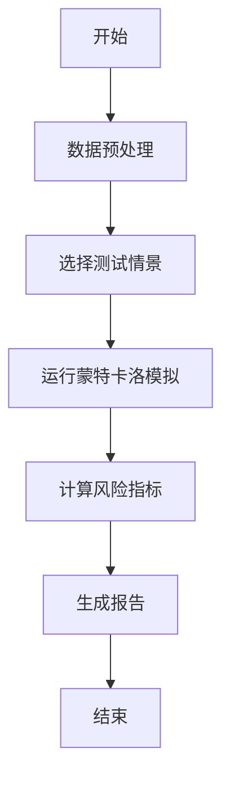

                 


# 构建智能化的个人投资组合压力测试工具

## 关键词：压力测试，投资组合，人工智能，风险管理，蒙特卡洛模拟

## 摘要：  
本文详细介绍了如何利用人工智能和大数据技术构建一个智能化的个人投资组合压力测试工具。通过对投资组合压力测试的背景、核心概念、算法原理、系统架构设计及项目实战的全面分析，帮助读者理解并掌握如何利用技术手段优化投资组合的风险管理。文章结合实际案例，深入剖析了压力测试工具的设计与实现过程，为投资者提供了一套高效、可靠的解决方案。

---

## 目录大纲

### 第一部分：投资组合压力测试的背景与意义

#### 第1章：投资组合压力测试的背景与意义

##### 1.1 投资组合与风险管理

- 1.1.1 投资组合的基本概念
  - 股票、债券、基金等资产的组合配置
  - 投资组合的目标：最大化收益与风险的平衡
- 1.1.2 风险管理的核心作用
  - 风险的定义与分类
  - 风险管理的常见策略
- 1.1.3 压力测试的定义与作用
  - 压力测试的定义
  - 压力测试的目的：评估极端市场条件下的投资组合表现
  - 压力测试在风险管理中的应用

##### 1.2 投资组合压力测试的智能化必要性

- 1.2.1 传统压力测试的局限性
  - 数据分析的局限性
  - 情景假设的主观性
- 1.2.2 智能化压力测试的优势
  - 数据驱动的分析方法
  - AI技术的应用：自动化情景生成与风险预测
- 1.2.3 智能化压力测试的未来发展
  - 技术进步对压力测试工具的影响
  - 个性化投资组合的优化方向

##### 1.3 本章小结

---

### 第二部分：压力测试工具的核心概念与技术原理

#### 第2章：压力测试的核心概念与联系

##### 2.1 压力测试的核心原理

- 2.1.1 数据分析与建模
  - 数据的采集与预处理
  - 数据分析的基本方法：均值、方差、协方差
- 2.1.2 情景分析与假设检验
  - 不同市场情景下的投资组合表现
  - 假设检验的统计方法
- 2.1.3 风险评估与优化策略
  - 风险价值（VaR）与预期损失（ES）的计算
  - 投资组合优化的数学模型

##### 2.2 核心概念对比分析

- 2.2.1 压力测试与回测分析的对比
  - 回测分析的定义与作用
  - 压力测试与回测分析的区别
- 2.2.2 传统压力测试与智能化压力测试的差异
  - 数据量与计算能力的提升
  - AI技术的应用带来的效率提升
- 2.2.3 投资组合优化与风险控制的关系
  - 优化目标与风险控制的平衡
  - 风险控制对投资组合稳定性的影响

##### 2.3 实体关系图（ER图）分析

- 2.3.1 投资组合实体关系图
  - 投资组合、资产、权重的关系
- 2.3.2 压力测试场景实体关系图
  - 市场情景、资产价格、组合收益的关系
- 2.3.3 数据流与交互关系图
  - 数据输入、处理、输出的关系

---

### 第三部分：压力测试工具的算法与数学模型

#### 第3章：压力测试算法原理

##### 3.1 蒙特卡洛模拟算法

- 3.1.1 蒙特卡洛模拟的基本原理
  - 随机抽样的基本思想
  - 蒙特卡洛模拟的应用场景
- 3.1.2 蒙特卡洛模拟的实现步骤
  - 数据预处理
  - 情景生成
  - 收益模拟
- 3.1.3 蒙特卡洛模拟的优缺点
  - 优点：数据驱动、自动化
  - 缺点：计算量大、依赖假设

##### 3.2 压力测试的数学模型

- 3.2.1 投资组合收益与风险的数学表达
  - 收益：期望值与方差
  - 风险：波动率、VaR、ES
- 3.2.2 风险价值（VaR）与预期损失（ES）的计算公式
  - VaR的定义：$VaR = \alpha \times \sigma$
  - ES的定义：$ES = \frac{1}{\alpha} \int_{0}^{\alpha} VaR \, d\alpha$
- 3.2.3 情景分析的数学建模
  - 情景生成的数学模型
  - 不同情景下的组合收益计算

##### 3.3 算法流程图（Mermaid）



##### 3.4 Python实现代码示例

```python
import numpy as np

def monte_carlo_simulation(returns, num_simulations=1000):
    simulations = []
    for _ in range(num_simulations):
        # 生成随机情景
        scenario = np.random.multivariate_normal(
            mean=[0, 0], 
            cov=np.array([[1, 0.5], [0.5, 1]]), 
            size=1
        )
        simulations.append(scenario)
    return simulations

# 示例数据
returns = np.array([[0.1, 0.2], [0.3, 0.1]])

simulations = monte_carlo_simulation(returns)
print(simulations)
```

---

### 第四部分：系统分析与架构设计方案

#### 第4章：系统分析与架构设计

##### 4.1 问题场景介绍

- 4.1.1 投资者面临的市场风险
  - 市场波动、经济周期的影响
- 4.1.2 传统压力测试工具的局限性
  - 数据量小、计算效率低
- 4.1.3 智能化压力测试工具的需求
  - 高效计算、个性化配置

##### 4.2 系统功能设计

- 4.2.1 领域模型类图
  ```mermaid
  classDiagram
  class 投资组合 {
      资产列表：List[资产]
      权重列表：List[float]
      收益：float
      风险：float
  }
  class 市场情景 {
      股票收益：List[float]
      债券收益：List[float]
      组合收益：List[float]
  }
  class 压力测试工具 {
      数据输入：List[市场情景]
      模拟结果：List[测试结果]
  }
  ```

- 4.2.2 系统架构设计
  ```mermaid
  architecture
  frontend --> 数据源
  frontend --> 处理层
  处理层 --> 分析引擎
  分析引擎 --> 数据存储
  ```

- 4.2.3 系统交互设计
  ```mermaid
  sequenceDiagram
  用户 --> 前端界面：输入投资组合参数
  前端界面 --> 处理层：传递参数
  处理层 --> 分析引擎：运行蒙特卡洛模拟
  分析引擎 --> 数据存储：保存结果
  数据存储 --> 前端界面：返回测试报告
  用户 <-- 前端界面：查看报告
  ```

---

### 第五部分：项目实战与应用

#### 第5章：项目实战与应用

##### 5.1 环境安装与配置

- 5.1.1 Python环境安装
  - 安装Python 3.x
  - 安装必要的库：numpy、pandas、scipy、matplotlib
- 5.1.2 开发工具配置
  - 安装Jupyter Notebook或VS Code
  - 配置代码编辑器

##### 5.2 系统核心实现

- 5.2.1 核心代码实现
  ```python
  import numpy as np
  import matplotlib.pyplot as plt

  def calculate VaR(simulated_returns, confidence_level=0.95):
      sorted_returns = np.sort(simulated_returns)
      VaR = sorted_returns[int(len(simulated_returns) * (1 - confidence_level))]
      return VaR

  # 示例数据
  simulated_returns = np.random.normal(0, 1, 1000)
  VaR_95 = calculate VaR(simulated_returns, 0.95)
  print(f"VaR at 95% confidence level: {VaR_95}")
  ```

- 5.2.2 代码应用解读
  - 数据输入与预处理
  - 模拟运行与结果计算
  - 结果可视化与报告生成

##### 5.3 实际案例分析

- 5.3.1 投资组合配置
  - 示例投资组合：股票60%，债券30%，现金10%
- 5.3.2 情景生成
  - 不同经济周期下的资产表现
- 5.3.3 结果分析
  - VaR与ES的计算结果
  - 投资组合在不同情景下的表现对比

##### 5.4 项目小结

- 5.4.1 项目成果总结
  - 成功实现智能化压力测试工具
  - 提供了高效的风险管理解决方案
- 5.4.2 项目经验与教训
  - 数据质量的重要性
  - 算法优化的必要性
- 5.4.3 未来改进方向
  - 更多资产类别的支持
  - 更复杂的情景模拟

---

### 第六部分：最佳实践与小结

#### 第6章：最佳实践与小结

##### 6.1 最佳实践

- 6.1.1 数据质量管理
  - 数据清洗与标准化
  - 数据来源的可靠性
- 6.1.2 算法选择与优化
  - 根据需求选择合适的算法
  - 算法的可解释性与计算效率
- 6.1.3 系统架构设计
  - 可扩展性与可维护性
  - 安全性与稳定性

##### 6.2 小结

- 6.2.1 本文的核心内容回顾
  - 投资组合压力测试的背景与意义
  - 核心概念与技术原理
  - 系统架构设计与项目实战
- 6.2.2 智能化压力测试工具的未来展望
  - 技术进步对工具的影响
  - 用户需求的变化与工具的优化方向

##### 6.3 注意事项

- 6.3.1 数据隐私与安全
  - 数据泄露的风险
  - 数据加密与访问控制
- 6.3.2 算法的局限性
  - 蒙特卡洛模拟的假设条件
  - 情景生成的准确性
- 6.3.3 系统的维护与更新
  - 数据的及时更新
  - 算法的持续优化

##### 6.4 拓展阅读

- 6.4.1 推荐书籍
  - 《Python金融数据分析》
  - 《风险管理与VaR模型》
- 6.4.2 推荐博客与资源
  - QuantInstinct博客
  - Python金融工具库官方文档

---

### 总结

本文通过详细分析投资组合压力测试的背景、核心概念、算法原理、系统架构设计及项目实战，为读者提供了一套构建智能化个人投资组合压力测试工具的完整方案。通过本文的学习，读者可以掌握如何利用人工智能和大数据技术优化投资组合的风险管理，提升投资决策的科学性与可靠性。

--- 

**本文后续将按照上述目录大纲逐步展开详细内容，确保每个章节内容详实、逻辑清晰。**

