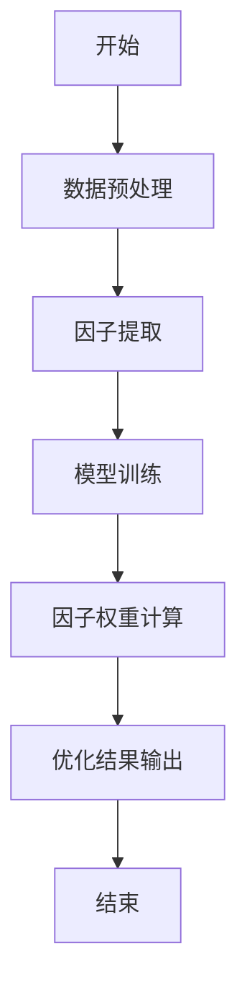
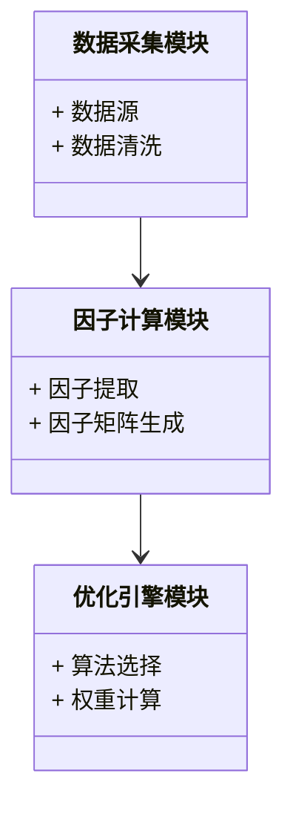
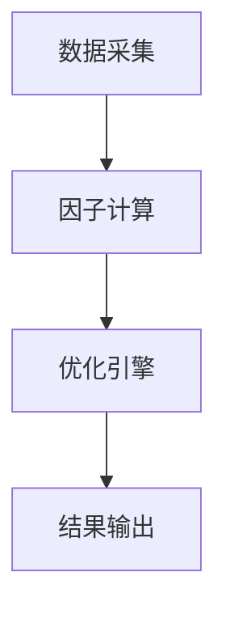
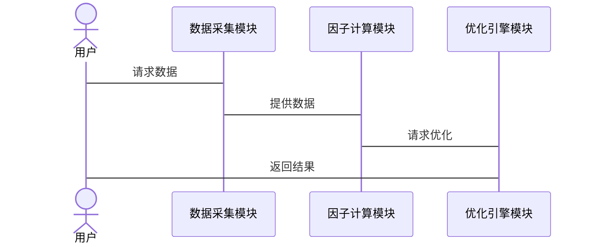

                 


# 构建智能化的个人投资组合因子暴露优化系统

**关键词**：投资组合优化、因子暴露、人工智能、机器学习、金融风险管理

**摘要**：本文详细探讨了如何利用人工智能和大数据技术构建智能化的个人投资组合因子暴露优化系统。通过分析因子暴露的核心概念、算法原理和系统架构，结合实际项目案例，提供了一套完整的解决方案。文章最后总结了最佳实践和未来研究方向，为投资者和数据科学家提供了实用的指导。

---

# 第1章: 投资组合优化与因子暴露概述

## 1.1 投资组合优化的基本概念

### 1.1.1 投资组合的基本定义

投资组合是指投资者持有的各种金融资产的集合，旨在通过分散投资降低风险并实现收益最大化。传统的投资组合优化方法基于现代投资组合理论（MPT），通过优化资产配置来实现收益与风险的最佳平衡。

### 1.1.2 因子分析在投资中的作用

因子分析是一种统计方法，用于识别影响资产回报的主要因素（如市值、价值、动量等）。因子分析帮助投资者理解资产回报的来源，并构建更有效的投资组合。

### 1.1.3 因子暴露的定义与意义

因子暴露是指投资组合在特定因子上的敏感程度，衡量了组合对某个因子的依赖程度。通过优化因子暴露，可以降低投资组合的系统性风险，提高收益。

## 1.2 智能化投资组合优化的背景

### 1.2.1 传统投资组合优化的局限性

传统的方法依赖于历史数据和假设，忽略了市场的动态变化和非线性关系，难以应对复杂的金融市场环境。

### 1.2.2 大数据与人工智能在投资中的应用

大数据技术提供了丰富的数据源，人工智能算法（如机器学习）能够处理复杂的数据关系，为投资组合优化提供了新的工具。

### 1.2.3 智能化优化的必要性与优势

智能化优化能够实时适应市场变化，发现传统方法难以捕捉的非线性关系，提升投资组合的收益风险比。

## 1.3 本章小结

本章介绍了投资组合优化的基本概念和智能化优化的必要性，为后续章节的分析奠定了基础。

---

# 第2章: 因子暴露的核心概念与属性

## 2.1 因子暴露的定义与特征

### 2.1.1 因子的定义与分类

因子可以分为系统性因子（如市值、价值）和非系统性因子。系统性因子影响整个市场，而非系统性因子则影响特定资产。

### 2.1.2 因子暴露的数学表达

因子暴露可以通过回归分析得出，公式为：
$$\beta = \frac{Cov(r_i, r_j)}{Var(r_j)}$$

### 2.1.3 因子暴露的属性特征对比表

| 特性 | 系统性因子 | 非系统性因子 |
|------|------------|--------------|
| 影响范围 | 整个市场   | 特定资产     |
| 预测能力 | 强         | 弱           |
| 风险类型 | 系统性风险 | 非系统性风险 |

## 2.2 因子暴露与投资组合风险的关系

### 2.2.1 因子暴露对组合风险的影响

高系统性因子暴露会增加投资组合的系统性风险，而适当分散因子暴露可以降低整体风险。

### 2.2.2 多因子模型与投资组合优化

多因子模型结合多个因子，通过优化因子权重实现风险与收益的最佳平衡。

### 2.2.3 因子暴露的边界与外延

因子暴露的边界取决于市场条件和投资目标，外延则涉及因子间的相互作用。

## 2.3 本章小结

本章详细讲解了因子暴露的定义、特征及其与投资组合风险的关系，为后续优化策略提供了理论基础。

---

# 第3章: 因子暴露优化的算法原理

## 3.1 现代投资组合理论基础

### 3.1.1 均值-方差优化模型

均值-方差优化模型通过最小化方差（风险）最大化收益，公式为：
$$\min_w w^T \Sigma w$$
约束条件为：
$$\sum w_i = 1$$

### 3.1.2 解释与公式推导

通过拉格朗日乘数法求解优化问题，得到最优权重。

## 3.2 基于机器学习的因子优化算法

### 3.2.1 线性回归与因子筛选

使用线性回归筛选重要因子，公式为：
$$y = \beta X + \epsilon$$

### 3.2.2 支持向量机在因子优化中的应用

支持向量机用于分类和回归，帮助识别高影响力的因子。

### 3.2.3 随机森林与因子权重分配

随机森林通过特征重要性评估因子权重。

## 3.3 算法流程图



## 3.4 本章小结

本章介绍了优化算法的数学模型和流程图，为系统实现提供了算法基础。

---

# 第4章: 系统架构设计方案

## 4.1 系统功能模块划分

### 4.1.1 数据采集模块

负责收集市场数据，包括价格、交易量等。

### 4.1.2 因子计算模块

计算各资产的因子暴露，生成因子矩阵。

### 4.1.3 优化引擎模块

根据优化算法计算最优因子权重。

## 4.2 系统功能设计(领域模型)



## 4.3 系统架构图



## 4.4 系统接口设计

API接口用于数据交互，如RESTful API。

## 4.5 系统交互序列图



## 4.6 本章小结

本章详细描述了系统架构设计，为后续实现提供了指导。

---

# 第5章: 项目实战与案例分析

## 5.1 环境安装与配置

安装Python、Pandas、Scikit-learn等库。

## 5.2 核心代码实现

因子暴露计算代码示例：

```python
import pandas as pd
from sklearn.linear_model import LinearRegression

# 数据预处理
data = pd.read_csv('data.csv')
X = data.drop('target', axis=1)
y = data['target']

# 线性回归计算因子权重
model = LinearRegression()
model.fit(X, y)
weights = model.coef_
print(weights)
```

## 5.3 代码解读与分析

解释代码实现，说明每一步的作用。

## 5.4 实际案例分析

以具体资产为例，展示优化过程和结果。

## 5.5 本章小结

本章通过实战案例，展示了系统实现的具体步骤和应用效果。

---

# 第6章: 最佳实践与总结

## 6.1 最佳实践 tips

### 6.1.1 数据质量的重要性

确保数据准确性和完整性。

### 6.1.2 模型选择的注意事项

根据数据特点选择合适的模型。

## 6.2 小结

总结全文，强调智能化优化系统的优势和实际应用价值。

## 6.3 注意事项

提醒读者在实际操作中需注意的风险和挑战。

## 6.4 拓展阅读

推荐相关书籍和论文，供进一步学习参考。

## 6.5 本章小结

本章总结了最佳实践经验和未来研究方向，为读者提供了进一步的指导。

---

# 参考文献

（此处列出相关参考文献）

---

# 致谢

感谢读者的支持和帮助。

---

# 附录

（附录内容根据需要添加）

