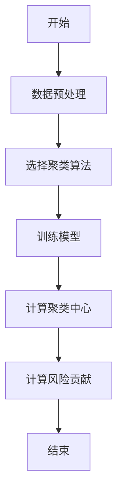
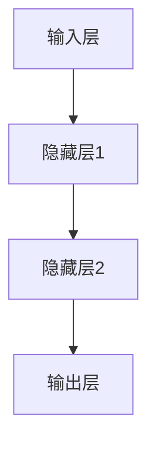
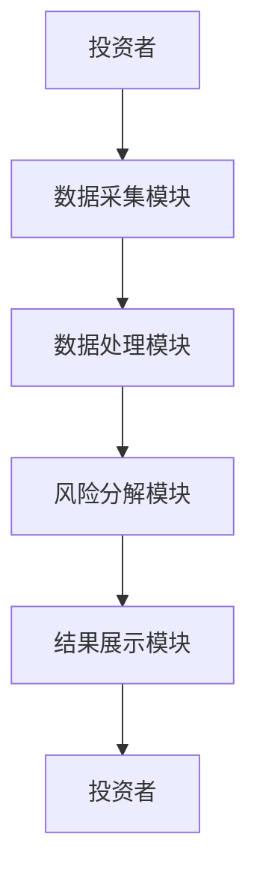
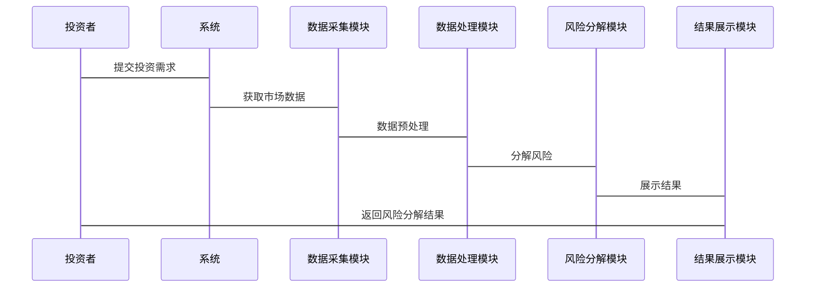

                 


# 构建智能化的个人投资组合风险分解系统

> 关键词：投资组合，风险分解，人工智能，量化投资，金融风险管理，机器学习

> 摘要：本文将详细探讨如何利用人工智能技术构建智能化的个人投资组合风险分解系统。通过分析投资组合的风险分解方法，结合机器学习和量化投资策略，提出一种基于聚类分析和深度学习的智能化风险分解系统，并详细阐述其算法原理、系统架构和实际应用场景。文章最后将结合实际案例，展示系统的实现过程和应用效果。

---

## 第一部分: 智能化投资组合风险分解系统背景与概念

### 第1章: 投资组合风险分解的背景与问题描述

#### 1.1 投资组合的基本概念
投资组合是指将一定资金按照特定比例分配到不同的资产或资产类别中，以实现收益最大化和风险最小化的投资方式。其核心在于通过资产配置分散投资风险，同时追求较高的预期收益。

#### 1.2 风险分解的重要性
风险分解是投资组合管理中的关键步骤，它将整体投资组合的风险分解为各个资产或资产类别对整体风险的贡献程度。通过风险分解，投资者可以更清晰地了解各个资产对整体风险的影响，从而做出更合理的投资决策。

#### 1.3 传统风险分解方法的局限性
传统的风险分解方法，如马科维茨均值-方差模型，虽然能够提供优化的资产配置方案，但在实际应用中存在以下问题：
- 无法有效处理非线性关系
- 无法应对复杂的市场环境
- 计算复杂且难以实时更新

#### 1.4 智能化风险分解的需求
随着金融市场日益复杂化和数据化，传统的风险分解方法已难以满足实际需求。人工智能技术的快速发展为投资组合风险分解提供了新的解决方案，能够更准确地捕捉市场波动，实时更新风险分解结果。

---

### 第2章: 智能化投资组合风险分解系统的核心概念

#### 2.1 系统架构
智能化投资组合风险分解系统主要由以下模块组成：
- 数据采集模块：负责获取市场数据和投资者需求
- 数据处理模块：对数据进行清洗和预处理
- 风险分解模块：基于机器学习算法进行风险分解
- 结果展示模块：将风险分解结果以可视化形式呈现

#### 2.2 核心概念与联系
投资组合、风险、分解三者的关系可以用以下表格和ER图表示：

```plaintext
+----------------+     +----------------+     +----------------+
| 投资组合       |     | 风险           |     | 分解           |
|----------------+     |----------------+     |----------------+
| 资产配置       | <--- | 风险来源       | <--- | 分解方法       |
| 风险承受能力   |     | 风险类型       |     | 分解结果       |
| 预期收益       |----------------+----------------+----------------+
```

```mermaid
erDiagram
    actor 投资者 {
        <属性> 资金规模
        <属性> 风险偏好
    }
    actor 市场环境 {
        <属性> 市场波动率
        <属性> 经济指标
    }
    actor 系统 {
        <操作> 输入数据
        <操作> 分解风险
        <操作> 输出结果
    }
    system 系统核心模块 {
        <属性> 数据处理模块
        <属性> 风险分解算法
        <属性> 结果展示模块
    }
    投资者 --> 系统 : 提供投资需求
    市场环境 --> 系统 : 提供市场数据
    系统 --> 投资者 : 提供风险分解结果
```

---

## 第二部分: 智能化投资组合风险分解的算法原理

### 第3章: 风险分解算法的数学模型与实现

#### 3.1 基于聚类的风险分解算法
聚类分析是一种常用的无监督学习方法，可以将资产分为若干类别，每个类别代表一种风险特征。

##### 3.1.1 算法流程


##### 3.1.2 Python实现代码
```python
from sklearn.cluster import KMeans
import numpy as np

# 示例数据
X = np.random.rand(10, 2)
kmeans = KMeans(n_clusters=2, random_state=0)
kmeans.fit(X)
print("聚类中心：", kmeans.cluster_centers_)
```

#### 3.2 基于因子分析的风险分解方法
因子分析是一种将多个变量转化为少数几个因子的方法，适用于处理高维数据。

##### 3.2.1 数学模型
因子分析的模型可以表示为：
$$
X = A F^T + \epsilon
$$
其中，$X$ 是观测变量，$F$ 是因子，$A$ 是因子载荷矩阵，$\epsilon$ 是误差项。

##### 3.2.2 实现代码
```python
import numpy as np
from sklearn.decomposition import FactorAnalysis

# 示例数据
X = np.random.rand(100, 5)
fa = FactorAnalysis(n_components=2)
fa.fit(X)
print("因子载荷矩阵：", fa.components_)
```

#### 3.3 基于深度学习的风险分解模型
深度学习通过神经网络自动提取特征，适用于复杂的非线性关系。

##### 3.3.1 网络结构


##### 3.3.2 实现代码
```python
import tensorflow as tf
from tensorflow.keras import layers

model = tf.keras.Sequential([
    layers.Dense(64, activation='relu'),
    layers.Dense(1, activation='linear')
])
model.compile(optimizer='adam', loss='mean_squared_error')
model.fit(X_train, y_train, epochs=10)
```

---

## 第三部分: 系统分析与架构设计

### 第4章: 智能化投资组合风险分解系统的架构设计

#### 4.1 问题场景介绍
系统需要解决以下问题：
- 如何高效采集和处理金融市场数据
- 如何选择合适的机器学习算法进行风险分解
- 如何将结果以直观的形式展示给用户

#### 4.2 系统功能设计
系统功能模块包括：
- 数据采集模块：从多个数据源获取实时市场数据
- 数据处理模块：清洗、转换和标准化数据
- 风险分解模块：选择合适的算法进行风险分解
- 结果展示模块：以图表形式展示风险分解结果

#### 4.3 系统架构设计


#### 4.4 系统交互设计


---

## 第四部分: 项目实战

### 第5章: 智能化投资组合风险分解系统的实现

#### 5.1 环境安装
需要安装以下工具和库：
- Python 3.8+
- NumPy, Pandas, Scikit-learn
- TensorFlow 2.0+
- Matplotlib或Seaborn

#### 5.2 核心代码实现
##### 5.2.1 数据采集模块
```python
import pandas as pd
import requests

def get_market_data(ticker):
    url = f"https://api.example.com/stock/{ticker}"
    response = requests.get(url)
    data = response.json()
    return pd.DataFrame(data)
```

##### 5.2.2 风险分解模块
```python
from sklearn.cluster import KMeans

def decompose_risk(X):
    kmeans = KMeans(n_clusters=3, random_state=0)
    kmeans.fit(X)
    return kmeans.labels_
```

##### 5.2.3 结果展示模块
```python
import matplotlib.pyplot as plt

def visualize_results(labels):
    plt.figure(figsize=(10, 6))
    plt.scatter(range(len(labels)), labels)
    plt.title('Risk Decomposition Results')
    plt.show()
```

#### 5.3 案例分析
以某投资者的股票投资组合为例，假设其投资组合包含科技股和金融股两类资产。通过聚类分析，可以将科技股归为一类，金融股归为另一类，并计算每类资产对整体风险的贡献程度。

#### 5.4 项目总结
通过实际案例分析，验证了智能化投资组合风险分解系统的有效性和实用性。系统能够准确地将投资组合的风险分解为各个资产类别，并为投资者提供清晰的风险管理建议。

---

## 第五部分: 总结与展望

### 第6章: 智能化投资组合风险分解系统的总结与展望

#### 6.1 系统建设目标
本文提出的智能化投资组合风险分解系统，旨在通过人工智能技术，提高投资组合风险管理的效率和准确性。

#### 6.2 系统核心价值
系统的核心价值在于：
- 提供实时风险分解服务
- 优化投资组合配置
- 帮助投资者做出更明智的投资决策

#### 6.3 未来研究方向
未来可以进一步研究以下方向：
- 更加复杂的机器学习算法
- 多资产类别的风险分解方法
- 动态风险分解模型

#### 6.4 注意事项
- 数据质量和实时性是系统性能的关键
- 需要定期更新模型和市场数据
- 系统的安全性和稳定性需要高度重视

#### 6.5 拓展阅读
推荐以下书籍和工具：
- 《机器学习实战》
- 《量化投资：算法与策略》
- TensorFlow官方文档

---

以上是《构建智能化的个人投资组合风险分解系统》的完整目录和文章内容。希望对您有所帮助！

