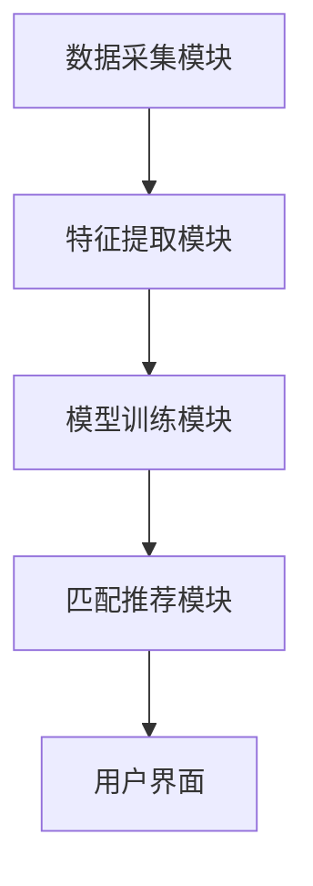
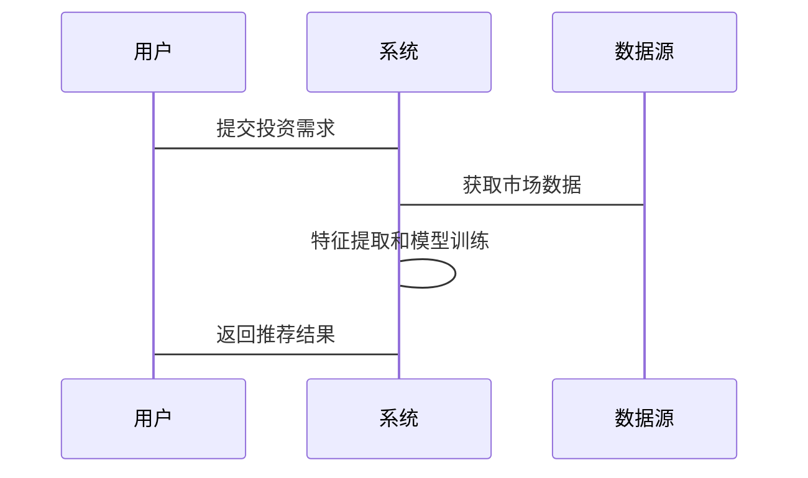

                 


# 构建智能化的个人投资风格分析与匹配系统

## 关键词：投资风格分析，人工智能，机器学习，系统架构，数据匹配

## 摘要：  
本文详细探讨了如何利用人工智能和机器学习技术构建智能化的个人投资风格分析与匹配系统。通过分析投资风格的核心要素，结合数据驱动的方法，提出了一套从数据采集、特征提取、模型训练到系统实现的完整解决方案。文章内容包括背景介绍、核心概念、算法原理、系统架构、项目实战等部分，旨在为读者提供从理论到实践的全面指导。

---

## 第一部分: 投资风格分析与匹配的背景与意义

### 第1章: 投资风格分析与匹配的背景与意义

#### 1.1 投资风格分析的背景
##### 1.1.1 传统投资风格分析的局限性
传统投资风格分析主要依赖于手动分类和统计方法，存在以下问题：  
1. 分析主观性高，难以量化。  
2. 数据处理效率低，难以应对海量数据。  
3. 无法实时更新，难以适应市场变化。  

##### 1.1.2 数据驱动投资的兴起
随着大数据和人工智能技术的快速发展，数据驱动投资逐渐成为主流。数据驱动投资的优势包括：  
1. 可以处理海量数据，提取更多有价值的信息。  
2. 通过机器学习算法，能够发现传统方法难以察觉的模式。  
3. 可以实时更新模型，适应市场的动态变化。  

##### 1.1.3 人工智能在投资分析中的应用
人工智能在投资分析中的应用主要体现在以下几个方面：  
1. **数据清洗与特征提取**：利用自然语言处理（NLP）和统计方法，从非结构化数据中提取有用特征。  
2. **投资风格分类**：通过聚类和分类算法，将投资者分为不同的风格类别。  
3. **投资行为预测**：基于时间序列分析，预测投资者的未来行为。  

---

#### 1.2 个人投资风格的定义与特点
##### 1.2.1 投资风格的分类
投资风格可以分为以下几类：  
- **保守型**：风险厌恶，偏好低风险、稳定收益的资产。  
- **平衡型**：风险承受能力适中，注重资产配置的多样性。  
- **激进型**：风险承受能力强，偏好高风险、高收益的资产。  

##### 1.2.2 个人投资行为的特征
个人投资行为的特征包括：  
1. **决策模式**：投资者在决策时可能表现出的模式，如频繁交易或长期持有。  
2. **风险偏好**：投资者对风险的敏感程度，影响其资产配置的选择。  
3. **认知偏差**：投资者在决策中可能存在的认知偏差，如过度自信或从众心理。  

##### 1.2.3 投资风格与收益的关系
投资风格与收益的关系可以通过以下方式分析：  
1. **风格一致性**：投资者的投资风格一致性越高，其收益的可预测性越强。  
2. **风格多样性**：通过资产配置，投资者可以在不同风格之间分散风险，提高整体收益。  

---

#### 1.3 智能化投资风格匹配的必要性
##### 1.3.1 提高投资效率的需求
传统投资风格匹配方法效率低下，难以满足大规模数据处理的需求。智能化方法可以通过自动化处理，显著提高效率。  

##### 1.3.2 个性化投资服务的兴起
随着投资者需求的多样化，个性化投资服务越来越受到重视。智能化投资风格匹配系统可以为投资者提供个性化的服务，满足其特定需求。  

##### 1.3.3 人工智能在投资匹配中的优势
人工智能在投资匹配中的优势包括：  
1. **精准匹配**：通过深度学习算法，可以实现更精准的投资风格匹配。  
2. **实时更新**：能够根据市场变化和投资者行为动态调整匹配结果。  
3. **智能化决策**：通过算法优化，提高投资决策的科学性和效率。  

---

#### 1.4 本章小结
本章主要介绍了投资风格分析的背景、定义、特点及其智能化匹配的必要性。通过分析传统方法的局限性，提出了利用人工智能技术构建智能化投资风格匹配系统的思路，为后续章节的展开奠定了基础。

---

## 第二部分: 投资风格分析与匹配的核心概念

### 第2章: 核心概念与联系

#### 2.1 数据采集与特征提取
##### 2.1.1 数据来源与类型
数据来源主要包括：  
1. **市场数据**：包括股票价格、成交量等。  
2. **投资者行为数据**：包括交易记录、持仓情况等。  
3. **外部数据**：包括宏观经济指标、新闻数据等。  

##### 2.1.2 投资行为特征的提取方法
提取投资行为特征的方法包括：  
1. **统计方法**：计算交易频率、持仓周期等指标。  
2. **机器学习方法**：利用聚类和分类算法提取特征。  
3. **NLP技术**：从新闻、评论中提取情感特征。  

##### 2.1.3 数据预处理与清洗
数据预处理包括：  
1. **去重**：去除重复数据。  
2. **填充缺失值**：对缺失值进行插值处理。  
3. **标准化**：对数据进行归一化处理。  

---

#### 2.2 投资风格分析的算法原理
##### 2.2.1 聚类分析与分类算法
常用的聚类算法包括：  
- K-means：基于距离的聚类算法。  
- DBSCAN：基于密度的聚类算法。  

常用的分类算法包括：  
- SVM：支持向量机，适用于小样本数据。  
- Random Forest：随机森林，适用于高维数据。  

##### 2.2.2 机器学习模型的选择
模型选择需要考虑以下因素：  
1. **数据量**：样本量小适合SVM，样本量大适合随机森林。  
2. **计算效率**：随机森林计算效率高，适合实时处理。  
3. **模型解释性**：SVM解释性较差，随机森林解释性较好。  

##### 2.2.3 深度学习在投资风格分析中的应用
深度学习在投资风格分析中的应用包括：  
1. **时间序列分析**：利用RNN处理时间序列数据。  
2. **图像识别**：利用CNN分析K线图。  

---

#### 2.3 投资风格匹配的实现方法
##### 2.3.1 基于相似度的匹配算法
基于相似度的匹配算法包括：  
- 欧氏距离：计算样本之间的距离。  
- 余弦相似度：计算样本之间的角度相似度。  

##### 2.3.2 基于规则的匹配策略
基于规则的匹配策略包括：  
- 风险匹配：根据投资者的风险偏好进行匹配。  
- 收益匹配：根据投资者的收益目标进行匹配。  

##### 2.3.3 综合匹配模型的设计
综合匹配模型需要考虑以下因素：  
1. **投资者特征**：包括风险偏好、投资期限等。  
2. **资产特征**：包括资产类型、流动性等。  
3. **市场环境**：包括宏观经济指标、市场情绪等。  

---

#### 2.4 本章小结
本章详细介绍了投资风格分析与匹配的核心概念，包括数据采集、特征提取、算法选择和匹配策略。通过对比不同算法的优缺点，提出了综合匹配模型的设计思路，为后续章节的系统实现奠定了基础。

---

## 第三部分: 投资风格分析与匹配系统的算法原理

### 第3章: 投资风格分析与匹配系统的算法原理

#### 3.1 聚类分析算法
##### 3.1.1 K-means算法原理
K-means算法是一种基于距离的聚类算法，步骤如下：  
1. **初始化**：随机选择K个质心。  
2. **迭代**：计算每个样本到质心的距离，将样本归类到最近的质心。  
3. **更新**：重新计算质心位置，直到质心不再变化或达到预设迭代次数。  

##### 3.1.2 DBSCAN算法
DBSCAN算法是一种基于密度的聚类算法，步骤如下：  
1. **邻域搜索**：对于每个样本，找到其邻域内的样本。  
2. **密度连接**：将密度相连的样本归为一类。  
3. **噪声处理**：将孤立样本标记为噪声。  

##### 3.1.3 聚类算法的优缺点对比
| 算法 | 优点 | 缺点 |
|------|------|------|
| K-means | 简单高效，适合大数据 | 初值敏感，可能收敛到局部最优 |
| DBSCAN | 能发现任意形状的簇 | 对参数敏感，计算复杂度高 |

---

#### 3.2 分类算法
##### 3.2.1 SVM算法原理
SVM算法通过构建超平面将数据分为两类，公式如下：  
$$ \text{目标函数} = \sum y_i w \cdot x_i + b \geq 0 $$  

##### 3.2.2 随机森林算法
随机森林算法通过集成学习提高模型的泛化能力，公式如下：  
$$ y = \text{sign}(\sum_{i=1}^n \text{tree}_i(x)) $$  

##### 3.2.3 分类算法的优缺点对比
| 算法 | 优点 | 缺点 |
|------|------|------|
| SVM | 高维数据表现好，过拟合较少 | 计算复杂度高，不适合大数据 |
| Random Forest | 鲁棒性强，适合高维数据 | 解释性较差 |

---

#### 3.3 深度学习模型
##### 3.3.1 RNN在时间序列分析中的应用
RNN通过循环结构处理时间序列数据，公式如下：  
$$ h_t = \text{tanh}(W_{hh}h_{t-1} + W_{xh}x_t + b_h) $$  

##### 3.3.2 CNN在图像识别中的应用
CNN通过卷积层提取图像特征，公式如下：  
$$ \text{输出} = \max(0, W \cdot x + b) $$  

##### 3.3.3 深度学习的优缺点
| 优点 | 缺点 |
|------|------|
| 高精度，适合复杂任务 | 计算资源消耗大，训练时间长 |
| 自动提取特征，减少特征工程 | 对数据量要求高，小样本表现差 |

---

#### 3.4 本章小结
本章详细讲解了投资风格分析与匹配系统中常用的算法原理，包括聚类、分类和深度学习算法。通过对不同算法的优缺点对比，提出了在实际应用中选择合适算法的建议。

---

## 第四部分: 投资风格分析与匹配系统的系统架构设计

### 第4章: 系统分析与架构设计方案

#### 4.1 系统功能设计
##### 4.1.1 数据采集模块
数据采集模块负责从多种数据源获取数据，包括：  
- 市场数据：股票价格、成交量等。  
- 投资者行为数据：交易记录、持仓情况等。  

##### 4.1.2 特征提取模块
特征提取模块通过对原始数据进行处理，提取投资风格相关的特征，包括：  
- 统计特征：交易频率、持仓周期等。  
- 文本特征：从新闻、评论中提取情感特征。  

##### 4.1.3 模型训练模块
模型训练模块利用机器学习算法对特征数据进行训练，生成投资风格分类模型。  

##### 4.1.4 匹配推荐模块
匹配推荐模块根据投资者的投资风格和市场环境，推荐适合的资产配置方案。  

---

#### 4.2 系统架构设计
##### 4.2.1 系统架构图


##### 4.2.2 接口设计
系统主要接口包括：  
1. 数据接口：与数据源对接，获取市场数据和投资者行为数据。  
2. 模型接口：与机器学习模型对接，进行特征提取和风格分类。  
3. 用户接口：与用户交互，接收输入并返回推荐结果。  

##### 4.2.3 交互流程图


---

#### 4.3 本章小结
本章从系统功能设计和架构设计两个方面，详细介绍了投资风格分析与匹配系统的整体架构。通过对系统各模块的分析，提出了实现智能化投资风格匹配系统的具体方案。

---

## 第五部分: 投资风格分析与匹配系统的项目实战

### 第5章: 项目实战

#### 5.1 环境安装与配置
##### 5.1.1 安装Python环境
安装Python 3.8及以上版本，并安装以下库：  
- `pandas`：数据处理库。  
- `numpy`：数值计算库。  
- `scikit-learn`：机器学习库。  
- `keras`：深度学习库。  

##### 5.1.2 安装数据接口
安装金融数据接口库，如`pandas_datareader`。  

#### 5.2 核心代码实现
##### 5.2.1 数据采集代码
```python
import pandas_datareader as pdr

# 获取数据
data = pdr.get_data_yahoo('AAPL', start='2020-01-01', end='2023-12-31')
```

##### 5.2.2 特征提取代码
```python
from sklearn.preprocessing import StandardScaler

# 标准化处理
scaler = StandardScaler()
data_scaled = scaler.fit_transform(data)
```

##### 5.2.3 模型训练代码
```python
from sklearn.cluster import KMeans

# 训练K-means模型
kmeans = KMeans(n_clusters=3, random_state=42)
kmeans.fit(data_scaled)
```

##### 5.2.4 匹配推荐代码
```python
from sklearn.metrics import silhouette_score

# 评估模型效果
score = silhouette_score(data_scaled, kmeans.labels_)
print(f"Silhouette Score: {score}")
```

#### 5.3 代码解读与分析
##### 5.3.1 数据采集模块
数据采集模块通过`pandas_datareader`获取Yahoo Finance的数据，包括开盘价、收盘价、最高价、最低价和成交量。

##### 5.3.2 特征提取模块
特征提取模块使用`StandardScaler`对数据进行标准化处理，确保不同特征的量纲一致。

##### 5.3.3 模型训练模块
模型训练模块使用K-means算法对标准化后的数据进行聚类分析，将投资者分为不同的风格类别。

##### 5.3.4 匹配推荐模块
匹配推荐模块通过计算聚类结果的 silhouette score，评估模型的效果，并根据投资者的投资需求推荐适合的资产配置方案。

#### 5.4 实际案例分析
##### 5.4.1 数据来源与处理
以某段时间的股票数据为例，展示如何通过代码获取数据并进行特征提取。

##### 5.4.2 模型训练与评估
通过训练模型，展示如何根据 silhouette score 评估模型的效果，并根据结果进行优化。

##### 5.4.3 推荐结果展示
根据投资者的投资需求，展示如何生成个性化的资产配置推荐方案。

#### 5.5 项目小结
通过本章的实战项目，读者可以掌握如何利用Python和机器学习算法构建投资风格分析与匹配系统。通过实际操作，能够更好地理解系统各模块的功能和实现细节。

---

## 第六部分: 投资风格分析与匹配系统的总结与展望

### 第6章: 总结与展望

#### 6.1 最佳实践
##### 6.1.1 数据处理
- 数据清洗：去除重复数据，填充缺失值。  
- 数据标准化：对不同特征进行标准化处理。  

##### 6.1.2 模型选择
- 根据数据量选择合适算法：小样本数据适合SVM，大数据适合随机森林。  
- 根据任务需求选择算法：时间序列分析适合RNN，图像识别适合CNN。  

##### 6.1.3 系统优化
- 系统架构优化：采用微服务架构，提高系统的扩展性和维护性。  
- 系统性能优化：通过缓存技术减少重复计算，提高系统响应速度。  

#### 6.2 小结
本文详细探讨了如何利用人工智能技术构建智能化的个人投资风格分析与匹配系统，从数据采集、特征提取、模型训练到系统实现，提供了完整的解决方案。

#### 6.3 注意事项
- 数据隐私：注意保护投资者的隐私数据，避免数据泄露。  
- 模型泛化能力：避免过拟合，确保模型在不同市场环境下的泛化能力。  

#### 6.4 拓展阅读
- 《机器学习实战》：学习更多机器学习算法的实现与应用。  
- 《深度学习》：深入理解深度学习的核心原理与应用。  

---

## 作者简介
（此处可以介绍作者的背景，例如：作者是人工智能领域专家，拥有多年投资分析经验，专注于利用技术手段提升投资效率和准确性。）

---

## 致谢
感谢读者的支持与关注，欢迎在留言区分享您的观点与建议。

