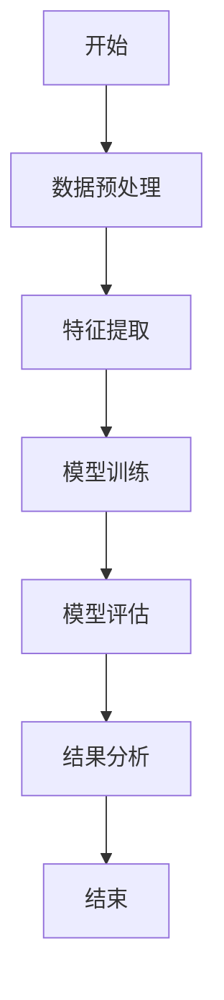

                 


# 构建智能化的个人投资风格漂移原因分析系统

> **关键词**：投资风格漂移，智能化分析，机器学习，系统架构，数据分析  
> **摘要**：本文旨在分析个人投资风格漂移的原因，并构建一个智能化的分析系统。通过机器学习算法和系统架构设计，帮助投资者理解风格漂移的内在机制，优化投资决策。

---

## 第一部分：背景介绍

### 第1章：个人投资风格漂移概述

#### 1.1 问题背景

- **1.1.1 投资行为的变化与风格漂移的定义**  
  投资风格漂移是指投资者在投资过程中，由于市场变化、个人认知偏差或外部干扰，导致其投资风格偏离初始设定的现象。这种漂移可能导致投资组合的风险和收益偏离预期。

- **1.1.2 风险因素与投资决策的关系**  
  风险因素如市场波动、经济周期等会影响投资者的决策，进而引发风格漂移。例如，当市场波动加剧时，投资者可能转向更保守的投资策略。

- **1.1.3 风格漂移对投资绩效的影响**  
  风格漂移可能导致投资组合的收益不稳定，甚至低于预期。例如，原本定位于成长型投资的投资者可能因短期亏损而转向价值型投资，影响整体收益。

#### 1.2 核心概念与问题描述

- **1.2.1 投资风格的构成要素**  
  投资风格由风险偏好、资产配置、市场预期等因素构成。例如，风险偏好高的投资者可能更倾向于股票投资。

- **1.2.2 风格漂移的类型与表现形式**  
  飘移类型包括渐进式漂移和突变式漂移。渐进式漂移是缓慢变化，突变式漂移是由于突发事件引发的骤变。

- **1.2.3 问题的边界与外延**  
  风格漂移的边界包括投资者的决策能力和市场环境。外延则涉及心理因素、外部事件等对投资风格的影响。

#### 1.3 问题解决与系统构建

- **1.3.1 系统目标与功能定位**  
  系统旨在通过数据分析和机器学习，识别风格漂移的原因，提供优化建议。

- **1.3.2 系统构建的必要性与可行性**  
  必要性：帮助投资者理解漂移原因，优化决策。可行性：基于现有数据分析技术，构建系统是可行的。

- **1.3.3 系统的预期输出与价值**  
  输出包括漂移原因分析报告和优化建议。价值在于帮助投资者提升投资效果，降低风险。

---

## 第二部分：核心概念与联系

### 第2章：核心概念分析

#### 2.1 核心概念的原理与特征

- **2.1.1 投资风格的构成要素**  
  投资风格由投资者的风险偏好、市场预期和资产配置策略决定。例如，风险偏好低的投资者倾向于债券投资。

- **2.1.2 风格漂移的影响因素**  
  主要包括市场变化、投资者情绪、外部事件等。例如，市场崩盘可能导致投资者迅速调整投资策略。

- **2.1.3 系统分析的关键维度**  
  包括时间序列分析、资产表现、投资者行为等维度。例如，分析投资者在不同市场周期中的行为变化。

#### 2.2 核心概念的属性特征对比

- **2.2.1 投资风格与市场环境的对比分析**  
  投资风格受市场环境影响，例如牛市中投资者更倾向于高风险投资。

- **2.2.2 风格漂移与投资决策的关系**  
  飘移是决策的结果，而决策又受外部环境影响。例如，市场下跌引发投资者转向保守策略。

- **2.2.3 系统分析的多维度特征**  
  系统分析需要考虑市场、心理和行为等多个维度。例如，分析投资者在不同市场状态下的行为模式。

#### 2.3 ER实体关系图

```mermaid
erDiagram
    actor 投资者 {
        <属性> 风险偏好
        <属性> 投资目标
        <属性> 投资期限
    }
    actor 市场环境 {
        <属性> 市场指数
        <属性> 经济指标
        <属性> 风险事件
    }
    actor 投资决策 {
        <行为> 资产配置
        <行为> 风险调整
        <行为> 投资风格漂移
    }
    actor 系统分析 {
        <功能> 数据采集
        <功能> 模型构建
        <功能> 结果输出
    }
    投资者 --> 投资决策 : 影响
    市场环境 --> 投资决策 : 影响
    投资决策 --> 系统分析 : 数据输入
    系统分析 --> 投资者 : 优化建议
```

---

## 第三部分：算法原理讲解

### 第3章：算法原理与实现

#### 3.1 算法选择与原理

- **3.1.1 机器学习算法的选择**  
  选择随机森林和决策树算法，用于分类投资风格漂移的原因。

- **3.1.2 风险分析模型的构建**  
  使用逻辑回归模型预测投资风格漂移的可能性。

- **3.1.3 数据预处理与特征提取**  
  数据清洗、标准化和特征选择，确保模型输入质量。

#### 3.2 算法流程图



#### 3.3 Python代码实现

- **数据预处理代码示例**

```python
import pandas as pd
from sklearn.preprocessing import StandardScaler

# 加载数据
data = pd.read_csv('investment_data.csv')

# 删除缺失值
data = data.dropna()

# 标准化处理
scaler = StandardScaler()
data_scaled = scaler.fit_transform(data)
```

- **模型训练与评估代码**

```python
from sklearn.ensemble import RandomForestClassifier
from sklearn.metrics import accuracy_score

# 训练模型
model = RandomForestClassifier()
model.fit(X_train, y_train)

# 评估模型
y_pred = model.predict(X_test)
print(accuracy_score(y_test, y_pred))
```

- **结果分析与可视化代码**

```python
import matplotlib.pyplot as plt

# 绘制特征重要性图
feature_importance = model.feature_importances_
plt.bar(range(len(feature_importance)), feature_importance)
plt.xticks(range(len(feature_importance)), data.columns)
plt.show()
```

#### 3.4 数学模型与公式

- **随机森林分类模型**  
  随机森林通过集成学习提高模型准确率，公式如下：  
  $$ y = \sum_{i=1}^{n} \text{Tree}(x_i) $$

- **决策树分类模型**  
  决策树通过信息增益构建树结构，公式如下：  
  $$ \text{信息增益} = \sum p \log \frac{1}{p} $$

---

## 第四部分：系统分析与架构设计

### 第4章：系统架构设计方案

#### 4.1 问题场景介绍

- **投资者行为分析**  
  系统需分析投资者在不同市场环境下的行为变化。

- **市场环境监测**  
  监测市场波动、经济指标等，识别可能引发风格漂移的因素。

#### 4.2 项目介绍

- **系统目标**  
  提供智能化的分析工具，帮助投资者识别和管理风格漂移。

- **系统功能设计**

  ```mermaid
  classDiagram
      class 投资者行为分析 {
          <方法> 分析投资者决策
          <方法> 监测市场环境
      }
      class 市场环境监测 {
          <方法> 收集市场数据
          <方法> 分析经济指标
      }
      class 系统分析模块 {
          <方法> 数据处理
          <方法> 模型构建
      }
      投资者行为分析 --> 系统分析模块 : 数据输入
      市场环境监测 --> 系统分析模块 : 数据输入
  ```

- **系统架构设计**

  ```mermaid
  architecture
      [投资者] --> [投资者行为分析]
      [市场数据] --> [市场环境监测]
      [投资者行为分析] --> [系统分析模块]
      [市场环境监测] --> [系统分析模块]
      [系统分析模块] --> [结果输出]
  ```

- **系统接口设计**

  ```mermaid
  sequenceDiagram
      投资者 --> 系统分析模块 : 提供投资数据
      系统分析模块 --> 投资者 : 返回分析结果
  ```

---

## 第五部分：项目实战

### 第5章：项目实战

#### 5.1 环境安装

- **安装Python和相关库**  
  安装Python 3.8以上版本，安装scikit-learn、pandas、matplotlib等库。

#### 5.2 核心代码实现

- **数据预处理**

```python
import pandas as pd
import numpy as np

# 创建示例数据
data = pd.DataFrame({
    '风险偏好': np.random.randint(1, 5, 100),
    '投资目标': np.random.randn(100),
    '投资期限': np.random.choice(['短期', '中期', '长期'], 100)
})

# 处理分类变量
data = pd.get_dummies(data)
```

- **模型训练**

```python
from sklearn.ensemble import RandomForestClassifier

# 训练模型
model = RandomForestClassifier()
model.fit(X_train, y_train)

# 预测结果
y_pred = model.predict(X_test)
```

#### 5.3 实际案例分析

- **案例分析**

  假设一位投资者原本设定为高风险偏好，但在市场波动加剧时转向保守策略。系统分析显示，市场崩盘事件（如2008年金融危机）是导致其风格漂移的主要原因。

#### 5.4 项目小结

- **系统优势**  
  高效分析，精准识别漂移原因，提供优化建议。

- **经验总结**  
  数据质量至关重要，模型调优不可或缺。

---

## 第六部分：最佳实践

### 第6章：最佳实践

#### 6.1 小结

- 系统构建的意义和价值，帮助投资者优化决策。

#### 6.2 注意事项

- 数据质量：确保数据的完整性和准确性。
- 模型调优：选择合适的算法，避免过拟合。
- 结果解读：结合实际投资场景，合理解读分析结果。

#### 6.3 拓展阅读

- 推荐阅读书籍和资源，如《机器学习实战》、《投资学原理》等。

---

## 附录

### A. 术语表

- **投资风格漂移**：投资者偏离初始投资策略的现象。
- **机器学习**：通过数据训练模型，进行预测和分析的技术。

### B. 工具安装指南

- 安装Python和相关库的步骤说明。

### C. 参考文献

- 列出文章中引用的书籍、论文和其他资源。

---

通过以上内容，我们构建了一个智能化的个人投资风格漂移原因分析系统，帮助投资者理解和优化其投资决策。

