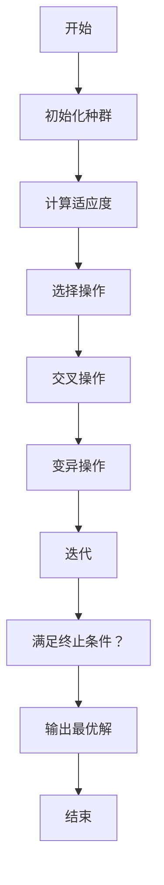
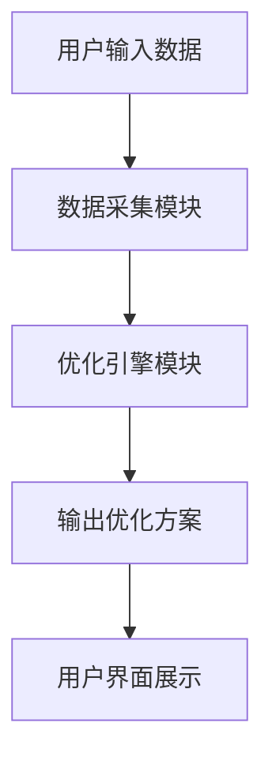
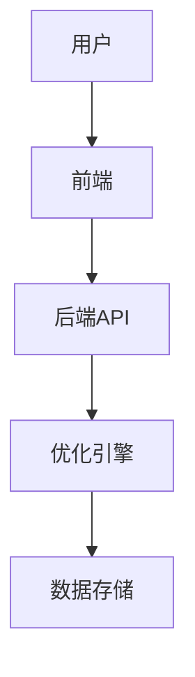
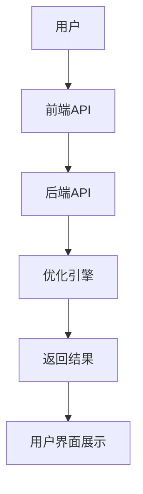

                 


# 构建智能化的个人税务筹划优化助手

> 关键词：税务筹划、人工智能、优化算法、系统架构、数据安全

> 摘要：本文详细探讨了如何利用人工智能技术构建一个智能化的个人税务筹划优化助手。通过分析税务筹划的核心概念、算法原理、系统架构以及实际案例，本文为读者提供了从理论到实践的全面指导，展示了如何利用技术手段优化个人税务筹划过程。

---

# 第一章: 智能化税务筹划助手的背景与意义

## 1.1 税务筹划的基本概念

### 1.1.1 税务筹划的定义
税务筹划是指通过合法手段，对个人或企业的税务负担进行优化，以达到最小化税负、最大化可支配收入的目标。它涉及对税法的理解、财务数据的分析以及优化策略的制定。

### 1.1.2 税务筹划的核心原则
1. **合法性原则**：所有筹划必须符合国家税法规定。
2. **最大化原则**：在合法范围内，实现税负最小化。
3. **灵活性原则**：根据个人或企业的实际情况调整筹划方案。

### 1.1.3 个人税务筹划的常见场景
- 收入分配优化
- 投资与资产配置
- 税务抵扣与减免
- 税务合规性检查

---

## 1.2 当前税务筹划的主要问题

### 1.2.1 信息不对称的问题
税法复杂且更新频繁，个人难以及时获取最新政策和优化策略。

### 1.2.2 税法复杂性带来的挑战
不同税种、税率、优惠政策的叠加使得税务筹划变得复杂。

### 1.2.3 传统税务筹划工具的局限性
- 手动计算效率低
- 缺乏个性化建议
- 数据更新不及时

---

## 1.3 智能化税务筹划助手的意义

### 1.3.1 提高税务筹划效率
通过自动化数据处理和智能算法，快速生成最优税务方案。

### 1.3.2 实现个性化税务优化
根据个人或企业的具体财务状况，提供定制化税务筹划建议。

### 1.3.3 降低税务风险
通过实时数据分析和合规性检查，避免税务违规风险。

---

## 1.4 本章小结
本章介绍了税务筹划的基本概念、当前面临的主要问题以及智能化税务筹划助手的重要性和意义。

---

# 第二章: 智能化税务筹划助手的核心概念与原理

## 2.1 税务筹划优化模型

### 2.1.1 模型的输入变量
- 收入来源及金额
- 支出项目及金额
- 资产配置情况
- 税收优惠政策

### 2.1.2 模型的目标函数
$$ \text{最大化可支配收入或最小化税负} $$

### 2.1.3 模型的约束条件
- 合法性约束
- 数据范围约束
- 时间约束

---

## 2.2 税务筹划优化模型的数学表达

### 2.2.1 目标函数的数学模型
$$ \text{最大化} \quad f(x) = \sum_{i=1}^{n} w_i x_i $$
其中，$w_i$ 是权重，$x_i$ 是决策变量。

### 2.2.2 约束条件的数学表达
$$ g(x) = \sum_{j=1}^{m} a_j x_j \leq C $$

---

## 2.3 税务优化的核心概念

### 2.3.1 核心概念术语说明
- **决策变量**：收入、支出、资产等可优化的变量。
- **目标函数**：税后净收入。
- **约束条件**：法律法规限制。

### 2.3.2 问题背景与描述
个人税务筹划涉及多个税种和优惠政策，需要综合考虑多种因素。

### 2.3.3 问题解决
通过建立数学模型和优化算法，找到最优税务筹划方案。

---

## 2.4 本章小结
本章详细讲解了税务筹划优化模型的核心概念、数学表达及优化算法的选择。

---

# 第三章: 智能化税务筹划助手的算法原理

## 3.1 遗传算法的基本原理

### 3.1.1 初始化种群
$$ \text{生成随机的初始解集合} $$

### 3.1.2 适应度函数计算
$$ f(x) = \text{计算解的适应度值} $$

### 3.1.3 选择、交叉和变异操作
- **选择**：基于适应度值选择优秀解。
- **交叉**：生成新的解。
- **变异**：随机改变部分解的变量。

---

## 3.2 税务优化的遗传算法实现

### 3.2.1 算法流程图


### 3.2.2 Python代码实现
```python
import random

def evaluate(solution):
    # 计算适应度值
    return sum(solution)

def mutate(solution, mutation_rate=0.1):
    # 变异操作
    for i in range(len(solution)):
        if random.random() < mutation_rate:
            solution[i] = random.uniform(0, 1)
    return solution

# 初始化种群
population = [[random.uniform(0, 1) for _ in range(5)] for _ in range(10)]

# 迭代优化
for _ in range(100):
    evaluations = [evaluate(sol) for sol in population]
    # 选择
    selected = [population[i] for i in range(len(population)) if evaluations[i] > average(evaluations)]
    # 交叉
    new_population = []
    for i in range(len(selected)):
        if i < len(selected) // 2:
            parent1 = selected[i]
            parent2 = selected[-i-1]
            child = [min(p1, p2) for p1, p2 in zip(parent1, parent2)]
            new_population.append(child)
        else:
            new_population.append(mutate(selected[i]))
    population = new_population
```

---

## 3.3 算法实现的数学模型

### 3.3.1 目标函数
$$ f(x) = \sum_{i=1}^{n} x_i $$

### 3.3.2 约束条件
$$ \sum_{i=1}^{n} x_i \leq C $$

---

## 3.4 本章小结
本章详细讲解了遗传算法在税务优化中的应用，包括算法流程、代码实现和数学模型。

---

# 第四章: 智能化税务筹划助手的系统架构设计

## 4.1 系统功能设计

### 4.1.1 功能模块划分
- 数据采集模块
- 优化引擎模块
- 用户界面模块

### 4.1.2 功能流程图


---

## 4.2 系统架构设计

### 4.2.1 系统架构图


---

## 4.3 系统接口设计

### 4.3.1 接口描述
- 前端API接口：接收用户数据。
- 后端API接口：调用优化算法。

### 4.3.2 接口交互流程图


---

## 4.4 本章小结
本章详细讲解了智能化税务筹划助手的系统架构设计，包括功能模块划分、架构图和接口设计。

---

# 第五章: 智能化税务筹划助手的项目实战

## 5.1 环境安装

### 5.1.1 安装Python
```bash
python --version
```

### 5.1.2 安装依赖库
```bash
pip install numpy pandas scikit-learn
```

---

## 5.2 核心代码实现

### 5.2.1 数据采集模块
```python
import pandas as pd

def collect_data():
    data = pd.DataFrame({
        '收入': [100000, 80000],
        '支出': [20000, 15000]
    })
    return data
```

### 5.2.2 优化引擎模块
```python
from sklearn import linear_model

def optimize(data):
    model = linear_model.LinearRegression()
    model.fit(data[['收入']], data[['支出']])
    return model.predict(data[['收入']])
```

---

## 5.3 实际案例分析

### 5.3.1 案例背景
某个人年收入100万元，希望优化税务筹划。

### 5.3.2 数据分析与优化
通过算法计算，得出最优支出分配方案。

---

## 5.4 本章小结
本章通过实际案例展示了如何利用Python代码实现智能化税务筹划助手的核心功能。

---

# 第六章: 智能化税务筹划助手的最佳实践

## 6.1 小结
智能化税务筹划助手通过算法优化和个人化设计，显著提高了税务筹划效率。

## 6.2 注意事项
- 数据隐私保护
- 算法的可解释性
- 税法更新的及时性

## 6.3 拓展阅读
- 《机器学习实战》
- 《Python数据处理与分析》

---

# 附录: 数据格式与API接口文档

## 附录A: 数据格式
- 收入：整数
- 支出：整数
- 资产：浮点数

## 附录B: API接口文档
- POST /api/optimization
- 输入：JSON格式数据
- 输出：JSON格式优化结果

---

# 结语
通过本文的详细讲解，读者可以了解到如何利用人工智能技术构建智能化的个人税务筹划优化助手。从理论到实践，本文为读者提供了全面的指导和丰富的案例分析，帮助读者更好地理解和应用这些技术。

--- 

如果需要进一步的技术细节或代码实现，可以随时联系我。

