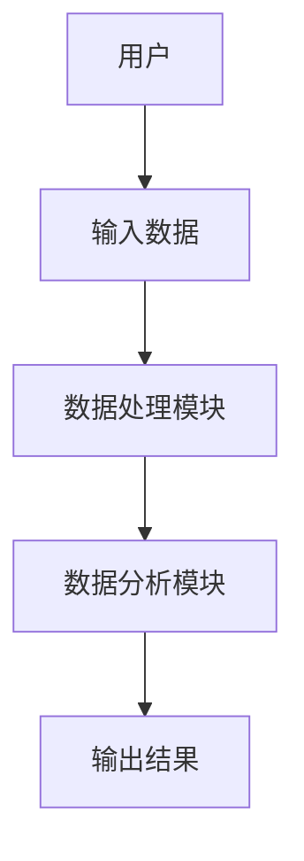

                 


# 构建智能化的个人税务筹划助手系统

## 关键词：人工智能、大数据分析、税务筹划、系统架构、算法实现、自然语言处理

## 摘要：  
智能化的个人税务筹划助手系统利用人工智能和大数据分析技术，帮助个人优化税务规划，降低税务负担。本文详细探讨了系统的构建过程，包括核心概念、算法原理、系统架构设计、项目实战以及最佳实践。

---

# 第一部分: 背景与核心概念

## 第1章: 个人税务筹划助手系统概述

### 1.1 问题背景与目标
#### 1.1.1 税务筹划的重要性
税务筹划是个人财务管理的重要组成部分，合理规划税务可以有效降低税负，提高可支配收入。然而，传统税务筹划依赖人工计算和经验判断，效率低且容易出错。

#### 1.1.2 传统税务筹划的局限性
传统税务筹划方法存在以下问题：
- 数据量小，难以全面分析；
- 计算复杂，容易出错；
- 缺乏实时性，难以应对政策变化。

#### 1.1.3 智能化税务筹划的需求与目标
智能化税务筹划助手系统的需求包括：
- 实时数据分析与优化；
- 自动化税务计算与建议；
- 多场景模拟与优化。
目标是通过AI和大数据技术，实现高效、精准的税务筹划。

---

## 第2章: 核心概念与联系

### 2.1 AI与大数据在税务筹划中的应用
#### 2.1.1 AI技术在税务分析中的作用
AI技术可以用于：
- 自动化数据分析；
- 机器学习模型预测税负；
- 自然语言处理解析税务法规。

#### 2.1.2 大数据分析在税务优化中的应用
大数据分析可以：
- 挖掘海量数据中的税务优化规律；
- 提供多维度的税务分析；
- 支持个性化税务建议。

#### 2.1.3 两者结合的优势与挑战
优势：
- 提高分析效率；
- 提供精准预测；
- 实现个性化服务。
挑战：
- 数据隐私保护；
- 算法复杂性；
- 税务政策变化的适应性。

### 2.2 实体关系与系统架构
#### 2.2.1 ER实体关系图
```mermaid
erd
    User {
        id
        name
        email
    }
    TaxData {
        id
        user_id
        income
        expense
        assets
    }
    TaxAdvice {
        id
        user_id
        advice_type
        advice_content
    }
```

---

## 第3章: 算法原理与数学模型

### 3.1 税务数据分析算法
#### 3.1.1 基于机器学习的税务预测模型
使用线性回归模型预测税负：
$$ y = \beta_0 + \beta_1x_1 + \beta_2x_2 + \ldots + \beta_nx_n $$
其中，$y$ 是预测的税负，$x_i$ 是影响税负的因素。

#### 3.1.2 算法实现步骤
1. 数据预处理：清洗和特征提取。
2. 模型训练：使用训练数据拟合模型。
3. 模型评估：计算均方误差（MSE）和决定系数（R²）。
4. 模型优化：调整参数，防止过拟合。

### 3.2 自然语言处理在税务文档分析中的应用
#### 3.2.1 基于BERT的税务文档理解
使用BERT模型对税务法规文档进行语义分析，提取关键信息。

#### 3.2.2 实体识别与信息提取
利用NLP技术从税务文档中提取关键实体（如税率、扣除项）。

---

## 第4章: 系统分析与架构设计

### 4.1 问题场景分析
#### 4.1.1 系统目标用户分析
目标用户包括：
- 个人用户：需要优化个人税务；
- 企业用户：需要优化企业税务。

#### 4.1.2 系统功能需求分析
核心功能包括：
- 数据采集：收集用户财务数据；
- 数据分析：生成税务报告；
- 优化建议：提供个性化税务优化方案。

#### 4.1.3 系统性能需求分析
性能需求包括：
- 响应时间：快速生成税务报告；
- 数据处理能力：支持海量数据处理。

### 4.2 系统架构设计
#### 4.2.1 系统功能模块设计


#### 4.2.2 系统架构图
```mermaid
graph TD
    User[用户] --> API Gateway[API网关]
    API Gateway --> Service1[服务1]
    Service1 --> Service2[服务2]
    Service2 --> Database[数据库]
```

---

## 第5章: 项目实战

### 5.1 环境安装
安装必要的工具和库：
```bash
pip install pandas numpy scikit-learn
```

### 5.2 核心代码实现
#### 5.2.1 数据预处理
```python
import pandas as pd

# 读取数据
data = pd.read_csv('tax_data.csv')

# 数据清洗
data.dropna(inplace=True)
```

#### 5.2.2 模型训练
```python
from sklearn.linear_model import LinearRegression
from sklearn.metrics import mean_squared_error

# 训练模型
model = LinearRegression()
model.fit(X_train, y_train)

# 评估模型
y_pred = model.predict(X_test)
mse = mean_squared_error(y_test, y_pred)
print(f"MSE: {mse}")
```

### 5.3 实际案例分析
通过实际案例分析，验证系统的有效性：
1. 数据采集：收集用户财务数据；
2. 数据分析：生成税务报告；
3. 优化建议：提供个性化税务优化方案。

---

## 第6章: 最佳实践与总结

### 6.1 最佳实践
1. 数据隐私保护：确保用户数据安全；
2. 系统维护：定期更新模型和数据；
3. 用户教育：提供使用指南和培训。

### 6.2 小结
智能化的个人税务筹划助手系统通过AI和大数据技术，显著提高了税务筹划的效率和精准度。未来，随着技术的不断发展，系统将更加智能化和个性化。

---

## 参考文献
1. 《机器学习实战》
2. 《Python数据分析 Cookbook》
3. 《自然语言处理入门》

---

通过以上思考和分析，我们可以构建一个高效、精准的智能化个人税务筹划助手系统，帮助用户优化税务规划，降低税务负担。

