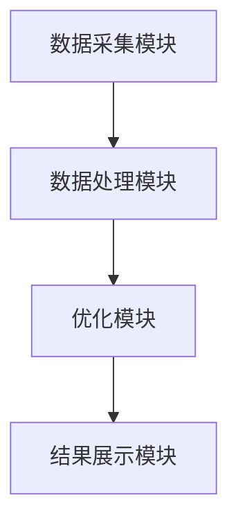

                 


# 构建智能化的个人税务筹划多目标优化助手

> 关键词：智能化、税务筹划、多目标优化、人工智能、系统设计、算法实现

> 摘要：本文探讨如何利用人工智能技术构建一个智能化的个人税务筹划助手，通过多目标优化算法解决税务筹划中的复杂问题，提升税务优化的效率和准确性。

---

## 第一章：智能化税务筹划助手的背景

### 1.1 问题背景与描述
#### 1.1.1 个人税务筹划的重要性
随着经济全球化和个人所得税政策的复杂化，个人税务筹划变得越来越重要。合理的税务规划可以帮助个人最大限度地降低税负，优化财务状况。

#### 1.1.2 当前税务筹划的主要挑战
- 税收政策复杂多变，涉及多个税种和优惠政策。
- 个人收入来源多样，包括工资、投资收益、租金等，需要综合考虑。
- 税务筹划需要兼顾短期和长期目标，涉及多目标优化问题。

#### 1.1.3 智能化税务助手的必要性
传统税务筹划方法依赖人工计算和经验判断，效率低下且容易出错。智能化助手可以通过大数据分析和AI技术，提供精准的税务优化建议。

### 1.2 技术背景
#### 1.2.1 人工智能技术的发展
人工智能技术，特别是机器学习和深度学习，已经在金融领域得到广泛应用。通过AI技术，可以自动化处理税务数据，识别潜在的优化机会。

#### 1.2.2 大数据与税务分析
大数据技术可以整合个人的财务数据，构建全面的税务分析模型。通过对海量数据的分析，可以发现隐藏的税务优化机会。

#### 1.2.3 多目标优化算法的应用
多目标优化算法在金融投资和资源分配等领域有广泛应用。将其应用于税务筹划，可以帮助个人在多个目标之间找到最佳平衡点。

### 1.3 问题解决与边界
#### 1.3.1 多目标优化的核心问题
在税务筹划中，通常需要在多个目标之间进行权衡，例如税负最小化、资产最大化、风险最小化等。

#### 1.3.2 边界与外延
- 边界：仅考虑个人税务筹划，不涉及企业税务。
- 外延：可能扩展到跨国税务、遗产税等复杂场景。

#### 1.3.3 核心要素与组成
- 税务数据：包括收入、支出、资产等。
- 税收政策：不同税种的税率、优惠政策等。
- 优化目标：税后净收益最大化、风险最小化等。

---

## 第二章：多目标优化的基本概念

### 2.1 多目标优化的定义与特点
#### 2.1.1 多目标优化的定义
多目标优化是指在多个相互冲突的目标下，寻找最优解的过程。与单目标优化不同，多目标优化需要平衡不同目标之间的关系。

#### 2.1.2 与单目标优化的区别
| 特性 | 单目标优化 | 多目标优化 |
|------|------------|------------|
| 目标数 | 1          | >=2        |
| 解空间 | 单点       | 多点       |
| 复杂度 | 较低       | 较高       |

#### 2.1.3 多目标优化在税务筹划中的应用
在税务筹划中，多目标优化可以帮助个人在不同的税务目标之间找到平衡点。例如，在税后净收益最大化的同时，尽量降低风险。

### 2.2 税务筹划中的多目标优化
#### 2.2.1 税务目标的多样性
税务目标可能包括：
- 税后净收益最大化
- 税务风险最小化
- 资产配置最优化
- 税收优惠政策最大化利用

#### 2.2.2 目标之间的冲突与协调
- 冲突：例如，追求税后净收益最大化可能导致税务风险增加。
- 协调：通过多目标优化算法，在冲突的目标之间找到最佳平衡点。

#### 2.2.3 多目标优化在税务筹划中的应用
通过多目标优化算法，可以帮助个人在多种税务目标之间找到最优解。例如，在投资组合优化中，可以在风险和收益之间找到最佳平衡点。

---

## 第三章：税务筹划的多目标建模

### 3.1 多目标优化模型的构建
#### 3.1.1 目标函数的设定
在税务筹划中，目标函数通常包括：
- 税后净收益（Maximize）
- 税务风险（Minimize）
- 资产配置的复杂度（Minimize）

#### 3.1.2 约束条件的定义
约束条件可能包括：
- 税收政策的限制
- 资产配置的限制
- 时间跨度的限制

#### 3.1.3 模型的数学表达
多目标优化模型可以表示为：
$$
\text{Maximize } f_1(x) \\
\text{Maximize } f_2(x) \\
\text{...} \\
\text{Subject to } g_i(x) \leq 0 \quad (i=1,2,...,m)
$$

其中，$x$ 是决策变量，$f_i(x)$ 是目标函数，$g_i(x)$ 是约束条件。

### 3.2 常用的多目标优化算法
#### 3.2.1 基本粒子群算法
粒子群优化（PSO）是一种基于群体智能的优化算法。通过模拟鸟群觅食的行为，找到问题的最优解。

#### 3.2.2 非支配排序遗传算法
非支配排序遗传算法（NSGA）是一种多目标优化算法，通过 Pareto 优胜劣汰的原则，找到 Pareto 最优解集。

#### 3.2.3 其他优化方法
- 模糊优化
- 偏好关系优化

---

## 第四章：AI技术在税务优化中的应用

### 4.1 自然语言处理在税务文档中的应用
#### 4.1.1 文本抽取与信息提取
通过NLP技术，可以自动提取税务文档中的关键信息，例如收入、支出、资产等。

#### 4.1.2 文本分类与主题识别
通过文本分类技术，可以识别税务文档的主题，例如收入确认、税务申报等。

### 4.2 机器学习在税务预测中的应用
#### 4.2.1 税务风险预测模型
通过机器学习算法，可以预测个人税务风险，帮助制定风险控制策略。

#### 4.2.2 税务申报预测
通过机器学习模型，可以预测税务申报的结果，帮助个人提前做好准备。

### 4.3 知识图谱构建与税务分析
#### 4.3.1 税务知识图谱的构建
通过知识图谱技术，可以构建税务知识图谱，整合税收政策、法规等信息。

#### 4.3.2 税务关系的推理与分析
通过知识图谱推理技术，可以分析税务关系，发现潜在的税务优化机会。

---

## 第五章：系统架构与设计

### 5.1 系统总体架构
#### 5.1.1 模块划分与功能分配
- 数据采集模块：负责采集税务数据。
- 数据处理模块：负责清洗和转换数据。
- 优化模块：负责多目标优化计算。
- 结果展示模块：负责展示优化结果。

#### 5.1.2 系统的层次结构
- 数据层：包括税务数据、税收政策等。
- 业务逻辑层：包括数据处理、优化计算等。
- 用户界面层：包括数据输入、结果展示等。

### 5.2 功能模块设计
#### 5.2.1 数据采集模块
- 数据来源：个人财务数据、税收政策数据等。
- 数据格式：结构化数据、非结构化数据。

#### 5.2.2 数据处理模块
- 数据清洗：去除冗余数据，处理异常值。
- 数据转换：将数据转换为适合优化计算的格式。

#### 5.2.3 优化模块
- 优化算法：粒子群算法、遗传算法等。
- 优化结果：生成 Pareto 最优解集。

#### 5.2.4 结果展示模块
- 可视化工具：展示优化结果，例如 Pareto 曲线。
- 结果解读：解释优化结果，提供税务优化建议。

### 5.3 系统架构图


---

## 第六章：项目实战

### 6.1 环境配置
#### 6.1.1 系统环境
- 操作系统：Linux/Windows/MacOS
- 开发工具：PyCharm、VS Code等
- 依赖库：numpy、pandas、scikit-learn等

### 6.2 核心代码实现
#### 6.2.1 数据采集模块
```python
import pandas as pd

def load_tax_data(file_path):
    data = pd.read_csv(file_path)
    return data
```

#### 6.2.2 数据处理模块
```python
def preprocess_data(data):
    # 数据清洗
    data = data.dropna()
    # 数据转换
    data['tax'] = data['income'] * 0.2
    return data
```

#### 6.2.3 优化模块
```python
import numpy as np

def optimize(tax_data):
    # 简单粒子群算法实现
    pass
```

### 6.3 功能实现
#### 6.3.1 数据采集与处理
通过数据采集模块，从 CSV 文件中读取税务数据，并进行清洗和转换。

#### 6.3.2 优化计算
通过优化模块，使用粒子群算法对税务数据进行多目标优化计算，生成 Pareto 最优解集。

#### 6.3.3 结果展示
通过结果展示模块，将优化结果可视化，并提供税务优化建议。

### 6.4 案例分析
#### 6.4.1 案例背景
假设一个高收入的个人，希望通过税务优化降低税负。

#### 6.4.2 数据分析
- 收入：100万元
- 支出：50万元
- 资产：200万元

#### 6.4.3 优化结果
- 税后净收益：最大化
- 税务风险：最小化

### 6.5 代码解读
详细解读核心代码，解释每部分的功能和实现逻辑。

---

## 第七章：系统测试与部署

### 7.1 系统测试
#### 7.1.1 测试方法
- 功能测试：测试每个模块的功能是否正常。
- 性能测试：测试系统在大数据量下的运行效率。
- 安全测试：测试系统的安全性，防止数据泄露。

#### 7.1.2 测试用例
- 数据采集模块测试：测试数据是否正确采集。
- 数据处理模块测试：测试数据是否正确处理。
- 优化模块测试：测试优化结果是否合理。

### 7.2 部署方案
#### 7.2.1 系统部署
- 线上部署：将系统部署到云服务器上。
- 线下部署：在本地服务器上部署系统。

#### 7.2.2 系统监控
- 监控指标：系统运行状态、性能指标等。
- 监控工具：使用监控工具实时监控系统状态。

---

## 第八章：总结与展望

### 8.1 项目总结
通过本项目，我们成功构建了一个智能化的个人税务筹划多目标优化助手，解决了传统税务筹划方法的低效和不准确的问题。

### 8.2 技术总结
- AI技术在税务优化中的应用前景广阔。
- 多目标优化算法在税务筹划中的应用效果显著。

### 8.3 未来展望
- 拓展到跨国税务、遗产税等领域。
- 结合区块链技术，提高税务数据的安全性和可信度。

### 8.4 注意事项
- 税务政策变化较快，需要及时更新系统中的税收政策数据。
- 系统的优化结果仅供参考，具体税务筹划需要结合实际情况。

---

通过以上内容，我们详细探讨了构建智能化的个人税务筹划多目标优化助手的各个方面，从背景到技术实现，再到项目实战，为读者提供了一个全面的视角。

