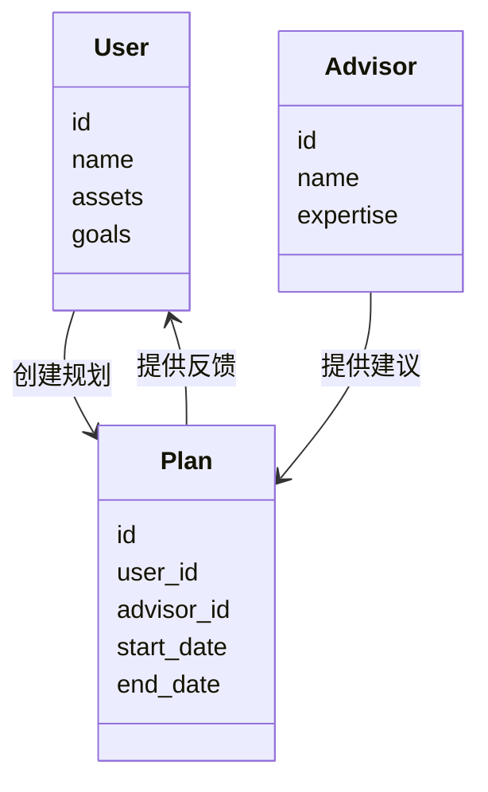
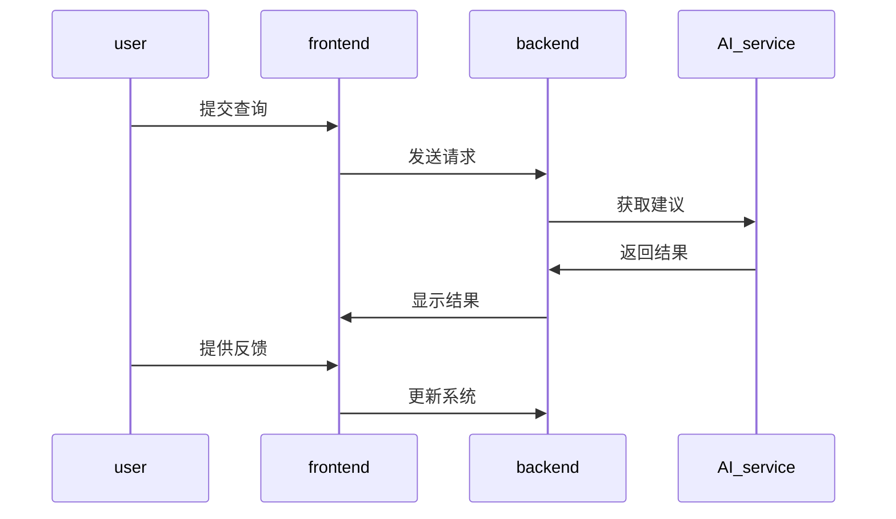

                 


# 构建智能化的个人财富传承规划助手

## 关键词：财富传承规划、人工智能、知识图谱、自然语言处理、系统架构、智能化助手

## 摘要

本文探讨如何利用人工智能技术构建智能化的个人财富传承规划助手。通过结合自然语言处理、知识图谱和系统架构设计，我们提出了一种高效的方法，以实现个性化、动态的财富管理。本文详细分析了智能化助手的核心概念、算法原理和系统架构，并通过实际案例展示了其应用和价值。

## 目录

### 目录
1. 背景介绍
2. 核心概念与联系
3. 算法原理
4. 系统分析与架构设计
5. 项目实战
6. 总结与展望

## 第一部分: 背景介绍

### 第1章: 个人财富传承规划的智能化背景

#### 1.1 财富传承规划的核心概念

##### 1.1.1 财富传承规划的定义与目标

财富传承规划是指通过法律、税务和资产配置等手段，确保个人财富能够有效传承给下一代或其他受益人。其目标是最大化资产价值，减少税务负担，并确保传承过程的合法性和顺利性。

##### 1.1.2 传统财富传承规划的局限性

传统财富传承规划主要依赖人工咨询，存在以下问题：

- 个性化不足：难以满足不同家庭的多样化需求。
- 动态调整困难：市场变化和家庭情况变化难以及时反映。
- 信息分散：缺乏统一的平台整合法律、税务和资产配置信息。

##### 1.1.3 智能化助手的必要性与优势

智能化助手通过AI技术，能够实现以下优势：

- 提供个性化建议：基于用户数据，定制专属传承方案。
- 实时更新：根据市场变化和法律法规更新，提供最新建议。
- 高效便捷：用户可通过在线平台随时获取帮助，节省时间和成本。

#### 1.2 个人财富传承规划的智能化需求

##### 1.2.1 个性化与动态调整的重要性

财富传承规划需要根据用户的具体情况动态调整，包括资产规模、家庭结构、税务环境等因素的变化。

##### 1.2.2 数据驱动的决策支持

通过收集和分析大量数据，智能化助手能够为用户提供科学的决策支持，包括资产配置、税务优化和法律合规等方面。

##### 1.2.3 全球化与多资产配置的挑战

随着全球化的发展，个人资产可能分布在多个国家和地区，智能化助手需要能够处理多货币、多税务环境下的传承规划。

#### 1.3 人工智能在财富传承规划中的应用前景

##### 1.3.1 AI技术在财富管理中的潜力

AI技术可以通过自然语言处理、机器学习和知识图谱等手段，提高财富管理的效率和准确性。

##### 1.3.2 智能化助手的功能与价值

智能化助手可以实现以下功能：

- 提供传承方案建议
- 监测市场动态
- 预警潜在风险
- 协调多方资源

##### 1.3.3 未来发展趋势与挑战

未来，智能化助手将更加智能化和个性化，但需要克服数据隐私、技术局限性和用户信任等挑战。

---

## 第二部分: 核心概念与联系

### 第2章: 智能化个人财富传承规划助手的核心概念

#### 2.1 核心概念与定义

##### 2.1.1 智能化助手的基本定义

智能化个人财富传承规划助手是一种基于人工智能技术的在线工具，能够为用户提供个性化的传承规划建议和实时支持。

##### 2.1.2 功能模块与核心要素

智能化助手的主要功能模块包括：

- 用户信息收集与分析
- 传承方案生成
- 监测与调整
- 交互与反馈

核心要素包括：

- 用户数据：资产、负债、家庭结构等。
- 传承目标：财富分配、税务优化等。
- 法律法规：各国的遗产税、赠与税等。

#### 2.2 核心概念与联系

##### 2.2.1 问题背景与目标

本文旨在解决传统财富传承规划效率低、个性化不足的问题，提出智能化助手的构建方法。

##### 2.2.2 核心概念的属性对比

以下是传统财富传承规划与智能化助手的对比：

| 特性             | 传统方式                  | 智能化助手            |
|------------------|---------------------------|----------------------|
| 个性化           | 较低                      | 高                   |
| 动态调整能力     | 较弱                      | 强                   |
| 信息整合能力     | 有限                      | 强                   |
| 成本与效率       | 高                        | 低                   |

##### 2.2.3 ER实体关系图

以下是用户、顾问和规划方案的ER实体关系图：

```mermaid
erDiagram
    user {
        id
        name
        age
        assets
        liabilities
        goals
    }
    advisor {
        id
        name
        expertise
    }
    plan {
        id
        user_id
        advisor_id
        start_date
        end_date
        status
    }
    user --> plan : 创建规划
    advisor --> plan : 提供建议
```

---

## 第三部分: 算法原理

### 第3章: 算法原理

#### 3.1 自然语言处理在财富传承规划中的应用

##### 3.1.1 自然语言处理的基本原理

自然语言处理（NLP）通过理解文本内容，提取关键信息。常用技术包括分词、实体识别和情感分析等。

##### 3.1.2 文本表示与相似度计算

使用词嵌入模型（如Word2Vec）将文本转化为向量表示，计算文本相似度。

$$ \text{余弦相似度} = \frac{\vec{A} \cdot \vec{B}}{|\vec{A}| |\vec{B}|} $$

##### 3.1.3 实例分析

例如，将法律条款文本转化为向量，与用户需求进行匹配，提取相关信息。

#### 3.2 知识图谱的构建与应用

##### 3.2.1 知识图谱的构建步骤

1. 数据收集：整理法律、税务等领域的知识。
2. 实体识别：识别关键实体（如法律术语、税务节点）。
3. 关系抽取：建立实体间的关联关系。
4. 图谱构建：构建结构化的知识图谱。

##### 3.2.2 知识图谱的表示方法

使用图嵌入模型（如GraphSAGE）将图结构转化为向量表示。

$$ \text{节点表示} = \text{聚合邻居} + \text{自身特征} $$

##### 3.2.3 知识图谱的查询与推理

通过SPARQL查询语言，在知识图谱中进行复杂推理，获取传承规划的相关信息。

---

## 第四部分: 系统分析与架构设计

### 第4章: 系统分析与架构设计

#### 4.1 问题场景介绍

用户希望通过智能化助手进行财富传承规划，系统需要处理多源数据，提供个性化建议。

#### 4.2 系统功能设计

##### 4.2.1 领域模型设计

以下是系统功能模块的类图：



##### 4.2.2 系统架构设计

以下是系统架构图：


##### 4.2.3 接口设计

系统通过API接口与第三方服务（如法律数据库）进行交互，获取实时数据。

##### 4.2.4 交互设计

以下是用户与系统交互的流程图：



---

## 第五部分: 项目实战

### 第5章: 项目实战

#### 5.1 环境安装

需要安装以下工具：

- Python 3.8+
- Jupyter Notebook
- NLTK、Gensim等NLP库
- Neo4j用于知识图谱存储

#### 5.2 核心代码实现

##### 5.2.1 自然语言处理部分

以下是关键词提取的代码示例：

```python
from sklearn.feature_extraction.text import TfidfVectorizer

texts = ["财富传承", "遗产税", "资产配置"]
vectorizer = TfidfVectorizer()
tfidf_matrix = vectorizer.fit_transform(texts)
```

##### 5.2.2 知识图谱构建部分

以下是构建知识图谱的代码示例：

```python
from neo4j import GraphDatabase

def add_node(tx, label, properties):
    tx.run("CREATE (n:%s $props) RETURN n" % label, params={"props": properties})

with driver.transaction() as tx:
    add_node(tx, "User", {"name": "张三", "age": 45})
    add_node(tx, "Plan", {"type": "传承规划", "status": "draft"})
```

#### 5.3 案例分析

##### 5.3.1 案例介绍

以张三为例，他有1000万资产，需制定传承规划。

##### 5.3.2 实施步骤

1. 收集用户信息。
2. 生成传承方案。
3. 监测与调整。

##### 5.3.3 结果展示

生成的传承方案包括资产分配、税务优化等内容，并提供实时调整建议。

---

## 第六部分: 总结与展望

### 第6章: 总结与展望

#### 6.1 总结

本文详细介绍了智能化个人财富传承规划助手的构建过程，包括背景、核心概念、算法原理和系统设计。通过实际案例展示了其应用价值。

#### 6.2 展望

未来，随着AI技术的发展，智能化助手将更加智能化和个性化，但需克服数据隐私和技术局限性等挑战。

---

## 注意事项

- 本文中的代码示例仅供参考，实际应用需根据具体需求调整。
- 系统设计时需注意数据安全和隐私保护。

## 拓展阅读

建议阅读以下书籍和文章，以深入了解相关技术：

- 《深度学习入门：用Python轻松实现算法》
- 《自然语言处理实战：基于Python的自然语言处理项目》
- 《知识图谱：概念、方法与应用》

---

通过本文的系统介绍，读者可以全面了解智能化个人财富传承规划助手的构建方法，掌握其在实际应用中的潜力和价值。

