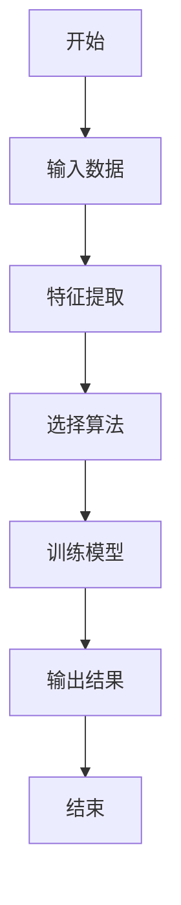
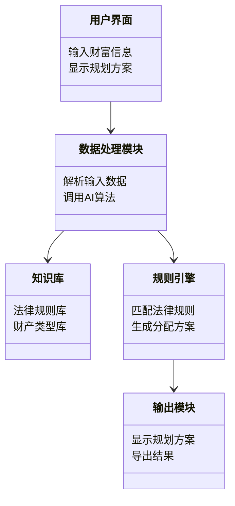
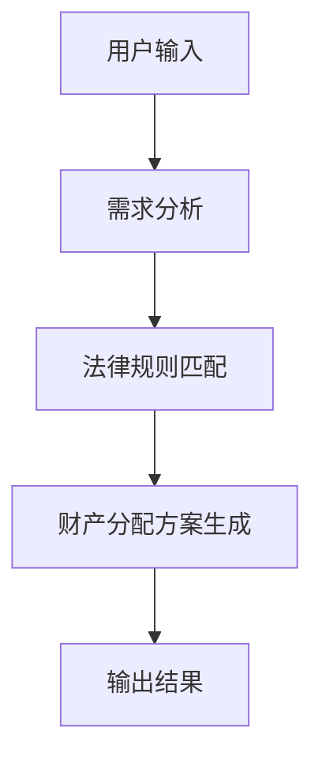

                 


# 构建智能化的个人财富传承规划助手

## 关键词：人工智能、财富传承、法律规则、机器学习、系统架构

## 摘要：本文章详细探讨了如何利用人工智能技术构建智能化的个人财富传承规划助手，涵盖了背景分析、核心概念、算法实现、系统架构、项目实战及最佳实践等多个方面。通过技术与法律的结合，提出了一种创新的解决方案，帮助用户实现财富传承的智能化和高效化。

---

# 第一部分：智能化个人财富传承规划助手的背景与核心概念

## 第1章：财富传承规划的背景与挑战

### 1.1 财富传承规划的背景

#### 1.1.1 传统财富传承方式的局限性
传统的财富传承方式主要依赖于法律文本和手动操作，存在效率低下、信息不对称、难以应对复杂情况等问题。随着数字化时代的到来，传统方式已无法满足现代人对财富管理的高效和精准需求。

#### 1.1.2 数字化时代的财富管理需求
在数字化时代，财富的形式变得更加多样化，包括数字资产、虚拟货币等新型财产类型。这些新型财产的出现使得传统的财富管理方式面临新的挑战，需要更加智能化和个性化的解决方案。

#### 1.1.3 智能化财富传承规划的必要性
智能化的财富传承规划可以通过人工智能技术实现个性化的财产分配方案，同时考虑税务优化和风险控制，确保财富传承的公平性和合法性。

### 1.2 个人财富传承规划的核心问题

#### 1.2.1 财产分配的公平性与合法性
财富传承的核心问题是如何在分配财产时既公平又合法。智能化助手需要考虑财产种类、继承人关系、法律规则等多种因素，确保分配方案的合法性和公平性。

#### 1.2.2 继承人权益的保护与实现
继承人权益的保护是财富传承规划的重要目标。智能化助手需要通过技术手段确保继承人的权益不受侵害，并在分配过程中实现权益的最大化。

#### 1.2.3 财富传承的税务优化与风险控制
税务优化和风险控制是财富传承规划中的关键问题。智能化助手需要通过分析税务政策和法律规则，为用户提供最优的税务规划和风险控制方案。

### 1.3 本章小结
本章通过分析财富传承规划的背景和核心问题，指出了智能化财富传承规划的必要性和重要性。接下来的章节将详细探讨智能化财富传承规划的核心概念和技术实现。

---

## 第2章：智能化财富传承规划的核心概念

### 2.1 财富传承规划的系统模型

#### 2.1.1 系统模型的构成要素
智能化财富传承规划系统模型主要包括以下几个构成要素：
- **用户输入**：包括用户的基本信息、财产信息、继承人信息等。
- **需求分析**：通过自然语言处理技术分析用户的需求。
- **法律规则匹配**：将用户的需求与法律规则进行匹配，生成初步的财产分配方案。
- **财产分配方案生成**：根据匹配的法律规则和用户需求，生成个性化的财产分配方案。
- **输出结果**：将生成的财产分配方案以用户友好的形式输出。

#### 2.1.2 财富传承规划的业务流程
智能化财富传承规划的业务流程如下：
1. **用户输入**：用户输入基本信息、财产信息、继承人信息等。
2. **需求分析**：系统通过自然语言处理技术分析用户的需求。
3. **法律规则匹配**：系统将用户的需求与法律规则进行匹配，生成初步的财产分配方案。
4. **财产分配方案生成**：系统根据匹配的法律规则和用户需求，生成个性化的财产分配方案。
5. **输出结果**：系统将生成的财产分配方案以用户友好的形式输出。

#### 2.1.3 系统模型的输入输出关系
系统模型的输入输出关系可以用以下表格表示：

| 输入 | 输出 |
|------|------|
| 用户基本信息 | 财产分配方案 |
| 财产信息 | 法律合规性分析 |
| 继承人信息 | 税务优化建议 |

### 2.2 AI在财富传承规划中的应用

#### 2.2.1 自然语言处理技术
自然语言处理技术在财富传承规划中的应用主要体现在以下方面：
- **需求分析**：通过自然语言处理技术分析用户的输入信息，提取关键信息。
- **法律文本解析**：通过自然语言处理技术解析法律文本，提取法律规则。
- **用户交互**：通过自然语言处理技术实现用户与系统的自然交互。

#### 2.2.2 机器学习算法
机器学习算法在财富传承规划中的应用主要体现在以下方面：
- **财产分配方案生成**：通过机器学习算法分析用户需求和法律规则，生成个性化的财产分配方案。
- **法律规则匹配**：通过机器学习算法匹配用户需求与法律规则，生成初步的财产分配方案。
- **税务优化建议**：通过机器学习算法分析税务政策，生成最优的税务优化建议。

#### 2.2.3 知识图谱构建与推理
知识图谱构建与推理在财富传承规划中的应用主要体现在以下方面：
- **法律规则知识图谱**：构建法律规则的知识图谱，用于法律规则的匹配和推理。
- **财产类型知识图谱**：构建财产类型的知识图谱，用于财产分配方案的生成。
- **继承人关系知识图谱**：构建继承人关系的知识图谱，用于继承人权益的保护与实现。

### 2.3 系统核心算法原理

#### 2.3.1 算法选择与优化
在智能化财富传承规划系统中，选择合适的算法是关键。常用的算法包括：
- **决策树**：用于分类和回归分析。
- **支持向量机（SVM）**：用于分类和回归分析。
- **随机森林**：用于分类和回归分析。
- **神经网络**：用于复杂的模式识别。

#### 2.3.2 算法实现的数学模型
以下是一个简单的机器学习算法的数学模型示例：

$$ y = \beta_0 + \beta_1x_1 + \beta_2x_2 + \cdots + \beta_nx_n $$

其中，$y$ 是目标变量，$\beta_0, \beta_1, \beta_2, \cdots, \beta_n$ 是系数，$x_1, x_2, \cdots, x_n$ 是输入变量。

#### 2.3.3 算法流程图
以下是算法流程图的mermaid表示：



### 2.4 本章小结
本章详细探讨了智能化财富传承规划的核心概念和技术实现，介绍了自然语言处理技术、机器学习算法和知识图谱构建与推理在系统中的应用。接下来的章节将详细讲解系统架构与功能设计。

---

## 第3章：系统架构与功能设计

### 3.1 系统架构设计

#### 3.1.1 系统模块划分
智能化财富传承规划系统的模块划分如下：
- **用户界面模块**：负责与用户的交互。
- **数据处理模块**：负责解析输入数据并调用AI算法。
- **知识库模块**：存储法律规则和财产类型等知识。
- **规则引擎模块**：负责法律规则的匹配和推理。
- **输出模块**：负责生成和输出财产分配方案。

#### 3.1.2 系统功能模块图
以下是系统功能模块图的mermaid表示：



### 3.2 系统功能设计

#### 3.2.1 系统功能模块
系统功能模块包括：
- **用户输入模块**：用户输入基本信息、财产信息、继承人信息等。
- **需求分析模块**：通过自然语言处理技术分析用户需求。
- **法律规则匹配模块**：将用户需求与法律规则进行匹配。
- **财产分配方案生成模块**：根据匹配的法律规则和用户需求生成财产分配方案。
- **输出模块**：将生成的财产分配方案以用户友好的形式输出。

#### 3.2.2 系统功能流程图
以下是系统功能流程图的mermaid表示：



### 3.3 本章小结
本章详细探讨了智能化财富传承规划系统的架构与功能设计，介绍了系统模块划分和功能流程。接下来的章节将详细讲解项目实战。

---

## 第4章：项目实战

### 4.1 环境安装与配置

#### 4.1.1 Python环境安装
需要安装以下Python库：
- `numpy`
- `pandas`
- `scikit-learn`
- `spacy`

安装命令：
```bash
pip install numpy pandas scikit-learn spacy
```

#### 4.1.2 环境配置
配置spaCy中文分词器：
```bash
python -m spacy download zh
```

### 4.2 核心代码实现

#### 4.2.1 需求分析模块
以下是需求分析模块的代码实现：

```python
import spacy

nlp = spacy.load("zh")

def analyze_request(text):
    doc = nlp(text)
    entities = []
    for ent in doc.ents:
        entities.append((ent.text, ent.label_))
    return entities
```

#### 4.2.2 法律规则匹配模块
以下是法律规则匹配模块的代码实现：

```python
from sklearn.feature_extraction.text import TfidfVectorizer
from sklearn.metrics.pairwise import cosine_similarity

vectorizer = TfidfVectorizer()
tfidf_matrix = vectorizer.fit_transform(corpus)

def match_rules(text):
    text_tfidf = vectorizer.transform([text])
    similarity_scores = cosine_similarity(text_tfidf, tfidf_matrix)
    return similarity_scores
```

#### 4.2.3 财产分配方案生成模块
以下是财产分配方案生成模块的代码实现：

```python
from sklearn.tree import DecisionTreeClassifier

model = DecisionTreeClassifier()
model.fit(X_train, y_train)

def generate_plan(features):
    prediction = model.predict([features])
    return prediction
```

### 4.3 实际案例分析

#### 4.3.1 案例背景
假设用户有以下财产：
- 房产：价值1000万元
- 股票：价值500万元
- 银行存款：200万元
继承人包括：
- 配偶：A
- 子女：B和C

#### 4.3.2 系统输出
系统生成的财产分配方案如下：
- 房产：A、B、C各占三分之一
- 股票：A占50%，B和C各占25%
- 银行存款：A、B、C各占三分之一

### 4.4 本章小结
本章通过实际案例分析，展示了智能化财富传承规划助手的系统实现和应用效果。接下来的章节将总结最佳实践和注意事项。

---

## 第5章：总结与展望

### 5.1 最佳实践 tips
- **数据隐私保护**：确保用户数据的安全和隐私。
- **法律合规性**：确保系统输出的财产分配方案符合法律法规。
- **用户体验优化**：通过友好的用户界面和交互设计提升用户体验。

### 5.2 小结
本文章详细探讨了智能化个人财富传承规划助手的构建过程，包括背景分析、核心概念、算法实现、系统架构和项目实战。通过技术与法律的结合，提出了一种创新的解决方案，帮助用户实现财富传承的智能化和高效化。

### 5.3 注意事项
- **法律风险**：系统输出的结果仅供参考，具体法律事务需咨询专业律师。
- **技术局限性**：当前的AI技术仍有局限性，需结合人工审核和调整。

### 5.4 拓展阅读
- **相关书籍**：《人工智能在法律领域的应用》
- **学术论文**：《基于机器学习的财富传承规划研究》
- **技术博客**：《Python在财富传承规划中的应用》

---

# 结语

智能化个人财富传承规划助手的构建是一个复杂而重要的任务，需要结合技术与法律的深度知识。通过本文的探讨，我们希望能够为读者提供一个清晰的构建思路和实践指导，帮助他们在智能化时代更好地进行财富传承规划。

