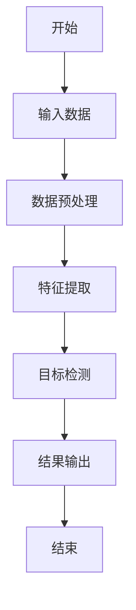
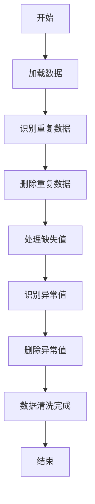
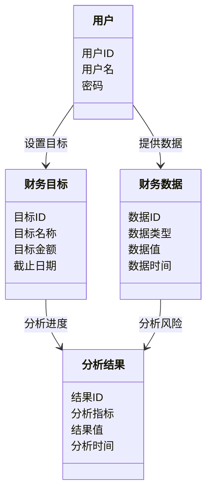

                 


# 构建智能化的个人财富管理目标跟踪助手

## 关键词：
- 智能化财富管理
- 目标跟踪
- AI算法
- 数据分析
- 系统架构

## 摘要：
智能化个人财富管理目标跟踪助手通过整合AI算法和数据分析技术，帮助用户高效设定、跟踪和调整财务目标。本文详细阐述了构建该助手的背景、核心概念、算法原理、系统架构，并通过实际案例展示了如何将理论应用于实践。通过本文，读者可以掌握从理论到实践的全过程，构建一个智能化的财富管理助手。

---

## 第一部分：智能化个人财富管理目标跟踪助手的背景与概念

### 第1章：智能化财富管理的背景与问题背景

#### 1.1 个人财富管理的重要性
财富管理是个人生活中至关重要的一部分，它涉及到储蓄、投资、支出规划等多个方面。随着经济环境的复杂化和个体需求的多样化，传统的财富管理方式逐渐显现出诸多不足。

##### 1.1.1 财富管理的核心概念
财富管理是指通过科学的规划和管理，实现个人财务目标的过程。它包括资产配置、风险控制、投资决策等多个环节。有效的财富管理能够帮助个人实现财务自由，避免财务风险。

##### 1.1.2 传统财富管理的局限性
传统的财富管理主要依赖人工操作，存在效率低、覆盖面窄、个性化不足等问题。例如，传统的方法难以实时跟踪和调整财务目标，也无法根据市场变化提供及时的建议。

##### 1.1.3 智能化财富管理的必要性
随着人工智能和大数据技术的快速发展，智能化财富管理成为可能。通过智能化工具，用户可以更高效地设定目标、跟踪进度、调整策略，从而提高财富管理的效果。

#### 1.2 个人财富管理目标跟踪的挑战
在实际操作中，个人财富管理目标跟踪面临诸多挑战，包括数据分散、信息不全、目标分解复杂等问题。

##### 1.2.1 目标设定的复杂性
财务目标的设定需要考虑多个因素，如时间、风险承受能力、投资渠道等。如何科学分解目标并制定可行的计划是关键。

##### 1.2.2 数据收集与处理的难点
财富管理涉及大量数据，如收入、支出、投资收益等。如何高效收集、清洗和处理这些数据是构建智能化助手的关键步骤。

##### 1.2.3 目标执行中的不确定性
市场环境、个人收入变化等外部因素会影响目标的实现。如何动态调整目标和策略是智能化助手需要解决的核心问题。

### 第2章：智能化财富管理目标跟踪助手的核心概念

#### 2.1 智能化目标跟踪助手的定义
智能化个人财富管理目标跟踪助手是一种基于AI和大数据技术的工具，能够帮助用户设定、跟踪和调整财务目标，提供个性化的建议和预测。

##### 2.1.1 核心功能与模块
智能化助手通常包括目标管理模块、数据采集模块、分析引擎模块和用户界面模块。每个模块都有其独特的功能和作用。

##### 2.1.2 技术基础与实现方式
智能化助手依赖于多种技术，如机器学习算法、自然语言处理、数据可视化等。这些技术共同支撑着目标跟踪和分析的核心功能。

#### 2.2 相关概念对比分析
为了更好地理解智能化助手，需要将其与传统目标管理工具和其他相关概念进行对比分析。

##### 2.2.1 传统目标管理工具与智能化助手的区别
传统工具通常功能单一，缺乏智能化分析能力。而智能化助手能够实时跟踪、预测和调整目标，提供更精准的建议。

##### 2.2.2 AI技术在财富管理中的应用对比
AI技术的应用使财富管理更加智能化和个性化。通过机器学习，助手能够根据用户行为和市场变化，提供定制化的建议。

##### 2.2.3 数据驱动与规则驱动的差异
数据驱动的助手依赖于大量数据进行分析和预测，而规则驱动的助手则基于预设的规则进行判断。智能化助手通常是两者的结合。

---

## 第二部分：智能化财富管理目标跟踪助手的核心功能与技术基础

### 第3章：智能化财富管理目标跟踪助手的核心功能与技术基础

#### 3.1 核心功能模块
智能化助手的功能模块包括目标设定、数据采集、目标跟踪和预测、风险评估等。

##### 3.1.1 目标设定与分解
目标设定是智能化助手的第一步。用户需要明确财务目标，如储蓄目标、投资收益目标等。助手会将这些目标分解为可执行的子目标，制定详细计划。

##### 3.1.2 数据采集与处理
数据是智能化助手的核心资源。助手需要采集用户的财务数据，如收入、支出、资产配置等，并进行清洗和预处理，确保数据的准确性和完整性。

##### 3.1.3 目标跟踪与预测
通过实时跟踪用户的财务数据，助手能够评估目标的实现进度，并根据历史数据和市场趋势进行预测，提供调整建议。

##### 3.1.4 风险评估与调整建议
智能化助手能够识别潜在风险，并根据用户的风险承受能力，提供相应的调整建议，帮助用户优化财务策略。

#### 3.2 技术基础
智能化助手的技术基础包括AI算法、大数据处理、数据可视化等。

##### 3.2.1 AI算法在目标跟踪中的应用
AI算法，如机器学习和深度学习，用于目标检测、数据清洗和预测模型的构建。这些算法能够提高目标跟踪的准确性和效率。

##### 3.2.2 数据分析与可视化技术
数据分析技术用于处理和挖掘财务数据，提供深入的洞察。数据可视化技术则帮助用户直观地理解数据，如通过图表展示目标的实现进度。

##### 3.2.3 自然语言处理技术
自然语言处理技术用于解析用户的文本输入，如解析用户的财务目标描述，提取关键信息。

---

## 第三部分：智能化财富管理目标跟踪助手的算法原理

### 第4章：目标检测与识别算法

#### 4.1 目标检测算法原理
目标检测算法用于识别和定位财务数据中的关键信息，如支出项目、投资收益等。

##### 4.1.1 基于深度学习的目标检测算法
深度学习算法，如YOLO和Faster R-CNN，常用于目标检测。这些算法通过卷积神经网络提取特征，实现精准的目标检测。

##### 4.1.2 目标检测算法的流程图
以下是目标检测算法的流程图：



##### 4.1.3 目标检测算法的实现代码示例
以下是一个基于YOLO的目标检测代码示例：

```python
import tensorflow as tf
from tensorflow.keras.models import Model
from tensorflow.keras.layers import Input, Conv2D, MaxPooling2D, Dense

# 定义模型输入
input_tensor = Input(shape=(416, 416, 3))

# 特征提取层
x = Conv2D(32, (3, 3), activation='relu')(input_tensor)
x = MaxPooling2D(pool_size=(2, 2))(x)

# 目标检测层
x = Conv2D(64, (3, 3), activation='relu')(x)
x = MaxPooling2D(pool_size=(2, 2))(x)

# 输出层
output = Dense(10, activation='softmax')(x)

# 创建模型
model = Model(inputs=input_tensor, outputs=output)
model.compile(optimizer='adam', loss='categorical_crossentropy', metrics=['accuracy'])
```

---

### 第5章：数据清洗与预处理算法

#### 5.1 数据清洗算法
数据清洗是确保数据质量的重要步骤，包括去重、处理缺失值、识别异常值等。

##### 5.1.1 数据清洗算法的实现代码示例
以下是一个数据清洗的Python代码示例：

```python
import pandas as pd

# 加载数据
df = pd.read_csv('financial_data.csv')

# 删除重复数据
df = df.drop_duplicates()

# 处理缺失值
df['income'].fillna(df['income'].mean(), inplace=True)

# 识别异常值
z_scores = (df['expenses'] - df['expenses'].mean()) / df['expenses'].std()
df = df[(z_scores < 3)]
```

##### 5.1.2 数据清洗算法的流程图
以下是数据清洗流程的流程图：



---

## 第四部分：智能化财富管理目标跟踪助手的数学模型

### 第6章：目标进度预测模型

#### 6.1 基于时间序列的预测模型
时间序列预测模型用于预测目标的实现进度。

##### 6.1.1 时间序列预测模型的数学公式
线性回归模型用于时间序列预测：

$$ y_t = \beta_0 + \beta_1 t + \epsilon_t $$

其中，$y_t$ 是目标在时间 $t$ 的实现进度，$\beta_0$ 和 $\beta_1$ 是回归系数，$\epsilon_t$ 是误差项。

##### 6.1.2 时间序列预测模型的实现代码示例
以下是一个时间序列预测的Python代码示例：

```python
import pandas as pd
import numpy as np
from sklearn.linear_model import LinearRegression

# 加载数据
df = pd.read_csv('target_progress.csv')
df['time'] = range(len(df))

# 训练模型
model = LinearRegression()
model.fit(df[['time']], df['progress'])

# 预测未来进度
future_time = np.array([[len(df)]])
predicted_progress = model.predict(future_time)
```

---

### 第7章：风险评估与调整建议模型

#### 7.1 基于机器学习的风险评估模型
机器学习模型用于评估财务目标实现过程中的风险。

##### 7.1.1 风险评估模型的数学公式
马尔可夫链模型用于风险评估：

$$ P(i, t+1) = \sum_{j} P(j, t) \cdot P(i|j) $$

其中，$P(i, t+1)$ 是状态 $i$ 在时间 $t+1$ 的概率，$P(j, t)$ 是状态 $j$ 在时间 $t$ 的概率，$P(i|j)$ 是从状态 $j$ 转移到状态 $i$ 的概率。

##### 7.1.2 风险评估模型的实现代码示例
以下是一个风险评估模型的Python代码示例：

```python
import numpy as np
from sklearn.metrics import confusion_matrix

# 定义状态转移矩阵
transition_matrix = np.array([
    [0.7, 0.2, 0.1],
    [0.1, 0.6, 0.3],
    [0.2, 0.3, 0.5]
])

# 计算风险概率
def calculate_risk(current_state):
    return transition_matrix[current_state]

# 示例计算
current_state = 1
risk_matrix = calculate_risk(current_state)
print("风险概率矩阵:", risk_matrix)
```

---

## 第五部分：智能化财富管理目标跟踪助手的系统架构

### 第8章：系统功能设计

#### 8.1 系统功能模块
智能化助手的系统功能模块包括目标管理、数据采集、分析引擎和用户界面。

##### 8.1.1 目标管理模块
目标管理模块负责用户的财务目标设定、分解和管理。

##### 8.1.2 数据采集模块
数据采集模块负责从多个数据源获取用户的财务数据，如银行账户、投资账户等。

##### 8.1.3 分析引擎模块
分析引擎模块负责对数据进行分析和处理，生成预测和建议。

##### 8.1.4 用户界面模块
用户界面模块提供友好的用户交互界面，展示分析结果和操作选项。

#### 8.2 系统功能设计的领域模型
以下是系统功能设计的领域模型：



---

## 第六部分：智能化财富管理目标跟踪助手的项目实战

### 第9章：环境安装与核心代码实现

#### 9.1 环境安装
需要安装的环境包括Python、TensorFlow、Keras、Pandas、Mermaid工具等。

#### 9.2 核心代码实现
以下是核心代码实现的示例：

##### 9.2.1 目标检测代码
```python
import tensorflow as tf
from tensorflow.keras.models import Model
from tensorflow.keras.layers import Input, Conv2D, MaxPooling2D

# 定义模型输入
input_tensor = Input(shape=(416, 416, 3))

# 特征提取层
x = Conv2D(32, (3, 3), activation='relu')(input_tensor)
x = MaxPooling2D(pool_size=(2, 2))(x)

# 目标检测层
x = Conv2D(64, (3, 3), activation='relu')(x)
x = MaxPooling2D(pool_size=(2, 2))(x)

# 输出层
output = Dense(10, activation='softmax')(x)

# 创建模型
model = Model(inputs=input_tensor, outputs=output)
model.compile(optimizer='adam', loss='categorical_crossentropy', metrics=['accuracy'])
```

##### 9.2.2 数据清洗代码
```python
import pandas as pd

# 加载数据
df = pd.read_csv('financial_data.csv')

# 删除重复数据
df = df.drop_duplicates()

# 处理缺失值
df['income'].fillna(df['income'].mean(), inplace=True)

# 识别异常值
z_scores = (df['expenses'] - df['expenses'].mean()) / df['expenses'].std()
df = df[(z_scores < 3)]
```

---

### 第10章：项目实战与案例分析

#### 10.1 项目实战
以下是项目实战的详细步骤：

##### 10.1.1 环境配置
安装所需的Python包和工具，如TensorFlow、Pandas、Mermaid等。

##### 10.1.2 数据准备
收集和整理用户的财务数据，确保数据的完整性和准确性。

##### 10.1.3 模型训练
使用训练数据训练目标检测和预测模型，调整模型参数以提高准确率。

##### 10.1.4 系统集成
将各个功能模块集成到系统中，实现目标跟踪和预测的完整流程。

#### 10.2 案例分析
通过一个实际案例展示智能化助手的应用，分析其在目标跟踪和风险评估中的表现。

---

## 第七部分：智能化财富管理目标跟踪助手的最佳实践

### 第11章：最佳实践与注意事项

#### 11.1 小结
智能化个人财富管理目标跟踪助手的构建需要综合运用多种技术，包括AI算法、数据分析和系统架构设计。

#### 11.2 注意事项
在实际应用中，需要注意数据隐私保护、模型的可解释性以及系统的可扩展性。

#### 11.3 拓展阅读
建议读者进一步阅读相关领域的书籍和论文，深入理解智能化财富管理的理论和技术。

---

## 第八部分：总结

通过本文的详细阐述，读者可以全面了解构建智能化个人财富管理目标跟踪助手的背景、核心概念、算法原理、系统架构和项目实战。智能化助手的应用将显著提升个人财富管理的效率和效果，帮助用户更好地实现财务目标。

---

## 致谢

感谢读者的耐心阅读，希望本文能为您提供有价值的见解和启发。

