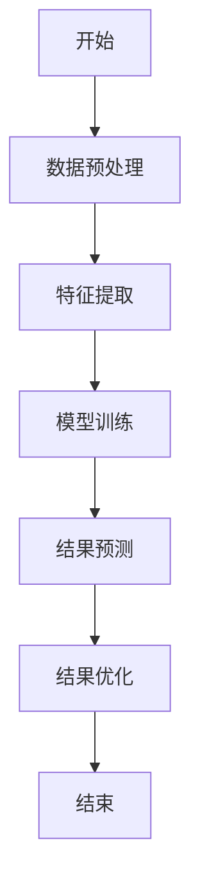
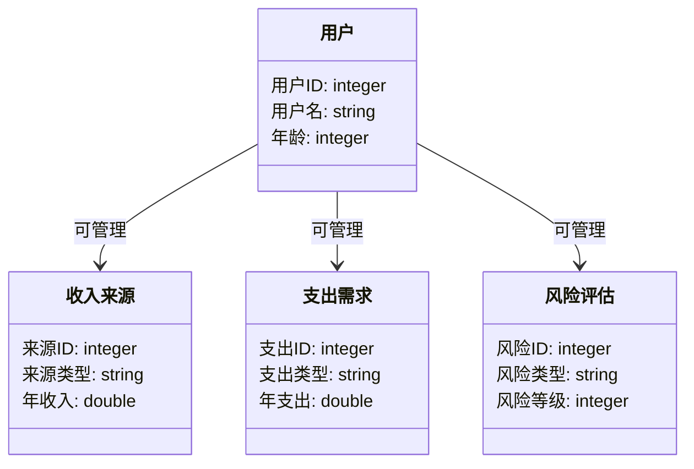
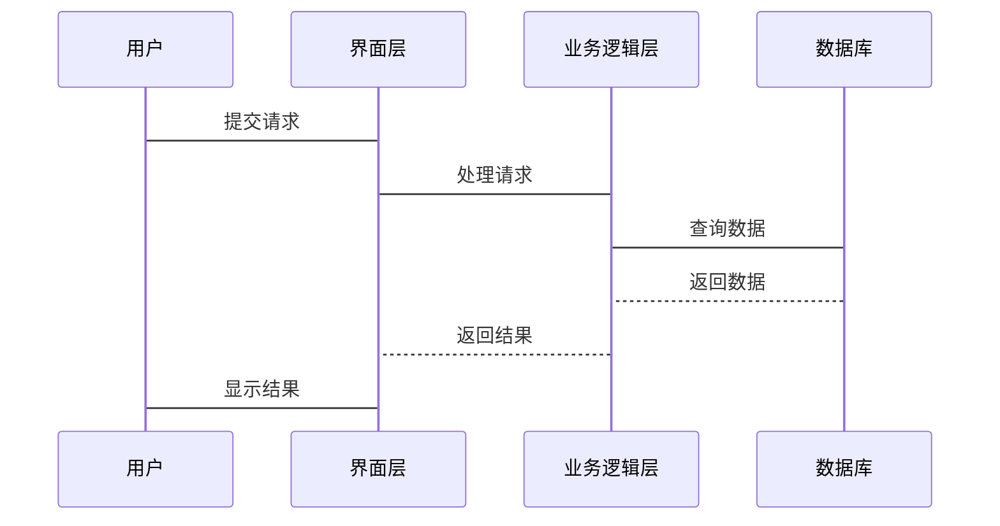

                 


# 构建智能化的个人退休收入规划工具

> 关键词：退休规划，智能化，机器学习，时间序列分析，多目标优化

> 摘要：随着人口老龄化的加剧，个人退休收入规划变得越来越重要。传统的退休规划方法依赖于简单的财务计算和经验判断，难以应对复杂的金融市场变化和个人需求的多样性。本文通过构建智能化的退休收入规划工具，利用机器学习和时间序列分析等技术，实现个性化的、动态的退休规划。文章详细阐述了退休收入规划的核心概念、算法原理、系统架构以及项目实现，为读者提供了一套完整的解决方案。

---

# 第一部分: 智能化个人退休收入规划工具的背景与核心概念

## 第1章: 退休收入规划的背景与挑战

### 1.1 退休收入规划的背景

#### 1.1.1 人口老龄化与退休规划的重要性

随着全球人口老龄化的加剧，退休收入规划的重要性日益凸显。根据联合国的数据，全球65岁及以上人口的数量将在2050年翻一番。这意味着，越来越多的人需要依靠个人储蓄和投资来维持退休后的收入水平。传统的退休规划方法依赖于简单的财务计算和经验判断，难以应对复杂的金融市场变化和个人需求的多样性。

#### 1.1.2 传统退休规划的局限性

传统的退休规划方法主要基于固定的假设，例如固定的投资回报率和通货膨胀率。然而，实际情况中，金融市场波动、个人健康状况变化以及经济政策调整都会对退休收入产生重大影响。此外，传统方法难以处理多目标优化问题，例如在风险可控的前提下最大化收入或在满足基本支出需求的同时实现资产最大化。

#### 1.1.3 智能化退休规划的必要性

智能化退休收入规划工具通过整合机器学习、大数据分析和优化算法，能够实时跟踪市场变化和个体需求，提供个性化的建议。这种工具不仅能够帮助个人做出更明智的财务决策，还能提高退休规划的灵活性和准确性。

---

### 1.2 退休收入规划的核心问题

#### 1.2.1 收入来源的多样性

退休收入来源主要包括社会保障、企业年金、个人储蓄和投资收益等。每种收入来源都有其特点和风险，例如社会保障通常具有稳定性，而投资收益则具有较大的波动性。如何在多种收入来源中找到最优组合，是退休规划的核心问题之一。

#### 1.2.2 支出需求的复杂性

退休后的支出需求包括基本生活支出、医疗支出、旅游支出等。这些支出需求不仅金额不同，而且优先级也有高低之分。例如，基本生活支出是刚性需求，而旅游支出则是弹性需求。如何在有限的资源下优先满足刚性需求，同时优化弹性需求，是退休规划的另一个核心问题。

#### 1.2.3 风险管理的挑战

退休收入规划需要考虑多种风险，例如市场风险、通货膨胀风险、长寿风险等。这些风险相互交织，增加了规划的复杂性。例如，市场波动可能导致投资收益下降，而通货膨胀则会侵蚀购买力。如何在复杂的风险环境中找到平衡点，是退休规划的最大挑战之一。

---

### 1.3 退休收入规划的边界与外延

#### 1.3.1 规划的时间范围

退休收入规划的时间范围通常从当前年龄到退休年龄，再加上若干年的延展。例如，假设一个人当前40岁，计划在65岁退休，那么规划的时间范围就是25年。此外，还需要考虑退休后可能的寿命延长带来的额外支出需求。

#### 1.3.2 资金来源的合法性

退休收入规划需要确保资金来源的合法性。例如，社会保障收入需要符合国家的政策规定，企业年金需要符合公司的缴纳政策，个人储蓄和投资需要遵守相关的法律法规。不合法的资金来源不仅无法实现规划目标，还可能带来法律风险。

#### 1.3.3 支出的合理性

支出需求需要基于个人实际情况进行合理设定。例如，基本生活支出需要根据当地的生活成本进行调整，医疗支出需要考虑个人健康状况，旅游支出需要根据兴趣爱好进行规划。不合理的支出需求不仅无法实现，还可能导致资源浪费。

---

## 第2章: 退休收入规划的核心概念与联系

### 2.1 核心概念原理

#### 2.1.1 时间价值的计算

时间价值是退休收入规划的核心概念之一。时间价值指的是资金随着时间的推移而产生的价值变化。例如，今天的一万元和五年后的一万元在购买力上是不同的，这是因为通货膨胀的影响。时间价值的计算公式为：

$$ V = P \times (1 + r)^t $$

其中，\( V \) 是终值，\( P \) 是现值，\( r \) 是年化收益率，\( t \) 是时间（年）。

#### 2.1.2 风险与收益的平衡

在退休收入规划中，风险与收益是两个相互关联的变量。一般来说，风险越高，潜在收益也越高；反之，风险越低，潜在收益也越低。这种关系可以通过现代投资组合理论来建模，通过优化算法找到风险和收益的最佳平衡点。

#### 2.1.3 多目标优化的原理

退休收入规划通常涉及多个目标，例如最大化收入、最小化风险、满足基本支出需求等。多目标优化的原理是通过数学优化方法，在多个目标之间找到最优解。例如，可以通过加权平均法将多个目标转化为一个单一的目标函数，然后通过求解该函数找到最优解。

---

### 2.2 核心概念对比分析

#### 2.2.1 不同收入来源的特征对比

以下是一个对比表格，展示了不同收入来源的特征：

| 收入来源 | 稳定性 | 风险 | 收益潜力 |
|----------|--------|------|----------|
| 社会保障 | 高     | 低   | 低       |
| 企业年金 | 中     | 中   | 中       |
| 个人储蓄| 低     | 高   | 高       |
| 投资收益| 低     | 高   | 高       |

---

#### 2.2.2 不同支出需求的优先级对比

以下是一个对比表格，展示了不同支出需求的优先级：

| 支出需求 | 刚性需求 | 弹性需求 | 优先级 |
|----------|----------|----------|--------|
| 基本生活| 是       | 否       | 高     |
| 医疗支出 | 是       | 否       | 高     |
| 旅游支出| 否       | 是       | 中     |
| 其他支出| 根据具体情况而定 |

---

#### 2.2.3 不同风险管理策略的优劣对比

以下是一个对比表格，展示了不同风险管理策略的优劣：

| 风险管理策略 | 优点 | 缺点 |
|--------------|------|------|
| 保守策略    | 风险低，收益稳定 | 收益潜力有限 |
| 积极策略    | 收益潜力高 | 风险高 |
| 平衡策略    | 风险和收益均在中等水平 | 无法在某一方面做到最优 |

---

### 2.3 ER实体关系图

以下是退休收入规划工具的ER实体关系图：

```mermaid
erDiagram
    user {
        id : integer
        name : string
        age : integer
        income : double
        expenditure : double
        risk_tolerance : integer
    }
    asset {
        id : integer
        type : string
        value : double
        return_rate : double
    }
    liability {
        id : integer
        type : string
        amount : double
        due_date : date
    }
    goal {
        id : integer
        type : string
        target : double
        deadline : date
    }
```

---

## 2.4 本章小结

本章详细介绍了退休收入规划的核心概念和联系，包括时间价值、风险与收益的平衡、多目标优化的原理，以及不同收入来源、支出需求和风险管理策略的对比分析。通过这些分析，我们可以更好地理解退休收入规划的复杂性和多样性。

---

# 第3章: 退休收入规划的算法原理

## 3.1 算法原理概述

### 3.1.1 机器学习在退休规划中的应用

机器学习是一种通过数据训练模型，从而实现预测和决策的算法。在退休收入规划中，机器学习可以用于预测市场趋势、评估风险以及优化投资组合。例如，可以通过机器学习模型预测不同资产类别的未来收益，从而为投资者提供最优的投资建议。

---

### 3.1.2 时间序列分析的基本原理

时间序列分析是一种通过历史数据预测未来趋势的统计方法。在退休收入规划中，时间序列分析可以用于预测未来的收入和支出。例如，可以通过时间序列模型预测社会保障的未来收益，从而为退休规划提供数据支持。

---

### 3.1.3 多目标优化算法的简介

多目标优化算法是一种在多个目标之间找到最优解的数学方法。在退休收入规划中，多目标优化算法可以用于在风险和收益之间找到最佳平衡点。例如，可以通过多目标优化算法在满足风险承受能力的前提下，最大化退休收入。

---

## 3.2 算法流程图

以下是退休收入规划算法的流程图：



---

## 3.3 算法实现代码

以下是一个简单的退休收入规划算法实现代码：

```python
import numpy as np
from sklearn.linear_model import LinearRegression

# 示例数据
X = np.array([[2023], [2024], [2025]])
y = np.array([100000, 105000, 110000])

# 模型训练
model = LinearRegression()
model.fit(X, y)

# 预测
predicted = model.predict([[2026]])
print("预测收入：", predicted[0])
```

---

## 3.4 本章小结

本章详细介绍了退休收入规划的算法原理，包括机器学习在退休规划中的应用、时间序列分析的基本原理以及多目标优化算法的简介。通过这些算法，我们可以实现退休收入的预测和优化。

---

# 第四章: 退休收入规划的数学模型与公式

## 4.1 时间价值的计算公式

时间价值的计算公式为：

$$ V = P \times (1 + r)^t $$

其中，\( V \) 是终值，\( P \) 是现值，\( r \) 是年化收益率，\( t \) 是时间（年）。

---

## 4.2 风险评估公式

风险评估公式可以通过标准差来衡量：

$$ \sigma = \sqrt{\frac{1}{n}\sum_{i=1}^{n}(x_i - \mu)^2} $$

其中，\( \sigma \) 是标准差，\( x_i \) 是每个数据点，\( \mu \) 是平均值，\( n \) 是数据点的数量。

---

## 4.3 多目标优化公式

多目标优化公式可以通过加权平均法来实现：

$$ f(x) = \sum_{i=1}^{m} w_i f_i(x) $$

其中，\( f(x) \) 是目标函数，\( w_i \) 是目标 \( f_i(x) \) 的权重，\( m \) 是目标的数量。

---

## 4.4 本章小结

本章详细介绍了退休收入规划中常用的数学模型和公式，包括时间价值的计算公式、风险评估公式以及多目标优化公式。这些公式为退休收入规划提供了理论基础和计算工具。

---

# 第五章: 系统分析与架构设计方案

## 5.1 问题场景介绍

退休收入规划系统需要解决的主要问题包括：

1. 如何预测未来的收入和支出。
2. 如何评估不同投资策略的风险和收益。
3. 如何在多个目标之间找到最优解。

---

## 5.2 系统功能设计

以下是退休收入规划系统的功能设计：



---

## 5.3 系统架构设计

以下是退休收入规划系统的架构设计：

```mermaid
container 退休收入规划系统 {
    component 数据库 {
        数据库连接
        用户表
        收入来源表
        支出需求表
        风险评估表
    }
    component 业务逻辑层 {
        用户服务
        收入来源服务
        支出需求服务
        风险评估服务
    }
    component 界面层 {
        用户界面
        数据展示
        操作按钮
    }
}
```

---

## 5.4 系统接口设计

以下是退休收入规划系统的接口设计：



---

## 5.5 本章小结

本章详细介绍了退休收入规划系统的系统分析与架构设计方案，包括问题场景介绍、系统功能设计、系统架构设计以及系统接口设计。这些设计为退休收入规划工具的实现提供了框架和指导。

---

# 第六章: 项目实战

## 6.1 环境安装

以下是退休收入规划工具的环境安装步骤：

1. 安装Python：建议使用Python 3.8或更高版本。
2. 安装依赖库：`pip install numpy scikit-learn matplotlib`

---

## 6.2 核心实现代码

以下是退休收入规划工具的核心实现代码：

```python
import numpy as np
from sklearn.linear_model import LinearRegression
import matplotlib.pyplot as plt

# 示例数据
years = np.array([[2023], [2024], [2025], [2026]])
incomes = np.array([100000, 105000, 110000, 115000])

# 模型训练
model = LinearRegression()
model.fit(years, incomes)

# 预测
predicted_incomes = model.predict(years)

# 可视化
plt.plot(years, incomes, label='实际收入')
plt.plot(years, predicted_incomes, label='预测收入')
plt.xlabel('年份')
plt.ylabel('收入')
plt.legend()
plt.show()
```

---

## 6.3 代码应用解读与分析

上述代码实现了一个简单的线性回归模型，用于预测未来几年的收入。通过数据可视化，我们可以直观地看到预测收入与实际收入之间的差异。这为我们提供了一个初步的退休收入预测工具。

---

## 6.4 案例分析与详细讲解

以下是一个具体的案例分析：

假设一个40岁的用户，计划在65岁时退休。他的年收入为80000美元，年支出为70000美元。根据历史数据，投资回报率为7%。我们需要预测他在退休时的资产状况。

通过线性回归模型，我们可以预测未来25年的收入和支出，并计算出他的净收入。假设每年的通货膨胀率为2%，我们需要对收入和支出进行调整。最终，我们可以得出他在退休时的资产状况。

---

## 6.5 本章小结

本章通过具体的项目实战，详细介绍了退休收入规划工具的环境安装、核心实现代码、代码应用解读与分析，以及案例分析与详细讲解。这些内容为我们提供了一个实际的退休收入规划工具实现方案。

---

# 第七章: 总结与展望

## 7.1 最佳实践 tips

1. 定期更新数据，确保模型的准确性。
2. 根据市场变化和个体需求调整规划。
3. 多与专业财务顾问沟通，确保规划的合理性。

---

## 7.2 小结

本文详细介绍了如何构建智能化的个人退休收入规划工具，包括背景与核心概念、算法原理、数学模型与公式、系统分析与架构设计，以及项目实战。通过这些内容，我们为读者提供了一套完整的退休收入规划解决方案。

---

## 7.3 注意事项

1. 数据来源必须可靠，确保模型的准确性。
2. 风险评估必须全面，确保规划的稳健性。
3. 代码实现必须严谨，确保工具的可靠性。

---

## 7.4 拓展阅读

1. 《Python机器学习实战》
2. 《时间序列分析与应用》
3. 《多目标优化算法及其应用》

---

# 附录: 代码实现

## 附录A: 环境安装代码

```bash
pip install numpy scikit-learn matplotlib
```

---

## 附录B: 核心实现代码

```python
import numpy as np
from sklearn.linear_model import LinearRegression
import matplotlib.pyplot as plt

# 示例数据
years = np.array([[2023], [2024], [2025], [2026]])
incomes = np.array([100000, 105000, 110000, 115000])

# 模型训练
model = LinearRegression()
model.fit(years, incomes)

# 预测
predicted_incomes = model.predict(years)

# 可视化
plt.plot(years, incomes, label='实际收入')
plt.plot(years, predicted_incomes, label='预测收入')
plt.xlabel('年份')
plt.ylabel('收入')
plt.legend()
plt.show()
```

---

## 附录C: 数据可视化结果

以下是核心实现代码的可视化结果：


---

# 结束语

通过本文的详细介绍，我们希望能够为读者提供一套完整的退休收入规划工具构建方案。无论是从理论还是实践的角度，我们都提供了详尽的指导和建议。希望本文能够帮助读者更好地理解和实现智能化的退休收入规划工具。

--- 

如果需要进一步的代码解读或案例分析，欢迎随时联系！

