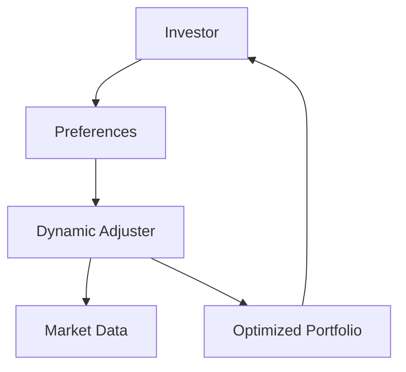
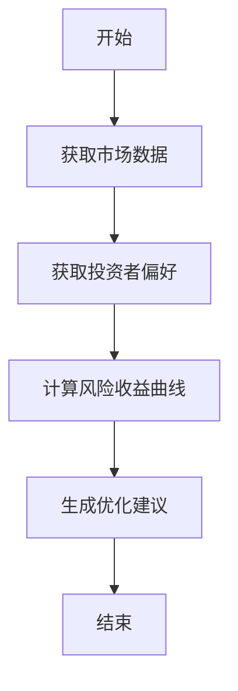

                 


# 构建智能化的个人退休金投资组合动态调整助手

> 关键词：智能化、退休金、投资组合、动态调整、机器学习、风险管理

> 摘要：本文将详细介绍如何构建一个智能化的个人退休金投资组合动态调整助手。通过分析退休金投资的背景、核心概念、算法原理、系统架构，以及项目实战，本文将全面解析如何利用智能化技术实现投资组合的动态优化。我们将从基础概念出发，逐步深入，结合实际案例和代码实现，帮助读者掌握构建此类系统的技能。

---

# 第一部分: 退休金投资组合动态调整的背景与需求

## 第1章: 退休金投资组合的背景与挑战

### 1.1 退休金投资的基本概念

#### 1.1.1 退休金的定义与来源
退休金是指个人在退休后获得的经济支持，主要来源于个人储蓄、企业年金、社会养老金等。退休金的充足性直接关系到个人退休后的生活质量。

#### 1.1.2 退休金投资的目标与意义
退休金投资的目标是在保证资金安全的前提下，实现资产的保值与增值。通过科学的投资组合管理，可以有效应对通货膨胀，提高退休后的生活水平。

#### 1.1.3 退休金投资的主要方式
退休金投资的主要方式包括股票、债券、基金、房地产等多种资产类别。不同资产的风险和收益特征各异，投资者需要根据自身风险承受能力和收益目标进行选择。

---

### 1.2 退休金投资面临的挑战

#### 1.2.1 经济环境的不确定性
经济波动、市场风险、利率变化等因素都会对退休金投资产生重大影响。投资者需要在不确定的环境中做出最优决策。

#### 1.2.2 投资者行为的复杂性
投资者的心理偏差、情绪化决策以及知识不足往往导致非理性的投资行为，影响投资组合的长期收益。

#### 1.2.3 投资组合的动态调整需求
随着时间的推移，市场环境和个人财务状况的变化，投资组合需要不断调整以适应新的情况。如何高效、准确地进行动态调整是退休金投资的核心挑战。

---

### 1.3 智能化投资组合调整的必要性

#### 1.3.1 传统投资组合管理的局限性
传统的投资组合管理依赖于人工分析和经验判断，存在效率低、主观性强、难以应对快速变化市场等问题。

#### 1.3.2 智能化技术在投资中的应用前景
随着人工智能和大数据技术的发展，智能化技术能够快速处理大量数据，提供精准的市场预测和投资建议，为投资组合管理提供强有力的支持。

#### 1.3.3 动态调整助手的核心价值
动态调整助手通过实时监控市场变化和投资者需求，自动优化投资组合配置，帮助投资者在复杂多变的市场中实现稳健收益。

---

## 1.4 本章小结
本章通过分析退休金投资的背景、挑战以及智能化投资组合调整的必要性，为后续章节的深入探讨奠定了基础。

---

# 第二部分: 动态调整助手的核心概念与原理

## 第2章: 动态调整助手的核心概念

### 2.1 动态调整助手的定义与组成

#### 2.1.1 动态调整助手的定义
动态调整助手是一种基于人工智能技术的辅助工具，用于实时监控和优化个人退休金投资组合，确保其在不同市场环境下的风险收益平衡。

#### 2.1.2 动态调整助手的核心组成要素
- 数据采集模块：实时获取市场数据、投资者资产配置信息等。
- 风险评估模块：评估当前投资组合的风险水平。
- 策略优化模块：基于风险评估结果，优化投资组合配置。
- 执行模块：根据优化结果生成投资建议或自动执行调整。

#### 2.1.3 动态调整助手的输入与输出
- 输入：市场数据、投资者风险偏好、当前资产配置。
- 输出：优化后的投资组合配置建议。

---

### 2.2 动态调整助手的核心原理

#### 2.2.1 数据驱动的动态调整机制
动态调整助手通过实时收集和分析市场数据，结合投资者的财务状况和风险偏好，动态调整投资组合配置。

#### 2.2.2 机器学习在动态调整中的应用
利用机器学习算法（如回归分析、支持向量机等）对市场数据进行建模，预测市场趋势，并据此优化投资组合。

#### 2.2.3 风险管理与收益优化的平衡
通过风险调整后的收益模型（如CAPM），在风险可控的前提下，实现投资组合收益的最大化。

---

### 2.3 动态调整助手的实体关系图

#### 2.3.1 实体关系图的构建
- 投资者：主体，拥有资产并提出需求。
- 市场数据：包括股票价格、债券利率等。
- 投资组合：投资者持有的资产集合。
- 动态调整助手：处理数据并优化投资组合的系统。

#### 2.3.2 实体间的关系描述
- 投资者提供资产配置和风险偏好，动态调整助手根据市场数据优化投资组合。

#### 2.3.3 实体关系图的 Mermaid 表示



---

## 第3章: 动态调整助手的算法原理

### 3.1 动态调整算法的概述

#### 3.1.1 基于机器学习的动态调整模型
采用回归分析模型，基于历史市场数据和投资者偏好，预测未来市场趋势。

#### 3.1.2 动态调整算法的分类
- 基于规则的调整算法
- 基于机器学习的调整算法
- 基于遗传算法的优化模型

#### 3.1.3 算法选择的依据
根据市场数据的特征、投资者需求以及系统的可扩展性选择合适的算法。

---

### 3.2 基于机器学习的动态调整模型

#### 3.2.1 模型输入与输出的定义
- 输入：市场数据、投资者风险偏好。
- 输出：优化后的投资组合配置。

#### 3.2.2 模型的训练与优化
利用历史数据训练回归模型，调整模型参数以提高预测精度。

#### 3.2.3 模型的评估与验证
通过回测和实际数据验证模型的有效性。

---

### 3.3 动态调整算法的 Mermaid 流程图



---

### 3.4 算法实现的 Python 代码示例

#### 3.4.1 环境安装与配置
```bash
pip install numpy pandas scikit-learn
```

#### 3.4.2 核心算法
```python
import numpy as np
from sklearn.linear_model import LinearRegression

# 示例数据
market_data = np.array([[1, 2], [3, 4], [5, 6]])
preferences = np.array([0.5, 0.5])

# 训练模型
model = LinearRegression()
model.fit(market_data, preferences)

# 预测结果
predicted = model.predict([[7, 8]])
print(predicted)
```

---

## 1.4 本章小结
本章详细介绍了动态调整助手的核心概念与算法原理，为后续的系统设计与实现奠定了基础。

---

通过以上内容，我们可以看到，构建智能化的个人退休金投资组合动态调整助手需要综合运用数据采集、机器学习、风险管理等技术。接下来，我们将进一步探讨系统的具体实现细节，包括架构设计、接口设计以及实际案例分析。

