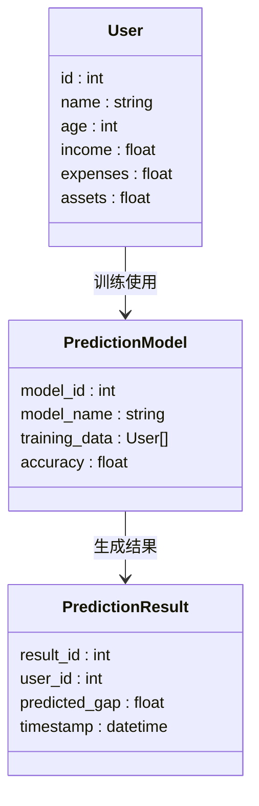
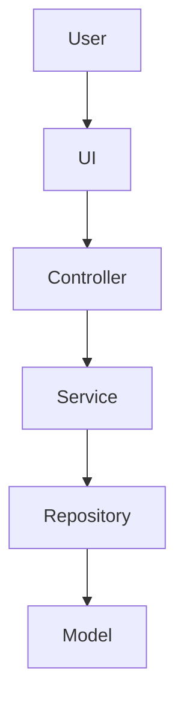
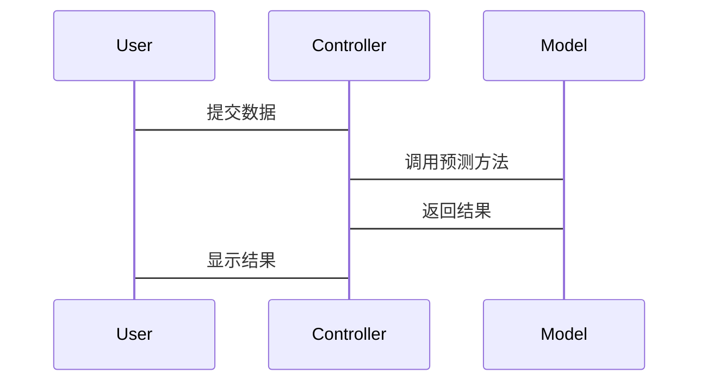

                 


# 构建智能化的个人退休金缺口动态预测助手

> 关键词：退休金缺口预测、人工智能、动态预测模型、系统架构设计、机器学习

> 摘要：本文详细探讨了如何构建一个智能化的个人退休金缺口动态预测助手。通过分析背景、设计算法、优化模型，结合系统架构设计和项目实战，展示了如何利用技术手段解决个人退休金缺口问题。文章从基础概念到实现细节，逐步引导读者构建一个高效的退休金缺口预测系统。

## 第一部分: 背景介绍

### 第1章: 个人退休金缺口动态预测的背景与问题

#### 1.1 退休金缺口问题的背景
##### 1.1.1 人口老龄化与退休金需求的增长
随着全球人口老龄化的加剧，个人退休金的充足性问题日益突出。传统的一次性退休金计算方法难以适应收入和支出变化的动态需求，导致退休后生活质量下降。

##### 1.1.2 现有退休金计算方法的局限性
现有的退休金计算通常基于固定的公式，忽略了通货膨胀、个人消费习惯变化等因素，难以提供个性化的预测结果。

##### 1.1.3 动态预测的必要性与重要性
动态预测能够根据个人的实时数据，如收入、支出、资产变化等，提供及时的退休金缺口评估，帮助个人调整财务规划。

#### 1.2 问题描述与目标设定
##### 1.2.1 退休金缺口的定义与计算
退休金缺口是指在退休期间，个人所需支出与实际可得退休金之间的差额。计算缺口需要考虑通货膨胀、寿命预期等因素。

##### 1.2.2 动态预测的核心目标
动态预测的核心目标是根据个人当前的财务状况，预测未来退休金的充足性，并提供调整建议，确保退休后生活质量。

##### 1.2.3 边界与外延
退休金缺口预测的边界包括个人的财务数据、市场环境等，外延则可能扩展到遗产规划、保险产品选择等。

#### 1.3 问题解决思路与方法
##### 1.3.1 数据驱动的预测方法
通过收集和分析个人的财务数据，利用统计学方法进行预测。

##### 1.3.2 人工智能技术的应用
采用机器学习算法，如时间序列分析和回归模型，提高预测的准确性。

##### 1.3.3 系统化解决方案的设计
设计一个包括数据采集、模型训练、结果展示和用户反馈的系统化解决方案。

### 第2章: 核心概念与联系

#### 2.1 智能化预测助手的核心概念
##### 2.1.1 数据源与特征分析
数据源包括收入、支出、资产等，特征分析帮助筛选影响退休金缺口的关键因素。

##### 2.1.2 预测模型与算法
采用时间序列分析和机器学习模型，如ARIMA和随机森林，进行预测。

##### 2.1.3 用户交互与反馈机制
通过用户友好的界面，提供实时预测结果和调整建议，并根据用户反馈优化模型。

#### 2.2 核心要素与概念结构
##### 2.2.1 数据流与信息处理流程
从数据采集到特征提取，再到模型训练和结果展示的完整流程。

##### 2.2.2 模型训练与优化
通过交叉验证和超参数调整，优化预测模型的性能。

##### 2.2.3 用户需求与系统响应
根据用户输入，系统实时反馈预测结果，并提供个性化建议。

#### 2.3 概念属性特征对比表格
```plaintext
| 概念       | 输入数据 | 输出结果 | 处理方式 | 反馈机制 |
|------------|----------|----------|----------|----------|
| 数据源     | 收入、支出、资产等 | -        | 数据清洗与特征提取 | - |
| 预测模型   | 特征数据 | 缺口预测 | 训练与预测 | 调整模型参数 |
| 用户交互   | 用户输入 | 预测结果 | 界面展示 | 用户反馈 |
```

#### 2.4 ER实体关系图
```mermaid
erDiagram
    user {
        id : int
        name : string
        age : int
        income : float
        expenses : float
        assets : float
    }
    prediction_model {
        model_id : int
        model_name : string
        training_data : reference to user
        accuracy : float
    }
    prediction_result {
        result_id : int
        user_id : int
        predicted_gap : float
        timestamp : datetime
    }
    user --> prediction_model : 训练使用
    prediction_model --> prediction_result : 生成结果
```

## 第三部分: 算法原理

### 第3章: 时间序列分析

#### 3.1 时间序列分析的基本原理
时间序列分析用于预测随时间变化的数据，适用于退休金缺口的动态预测。

#### 3.2 ARIMA模型的原理与实现
ARIMA（自回归积分滑动平均模型）适用于非平稳时间序列数据的预测。

##### 3.2.1 模型参数识别
通过自相关性和偏相关性分析确定AR和MA的阶数。

##### 3.2.2 模型实现
使用Python的statsmodels库进行模型训练和预测。

##### 3.2.3 代码示例
```python
from statsmodels.tsa.arima.model import ARIMA
import pandas as pd

# 数据准备
data = pd.read_csv('retirement_gap.csv')
data = data['gap'].values

# 模型训练
model = ARIMA(data, order=(5, 1, 0))
model_fit = model.fit()

# 预测
forecast = model_fit.forecast(steps=10)
print(forecast)
```

### 第4章: 机器学习模型

#### 4.1 随机森林算法
随机森林通过集成学习提高预测准确性。

##### 4.1.1 数据特征选择
选择影响退休金缺口的关键特征，如年龄、收入、支出等。

##### 4.1.2 模型训练
使用Scikit-learn库训练随机森林模型。

##### 4.1.3 代码示例
```python
from sklearn.ensemble import RandomForestRegressor
from sklearn.model_selection import train_test_split

# 数据准备
X = data[['age', 'income', 'expenses', 'assets']]
y = data['gap']

# 分割数据
X_train, X_test, y_train, y_test = train_test_split(X, y, test_size=0.2)

# 模型训练
model = RandomForestRegressor(n_estimators=100)
model.fit(X_train, y_train)

# 预测
y_pred = model.predict(X_test)
print('预测结果:', y_pred)
```

#### 4.2 数学模型与公式
##### 4.2.1 随机森林的数学模型
随机森林是多个决策树的集成，预测结果是各树的平均值。

##### 4.2.2 ARIMA模型的数学公式
$$ ARIMA(p, d, q) $$
其中，p为自回归阶数，d为差分阶数，q为滑动平均阶数。

## 第四部分: 系统分析与架构设计

### 第5章: 问题场景与系统分析

#### 5.1 问题场景介绍
描述系统在实际应用中的典型场景，如用户输入数据，系统返回预测结果。

#### 5.2 系统功能设计
##### 5.2.1 领域模型类图


### 第6章: 系统架构设计

#### 6.1 系统架构图


#### 6.2 系统接口设计
定义API接口，如RESTful API，用于数据传输和模型调用。

#### 6.3 系统交互序列图


## 第五部分: 项目实战

### 第7章: 环境安装与配置

#### 7.1 环境需求
列出所需Python版本、依赖库等。

#### 7.2 安装依赖
使用pip安装必要的库，如statsmodels、scikit-learn等。

### 第8章: 核心功能实现

#### 8.1 数据采集与预处理
##### 8.1.1 数据清洗
处理缺失值、异常值，标准化数据。

##### 8.1.2 特征工程
提取和选择影响预测的关键特征。

#### 8.2 模型实现
##### 8.2.1 时间序列模型实现
使用ARIMA进行预测。

##### 8.2.2 机器学习模型实现
训练随机森林模型。

### 第9章: 系统测试与优化

#### 9.1 测试用例设计
编写单元测试和集成测试用例。

#### 9.2 模型优化
调整超参数，提高预测准确性。

#### 9.3 性能优化
优化代码，提升运行效率。

### 第10章: 实际案例分析

#### 10.1 案例背景
描述一个典型用户的财务状况。

#### 10.2 数据分析
展示数据清洗和特征提取的过程。

#### 10.3 模型预测与结果解读
展示预测结果，并解释其含义。

### 第11章: 项目总结

#### 11.1 项目小结
总结项目完成情况，成功经验与不足之处。

#### 11.2 最佳实践
提出在实施类似项目时的建议和注意事项。

#### 11.3 拓展阅读
推荐相关书籍和资源，供读者深入学习。

## 第六部分: 总结与展望

### 第12章: 总结

#### 12.1 全文总结
回顾全文内容，强调智能化退休金缺口预测助手的重要性和实现方法。

#### 12.2 技术局限性
讨论当前技术的局限性，如数据隐私问题、模型解释性等。

### 第13章: 未来展望

#### 13.1 智能化预测的发展趋势
预测未来技术的发展方向，如更复杂的模型、多模态数据的应用等。

#### 13.2 可能的研究方向
提出未来可能的研究领域，如实时预测、个性化策略优化等。

## 参考文献

（此处列出相关书籍和论文）

## 致谢

感谢读者的支持和参与，感谢团队成员的贡献。

---

以上是《构建智能化的个人退休金缺口动态预测助手》的详细目录大纲，涵盖了从背景介绍到项目实战的各个方面，确保读者能够系统地理解和实现退休金缺口预测助手。

