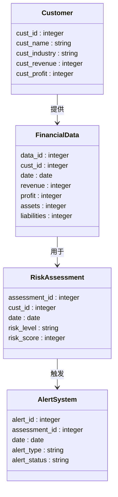
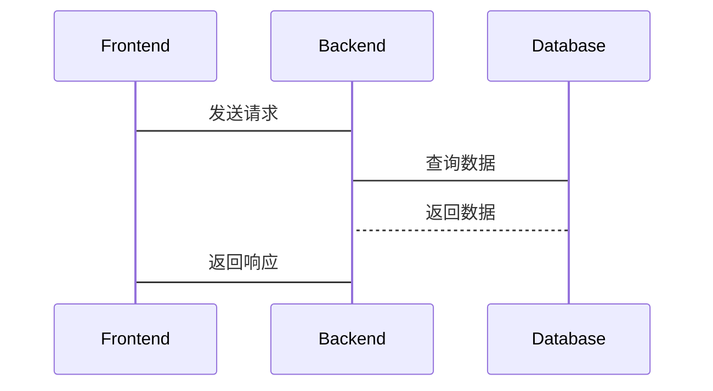

                 


# 构建智能化的企业财务风险预警系统

> 关键词：财务风险预警系统, 人工智能, 大数据, 机器学习, 系统架构

> 摘要：本文详细探讨了构建智能化企业财务风险预警系统的各个方面，包括系统概述、数据处理、模型构建、系统架构设计、项目实战以及高级主题。通过分析财务风险的定义、分类及其对企业的潜在影响，结合智能化技术的应用，本文提出了基于机器学习的预警模型，详细讲解了从数据采集到系统部署的完整流程，并提供了实际案例分析和代码实现，帮助读者全面掌握智能化财务风险预警系统的设计与实现方法。

---

## 第一部分：企业财务风险预警系统概述

### 第1章：财务风险预警系统的基本概念

#### 1.1 财务风险的定义与分类

##### 1.1.1 财务风险的定义
财务风险是指企业在经营过程中，由于内外部因素的变化，可能导致财务状况恶化，进而影响企业偿债能力、运营能力和盈利能力的风险。财务风险通常包括流动性风险、偿债风险、盈利风险和市场风险等。

##### 1.1.2 财务风险的主要分类
财务风险可以分为以下几类：
- **流动性风险**：企业无法及时获得足够的资金来偿还债务或满足日常运营需求。
- **偿债风险**：企业在债务到期时无法偿还债务的风险。
- **盈利风险**：企业盈利能力下降，无法维持正常运营的风险。
- **市场风险**：由于市场环境变化（如经济波动、政策变化）导致的企业财务状况恶化。

##### 1.1.3 财务风险对企业的影响
财务风险可能对企业造成多方面的影响，包括：
- 企业信用评级下降，影响融资能力。
- 影响企业投资者信心，可能导致股价波动。
- 增加企业运营成本，降低盈利能力。
- 在极端情况下，可能导致企业破产。

#### 1.2 财务风险预警系统的重要性

##### 1.2.1 系统在企业风险管理中的作用
财务风险预警系统通过实时监控企业的财务数据，识别潜在风险，并及时发出预警信号，帮助企业采取应对措施，降低风险损失。

##### 1.2.2 系统对企业决策的支持
预警系统能够提供数据支持，帮助企业管理层做出更明智的财务决策，优化资源配置，提高企业抗风险能力。

##### 1.2.3 系统在财务健康评估中的价值
通过定期评估企业的财务健康状况，预警系统能够帮助企业及时发现和纠正财务问题，维护企业的财务稳定。

#### 1.3 智能化财务风险预警系统的概念

##### 1.3.1 智能化系统的定义
智能化财务风险预警系统是一种基于人工智能、大数据分析和机器学习技术的财务风险管理工具，能够实时监控企业财务数据，自动识别潜在风险，并提供智能化的预警和决策支持。

##### 1.3.2 智能化系统的核心特征
智能化财务风险预警系统具有以下核心特征：
- **自动化数据采集与处理**：能够自动获取企业财务数据，并进行清洗和预处理。
- **智能化分析与预测**：利用机器学习算法，对财务数据进行深度分析，预测潜在风险。
- **实时监控与预警**：能够实时监控企业的财务状况，并在风险发生前发出预警信号。
- **自适应优化**：系统能够根据历史数据和新数据，不断优化预警模型，提高预警准确性。

##### 1.3.3 智能化系统与传统系统的区别
与传统财务风险预警系统相比，智能化系统具有以下优势：
- **更高的准确性**：基于机器学习的算法能够更准确地识别潜在风险。
- **更强的实时性**：智能化系统能够实时监控财务数据，提供及时的预警信息。
- **更强的自适应性**：系统能够根据新的数据和环境变化，自动优化预警模型。

#### 1.4 系统的边界与外延

##### 1.4.1 系统的功能边界
智能化财务风险预警系统的主要功能包括：
- 数据采集与处理
- 风险评估与预警
- 预警信息的可视化展示
- 预警结果的分析与解读
- 系统的自适应优化

##### 1.4.2 系统的外延范围
智能化财务风险预警系统的外延范围包括：
- 与企业其他管理系统（如ERP、CRM）的集成
- 与其他数据分析工具（如大数据平台）的集成
- 与外部数据源（如市场数据、行业数据）的集成

##### 1.4.3 系统与其他系统的关联
智能化财务风险预警系统通常需要与其他系统进行集成，以实现数据的共享和业务的协同。例如：
- 与企业ERP系统集成，获取实时的财务数据。
- 与CRM系统集成，获取客户的信用信息。
- 与市场数据分析平台集成，获取宏观经济数据。

#### 1.5 核心要素组成

##### 1.5.1 数据源
数据源是智能化财务风险预警系统的核心要素之一。数据源主要包括：
- **内部数据**：企业内部的财务数据，如资产负债表、利润表、现金流等。
- **外部数据**：外部市场数据，如行业数据、宏观经济数据、市场波动数据等。
- **业务数据**：企业的业务数据，如销售数据、采购数据、库存数据等。

##### 1.5.2 预警模型
预警模型是智能化财务风险预警系统的核心部分，负责对财务数据进行分析和预测，识别潜在风险。常用的预警模型包括：
- **逻辑回归模型**：用于分类问题，预测企业是否存在财务风险。
- **随机森林模型**：用于分类和回归问题，能够处理高维数据。
- **神经网络模型**：用于复杂非线性关系的建模。

##### 1.5.3 预警指标
预警指标是衡量企业财务状况的关键指标，用于评估企业的偿债能力、盈利能力、运营能力和成长能力。常用的预警指标包括：
- **流动性指标**：如流动比率、速动比率。
- **偿债能力指标**：如资产负债率、利息覆盖倍数。
- **盈利能力指标**：如净利润率、ROE（净资产收益率）。
- **运营能力指标**：如应收账款周转率、存货周转率。

##### 1.5.4 预警阈值
预警阈值是系统触发预警信号的标准，通常根据企业的历史数据和行业基准值来设定。例如：
- 当企业的流动比率低于1时，触发流动性风险预警。
- 当企业的净利润率连续三个月下降时，触发盈利能力预警。

---

## 第2章：智能化财务风险预警系统的背景与现状

### 2.1 企业财务风险管理的现状

#### 2.1.1 传统财务风险管理的局限性
传统的财务风险管理主要依赖于人工分析和简单的统计模型，存在以下局限性：
- 数据处理能力有限，难以应对海量数据。
- 预警模型的准确性和及时性不足，容易漏报或误报。
- 需要大量人工干预，效率低下。

#### 2.1.2 数字化转型对财务管理的影响
随着企业数字化转型的推进，财务管理也逐渐从人工化向自动化、智能化方向发展。大数据和人工智能技术的应用，使得企业能够更高效地处理财务数据，提高风险管理的准确性和及时性。

#### 2.1.3 当前企业财务风险管理的主要挑战
当前企业财务风险管理面临的主要挑战包括：
- 数据孤岛问题：企业内部数据分散在不同的系统中，难以整合和分析。
- 数据质量问题：数据的不完整性和不准确性会影响预警模型的效果。
- 模型更新问题：传统的预警模型难以适应快速变化的市场环境。

### 2.2 智能化财务风险预警系统的背景

#### 2.2.1 大数据与人工智能技术的发展
大数据和人工智能技术的发展为企业财务风险管理提供了新的工具和方法。例如：
- 大数据技术能够帮助企业获取更多的数据源，提高数据的全面性。
- 人工智能技术（如机器学习）能够帮助企业建立更复杂的预警模型，提高预警的准确性和及时性。

#### 2.2.2 企业对智能化管理的需求
随着市场竞争的加剧，企业对财务管理的智能化需求日益增加。智能化财务风险预警系统能够帮助企业更高效地识别和应对财务风险，提升企业的竞争力。

#### 2.2.3 智能化系统在财务风险管理中的应用前景
智能化财务风险预警系统在财务风险管理中的应用前景广阔，能够帮助企业实现：
- 实时监控财务状况，提高风险预警的及时性。
- 自动化分析财务数据，提高风险管理的效率。
- 精准识别潜在风险，提高风险管理的准确性。

### 2.3 国内外研究与应用现状

#### 2.3.1 国内智能化财务风险管理的发展
近年来，国内智能化财务风险管理的发展迅速，许多企业已经开始尝试应用智能化技术来提升风险管理能力。例如：
- 部分大型企业已经开始应用基于机器学习的预警系统，实时监控企业的财务状况。
- 一些金融机构也开始尝试应用智能化技术，评估企业的信用风险。

#### 2.3.2 国际智能化财务风险管理的进展
国际上，智能化财务风险管理的研究和应用也取得了显著进展。例如：
- 美国一些企业已经开始应用基于深度学习的预警模型，预测企业的财务风险。
- 欧洲的一些金融机构也开始尝试应用智能化技术，评估企业的财务健康状况。

#### 2.3.3 现有系统的主要优缺点
现有智能化财务风险预警系统的主要优点包括：
- 高准确性：基于机器学习的模型能够更准确地识别潜在风险。
- 高效率：系统能够快速处理海量数据，提高风险管理的效率。
- 实时性：系统能够实时监控企业的财务状况，提供及时的预警信息。

现有系统的缺点包括：
- 数据依赖性：模型的准确性依赖于数据的质量和数量。
- 系统复杂性：智能化系统的建设和维护需要较高的技术和资源投入。

### 2.4 系统构建的必要性与目标

#### 2.4.1 系统构建的必要性
随着市场竞争的加剧和经济环境的复杂化，企业面临的财务风险日益增加。传统的财务风险管理方法已经难以满足企业的需求。因此，构建智能化财务风险预警系统具有重要意义。

#### 2.4.2 系统构建的目标
系统构建的目标是：
- 提高企业财务风险管理的准确性。
- 提高企业财务风险管理的效率。
- 提高企业财务风险管理的实时性。
- 提高企业财务风险管理的智能化水平。

#### 2.4.3 系统构建的预期成果
通过构建智能化财务风险预警系统，预期能够实现以下成果：
- 实现企业财务数据的实时监控和分析。
- 提供准确的财务风险预警信息，帮助企业及时应对潜在风险。
- 提供智能化的决策支持，优化企业的财务管理和运营。

---

## 第3章：智能化财务风险预警系统的核心概念与联系

### 3.1 核心概念原理

#### 3.1.1 数据采集与处理
数据采集与处理是智能化财务风险预警系统的核心过程，包括数据的采集、清洗、转换和集成。通过数据处理，能够将分散在不同系统中的财务数据整合到一个统一的平台中，为后续的分析和建模提供高质量的数据支持。

#### 3.1.2 风险评估模型
风险评估模型是智能化财务风险预警系统的核心部分，负责对企业的财务数据进行分析和预测，识别潜在的财务风险。常用的模型包括逻辑回归模型、随机森林模型和神经网络模型。

#### 3.1.3 预警指标体系
预警指标体系是衡量企业财务状况的关键指标，用于评估企业的偿债能力、盈利能力、运营能力和成长能力。常用的预警指标包括流动性指标、偿债能力指标、盈利能力指标和运营能力指标。

### 3.2 核心概念属性特征对比表格

| 概念          | 属性          | 特征                                      |
|---------------|---------------|------------------------------------------|
| 数据源        | 类型          | 财务数据、业务数据、市场数据              |
| 预警模型      | 方法          | 逻辑回归、随机森林、神经网络            |
| 预警指标      | 类别          | 流动性指标、偿债能力指标、盈利能力指标    |
| 预警阈值      | 标准          | 根据历史数据和行业基准值设定              |

### 3.3 ER实体关系图架构

以下是智能化财务风险预警系统的ER实体关系图：

```mermaid
erDiagram
    customer[CUSTOMER] {
        cust_id : integer
        cust_name : string
        cust_industry : string
        cust_revenue : integer
        cust_profit : integer
    }
    financial_data[FINANCIAL_DATA] {
        data_id : integer
        cust_id : integer
        date : date
        revenue : integer
        profit : integer
        assets : integer
        liabilities : integer
    }
    risk_assessment[RISK_ASSESSMENT] {
        assessment_id : integer
        cust_id : integer
        date : date
        risk_level : string
        risk_score : integer
    }
   预警系统[ALERT_SYSTEM] {
        alert_id : integer
        assessment_id : integer
        date : date
        alert_type : string
        alert_status : string
    }
    customer --> financial_data : 提供
    financial_data --> risk_assessment : 用于
    risk_assessment -->预警系统 : 触发
```

---

## 第4章：智能化财务风险预警系统的算法原理讲解

### 4.1 逻辑回归模型

#### 4.1.1 模型原理
逻辑回归是一种常用的分类算法，适用于二分类问题。其基本思想是通过构建一个线性回归模型，将输入特征映射到一个概率空间，然后通过阈值判断分类结果。

#### 4.1.2 模型公式
逻辑回归的数学公式为：

$$ P(y=1|x) = \frac{e^{\beta_0 + \beta_1 x_1 + \beta_2 x_2 + \dots + \beta_n x_n}}{1 + e^{\beta_0 + \beta_1 x_1 + \beta_2 x_2 + \dots + \beta_n x_n}} $$

其中：
- $P(y=1|x)$ 是在给定特征 $x$ 的情况下，$y=1$ 的概率。
- $\beta_0, \beta_1, \dots, \beta_n$ 是模型的系数。
- $x_1, x_2, \dots, x_n$ 是输入特征。

#### 4.1.3 算法步骤
1. 数据预处理：包括数据清洗、特征选择和数据标准化。
2. 模型训练：使用训练数据训练逻辑回归模型，优化模型系数。
3. 模型预测：使用训练好的模型对测试数据进行预测。
4. 模型评估：通过准确率、召回率、F1分数等指标评估模型的性能。

#### 4.1.4 示例代码
以下是逻辑回归模型的Python代码示例：

```python
from sklearn.linear_model import LogisticRegression
from sklearn.model_selection import train_test_split
from sklearn.metrics import accuracy_score

# 数据准备
X = df[['revenue', 'profit', 'assets', 'liabilities']]
y = df['risk_flag']

# 数据分割
X_train, X_test, y_train, y_test = train_test_split(X, y, test_size=0.2, random_state=42)

# 模型训练
model = LogisticRegression()
model.fit(X_train, y_train)

# 模型预测
y_pred = model.predict(X_test)

# 模型评估
print("准确率:", accuracy_score(y_test, y_pred))
```

---

### 4.2 随机森林模型

#### 4.2.1 模型原理
随机森林是一种基于决策树的集成学习算法，通过构建多个决策树并集成它们的结果，能够提高模型的准确性和稳定性。

#### 4.2.2 模型公式
随机森林模型没有单一的数学公式，其核心思想是通过投票或加权的方式，将多个决策树的预测结果进行集成。

#### 4.2.3 算法步骤
1. 数据预处理：包括数据清洗、特征选择和数据标准化。
2. 模型训练：使用训练数据训练随机森林模型，优化模型参数。
3. 模型预测：使用训练好的模型对测试数据进行预测。
4. 模型评估：通过准确率、召回率、F1分数等指标评估模型的性能。

#### 4.2.4 示例代码
以下是随机森林模型的Python代码示例：

```python
from sklearn.ensemble import RandomForestClassifier
from sklearn.model_selection import train_test_split
from sklearn.metrics import accuracy_score

# 数据准备
X = df[['revenue', 'profit', 'assets', 'liabilities']]
y = df['risk_flag']

# 数据分割
X_train, X_test, y_train, y_test = train_test_split(X, y, test_size=0.2, random_state=42)

# 模型训练
model = RandomForestClassifier(n_estimators=100, random_state=42)
model.fit(X_train, y_train)

# 模型预测
y_pred = model.predict(X_test)

# 模型评估
print("准确率:", accuracy_score(y_test, y_pred))
```

---

## 第5章：智能化财务风险预警系统的系统架构设计

### 5.1 问题场景介绍

智能化财务风险预警系统需要解决的主要问题是：如何通过智能化技术，帮助企业实时监控财务数据，识别潜在风险，并提供及时的预警信息。系统需要具备高可用性、高扩展性和高安全性，能够处理海量数据，并支持多用户同时访问。

### 5.2 系统功能设计

#### 5.2.1 领域模型（Mermaid 类图）
以下是系统的核心领域模型：



#### 5.2.2 系统架构设计（Mermaid 架构图）
以下是系统架构设计图：


#### 5.2.3 系统接口设计
系统主要接口包括：
- 数据接口：用于获取企业财务数据。
- 预警接口：用于触发和管理预警信息。
- 报告接口：用于生成和查看财务风险报告。

#### 5.2.4 系统交互（Mermaid 序列图）
以下是系统交互序列图：



---

## 第6章：智能化财务风险预警系统的项目实战

### 6.1 环境配置

#### 6.1.1 安装Python和必要的库
以下是安装Python和必要库的命令：

```bash
python --version
pip install scikit-learn pandas numpy matplotlib
```

#### 6.1.2 安装Jupyter Notebook
安装Jupyter Notebook：

```bash
pip install jupyter
```

### 6.2 系统核心实现

#### 6.2.1 数据预处理

##### 6.2.1.1 数据清洗
```python
import pandas as pd

df = pd.read_csv('financial_data.csv')
df.dropna(inplace=True)
df.drop_duplicates(inplace=True)
```

##### 6.2.1.2 特征工程
```python
from sklearn.preprocessing import StandardScaler

scaler = StandardScaler()
X_scaled = scaler.fit_transform(df[['revenue', 'profit', 'assets', 'liabilities']])
```

#### 6.2.2 模型训练与优化

##### 6.2.2.1 逻辑回归模型
```python
from sklearn.linear_model import LogisticRegression
from sklearn.model_selection import GridSearchCV

param_grid = {
    'C': [0.1, 1, 10],
    'penalty': ['l2']
}

grid_search = GridSearchCV(LogisticRegression(), param_grid, cv=5)
grid_search.fit(X_scaled, y)
best_model = grid_search.best_estimator_
```

##### 6.2.2.2 随机森林模型
```python
from sklearn.ensemble import RandomForestClassifier

param_grid = {
    'n_estimators': [100, 200],
    'max_depth': [None, 10, 20]
}

grid_search = GridSearchCV(RandomForestClassifier(), param_grid, cv=5)
grid_search.fit(X_scaled, y)
best_model = grid_search.best_estimator_
```

#### 6.2.3 系统部署与测试

##### 6.2.3.1 部署环境
推荐使用Docker进行系统部署，以下是Dockerfile示例：

```dockerfile
FROM python:3.8
WORKDIR /app
COPY requirements.txt .
RUN pip install --no-cache-dir -r requirements.txt
COPY . .
CMD ["python", "server.py"]
```

##### 6.2.3.2 测试用例
以下是测试用例示例：

```python
from sklearn.metrics import accuracy_score

y_pred = best_model.predict(X_test_scaled)
print("准确率:", accuracy_score(y_test, y_pred))
```

### 6.3 实际案例分析

#### 6.3.1 案例背景
某制造企业最近几个月的财务状况出现波动，企业希望利用智能化财务风险预警系统，识别潜在的财务风险，制定应对策略。

#### 6.3.2 数据分析
通过分析企业的财务数据，发现企业的流动比率和速动比率均低于行业平均水平，可能存在流动性风险。

#### 6.3.3 预警结果
系统预测企业的财务风险等级为“高风险”，并建议企业采取以下措施：
- 优化库存管理，加快资金周转。
- 增加短期融资，改善流动性。
- 降低运营成本，提高盈利能力。

#### 6.3.4 结果解读
通过系统的预警和建议，企业能够及时采取措施，降低财务风险，保障企业的财务稳定。

### 6.4 项目小结

- **项目目标**：构建智能化财务风险预警系统，帮助企业实时监控财务数据，识别潜在风险。
- **项目成果**：开发了一个基于机器学习的预警系统，能够准确识别企业的财务风险，并提供及时的预警信息。
- **项目意义**：通过智能化技术的应用，提高了企业财务风险管理的效率和准确性，为企业决策提供了有力支持。

---

## 第七章：智能化财务风险预警系统的高级主题

### 7.1 实时财务风险预警

#### 7.1.1 实时数据采集与处理
通过流数据处理技术（如Apache Kafka、Apache Flink），实现企业财务数据的实时采集和处理。

#### 7.1.2 实时预警模型
基于实时数据流，构建实时预警模型，能够动态调整预警阈值，提高预警的实时性和准确性。

### 7.2 模型优化与调优

#### 7.2.1 模型调优策略
通过网格搜索、随机搜索等方法，优化模型的超参数，提高模型的准确性和稳定性。

#### 7.2.2 模型评估与验证
通过交叉验证、ROC曲线等方法，评估模型的性能，并进行模型的验证和优化。

### 7.3 预警系统的可解释性

#### 7.3.1 可解释性的重要性
可解释性是智能化财务风险预警系统的重要特征，能够帮助用户理解预警结果的原因和依据。

#### 7.3.2 提高可解释性的方法
通过特征重要性分析、模型可视化等方法，提高预警系统的可解释性。

### 7.4 系统安全性与风险管理

#### 7.4.1 系统安全性设计
通过数据加密、访问控制等技术，确保系统数据的安全性和系统的稳定性。

#### 7.4.2 风险管理策略
制定完善的风险管理策略，确保系统在面对各种风险时能够稳定运行，减少损失。

---

## 第八章：总结与展望

### 8.1 总结

通过本文的详细讲解，我们了解了智能化企业财务风险预警系统的构建过程，包括系统概述、数据处理、模型构建、系统架构设计、项目实战以及高级主题。我们还详细探讨了系统的核心概念、算法原理、系统设计和实际案例分析，为读者提供了全面的知识体系和实践指导。

### 8.2 展望

随着人工智能和大数据技术的不断发展，智能化财务风险预警系统将变得更加智能化和精准化。未来，我们可以期待以下发展：
- 更加高效的算法：如深度学习、强化学习等，将被应用于财务风险管理领域。
- 更加智能化的系统：系统将更加智能化，能够自动适应环境变化，提供更加个性化的预警服务。
- 更加广泛的应用：智能化财务风险预警系统将在更多行业和领域得到广泛应用，帮助企业更好地应对财务风险，提升企业的竞争力。

---

## 参考文献

1. 书籍：《机器学习实战》
2. 网站：Kaggle 数据科学社区
3. 文章：《基于机器学习的财务风险预警系统研究》
4. 技术文档：《Python 机器学习实战》

---

**全文完**

