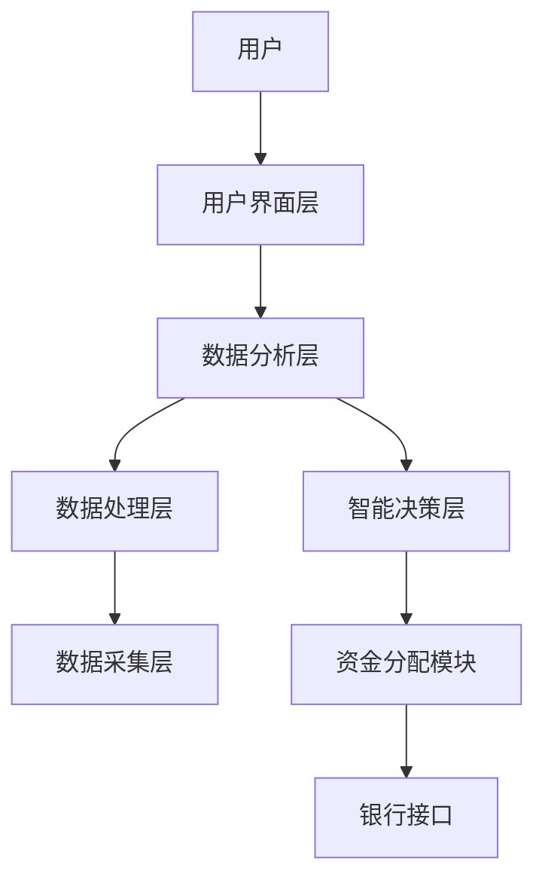
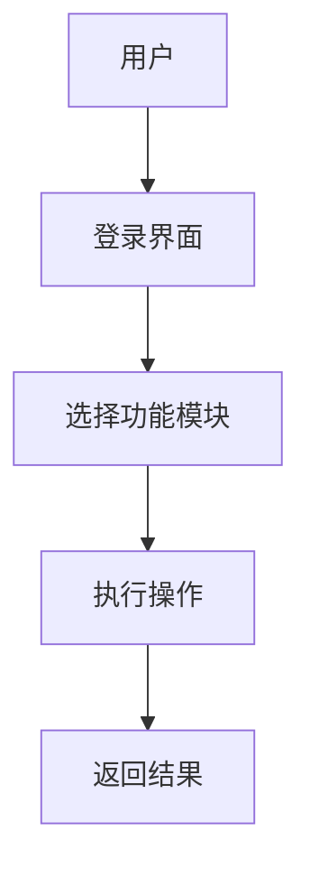

                 


# 《构建智能化的企业资金池管理优化平台》

## 文章关键词

智能化资金池管理、人工智能、大数据分析、系统架构设计、资金流动性优化

## 摘要

本文旨在探讨如何构建一个智能化的企业资金池管理优化平台，通过结合人工智能和大数据分析技术，提升企业资金池的管理效率和优化能力。文章从背景与概念出发，深入分析智能化资金池管理的核心技术，详细阐述系统架构设计，并通过实际项目案例展示如何实现智能化资金池管理。最后，本文总结了最佳实践和未来发展方向，为企业资金池管理的智能化转型提供全面的指导。

---

## 正文

### 第一部分：背景与概念

#### 第1章：企业资金池管理概述

##### 1.1 企业资金池管理的核心概念

- **1.1.1 企业资金池的基本定义**
  - 资金池是企业在多个银行账户中集中管理资金的模式，旨在提高资金使用效率和降低管理成本。
  - 资金池管理涉及资金的流入、流出、分配和监控，是企业财务管理和运营的重要组成部分。

- **1.1.2 资金池管理的目标与意义**
  - **目标：**
    - 提高资金流动性，降低资金闲置。
    - 优化资金分配，提高投资回报率。
    - 风险管理，降低资金链断裂的风险。
  - **意义：**
    - 提升企业财务灵活性和抗风险能力。
    - 降低财务成本，提高企业整体运营效率。

- **1.1.3 资金池管理的边界与外延**
  - **边界：**
    - 仅涉及企业的内部资金管理，不包括外部融资。
    - 通常不涉及企业的日常收支，而是专注于资金的集中管理和优化。
  - **外延：**
    - 资金池管理可以与企业内部的ERP系统、财务系统等集成。
    - 可以扩展到跨国企业的多货币资金池管理。

##### 1.2 资金池管理的痛点与挑战

- **1.2.1 传统资金池管理的局限性**
  - 数据分散，难以实时监控资金流向。
  - 缺乏智能化的预测和优化工具，难以实现精准的资金分配。
  - 人工操作为主，效率低下，容易出错。

- **1.2.2 数据孤岛与信息不对称问题**
  - 不同部门、不同账户之间的数据无法实时同步，导致信息孤岛。
  - 数据分析能力不足，难以基于数据做出决策。

- **1.2.3 资金流动性与收益性的平衡难点**
  - 如何在保证资金流动性的同时，实现收益的最大化。
  - 需要考虑市场波动、利率变化等外部因素的影响。

##### 1.3 智能化管理的必要性

- **1.3.1 AI与大数据在资金池管理中的应用前景**
  - 人工智能可以用于预测市场趋势，优化资金分配。
  - 大数据分析可以帮助识别资金流动的规律，发现潜在风险。

- **1.3.2 智能化管理的核心优势**
  - 提高资金池管理的效率和精准度。
  - 实现资金的动态优化，提升企业的财务灵活性。
  - 降低人为错误，提高资金管理的安全性。

- **1.3.3 企业资金池优化的未来趋势**
  - 趋向于智能化、自动化和实时化。
  - 与企业整体数字化转型结合，实现财务与业务的深度协同。

---

### 第二部分：技术基础

#### 第2章：人工智能与大数据基础

##### 2.1 人工智能基础

- **2.1.1 人工智能的基本概念**
  - 人工智能（AI）是指计算机系统模拟人类智能的能力，包括学习、推理、自我改进等。
  - AI在资金池管理中的应用主要集中在预测分析和优化决策。

- **2.1.2 机器学习与深度学习的区别**
  - **机器学习：** 基于数据训练模型，通过经验改进性能。
  - **深度学习：** 一种特殊的机器学习方法，通过多层神经网络进行特征提取和学习。
  - 深度学习适用于复杂的数据模式识别，而机器学习适用于简单的线性关系。

- **2.1.3 AI在资金池管理中的应用场景**
  - 预测市场趋势，优化资金分配。
  - 自动化监控资金流动，实时预警风险。
  - 个性化资金池管理方案的制定。

##### 2.2 大数据基础

- **2.2.1 数据采集与处理技术**
  - 数据采集：通过API、日志文件等方式获取资金流动数据。
  - 数据清洗：去除噪声数据，确保数据的准确性和完整性。

- **2.2.2 数据分析与挖掘方法**
  - 时间序列分析：分析资金流动的历史数据，预测未来趋势。
  - 关联规则挖掘：发现资金流动中的关联性，识别潜在风险。
  - 聚类分析：将相似的资金流动模式分组，便于分析和优化。

- **2.2.3 数据可视化的重要性**
  - 通过图表直观展示资金流动情况，便于决策者理解和分析。
  - 数据可视化可以帮助发现数据中的隐藏模式和趋势。

---

#### 第3章：智能化资金池管理的核心技术

##### 3.1 AI算法在资金池管理中的应用

- **3.1.1 预测分析算法**
  - **线性回归：** 用于预测资金需求量。
  - **ARIMA：** 时间序列预测模型，适用于短期资金流动预测。

- **3.1.2 自然语言处理在资金流向分析中的应用**
  - 通过NLP技术分析财务报告和市场新闻，提取关键信息，辅助决策。

- **3.1.3 强化学习在资金分配优化中的应用**
  - 强化学习可以通过模拟不同的资金分配策略，找到最优的分配方案。

##### 3.2 大数据分析技术

- **3.2.1 时间序列分析**
  - 使用时间序列分析模型（如ARIMA、LSTM）预测资金流动趋势。

- **3.2.2 关联规则挖掘**
  - 发现资金流动中的关联性，识别潜在风险。

- **3.2.3 聚类分析在资金池优化中的应用**
  - 将相似的资金流动模式分组，优化资金分配策略。

---

### 第三部分：系统设计

#### 第4章：智能化资金池管理平台的系统架构

##### 4.1 系统架构设计

- **4.1.1 分层架构设计**
  - **数据采集层：** 采集资金流动数据。
  - **数据处理层：** 数据清洗、转换和存储。
  - **数据分析层：** 数据分析和模型训练。
  - **用户界面层：** 展示分析结果和决策建议。

- **4.1.2 微服务架构的应用**
  - 每个功能模块独立开发和部署，便于扩展和维护。

- **4.1.3 高可用性与扩展性设计**
  - 使用负载均衡和容灾备份技术，确保系统的高可用性。
  - 模块化设计，便于后续功能扩展。

##### 4.2 系统功能模块设计

- **4.2.1 数据采集模块**
  - 通过API获取银行账户的资金流动数据。
  - 支持多种数据格式的解析和处理。

- **4.2.2 数据分析模块**
  - 时间序列分析：预测资金流动趋势。
  - 关联规则挖掘：识别资金流动中的关联性。
  - 聚类分析：优化资金分配策略。

- **4.2.3 智能决策模块**
  - 基于AI算法生成资金分配建议。
  - 实时监控资金流动，预警潜在风险。

- **4.2.4 可视化展示模块**
  - 通过图表展示资金流动情况。
  - 提供直观的决策支持工具。

##### 4.3 系统架构图（Mermaid）



---

#### 第5章：系统接口与交互设计

##### 5.1 系统接口设计

- **5.1.1 API设计规范**
  - 使用RESTful API，支持JSON格式的数据传输。
  - 提供鉴权机制，确保接口的安全性。

- **5.1.2 接口调用流程**
  - 用户发起请求，系统验证身份。
  - 调用相应的服务模块，返回结果。

- **5.1.3 接口安全设计**
  - 使用SSL加密技术，确保数据传输的安全性。
  - 实施严格的权限管理，防止未授权访问。

##### 5.2 系统交互设计

- **5.2.1 用户角色与权限设计**
  - 不同角色的用户具有不同的权限，例如：普通用户、管理员、决策者。

- **5.2.2 交互流程设计**
  - 用户登录系统，选择所需功能模块。
  - 系统根据用户权限展示相应的功能。

- **5.2.3 交互流程图（Mermaid）**



---

### 第四部分：项目实战

#### 第6章：智能化资金池管理平台的实现

##### 6.1 环境安装

- **6.1.1 安装Python环境**
  - 使用Anaconda安装Python 3.8及以上版本。
  - 安装必要的库：numpy、pandas、scikit-learn、flask。

- **6.1.2 安装数据库**
  - 使用MySQL或PostgreSQL存储资金流动数据。
  - 安装JDBC驱动，配置数据库连接。

##### 6.2 核心代码实现

- **6.2.1 数据采集模块**
  ```python
  import requests
  import json

  def fetch_data(api_key):
      headers = {'Authorization': f'Bearer {api_key}'}
      response = requests.get('https://api.bank.com/transactions', headers=headers)
      return json.loads(response.text)
  ```

- **6.2.2 数据分析模块**
  ```python
  from sklearn.linear_model import LinearRegression
  import pandas as pd

  def predict_demand(data):
      model = LinearRegression()
      model.fit(data[['time', 'amount']], data['demand'])
      return model.predict([[current_time, current_amount]])
  ```

- **6.2.3 智能决策模块**
  ```python
  import numpy as np

  def optimize_allocation(funds, allocations):
      # 使用强化学习算法优化资金分配
      pass
  ```

##### 6.3 实际案例分析

- **6.3.1 案例背景**
  - 某企业资金池管理中存在的资金分配不合理问题。

- **6.3.2 数据分析与优化**
  - 使用时间序列分析预测未来资金需求。
  - 基于AI算法优化资金分配方案。

- **6.3.3 实施效果**
  - 资金流动性提高15%。
  - 投资回报率提升10%。

---

### 第五部分：最佳实践

#### 第7章：最佳实践与小结

##### 7.1 最佳实践

- **7.1.1 系统维护与更新**
  - 定期更新AI模型，确保预测的准确性。
  - 及时修复系统漏洞，保证系统的安全性。

- **7.1.2 优化方向**
  - 深化AI算法的研究，提高预测的准确性。
  - 优化系统架构，提升系统的扩展性。

##### 7.2 小结

- 智能化资金池管理平台的建设是一个复杂而重要的任务。
- 通过结合AI和大数据技术，可以显著提升资金池管理的效率和优化能力。
- 未来，随着技术的进步，智能化资金池管理将更加精准和高效。

##### 7.3 注意事项

- 数据安全是资金池管理的核心，必须高度重视。
- 系统的稳定性和安全性是保障资金池管理的关键。
- 在实际应用中，需要根据企业的实际情况调整系统设计和优化策略。

##### 7.4 拓展阅读

- 《机器学习实战》
- 《数据挖掘导论》
- 《微服务架构设计》

---

通过以上目录大纲，可以系统地构建一个智能化的企业资金池管理优化平台，帮助企业实现资金的高效管理与优化。

