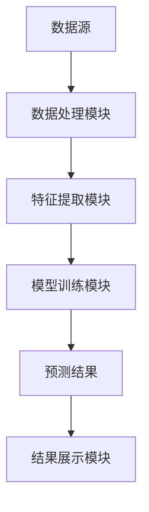
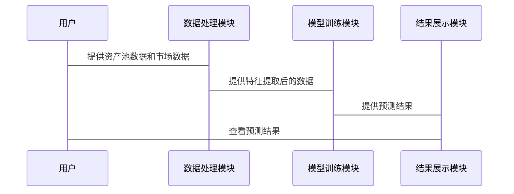

                 


# 构建智能化的资产证券化现金流预测模型

## 关键词：资产证券化，现金流预测，人工智能，机器学习，深度学习

## 摘要：本文详细探讨了如何利用人工智能和机器学习技术构建智能化的资产证券化现金流预测模型。文章从背景介绍、核心概念、算法原理、系统架构设计到项目实战，全面解析了模型构建的全过程，并提供了丰富的代码示例和实际案例分析，帮助读者掌握从理论到实践的核心方法。

---

# 第一部分: 资产证券化现金流预测模型背景与核心概念

---

# 第1章: 资产证券化现金流预测模型概述

## 1.1 资产证券化与现金流预测的背景

### 1.1.1 资产证券化的定义与特点

资产证券化是一种将流动性较低的资产转化为可流通证券的过程，其核心在于通过资产池的构建、信用增级、证券化和结构化技术，将资产的未来现金流转化为可交易的金融产品。资产证券化的主要特点包括：

- **资产池构建**：将一组同质资产（如应收账款、贷款、房地产等）组合成资产池。
- **信用增级**：通过结构化设计提高资产池的信用评级。
- **证券化**：将资产池的价值转化为可流通的证券（如债券、ABS等）。
- **结构化分层**：通过优先级划分优化风险和收益分配。

### 1.1.2 现金流预测在资产证券化中的重要性

现金流预测是资产证券化的核心环节，其准确性直接影响证券的定价、投资者的决策和项目的成功与否。传统的现金流预测方法依赖于人工经验，存在以下问题：

- 数据量大且复杂：资产池涉及的现金流数据往往具有高度的不确定性和波动性。
- 预测精度低：传统方法难以捕捉数据中的非线性关系和复杂模式。
- 计算效率低：手动计算和分析耗时且易出错。

### 1.1.3 智能化预测的必要性与优势

随着人工智能和机器学习技术的发展，智能化预测逐渐成为资产证券化领域的主流趋势。智能化预测的优势在于：

- **高精度**：能够捕捉数据中的非线性关系和复杂模式，提高预测的准确性。
- **高效性**：通过自动化处理和并行计算显著提高计算效率。
- **可扩展性**：能够处理大规模数据，适用于复杂的资产池分析。

---

## 1.2 资产证券化现金流预测的核心问题

### 1.2.1 现金流预测的基本概念

现金流预测是指根据历史数据和当前市场环境，预测未来一定时间内资产池的现金流分布情况。其核心问题包括：

- **数据预处理**：如何清洗、归一化和特征提取。
- **模型选择**：选择适合的算法（如线性回归、支持向量机、随机森林、LSTM等）。
- **模型评估**：如何验证模型的准确性和稳定性。

### 1.2.2 资产证券化中的现金流预测需求

资产证券化中的现金流预测需要满足以下需求：

- **精准性**：预测结果必须准确反映未来现金流的波动。
- **实时性**：能够快速响应市场变化和资产池的动态调整。
- **可解释性**：模型结果需要具备一定的可解释性，便于投资者理解和决策。

### 1.2.3 智能化预测的目标与边界

智能化预测的目标是通过机器学习算法构建高精度、高效率的现金流预测模型。其边界包括：

- **数据范围**：仅限于资产池相关的财务数据和市场数据。
- **预测范围**：仅限于未来一定时间内的现金流预测。
- **模型限制**：不考虑宏观经济政策和突发事件等不可预测因素。

---

## 1.3 模型构建的基本思路

### 1.3.1 数据驱动与模型构建的关系

数据是模型构建的基础，模型的性能高度依赖于数据的质量和特征。智能化预测强调数据驱动，通过提取数据中的特征和模式构建预测模型。

### 1.3.2 智能化预测的核心要素

智能化预测的核心要素包括：

- **数据预处理**：清洗、归一化和特征提取。
- **算法选择**：选择适合的机器学习或深度学习算法。
- **模型优化**：通过参数调整和超参数优化提高模型性能。
- **结果验证**：通过交叉验证和回测验证模型的稳定性和准确性。

### 1.3.3 模型的适用场景与限制

模型适用于以下场景：

- **大规模数据处理**：适合处理海量金融数据。
- **非线性关系分析**：适合分析现金流中的非线性波动。
- **实时预测**：适合需要快速响应的金融场景。

模型的限制包括：

- 对于小规模数据或低质量数据，模型性能可能受限。
- 无法预测突发事件或不可预测的宏观经济变化。

---

## 1.4 本章小结

本章从资产证券化的背景出发，详细介绍了现金流预测的重要性和智能化预测的必要性。通过分析现金流预测的核心问题，提出了智能化预测的基本思路和方法。为后续章节的模型构建奠定了理论基础。

---

# 第2章: 资产证券化现金流预测的核心概念

## 2.1 现金流预测的基本原理

### 2.1.1 现金流预测的数学模型

现金流预测的数学模型通常包括时间序列模型和机器学习模型。时间序列模型通过历史数据预测未来值，而机器学习模型则通过特征学习捕捉数据中的复杂模式。

### 2.1.2 传统现金流预测方法与智能化预测方法的对比

| 对比维度           | 传统方法                          | 智能化方法                          |
|--------------------|-----------------------------------|-------------------------------------|
| 数据依赖性         | 依赖历史数据                      | 依赖历史数据和特征                   |
| 模型复杂性         | 线性模型为主                      | 非线性模型为主                      |
| 预测精度           | 较低                             | 较高                               |
| 计算效率           | 低                              | 高                                 |

### 2.1.3 智能化预测的核心要素

智能化预测的核心要素包括：

- **数据预处理**：清洗、归一化和特征提取。
- **算法选择**：选择适合的机器学习或深度学习算法。
- **模型优化**：通过参数调整和超参数优化提高模型性能。

---

## 2.2 资产证券化中的现金流预测模型

### 2.2.1 资产证券化的基本流程

资产证券化的基本流程包括：

1. **资产池构建**：选择一组同质资产，形成资产池。
2. **信用增级**：通过结构化设计提高资产池的信用评级。
3. **证券化**：将资产池的价值转化为可流通的证券。
4. **结构化分层**：通过优先级划分优化风险和收益分配。

### 2.2.2 现金流预测在资产证券化中的作用

现金流预测在资产证券化中的作用包括：

- **定价依据**：预测现金流是证券定价的核心依据。
- **风险评估**：预测现金流波动有助于评估资产池的风险。
- **投资决策**：预测现金流为投资者提供决策支持。

---

## 2.3 核心概念的对比与联系

### 2.3.1 传统现金流预测方法与智能化预测方法的对比

| 对比维度           | 传统方法                          | 智能化方法                          |
|--------------------|-----------------------------------|-------------------------------------|
| 数据依赖性         | 依赖历史数据                      | 依赖历史数据和特征                   |
| 模型复杂性         | 线性模型为主                      | 非线性模型为主                      |
| 预测精度           | 较低                             | 较高                               |
| 计算效率           | 低                              | 高                                 |

### 2.3.2 机器学习算法在现金流预测中的应用

机器学习算法在现金流预测中的应用包括：

- **线性回归**：用于简单线性关系的预测。
- **支持向量机（SVM）**：用于复杂模式的分类和回归。
- **随机森林**：用于特征重要性分析和非线性关系预测。
- **LSTM**：用于时间序列数据的预测。

### 2.3.3 模型的输入与输出关系

模型的输入包括：

- 历史现金流数据。
- 市场数据（如利率、汇率等）。
- 资产池特征（如资产规模、行业风险等）。

模型的输出包括：

- 预测的未来现金流。
- 现金流预测的置信区间。
- 风险评估指标（如VaR、信用评级等）。

---

## 2.4 本章小结

本章从现金流预测的基本原理出发，详细介绍了智能化预测的核心概念和机器学习算法的应用。通过对比传统方法和智能化方法的优缺点，明确了智能化预测的优势和适用场景。

---

# 第3章: 资产证券化现金流预测模型的算法原理

## 3.1 时间序列分析的基本原理

### 3.1.1 时间序列分析的定义与特点

时间序列分析是一种通过分析历史数据，预测未来趋势的方法。其特点包括：

- 数据按时间顺序排列。
- 数据具有趋势性和周期性。

### 3.1.2 常见的时间序列模型

- **ARIMA模型**：自回归积分滑动平均模型，适用于线性时间序列数据。
- **LSTM模型**：长短期记忆网络，适用于非线性时间序列数据。
- **Transformer模型**：基于注意力机制，适用于长序列数据。

### 3.1.3 时间序列分析的步骤

1. **数据预处理**：清洗、归一化和特征提取。
2. **模型选择**：根据数据特征选择适合的模型。
3. **模型训练**：通过历史数据训练模型。
4. **模型验证**：通过回测验证模型的准确性。

---

## 3.2 机器学习在现金流预测中的应用

### 3.2.1 线性回归模型

线性回归模型是一种简单的时间序列预测方法，其数学公式为：

$$ y = \beta_0 + \beta_1x + \epsilon $$

其中，$y$ 是预测值，$x$ 是自变量，$\beta_0$ 和 $\beta_1$ 是回归系数，$\epsilon$ 是误差项。

### 3.2.2 支持向量机（SVM）

支持向量机是一种监督学习算法，适用于分类和回归问题。其核心思想是通过构建超平面将数据点分到不同的类别中。

### 3.2.3 随机森林与梯度提升树

随机森林是一种基于决策树的集成学习算法，适用于分类和回归问题。梯度提升树是一种通过不断优化损失函数构建决策树的方法。

---

## 3.3 深度学习模型在现金流预测中的应用

### 3.3.1 LSTM神经网络

LSTM（长短期记忆网络）是一种特殊的RNN（循环神经网络），能够有效捕捉时间序列中的长程依赖关系。其数学公式如下：

$$ \text{LSTM}(x_t, h_{t-1}, c_{t-1}) = (f_t, i_t, o_t) \cdot (\text{输入}) $$

其中，$f_t$ 是遗忘门，$i_t$ 是输入门，$o_t$ 是输出门。

### 3.3.2 Transformer模型

Transformer模型基于注意力机制，适用于长序列数据的预测。其数学公式如下：

$$ \text{Attention}(Q, K, V) = \text{softmax}\left(\frac{QK^T}{\sqrt{d_k}}\right)V $$

其中，$Q$ 是查询向量，$K$ 是键向量，$V$ 是值向量，$d_k$ 是向量的维度。

### 3.3.3 深度学习模型的优势与挑战

优势：

- 能够捕捉数据中的复杂模式。
- 适用于非线性关系的预测。

挑战：

- 对计算资源要求较高。
- 模型的可解释性较差。

---

## 3.4 算法原理的数学模型与公式

### 3.4.1 线性回归模型的公式推导

线性回归模型的最小二乘法推导：

$$ \text{最小化} \sum_{i=1}^n (y_i - \beta_0 - \beta_1x_i)^2 $$

解得：

$$ \beta_1 = \frac{\sum_{i=1}^n (x_i - \bar{x})(y_i - \bar{y})}{\sum_{i=1}^n (x_i - \bar{x})^2} $$

$$ \beta_0 = \bar{y} - \beta_1\bar{x} $$

### 3.4.2 LSTM模型的结构与公式

LSTM模型的结构包括输入门、遗忘门和输出门。其公式如下：

$$ f_t = \sigma(W_f \cdot [h_{t-1}, x_t] + b_f) $$

$$ i_t = \sigma(W_i \cdot [h_{t-1}, x_t] + b_i) $$

$$ o_t = \sigma(W_o \cdot [h_{t-1}, x_t] + b_o) $$

$$ c_t = f_t \cdot c_{t-1} + i_t \cdot \tanh(W_c \cdot [h_{t-1}, x_t] + b_c) $$

$$ h_t = o_t \cdot \tanh(c_t) $$

其中，$\sigma$ 是sigmoid函数，$\tanh$ 是双曲正切函数。

---

## 3.5 本章小结

本章详细介绍了时间序列分析和机器学习算法在现金流预测中的应用，重点讲解了线性回归、SVM、随机森林、LSTM和Transformer模型的原理和公式。通过对比不同算法的优缺点，明确了在不同场景下选择适合算法的重要性。

---

# 第4章: 资产证券化现金流预测模型的系统分析与架构设计

## 4.1 系统分析

### 4.1.1 项目背景与需求分析

资产证券化现金流预测系统的开发背景是传统预测方法的局限性和智能化预测的必要性。系统需求包括：

- **高精度预测**：通过机器学习算法实现高精度的现金流预测。
- **实时性**：能够快速响应市场变化和资产池的动态调整。
- **可扩展性**：适用于大规模数据和复杂场景。

### 4.1.2 系统功能设计

系统功能设计包括：

1. **数据输入与处理**：接收资产池数据和市场数据，进行数据清洗和特征提取。
2. **模型训练与预测**：根据选择的算法训练模型并进行现金流预测。
3. **结果展示与分析**：展示预测结果，并提供可视化分析工具。

---

## 4.2 系统架构设计

### 4.2.1 系统架构图



### 4.2.2 模块功能说明

- **数据处理模块**：负责数据的清洗和归一化。
- **特征提取模块**：提取数据中的有用特征，如时间特征、市场特征等。
- **模型训练模块**：选择适合的算法训练模型。
- **结果展示模块**：展示预测结果和可视化分析。

---

## 4.3 接口设计与交互流程

### 4.3.1 系统接口设计

系统接口包括：

1. **数据接口**：接收资产池数据和市场数据。
2. **模型接口**：提供模型训练和预测的API。
3. **结果接口**：返回预测结果和可视化数据。

### 4.3.2 交互流程图



---

## 4.4 本章小结

本章通过系统分析和架构设计，明确了资产证券化现金流预测系统的功能模块和交互流程。系统架构的设计为后续的开发和实现奠定了基础。

---

# 第5章: 资产证券化现金流预测模型的项目实战

## 5.1 环境安装与配置

### 5.1.1 Python环境安装

安装Python和必要的库：

```bash
pip install numpy pandas scikit-learn tensorflow
```

### 5.1.2 数据集准备

准备资产池的历史数据和市场数据，包括：

- 资产池规模
- 历史现金流数据
- 利率、汇率等市场数据

---

## 5.2 系统核心实现

### 5.2.1 数据预处理

数据预处理代码：

```python
import pandas as pd
import numpy as np

# 数据加载
data = pd.read_csv('cash_flow.csv')

# 数据清洗
data.dropna(inplace=True)

# 特征提取
features = data[['asset_size', 'interest_rate', 'market_value']]
labels = data['cash_flow']

# 数据归一化
from sklearn.preprocessing import StandardScaler
scaler = StandardScaler()
features_scaled = scaler.fit_transform(features)
```

### 5.2.2 模型训练与预测

模型训练代码：

```python
from sklearn.ensemble import RandomForestRegressor
from tensorflow.keras.models import Sequential
from tensorflow.keras.layers import LSTM, Dense

# 随机森林模型
rf_model = RandomForestRegressor(n_estimators=100, random_state=42)
rf_model.fit(features_scaled, labels)

# LSTM模型
model = Sequential()
model.add(LSTM(64, input_shape=(1, features_scaled.shape[1])))
model.add(Dense(1))
model.compile(loss='mean_squared_error', optimizer='adam')
model.fit(features_scaled, labels, epochs=10, batch_size=32)
```

### 5.2.3 结果展示

结果展示代码：

```python
import matplotlib.pyplot as plt

# 预测结果
rf_pred = rf_model.predict(features_scaled)
lstm_pred = model.predict(features_scaled).flatten()

# 绘制预测结果
plt.figure(figsize=(10, 6))
plt.plot(labels, label='实际值')
plt.plot(rf_pred, label='随机森林预测值')
plt.plot(lstm_pred, label='LSTM预测值')
plt.xlabel('时间')
plt.ylabel('现金流')
plt.legend()
plt.show()
```

---

## 5.3 项目小结

通过项目实战，我们实现了资产证券化现金流预测系统的数据预处理、模型训练和结果展示功能。通过对比随机森林和LSTM模型的预测结果，验证了深度学习模型在非线性关系预测中的优势。

---

# 第6章: 资产证券化现金流预测模型的最佳实践

## 6.1 最佳实践 Tips

### 6.1.1 数据预处理

- 数据清洗是关键，确保数据的完整性和准确性。
- 特征提取应结合业务知识，选择重要的特征。

### 6.1.2 模型选择

- 根据数据特征选择适合的算法。
- 对比不同算法的性能，选择最优模型。

### 6.1.3 模型优化

- 通过超参数调优提高模型性能。
- 使用交叉验证验证模型的稳定性。

### 6.1.4 结果分析

- 对比实际值和预测值，分析模型的准确性。
- 结合业务背景解释模型结果。

---

## 6.2 本章小结

本章总结了资产证券化现金流预测模型的最佳实践，包括数据预处理、模型选择和结果分析等方面。这些经验将帮助读者更好地构建和优化预测模型。

---

# 结语

通过本文的详细讲解，读者可以全面了解资产证券化现金流预测模型的构建过程，从理论到实践，掌握从数据预处理、模型选择到结果展示的核心方法。未来，随着人工智能和机器学习技术的不断发展，智能化预测将在资产证券化领域发挥越来越重要的作用。

--- 

# END

