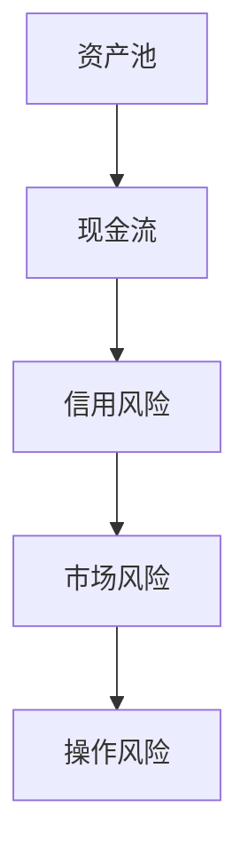
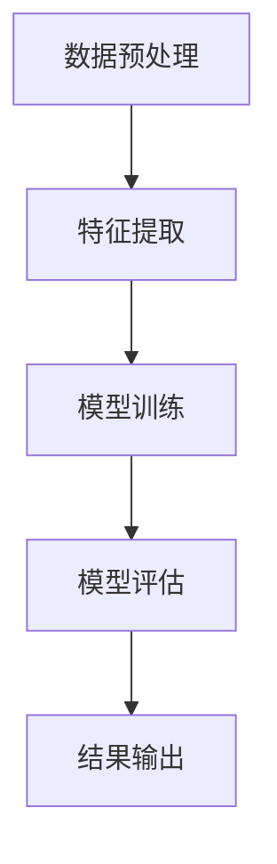
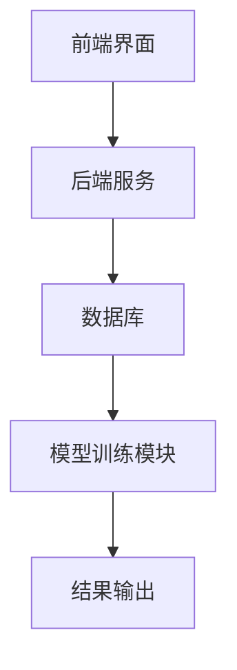

                 


---

# 构建智能化的资产证券化风险评估模型

**关键词：** 资产证券化、风险评估模型、机器学习、深度学习、大数据分析

**摘要：**  
资产证券化是一种重要的金融工具，其核心在于通过将资产池转化为可交易的证券，实现资金的高效流动。然而，资产证券化过程中存在着复杂的信用风险、市场风险和流动性风险。传统的风险评估方法往往依赖于经验判断和简单的统计分析，难以应对复杂多变的市场环境。随着人工智能和大数据技术的快速发展，构建智能化的资产证券化风险评估模型成为可能。本文将从理论到实践，详细探讨如何利用机器学习、深度学习等技术，构建一个高效、准确的资产证券化风险评估模型。

---

## 目录

### 第一部分: 资产证券化与风险评估模型概述

### 第1章: 资产证券化与风险评估概述

#### 1.1 资产证券化的定义与特点  
- 1.1.1 资产证券化的定义  
- 1.1.2 资产证券化的核心特点  
- 1.1.3 资产证券化与传统金融工具的区别  

#### 1.2 风险评估模型的基本概念  
- 1.2.1 风险评估的定义  
- 1.2.2 风险评估模型的核心要素  
- 1.2.3 风险评估模型的应用场景  

#### 1.3 智能化风险评估模型的背景与意义  
- 1.3.1 传统风险评估模型的局限性  
- 1.3.2 智能化技术在风险评估中的优势  
- 1.3.3 智能化风险评估模型的应用前景  

#### 1.4 本章小结  

---

### 第二部分: 资产证券化风险评估模型的核心概念与联系

### 第2章: 资产证券化风险评估的核心要素

#### 2.1 资产池的构成与风险特征  
- 2.1.1 资产池的定义与分类  
- 2.1.2 资产池的风险特征分析  
- 2.1.3 资产池与现金流的关系  

#### 2.2 风险评估模型的输入与输出  
- 2.2.1 模型的输入变量  
- 2.2.2 模型的输出结果  
- 2.2.3 模型的评估指标  

#### 2.3 资产证券化与风险评估的关系  
- 2.3.1 资产证券化中的风险类型  
- 2.3.2 风险评估在资产证券化中的作用  
- 2.3.3 风险评估对资产证券化的影响  

#### 2.4 核心概念与联系的表格对比  
- 2.4.1 资产池与风险特征对比表  
- 2.4.2 模型输入与输出对比表  

#### 2.5 ER实体关系图架构  


#### 2.6 本章小结  

---

### 第三部分: 资产证券化风险评估模型的算法原理

### 第3章: 常见算法原理与流程

#### 3.1 机器学习算法在风险评估中的应用  
- 3.1.1 线性回归模型  
- 3.1.2 支持向量机模型  
- 3.1.3 随机森林模型  
- 3.1.4 神经网络模型  

#### 3.2 算法流程图  


#### 3.3 算法原理的数学模型与公式  
- 3.3.1 线性回归的数学模型  
$$ y = \beta_0 + \beta_1x + \epsilon $$  
- 3.3.2 随机森林的分类算法  
$$ \text{预测概率} = \frac{\sum_{i=1}^{n} \text{预测结果}}{n} $$  

#### 3.4 本章小结  

---

### 第四部分: 系统分析与架构设计方案

### 第4章: 系统功能与架构设计

#### 4.1 项目背景与目标  
- 4.1.1 项目背景  
- 4.1.2 项目目标  
- 4.1.3 项目范围  

#### 4.2 系统功能设计  
- 4.2.1 数据采集模块  
- 4.2.2 数据处理模块  
- 4.2.3 模型训练模块  
- 4.2.4 结果展示模块  

#### 4.3 系统架构设计  


#### 4.4 系统接口设计  
- 4.4.1 数据接口  
- 4.4.2 模型接口  
- 4.4.3 结果接口  

#### 4.5 本章小结  

---

### 第五部分: 项目实战与案例分析

### 第5章: 项目实现与案例分析

#### 5.1 环境安装与配置  
- 5.1.1 Python环境搭建  
- 5.1.2 机器学习库安装（如scikit-learn、TensorFlow）  

#### 5.2 核心代码实现  
- 5.2.1 数据预处理代码  
```python
import pandas as pd
data = pd.read_csv('asset_data.csv')
data = data.dropna()
```
- 5.2.2 模型训练代码  
```python
from sklearn.ensemble import RandomForestClassifier
model = RandomForestClassifier()
model.fit(X_train, y_train)
```

#### 5.3 案例分析与结果解读  
- 5.3.1 案例背景  
- 5.3.2 数据分析  
- 5.3.3 模型评估  

#### 5.4 本章小结  

---

### 第六部分: 最佳实践与总结

### 第6章: 最佳实践与总结

#### 6.1 项目小结  
- 6.1.1 项目成果总结  
- 6.1.2 项目经验总结  

#### 6.2 注意事项与建议  
- 6.2.1 数据质量的重要性  
- 6.2.2 模型调优的技巧  
- 6.2.3 模型解释性的提升  

#### 6.3 拓展阅读与学习方向  
- 6.3.1 深度学习在风险评估中的应用  
- 6.3.2 时间序列分析在资产证券化中的应用  

#### 6.4 本章小结  

---

### 参考文献与致谢

---

以上是文章的详细目录结构和部分内容的示例，涵盖了从理论到实践的各个方面，确保读者能够系统地理解和掌握构建智能化资产证券化风险评估模型的全过程。

