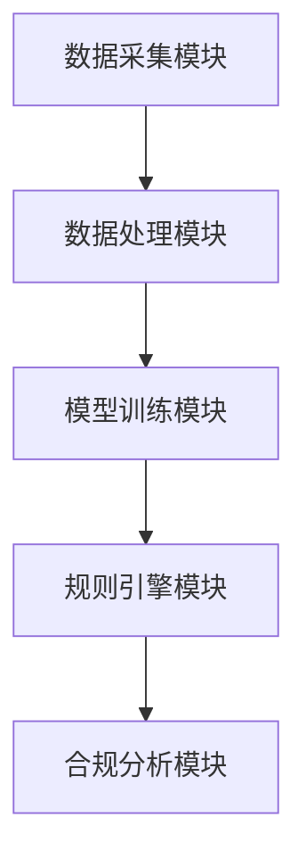
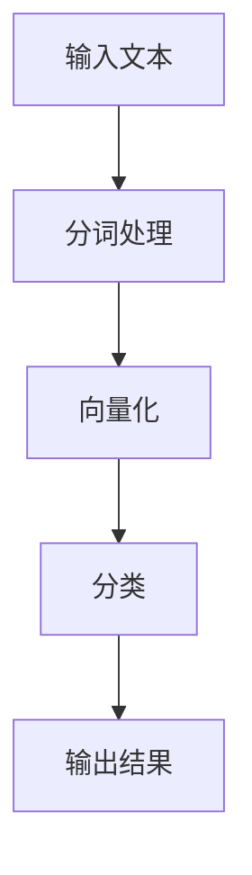
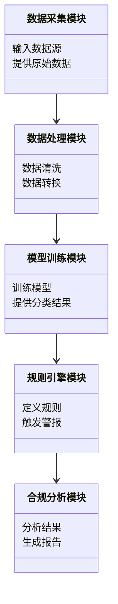
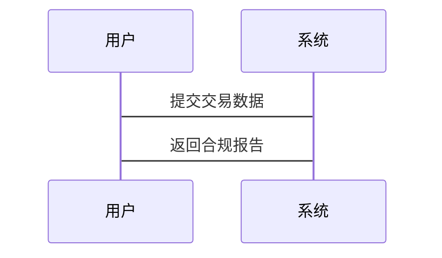

                 


# 构建智能化的金融监管合规系统

> 关键词：智能化监管、金融合规、AI、大数据、系统架构

> 摘要：本文详细探讨了构建智能化金融监管合规系统的各个方面，包括背景、核心概念、算法原理、系统架构、项目实战和总结。通过结合AI和大数据技术，分析了如何提高金融监管的效率和准确性，为读者提供了从理论到实践的全面指导。

---

## 第1章: 金融监管合规系统的背景与问题背景

### 1.1 金融监管的重要性与挑战
#### 1.1.1 金融监管的核心目标
- **保障金融稳定**：防止系统性风险，维护金融市场秩序。
- **保护投资者利益**：确保投资者资金安全，防止欺诈行为。
- **促进公平竞争**：避免市场操纵和不正当竞争。

#### 1.1.2 当前金融监管面临的挑战
- **数据量爆炸**：金融市场数据种类繁多，包括交易数据、新闻、社交媒体等，难以处理。
- **监管规则复杂**：金融法规繁多，且不断更新，传统方法难以应对。
- **实时性要求高**：需要快速识别和处理违规行为，避免事态扩大。

#### 1.1.3 智能化监管的必要性
- **提高效率**：通过AI技术快速分析海量数据，减少人工审查的工作量。
- **增强准确性**：利用机器学习模型识别潜在风险，减少人为错误。
- **适应性更强**：能够根据市场变化动态调整监管策略。

### 1.2 金融合规的定义与范围
#### 1.2.1 合规的基本概念
- **合规**：指金融机构和个人遵守相关法律法规和行业规范的行为。
- **合规管理**：通过建立制度、流程和工具，确保合规行为的实现。

#### 1.2.2 金融合规的主要领域
- **反洗钱（AML）**：识别和防止洗钱行为。
- **市场操纵检测**：监控市场操纵行为，维护公平交易。
- ** insider trading 内幕交易检测**：防止 insider利用非公开信息进行交易。

#### 1.2.3 合规监管的边界与外延
- **边界**：合规监管仅限于法律和行业规范的范围，不涉及企业内部管理。
- **外延**：合规监管不仅包括事后处罚，还包括事前预防和事中监控。

### 1.3 智能化监管的核心要素
#### 1.3.1 数据驱动的监管模式
- **数据采集**：从各种来源收集数据，包括交易数据、新闻、社交媒体等。
- **数据分析**：通过大数据技术处理数据，提取有用信息。
- **数据可视化**：将数据以图表形式展示，帮助监管人员理解。

#### 1.3.2 AI与大数据技术在合规中的应用
- **自然语言处理（NLP）**：用于分析文本数据，识别潜在风险。
- **机器学习**：用于预测和分类，识别异常行为。
- **数据挖掘**：从海量数据中提取模式和趋势。

#### 1.3.3 智能化监管系统的组成结构
- **数据采集模块**：负责收集各种数据。
- **数据处理模块**：对数据进行清洗、转换和标准化。
- **模型训练模块**：训练机器学习模型，用于预测和分类。
- **规则引擎模块**：根据预设规则，自动触发警报。
- **合规分析模块**：综合分析结果，生成报告和建议。

---

## 第2章: 智能化金融监管合规系统的概念与联系

### 2.1 核心概念与原理
#### 2.1.1 数据流的处理逻辑
- **数据源**：交易数据、新闻、社交媒体等。
- **数据预处理**：清洗、转换、标准化。
- **数据存储**：存储在数据库中，方便后续处理。

#### 2.1.2 AI模型的训练与应用
- **模型训练**：使用训练数据训练机器学习模型。
- **模型应用**：将模型应用于实际数据，进行预测和分类。

#### 2.1.3 规则引擎的运行机制
- **规则定义**：定义合规规则，例如“单笔交易金额超过一定阈值需要报告”。
- **规则触发**：当数据匹配规则时，触发警报。

### 2.2 核心概念对比分析
#### 2.2.1 数据流与规则引擎的对比
| 特性       | 数据流             | 规则引擎           |
|------------|--------------------|-------------------|
| 定义       | 数据的流动和处理过程 | 根据规则触发警报   |
| 目标       | 保证数据可用性     | 识别违规行为       |
| 依赖       | 数据采集和处理模块 | 合规规则和模型     |

#### 2.2.2 AI模型与传统规则的对比
| 特性       | AI模型             | 传统规则           |
|------------|--------------------|-------------------|
| 定义       | 基于机器学习的模型   | 预定义的规则       |
| 优点       | 能够处理复杂模式     | 实现简单，易于管理 |
| 缺点       | 需要大量数据训练     | 可能遗漏复杂情况   |

#### 2.2.3 不同模型的特征对比
| 特性       | 分词算法            | 语义理解模型        | 文本分类算法        |
|------------|--------------------|-------------------|-------------------|
| 定义       | 将文本分割成词       | 理解文本含义        | 根据内容分类文本    |
| 用途       | 提供基础数据         | 支持智能问答        | 自动分类文本内容    |
| 示例       | 分割句子为词语       | 理解用户查询意图    | 分类新闻到不同类别  |

### 2.3 系统架构图


---

## 第3章: 自然语言处理在合规文本分析中的应用

### 3.1 自然语言处理的核心算法
#### 3.1.1 分词算法
- **分词**：将连续的文本分割成有意义的词语或短语。
- **示例**：将“中国银行”分割成“中国”和“银行”。

#### 3.1.2 语义理解模型
- **词嵌入**：将词语转换为向量表示，例如Word2Vec。
- **句子嵌入**：将整个句子转换为向量表示，例如BERT。

#### 3.1.3 文本分类算法
- **朴素贝叶斯**：基于概率的分类算法，常用于文本分类。
- **支持向量机（SVM）**：通过构建超平面进行分类。

### 3.2 基于深度学习的文本分析
#### 3.2.1 Transformer模型
- **介绍**：一种基于注意力机制的模型，常用于机器翻译和文本生成。
- **应用**：用于分析金融新闻，识别市场情绪。

#### 3.2.2 BERT模型在合规文本中的应用
- **介绍**：一种预训练的模型，能够理解上下文。
- **应用**：用于分析合规文本，识别潜在的违规行为。

#### 3.2.3 模型训练流程
1. 数据准备：收集和标注合规文本数据。
2. 模型训练：使用标注数据训练BERT模型。
3. 模型应用：将模型应用于新的文本数据，进行分类或预测。

### 3.3 算法流程图


### 3.4 数学模型和公式
#### 3.4.1 朴素贝叶斯分类器
$$ P(y|x) = \frac{P(x|y)P(y)}{P(x)} $$
其中，$y$ 是类别，$x$ 是输入文本。

#### 3.4.2 Transformer模型的注意力机制
$$ \text{Attention}(Q, K, V) = \text{softmax}\left(\frac{QK^T}{\sqrt{d_k}}\right)V $$

---

## 第4章: 系统分析与架构设计方案

### 4.1 问题场景介绍
- **场景描述**：某金融机构需要监管其交易行为，防止市场操纵和内幕交易。

### 4.2 系统功能设计
#### 4.2.1 领域模型


#### 4.2.2 系统架构图


#### 4.2.3 接口设计
- **输入接口**：接收交易数据和新闻数据。
- **输出接口**：输出合规报告和警报信息。

#### 4.2.4 交互流程图


---

## 第5章: 项目实战

### 5.1 环境安装
- **工具安装**：安装Python、TensorFlow、PyTorch等工具。
- **数据源**：获取交易数据和新闻数据。

### 5.2 核心代码实现
```python
import tensorflow as tf
from tensorflow.keras import layers

# 定义模型
model = tf.keras.Sequential()
model.add(layers.Dense(64, activation='relu'))
model.add(layers.Dense(1, activation='sigmoid'))
model.compile(optimizer='adam', loss='binary_crossentropy', metrics=['accuracy'])
```

### 5.3 代码解读与分析
- **模型结构**：使用两层神经网络，第一层有64个神经元，第二层有1个神经元。
- **损失函数**：使用二进制交叉熵损失函数。
- **优化器**：使用Adam优化器。

### 5.4 案例分析
- **案例描述**：某交易行为被模型识别为异常，触发警报。
- **分析结果**：确认存在市场操纵行为，进行进一步调查。

### 5.5 项目小结
- **总结**：通过AI技术，成功实现了金融监管合规系统的智能化。
- **优化建议**：未来可以引入更复杂的模型，如GPT，提高分析准确性。

---

## 第6章: 总结与展望

### 6.1 最佳实践 tips
- **数据质量管理**：确保数据准确性和完整性。
- **模型优化**：定期更新模型，适应市场变化。

### 6.2 小结
- 本文详细介绍了构建智能化金融监管合规系统的各个方面，从背景到实战，为读者提供了全面的指导。

### 6.3 注意事项
- **数据隐私**：在处理数据时，要注意保护用户隐私。
- **模型解释性**：确保模型结果可解释，避免黑箱操作。

### 6.4 拓展阅读
- **相关书籍**：《机器学习实战》、《深度学习入门》。
- **论文推荐**：关注最新的AI与金融监管相关研究。

---

通过以上步骤，我们可以构建一个智能化的金融监管合规系统，利用AI和大数据技术，提高监管效率和准确性，为金融机构和投资者提供更好的服务。

