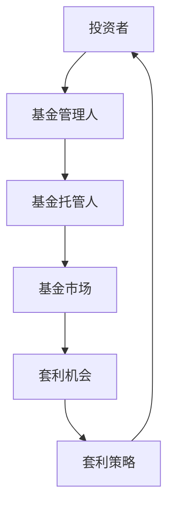
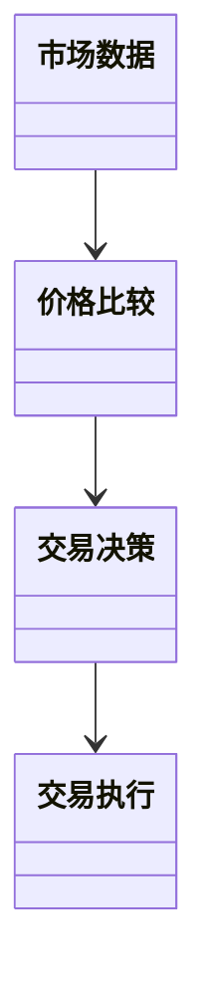
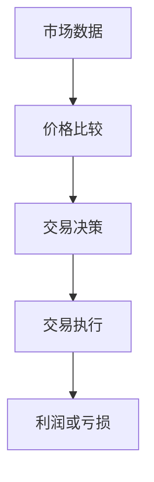

                 


# 契约型封闭基金套利：原理、算法与实践

## 关键词
- 契约型封闭基金
- 套利策略
- 金融算法
- 系统架构
- 项目实战

## 摘要
本文深入探讨了契约型封闭基金的套利机制，从理论到实践，系统地分析了套利的原理、算法实现和实际应用。通过详细的数学模型和代码示例，结合系统架构设计，为读者提供了一个全面的套利解决方案。

---

# 第一部分: 契约型封闭基金套利的背景与核心概念

## 第1章: 契约型封闭基金套利的背景介绍

### 1.1 问题背景
#### 1.1.1 金融市场的套利机会
- 套利是一种利用价格差异获利的策略，常见于金融衍生品市场。
- 契约型封闭基金的特殊性在于其封闭运作和契约约束，为套利提供了潜在机会。

#### 1.1.2 契约型封闭基金的特殊性
- 契约型封闭基金的运作机制：封闭期内资金规模固定，份额固定。
- 投资者在封闭期无法赎回，只能通过二级市场交易基金份额。

#### 1.1.3 套利在金融市场中的作用
- 套利有助于提高市场效率，减少价格差异。
- 套利在金融创新中的重要性。

### 1.2 问题描述
#### 1.2.1 契约型封闭基金的定义
- 契约型封闭基金是通过契约方式设立的基金，份额在封闭期内固定。
- 投资者通过购买基金份额参与投资，基金在封闭期内不得赎回。

#### 1.2.2 套利的基本原理
- 套利是指在同一资产在不同市场或不同时间点出现价格差异时，通过同时买入低价资产和卖出高价资产，利用价格回归实现利润。
- 在契约型封闭基金中，套利可能涉及基金份额的二级市场交易与一级市场申购/赎回的价差。

#### 1.2.3 套利与市场效率的关系
- 套利活动有助于消除市场中的不合理价差，促进价格发现。
- 套利过度可能导致市场流动性下降，影响市场稳定性。

### 1.3 问题解决
#### 1.3.1 套利的基本策略
- 价差套利：利用同一资产在不同市场或不同时间点的价格差异。
- 跨市场套利：利用不同市场之间的价格差异。

#### 1.3.2 套利与市场效率的关系
- 套利是市场自我调节的工具，有助于提高市场效率。
- 套利过度可能导致市场失灵，需要合理监管。

#### 1.3.3 套利的可行性分析
- 市场深度：市场深度越大，套利机会越少。
- 市场流动性：流动性越高，套利越容易实现。
- 交易成本：交易成本越高，套利的可行性越低。

### 1.4 边界与外延
#### 1.4.1 套利的边界条件
- 市场深度：套利机会的存在需要市场深度足够。
- 交易成本：交易成本过高会抵消套利收益。
- 市场效率：套利在高度有效的市场中机会较少。

#### 1.4.2 套利的外延应用
- 套利在不同金融工具中的应用：股票、债券、期货、期权等。
- 套利在不同市场中的应用：国内市场、国际市场、跨境套利。

#### 1.4.3 套利与其他金融策略的区别
- 套利与投机的区别：套利是基于价格差异的无风险或低风险策略，而投机是基于价格趋势的高风险策略。
- 套利与对冲的区别：套利利用价格差异，而对冲是通过建立相反头寸降低风险。

### 1.5 核心概念结构
#### 1.5.1 核心要素组成
- 价格差异：套利的核心在于发现和利用价格差异。
- 交易机制：套利需要通过有效的交易机制实现。
- 市场效率：套利活动影响市场效率，反过来又影响套利机会。

#### 1.5.2 核心概念的层次结构
- 顶层：市场效率。
- 中层：价格差异、交易机制。
- 底层：套利策略、套利收益。

#### 1.5.3 核心概念的相互关系
- 市场效率影响套利机会。
- 套利活动影响市场效率。
- 交易机制是套利的实现手段。

---

## 第2章: 契约型封闭基金套利的核心概念与联系

### 2.1 核心概念原理
#### 2.1.1 套利的基本原理
- 套利通过同时买入低价资产和卖出高价资产，利用价格差异实现利润。
- 套利的核心在于发现和利用价格差异。

#### 2.1.2 契约型封闭基金的运作机制
- 契约型封闭基金在封闭期内资金规模固定，份额固定。
- 投资者在封闭期无法赎回，只能通过二级市场交易基金份额。

#### 2.1.3 套利与基金运作的结合
- 套利可以利用基金份额的二级市场交易价格与 NAV（净资产价值）之间的差异。
- 套利活动可能影响基金的流动性，进而影响其市场价格。

### 2.2 核心概念属性对比
#### 2.2.1 套利与投机的对比
- 投机：基于价格趋势的高风险策略。
- 套利：基于价格差异的低风险策略。

#### 2.2.2 套利与 arbitrage 的对比
- arbitrage 是套利的英文术语，套利是 arbitrage 的具体应用。

#### 2.2.3 套利与对冲的对比
- 对冲：通过建立相反头寸降低风险。
- 套利：通过价格差异实现利润。

### 2.3 ER实体关系图


---

## 第3章: 契约型封闭基金套利的算法原理

### 3.1 套利算法基础
#### 3.1.1 套利的基本算法
- 价格比较：比较同一资产在不同市场或不同时间点的价格。
- 交易决策：根据价格差异决定买入或卖出。

#### 3.1.2 套利算法的优化
- 并行处理：同时监控多个市场或资产的价格。
- 风险控制：设置止损点，避免亏损过大。

#### 3.1.3 套利算法的实现步骤
1. 数据采集：获取相关资产的价格数据。
2. 价格比较：计算价格差异。
3. 交易决策：根据价格差异决定交易策略。
4. 执行交易：同时买入低价资产和卖出高价资产。
5. 盈利或亏损：根据价格回归情况实现盈利或止损。

### 3.2 套利算法的数学模型
#### 3.2.1 数学模型的建立
- 设资产A的价格为P_A，资产B的价格为P_B。
- 套利机会存在于P_A < P_B或P_A > P_B。

#### 3.2.2 数学模型的求解
- 当P_A < P_B时，买入资产A，卖出资产B，预期价格回归时实现利润。
- 当P_A > P_B时，卖出资产A，买入资产B，预期价格回归时实现利润。

#### 3.2.3 数学模型的应用
- 应用于契约型封闭基金的套利：比较基金份额的二级市场价格与 NAV 的差异，利用差异进行套利。

### 3.3 套利算法的Python实现
#### 3.3.1 环境安装
- 安装Python和相关库（如pandas、numpy、matplotlib）。
- 安装金融数据API（如Yahoo Finance API）。

#### 3.3.2 核心代码实现
```python
import pandas as pd
import numpy as np
import requests

# 获取资产价格数据
def get_prices(asset1, asset2):
    url = f"https://query1.finance.yahoo.com/quote/{asset1}, {asset2}"
    response = requests.get(url)
    data = response.json()
    prices = {}
    for asset in [asset1, asset2]:
        prices[asset] = data[f"{asset}.chart-data"]['prices'][0][1]
    return prices

# 套利算法
def arbitrage(asset1, asset2):
    prices = get_prices(asset1, asset2)
    if prices[asset1] < prices[asset2]:
        return f"买入{asset1}，卖出{asset2}"
    elif prices[asset1] > prices[asset2]:
        return f"卖出{asset1}，买入{asset2}"
    else:
        return "无套利机会"

# 示例
print(arbitrage("A", "B"))
```

#### 3.3.3 代码解读与分析
- 数据采集：使用Yahoo Finance API获取资产价格数据。
- 价格比较：比较两个资产的价格，判断是否存在套利机会。
- 交易决策：根据价格差异决定买入或卖出。

---

## 第4章: 套利算法的高级策略

### 4.1 高级套利策略的原理
#### 4.1.1 跨市場套利
- 利用不同市场之间的价格差异。
- 例如，同一资产在A股和港股的价格差异。

#### 4.1.2 跨期套利
- 利用同一资产在不同时间点的价格差异。
- 例如，利用期货和现货的价格差异。

#### 4.1.3 股票套利
- 利用股票的短期价格波动进行套利。

### 4.2 高级套利策略的实现
#### 4.2.1 跨市場套利的实现
- 数据采集：获取不同市场的资产价格。
- 价格比较：比较同一资产在不同市场的价格。
- 交易决策：根据价格差异决定买入或卖出。

#### 4.2.2 跨期套利的实现
- 数据采集：获取同一资产在不同时间点的价格。
- 价格比较：比较不同时间点的价格差异。
- 交易决策：根据价格差异决定买入或卖出。

#### 4.2.3 股票套利的实现
- 数据采集：获取股票的价格和相关指标（如PE、PB）。
- 价格比较：比较股票的价格与内在价值。
- 交易决策：根据价格与价值的差异决定买入或卖出。

---

## 第5章: 套利算法的数学模型与公式

### 5.1 数学模型的建立
- 设资产A的价格为P_A，资产B的价格为P_B。
- 套利机会存在于P_A < P_B或P_A > P_B。

### 5.2 数学模型的求解
- 当P_A < P_B时，买入资产A，卖出资产B，预期价格回归时实现利润。
- 当P_A > P_B时，卖出资产A，买入资产B，预期价格回归时实现利润。

### 5.3 数学模型的应用
- 应用于契约型封闭基金的套利：比较基金份额的二级市场价格与 NAV 的差异，利用差异进行套利。

---

## 第6章: 系统分析与架构设计方案

### 6.1 系统分析
#### 6.1.1 问题场景介绍
- 契约型封闭基金的套利涉及多个市场和资产，需要高效的系统支持。
- 系统需要实时监控市场数据，快速决策交易策略。

#### 6.1.2 项目介绍
- 项目目标：开发一个高效的套利系统。
- 项目范围：涵盖数据采集、价格比较、交易决策和执行交易。

### 6.2 系统架构设计
#### 6.2.1 领域模型（类图）


#### 6.2.2 系统架构图


#### 6.2.3 系统接口设计
- 数据接口：市场数据接口。
- 交易接口：交易执行接口。

#### 6.2.4 系统交互图
```mermaid
sequenceDiagram
   参与者 投资者
    参与者 系统
    投资者 -> 系统: 请求市场数据
    系统 -> 市场数据: 获取市场数据
    市场数据 -> 系统: 返回市场数据
    投资者 -> 系统: 请求价格比较
    系统 -> 价格比较: 获取价格比较结果
    价格比较 -> 系统: 返回价格比较结果
    投资者 -> 系统: 请求交易决策
    系统 -> 交易决策: 获取交易决策结果
    交易决策 -> 系统: 返回交易决策结果
    投资者 -> 系统: 请求交易执行
    系统 -> 交易执行: 执行交易
    交易执行 -> 系统: 返回交易结果
```

---

## 第7章: 项目实战

### 7.1 项目实战环境安装
- 安装Python和相关库（如pandas、numpy、matplotlib）。
- 安装金融数据API（如Yahoo Finance API）。

### 7.2 项目核心实现
#### 7.2.1 数据采集
- 使用Yahoo Finance API获取市场数据。
- 处理数据，提取价格信息。

#### 7.2.2 价格比较
- 比较同一资产在不同市场或不同时间点的价格。
- 判断是否存在套利机会。

#### 7.2.3 交易决策
- 根据价格差异决定买入或卖出。
- 设置止损点，避免亏损过大。

#### 7.2.4 交易执行
- 执行交易策略。
- 记录交易结果。

### 7.3 项目实战代码实现
```python
import pandas as pd
import numpy as np
import requests

# 数据采集
def get_prices(asset1, asset2):
    url = f"https://query1.finance.yahoo.com/quote/{asset1}, {asset2}"
    response = requests.get(url)
    data = response.json()
    prices = {}
    for asset in [asset1, asset2]:
        prices[asset] = data[f"{asset}.chart-data"]['prices'][0][1]
    return prices

# 价格比较
def compare_prices(prices):
    if prices[asset1] < prices[asset2]:
        return "买入资产1，卖出资产2"
    elif prices[asset1] > prices[asset2]:
        return "卖出资产1，买入资产2"
    else:
        return "无套利机会"

# 交易决策
def make_decision(decision):
    if decision == "买入资产1，卖出资产2":
        return "买入资产1，卖出资产2"
    elif decision == "卖出资产1，买入资产2":
        return "卖出资产1，买入资产2"
    else:
        return "无交易"

# 交易执行
def execute_trade(decision):
    # 模拟交易执行
    return f"执行{decision}"

# 示例
asset1 = "A"
asset2 = "B"
prices = get_prices(asset1, asset2)
decision = compare_prices(prices)
execute_trade(decision)
```

### 7.4 项目实战案例分析
- 案例1：资产A和资产B的价格差异套利。
- 案例2：同一资产在不同市场的价格差异套利。
- 案例3：同一资产在不同时间点的价格差异套利。

### 7.5 项目小结
- 项目实现了套利的基本功能。
- 项目展示了套利算法的实际应用。
- 项目为后续研究提供了基础。

---

## 第8章: 最佳实践与总结

### 8.1 最佳实践
#### 8.1.1 交易成本控制
- 降低交易成本是实现套利的关键。
- 选择低佣金的交易平台。

#### 8.1.2 风险控制
- 设置止损点，避免亏损过大。
- 分散投资，降低风险。

#### 8.1.3 交易时机选择
- 在市场流动性充足时进行套利。
- 避免在市场波动剧烈时进行套利。

### 8.2 小结
- 套利是一种有效的金融工具，可以帮助投资者实现利润。
- 套利需要结合市场实际情况，合理选择交易策略。
- 套利活动需要严格控制风险，避免亏损。

### 8.3 注意事项
- 套利需要遵守相关法律法规。
- 套利需要结合市场实际情况，灵活调整策略。
- 套利需要严格控制交易成本和风险。

### 8.4 拓展阅读
- 建议阅读相关金融套利的书籍和论文。
- 关注金融市场的最新动态和套利机会。
- 学习更多的金融工具和策略，提高套利效率。

---

## 附录: 术语表
- 套利：利用价格差异进行交易以实现利润。
- 契约型封闭基金：通过契约方式设立的封闭式基金。
- 市场效率：市场中价格反映所有相关信息的程度。
- 交易成本：交易过程中产生的费用和时间成本。
- 止损点：设定的亏损上限，用于限制损失。

---

## 参考文献
1. 《金融套利策略与算法》
2. 《契约型封闭基金运作机制》
3. 《金融市场与套利》
4. 相关金融套利的学术论文和研究报告。

---

通过以上目录大纲，我们可以系统地了解和掌握契约型封闭基金套利的背景、核心概念、算法原理、系统设计和实际应用。这不仅为理论研究提供了基础，也为实际操作提供了指导。

