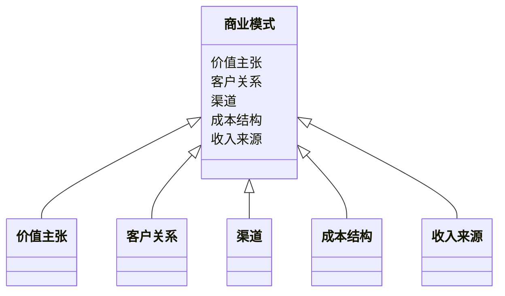
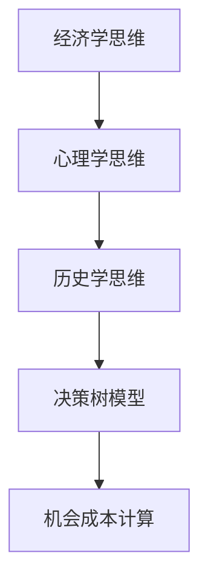

                 


# 查理·芒格的商业模式分析框架

> 关键词：商业模式分析，查理·芒格，多元思维模型，机会成本，决策树，系统架构

> 摘要：本文详细探讨了查理·芒格的多元思维模型在商业模式分析中的应用。通过系统地分析商业模式的核心要素，结合实际案例，展示了如何利用芒格的思维框架进行商业模式的设计与优化。文章内容包括背景介绍、核心概念、算法原理、系统架构、项目实战及最佳实践，旨在为读者提供全面的指导。

---

## 第一部分：背景介绍

### 第1章：查理·芒格与多元思维模型概述

#### 1.1 查理·芒格的生平与投资理念

查理·芒格是美国著名投资家沃伦·巴菲特的长期合作伙伴，以其独特的多元思维模型闻名。他不仅是一位成功的投资者，更是一位深邃的思想家。芒格的多元思维模型强调将多个学科的核心原则结合起来，以形成一个全面的决策框架。

#### 1.2 商业模式分析的重要性

商业模式是企业实现价值创造和价值分配的基本逻辑。在当今竞争激烈的市场环境中，理解并优化商业模式对于企业的生存和发展至关重要。查理·芒格的思维方式为商业模式分析提供了独特的视角。

---

## 第二部分：核心概念与联系

### 第2章：芒格商业模式分析框架的核心概念

#### 2.1 多元思维模型的构成

芒格的多元思维模型涵盖了多个学科的核心原则，包括经济学、心理学、历史学等。以下是各个学科的核心概念：

- **经济学思维**：理解成本、收益和边际效应，识别市场的供需关系。
- **心理学思维**：分析认知偏差，理解人类行为的非理性因素。
- **历史学思维**：通过研究历史周期，识别模式和趋势。

#### 2.2 核心概念的对比分析

为了更好地理解这些概念，我们可以通过对比分析来识别它们的特点。例如，经济学思维关注的是效率和成本，而心理学思维关注的是行为和动机。

以下是一个对比分析的表格：

| 概念         | 经济学思维       | 心理学思维       | 历史学思维       |
|--------------|------------------|------------------|------------------|
| 核心要素     | 成本、收益       | 认知偏差         | 历史周期         |
| 分析目标     | 经济效率         | 行为决策         | 历史趋势         |

#### 2.3 案例分析：历史事件中的芒格思维

通过分析历史事件，我们可以更好地理解芒格思维模型的应用。例如，研究1929年大萧条期间的企业决策，可以识别出许多认知偏差，如过度乐观和从众心理。

---

## 第三部分：算法原理讲解

### 第3章：芒格思维模型的算法实现

#### 3.1 决策树模型构建

决策树是一种用于结构化决策的工具，可以直观地展示不同决策路径及其结果。以下是使用Python构建决策树的代码示例：

```python
import graphviz

def construct_decision_tree():
    # 创建决策树
    dot = graphviz.Digraph()
    dot.node('root', '决策起点')
    dot.node('A', 'A选项')
    dot.node('B', 'B选项')
    dot.edge('root', 'A')
    dot.edge('root', 'B')
    return dot

# 生成决策树并导出
dot = construct_decision_tree()
dot.render('decision_tree.gv', view=True)
```

#### 3.2 机会成本计算

机会成本是指放弃某项选择所付出的代价。计算机会成本的数学模型如下：

$$
\text{机会成本} = \text{最大可能收益} - \text{实际选择收益}
$$

例如，如果选择投资A项目放弃投资B项目，B项目的预期收益为$100，而A项目的实际收益为$80，那么机会成本为$20。

---

## 第四部分：系统分析与架构设计

### 第4章：商业模式分析的系统架构

#### 4.1 系统功能设计

在系统功能设计中，我们需要构建一个领域模型，用于描述商业模式的各个要素。以下是一个领域模型的mermaid类图：



#### 4.2 系统架构设计

系统的架构设计需要考虑各个模块之间的交互。以下是一个系统架构的mermaid图：

```mermaid
client --> API Gateway
API Gateway --> Service Layer
Service Layer --> Database
```

---

## 第五部分：项目实战

### 第5章：基于芒格框架的商业模式分析实战

#### 5.1 项目环境安装

为了进行商业模式分析，需要安装以下工具：

- Python
- graphviz
- scikit-learn

安装命令如下：

```bash
pip install graphviz scikit-learn
```

#### 5.2 核心代码实现

以下是一个用Python实现的商业模式分析代码示例：

```python
from sklearn.tree import DecisionTreeClassifier
from sklearn.datasets import make_classification

# 生成数据
X, y = make_classification(n_samples=100, n_features=2, n_classes=2)

# 构建决策树模型
model = DecisionTreeClassifier()
model.fit(X, y)

# 预测
print(model.predict(X))
```

#### 5.3 案例分析与解读

以某公司为例，分析其商业模式。首先，构建决策树模型，识别关键决策点；然后，计算机会成本，评估不同选择的影响。

---

## 第六部分：最佳实践与小结

### 第6章：芒格框架的最佳实践

#### 6.1 小结与总结

通过本文的分析，我们可以看到查理·芒格的多元思维模型在商业模式分析中的广泛应用。理解这些模型并将其应用于实际分析中，可以帮助我们更好地制定决策。

#### 6.2 注意事项与拓展阅读

在应用芒格的框架时，需要注意以下几点：

1. 确保对各个模型的理解准确。
2. 结合实际案例进行分析，避免过于理论化。
3. 定期更新知识，保持对新趋势的敏感性。

---

## 附录：相关工具与资源

### 附录A：常用工具介绍

- **Python**：用于数据分析和建模。
- **graphviz**：用于绘制决策树和系统架构图。

### 附录B：推荐阅读资料

- 《穷查理宝典》：查理·芒格的智慧结晶。
- 《商业模式新思维》：深入探讨商业模式的设计与优化。

---

## 图表与代码示例

### 芒格思维模型的mermaid流程图



### 决策树构建的Python代码示例

```python
import graphviz

def construct_decision_tree():
    dot = graphviz.Digraph()
    dot.node('root', '决策起点')
    dot.node('A', 'A选项')
    dot.node('B', 'B选项')
    dot.edge('root', 'A')
    dot.edge('root', 'B')
    return dot

dot = construct_decision_tree()
dot.render('decision_tree.gv', view=True)
```

### 商业模式分析的系统架构图

```mermaid
client --> API Gateway
API Gateway --> Service Layer
Service Layer --> Database
```

---

通过以上内容，我们系统地介绍了查理·芒格的商业模式分析框架，并通过实际案例展示了其应用。希望读者能够通过本文，更好地理解和应用芒格的思维方式。

