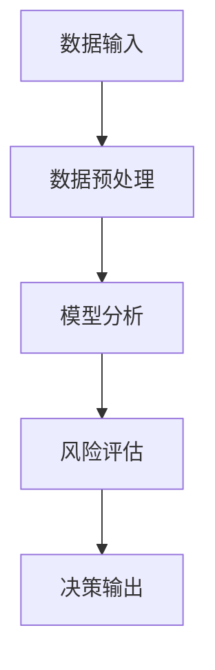
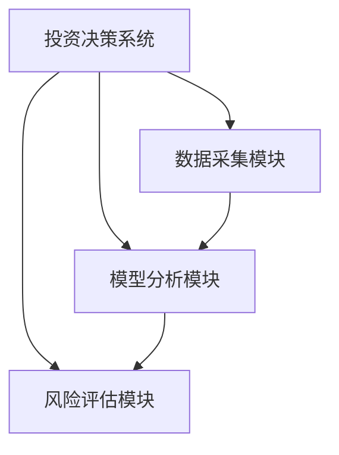

                 

# 查理·芒格的多元思维模型在投资中的应用

---

## 关键词：多元思维模型，投资决策，芒格思想，概率论，决策理论，系统架构

---

## 摘要：查理·芒格的多元思维模型是一种通过跨学科思维来解决复杂问题的方法，其在投资领域中的应用尤为显著。本文将从芒格的多元思维模型的基本概念出发，分析其核心原理，探讨其在投资决策中的具体应用，结合实际案例，详细解读如何通过多元思维模型构建有效的投资决策系统。文章还通过系统架构设计和项目实战，展示如何将多元思维模型应用于实际投资分析中，帮助投资者提升决策能力和风险管理水平。

---

# 第一部分: 引言

---

## 第1章: 查理·芒格与多元思维模型概述

### 1.1 查理·芒格的生平与思想

#### 1.1.1 查理·芒格的生平简介

查理·芒格（Charlie Munger）是世界著名投资家、伯克希尔·哈撒韦公司副主席，被誉为“巴菲特的导师”。芒格不仅在投资领域取得了卓越成就，还以其独特的多元思维模型闻名。他的思想横跨心理学、经济学、数学等多个学科，提倡通过跨学科的视角解决问题。

#### 1.1.2 芒格的价值投资理念

芒格的价值投资理念强调安全边际和长期价值，主张通过深入分析企业的基本面，寻找具有持续竞争优势和合理估值的投资标的。他认为，投资的核心是理解企业，而不是市场的短期波动。

#### 1.1.3 多元思维模型的核心思想

芒格的多元思维模型（Multi-Model Thinking）是一种通过整合多个学科的思维方式，帮助投资者从多个角度分析问题，避免单一思维的局限性。他认为，投资者应该像“格栅”一样，将各个学科的知识相互连接，形成一个完整的知识框架。

---

### 1.2 多元思维模型在投资中的重要性

#### 1.2.1 投资中的常见问题与挑战

投资领域充满了不确定性，投资者常常面临信息不对称、市场波动、情绪干扰等问题。传统单一的分析方法往往难以应对复杂的投资决策。

#### 1.2.2 多元思维模型如何解决投资问题

通过多元思维模型，投资者可以将心理学、经济学、数学等学科的原理结合起来，全面分析企业的竞争优势、财务状况、行业趋势等，从而做出更明智的投资决策。

#### 1.2.3 多元思维模型的适用范围与边界

多元思维模型适用于所有需要复杂决策的领域，但在投资中尤为重要。它可以帮助投资者识别潜在风险、评估投资机会，并制定长期投资策略。

---

### 1.3 本章小结

本章介绍了查理·芒格的生平及其多元思维模型的核心思想，强调了该模型在投资中的重要性。多元思维模型通过整合多学科知识，帮助投资者更全面地分析问题，提升决策能力。

---

# 第二部分: 多元思维模型的基础

---

## 第2章: 多元思维模型的核心概念

### 2.1 多元思维模型的定义与结构

#### 2.1.1 多元思维模型的定义

多元思维模型是一种通过整合多个学科的知识框架，帮助投资者从多个角度分析问题的方法。它强调知识的广泛性和相互关联性。

#### 2.1.2 多元思维模型的核心要素

- **心理学**：理解人类行为和决策中的偏差。
- **经济学**：分析市场机制和价值规律。
- **数学**：利用概率论和统计学进行风险评估。
- **逻辑学**：建立严谨的推理框架。

#### 2.1.3 多元思维模型的结构与层次

多元思维模型的结构包括以下几个层次：

1. **基础层**：逻辑与数学基础。
2. **中间层**：心理学与经济学原理。
3. **应用层**：跨学科综合分析。

---

### 2.2 多元思维模型与投资的关系

#### 2.2.1 多元思维模型在投资中的应用领域

- **价值评估**：通过财务分析和行业趋势判断企业价值。
- **风险控制**：利用概率论评估投资风险。
- **决策优化**：通过心理学原理优化投资决策。

#### 2.2.2 多元思维模型如何影响投资决策

多元思维模型通过整合多学科知识，帮助投资者更全面地分析问题，避免单一视角的局限性。

#### 2.2.3 多元思维模型的优缺点分析

- **优点**：提升决策的全面性和准确性。
- **缺点**：需要广泛的知识储备和复杂的分析过程。

---

### 2.3 本章小结

本章详细讲解了多元思维模型的定义、结构和核心要素，分析了其在投资中的应用领域和影响。多元思维模型通过跨学科的综合分析，帮助投资者做出更明智的决策。

---

# 第三部分: 多元思维模型的核心概念与联系

---

## 第3章: 多元思维模型的核心原理

### 3.1 概率论与统计学

#### 3.1.1 概率论的基本原理

概率论是多元思维模型的重要组成部分。通过概率分析，投资者可以评估不同投资方案的可行性和风险。

#### 3.1.2 统计学在投资中的应用

统计学可以帮助投资者分析历史数据，发现市场趋势和周期性规律。

#### 3.1.3 概率与统计在投资决策中的结合

通过概率和统计分析，投资者可以量化风险，制定科学的投资策略。

---

### 3.2 决策理论与心理学

#### 3.2.1 心理学对投资决策的影响

心理学研究发现，投资者常常受到情绪和认知偏差的影响，导致错误决策。

#### 3.2.2 常见的决策偏差与错误

- **确认偏差**：倾向于寻找支持自己观点的证据。
- **损失厌恶**：对损失的恐惧导致决策失误。
- **过度自信**：对自身判断过于自信。

#### 3.2.3 如何克服决策偏差

通过学习多元思维模型，投资者可以识别和克服决策偏差，提升决策的科学性。

---

### 3.3 经济学与金融学

#### 3.3.1 经济学的基本原理

经济学帮助投资者理解市场机制和价值规律，分析企业的竞争优势。

#### 3.3.2 金融学的核心概念

金融学涉及资产定价、资本结构、风险管理等重要内容。

#### 3.3.3 经济学与金融学在投资中的应用

通过经济学和金融学的分析，投资者可以更好地理解企业的财务状况和行业趋势。

---

### 3.4 本章小结

本章详细讲解了多元思维模型中的概率论、决策理论和经济学原理，分析了它们在投资中的应用。通过跨学科的综合分析，投资者可以更全面地理解市场和企业，做出更明智的投资决策。

---

## 第4章: 多元思维模型的系统架构设计

### 4.1 系统功能设计

#### 4.1.1 投资决策系统的功能模块

- **数据收集模块**：收集企业的财务数据、行业趋势等信息。
- **模型分析模块**：利用多元思维模型进行综合分析。
- **风险评估模块**：评估投资的风险和收益。

#### 4.1.2 系统功能流程图

---

### 4.2 系统架构设计

#### 4.2.1 系统架构图

---

### 4.3 本章小结

本章通过系统架构设计，展示了如何将多元思维模型应用于投资决策系统中，包括功能模块和系统架构的设计。

---

## 第5章: 多元思维模型的数学模型与算法实现

### 5.1 概率论模型

#### 5.1.1 概率模型的数学表达

$$ P(A) = \frac{\text{事件A的可能数}}{\text{总可能数}} $$

#### 5.1.2 概率模型的实现步骤

1. 确定事件的可能结果。
2. 计算事件发生的概率。
3. 评估风险和收益。

### 5.2 统计学模型

#### 5.2.1 统计模型的数学表达

$$ E(X) = \sum x_i P(X = x_i) $$

#### 5.2.2 统计模型的实现步骤

1. 收集数据。
2. 计算期望值和方差。
3. 分析数据分布。

---

### 5.3 本章小结

本章通过数学模型和算法实现，展示了多元思维模型在投资中的具体应用，包括概率论和统计学模型的实现步骤和数学表达。

---

## 第6章: 项目实战——多元思维模型在苹果公司投资中的应用

### 6.1 项目背景

苹果公司是全球知名的科技公司，具有强大的市场竞争力和品牌价值。

### 6.2 数据收集

收集苹果公司的财务数据、行业趋势、市场环境等信息。

### 6.3 模型应用

#### 6.3.1 财务分析

- 资产负债表分析。
- 利润表分析。

#### 6.3.2 行业趋势分析

- 市场需求分析。
- 竞争对手分析。

#### 6.3.3 风险评估

- 市场风险。
- 财务风险。

### 6.4 决策输出

基于多元思维模型的分析，得出苹果公司投资的结论。

---

### 6.5 本章小结

本章通过苹果公司的投资分析，展示了多元思维模型在实际投资中的应用，帮助投资者更好地理解和应用该模型。

---

## 第7章: 总结与展望

### 7.1 本章总结

本文详细讲解了查理·芒格的多元思维模型在投资中的应用，包括模型的核心原理、系统架构设计和实际案例分析。

### 7.2 未来展望

未来，多元思维模型将在投资领域发挥更大的作用，随着人工智能和大数据技术的发展，其应用将更加广泛和深入。

---

## 参考文献

（此处列出相关书籍、论文和资料）

---

通过本文的详细讲解，读者可以全面理解查理·芒格的多元思维模型在投资中的应用，掌握其核心原理和实际操作方法，为投资决策提供有力支持。

