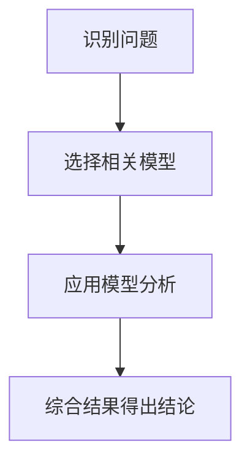
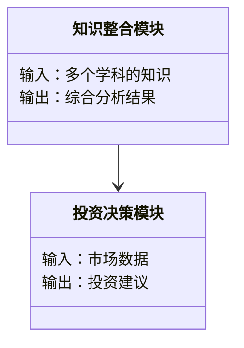

                 

# 查理·芒格的多元思维模型实际案例分析

## 关键词

- 查理·芒格
- 多元思维模型
- 投资决策
- 知识整合
- 系统性思维

## 摘要

本文详细分析查理·芒格提出的多元思维模型，探讨其在投资决策中的实际应用。通过系统性地整合多个学科的知识，分析模型的核心概念、算法原理、数学模型，并结合实际案例，展示如何将理论应用于实践。文章结构清晰，逻辑严谨，适合对投资分析和系统性思维感兴趣的读者阅读。

---

## 第一部分：多元思维模型的背景与核心概念

### 第1章：多元思维模型的背景介绍

#### 1.1 多元思维模型的定义与背景

多元思维模型是由查理·芒格提出的一种思维方式，强调将多个学科的知识整合起来，以全面理解问题。该模型适用于投资、商业决策等领域，帮助避免单一思维的局限性。

#### 1.2 多元思维模型的核心要素

- **心理学模型**：理解人类行为偏差，如确认偏差和损失厌恶。
- **经济学模型**：分析市场行为和定价机制。
- **物理学模型**：理解能量守恒和杠杆原理。
- **数学模型**：概率论和统计分析。
- **历史模型**：从历史中汲取经验教训。

---

### 第2章：多元思维模型的核心概念

#### 2.1 多元思维模型的整合机制

通过以下步骤实现知识整合：
1. 识别问题本质。
2. 应用相关学科模型进行分析。
3. 结合模型结果得出结论。

#### 2.2 多元思维模型的核心要素对比

| 模型类型  | 核心概念         | 优点                           | 缺点                           |
|----------|------------------|--------------------------------|--------------------------------|
| 心理学    | 行为偏差         | 解释人类决策中的非理性行为     | 简单化处理复杂心理现象         |
| 经济学    | 市场机制         | 分析供需关系                   | 假设条件过于理想化             |
| 物理学    | 能量守恒         | 解释系统的稳定性               | 不考虑系统的外部干扰因素       |
| 数学      | 概率与统计       | 提供量化分析工具               | 需大量数据支持，存在假设偏差   |
| 历史      | 历史案例         | 提供经验教训                   | 无法直接应用于当前问题         |

---

## 第二部分：多元思维模型的算法原理

### 第3章：多元思维模型的算法原理

#### 3.1 多元思维模型的整合算法

#### 3.2 算法的数学模型与公式

分析股票价值时，可以使用以下公式：

$$
\text{内在价值} = \sum_{t=1}^{n} \frac{\text{现金流}}{(1 + r)^t}
$$

其中，\( r \) 是折现率，\( t \) 是时间单位。

---

## 第三部分：多元思维模型的数学模型与公式

### 第4章：多元思维模型的数学模型

#### 4.1 知识网络的价值公式

知识网络的价值可以用以下公式表示：

$$
\text{知识网络价值} = \sum_{i=1}^{m} \sum_{j=1}^{n} \text{节点价值}(i, j)
$$

其中，\( m \) 和 \( n \) 分别是知识网络的节点数量和连接数。

---

## 第四部分：多元思维模型的系统分析与架构设计

### 第5章：多元思维模型的系统架构

#### 5.1 系统功能设计

---

## 第五部分：多元思维模型的实际案例分析

### 第6章：实际案例分析

#### 6.1 投资决策的案例分析

以评估一只股票为例：

1. **应用心理学模型**：分析投资者情绪。
2. **应用经济学模型**：分析市场供需。
3. **应用物理学模型**：分析企业运营稳定性。
4. **应用数学模型**：计算股票的内在价值。
5. **应用历史模型**：参考类似情况的历史表现。

---

## 第六部分：多元思维模型的总结与扩展

### 6.1 最佳实践 Tips

- **持续学习**：不断更新各学科知识。
- **模型筛选**：选择适用的模型，避免过多干扰。
- **数据支持**：确保数据准确，减少假设偏差。

---

### 6.2 小结

查理·芒格的多元思维模型是一种强大的工具，通过整合多个学科的知识，帮助做出更全面的决策。本文通过背景、核心概念、算法、数学模型、系统设计和案例分析，详细展示了其应用过程。

---

### 6.3 注意事项

- 避免模型堆砌，选择合适的模型。
- 考虑模型的局限性，结合实际情况灵活运用。
- 数据质量是关键，需确保数据的准确性和相关性。

---

### 6.4 拓展阅读

- 《芒格的投资心理学》
- 《系统思维：决策者的认知革命》
- 《如何构建知识体系》

---

通过以上分析，查理·芒格的多元思维模型在实际投资决策中的应用价值得到了充分体现。希望本文能为读者提供有价值的参考和启发。

