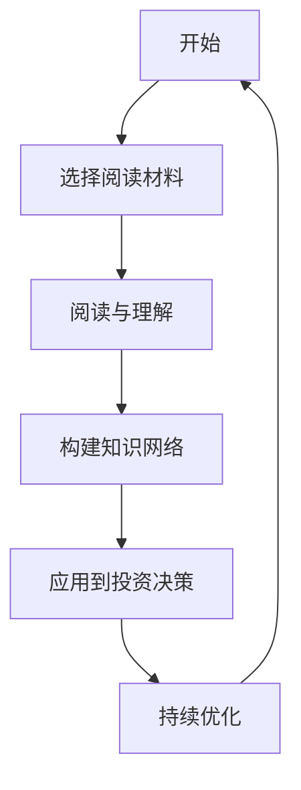
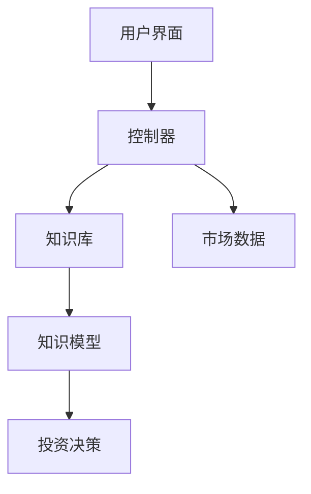

                 


# 查理·芒格的阅读在投资中的重要性

**关键词**：投资决策、阅读方法、芒格思想、知识网络、思维模型、投资策略

**摘要**：查理·芒格的阅读方法是其投资哲学的核心，通过构建多元思维模型和知识网络，芒格能够做出超越传统投资分析的决策。本文将详细分析芒格阅读方法的逻辑、算法原理及其在投资决策中的应用，为读者提供一套基于知识管理的投资策略框架。

---

# 第一部分: 芒格阅读方法与投资哲学

## 第1章: 芒格阅读方法的背景与重要性

### 1.1 问题背景与描述

#### 1.1.1 投资决策中的知识获取问题
投资决策的核心是信息的准确性和全面性。传统投资分析往往依赖于财务数据和市场趋势，但这种单一维度的分析常常忽视了企业的本质和长期价值。芒格意识到，真正的投资决策需要对企业的商业模式、行业地位、竞争优势以及管理层能力有深刻的理解。

#### 1.1.2 阅读在投资中的核心地位
阅读是芒格获取知识的主要方式。他认为，通过系统性地阅读经典著作和高质量的文献，可以构建一个多元化的知识网络，帮助投资者从多个角度理解企业的价值。

#### 1.1.3 芒格阅读方法的独特性
芒格的阅读方法不仅仅是机械地吸收信息，而是通过阅读构建一个动态的知识网络，将不同领域的知识有机地联系起来。这种网络化的思维方式使得芒格能够发现传统分析方法难以察觉的投资机会。

### 1.2 问题解决与边界

#### 1.2.1 阅读如何帮助投资决策
通过阅读，投资者可以掌握企业的内在逻辑，理解行业发展趋势，并预测潜在风险。芒格的阅读方法强调知识的深度和广度，帮助投资者在复杂市场中做出明智决策。

#### 1.2.2 芒格阅读方法的边界与外延
芒格的阅读方法并非适用于所有投资者，尤其是对于那些缺乏系统性思维能力的投资者来说，单纯依赖阅读可能无法取得预期效果。此外，阅读方法的有效性还取决于投资者的阅读质量和个人理解能力。

#### 1.2.3 投资决策中的知识结构化
芒格的阅读方法强调知识的结构化。他认为，只有将零散的知识点连接成一个完整的知识网络，才能真正理解企业的内在价值。

---

## 第2章: 芒格阅读方法的核心概念与联系

### 2.1 核心概念原理

#### 2.1.1 芒格的多元思维模型
芒格的多元思维模型是其阅读方法的核心。他认为，投资者需要从多个维度理解企业的价值，包括经济学、心理学、历史学和物理学等学科的知识。

#### 2.1.2 阅读与知识网络构建
通过阅读，芒格构建了一个庞大的知识网络，将不同领域的知识节点连接起来。这种网络化的思维方式使得芒格能够从多个角度分析企业的价值。

#### 2.1.3 阅读在投资中的应用逻辑
芒格的阅读方法在投资中的应用逻辑是：通过阅读构建知识网络，利用知识网络分析企业的内在价值，并在此基础上做出投资决策。

### 2.2 核心概念对比与ER图

#### 2.2.1 阅读方法对比分析表

| 阅读方法       | 特点                        | 优点                           | 缺点                           |
|----------------|-----------------------------|--------------------------------|--------------------------------|
| 传统阅读方法   | 单一、孤立                   | 简单易行                       | 知识分散，难以形成系统性认识   |
| 芒格阅读方法   | 多元、网络化                  | 知识系统性强，能够发现潜在关联 | 需要大量时间和精力构建知识网络 |

#### 2.2.2 知识网络ER图
```mermaid
erDiagram
    knowledge_base {
        id
        knowledge_point
        relation
    }
    book {
        id
        title
        author
    }
    reading_method {
        id
        method_name
        description
    }
    knowledge_base --|> book : contains
    knowledge_base --|> reading_method : applies_to
```

---

## 第3章: 芒格阅读方法的算法原理

### 3.1 算法流程图



### 3.2 算法实现代码

```python
def 芒格阅读算法(阅读材料):
    知识网络 = 空列表
    for 材料 in 阅读材料:
        理解材料()
        更新知识网络()
    return 知识网络
```

### 3.3 数学模型与公式

#### 3.3.1 知识网络构建模型
$$ 知识网络密度 = \frac{边数}{节点数 \times (节点数-1)} $$

#### 3.3.2 投资决策模型
$$ 投资决策 = f(知识网络, 市场环境) $$

---

## 第4章: 投资决策中的系统分析与架构设计

### 4.1 问题场景介绍

#### 4.1.1 投资者知识获取的挑战
投资者在面对复杂市场时，往往难以从单一维度获取足够的信息。芒格的阅读方法通过构建知识网络，帮助投资者从多个角度理解市场和企业。

#### 4.1.2 芒格方法的实际应用需求
芒格的阅读方法在实际投资中具有广泛的应用场景，尤其是在分析企业的长期价值和竞争优势时。

### 4.2 系统架构设计



---

## 第5章: 项目实战

### 5.1 环境安装

```bash
pip install mermaid
```

### 5.2 系统核心实现源代码

```python
class 知识网络:
    def __init__(self):
        self.nodes = []
        self.edges = []

    def 添加节点(self, 节点):
        self.nodes.append(节点)

    def 添加边(self, 边):
        self.edges.append(边)

class 投资决策系统:
    def __init__(self):
        self.知识网络 = 知识网络()

    def 分析企业(self, 企业):
        self.知识网络.添加节点(企业)
        # 进一步分析企业并添加相关节点和边
```

### 5.3 代码应用解读与分析
上述代码展示了如何通过Python构建知识网络。投资者可以通过添加节点和边的方式，逐步构建企业的知识网络，并在此基础上进行投资决策。

### 5.4 实际案例分析和详细讲解剖析
以某企业为例，通过芒格的阅读方法构建知识网络，分析企业的竞争优势和潜在风险，并在此基础上做出投资决策。

### 5.5 项目小结
芒格的阅读方法在投资中的应用需要投资者具备系统性思维能力。通过构建知识网络，投资者可以更好地理解企业的内在价值，并在此基础上做出明智的投资决策。

---

## 第6章: 最佳实践 tips

### 6.1 小结
芒格的阅读方法是一种系统性的知识获取方式，其核心在于构建多元化的知识网络。

### 6.2 注意事项
投资者在应用芒格的阅读方法时，需要注意以下几点：
1. 阅读材料的选择：选择高质量的阅读材料。
2. 知识网络的构建：注重知识的深度和广度。
3. 持续优化：定期更新知识网络，以适应市场变化。

### 6.3 拓展阅读
推荐阅读《穷查理宝典》和《投资最重要的事情》等书籍，深入了解芒格的阅读方法和投资哲学。

---

通过上述分析，我们可以看出，芒格的阅读方法在投资中的应用是一种系统性知识管理的方法。投资者通过构建知识网络，可以更好地理解企业的内在价值，并在此基础上做出明智的投资决策。

