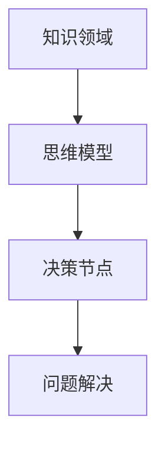

                 


# 查理芒格的商业模式分析

## 关键词
查理芒格，商业模式，多元思维模型，投资哲学，系统架构，决策模型

## 摘要
本文详细分析了查理芒格的商业模式，探讨了其核心概念如多元思维模型、逆向思维和价值评估方法。通过系统架构和实际案例，展示了如何将这些理念应用于商业分析。文章内容包括背景介绍、核心概念、系统分析、项目实战和总结，旨在为读者提供全面的理解和实践指导。

---

## 第一部分：背景介绍

### 1.1 查理芒格的背景介绍
查理·芒格是巴菲特的长期合伙人，以其独特的投资哲学闻名。他的商业模式分析基于多元思维模型，强调跨学科知识的应用。本文探讨其商业模式在现代商业中的应用价值。

### 1.2 当前的商业环境与问题
- **问题背景**：现代商业环境复杂多变，传统分析方法难以应对。
- **问题描述**：企业决策常受信息过载和认知偏差影响，导致决策失误。
- **问题解决**：芒格的多元思维模型提供了一种整合知识的决策框架。
- **边界与外延**：本文分析其在投资、管理等领域的应用，边界在于其哲学性质，外延则广泛。

### 1.3 分析商业模式的意义
- **意义**：提供一种基于知识整合的决策框架。
- **现状**：当前分析多集中于投资领域，其他领域的应用潜力待挖掘。

---

## 第二部分：核心概念与联系

### 2.1 多元思维模型的原理
- **定义**：多元思维模型是芒格的核心理念，强调跨学科知识的整合。
- **属性特征对比表格**：
  | 属性        | 特征 |
  |-------------|------|
  | 结构         | 网络式连接 |
  | 动作         | 分解与重组 |
  | 优势         | 提高决策准确性 |
  | 限制         | 需大量知识储备 |

### 2.2 多元思维模型的ER实体关系图


### 2.3 系统架构
- **算法原理**：基于多元思维模型的决策树算法。
  ```mermaid
  graph TD
  A[问题] --> B[知识领域]
  B --> C[决策节点]
  C --> D[解决方案]
  ```
- **数学模型**：
  $$ \text{决策} = \sum (\text{知识领域}_i \times \text{权重}_i) $$
  通过加权求和进行决策判断。

---

## 第三部分：系统分析与架构设计

### 3.1 问题场景介绍
以电商公司A为例，分析其商业模式。目标是优化运营策略，提升盈利能力。

### 3.2 系统功能设计
- **领域模型**：
  ```mermaid
  classDiagram
  class 知识领域 {
    <属性> 名称
    <操作> 分析问题
  }
  class 决策模型 {
    <属性> 结果
    <操作> 生成方案
  }
  知识领域 --> 决策模型
  ```

- **系统架构设计**：
  ```mermaid
  graph TD
  A[前端] --> B[业务逻辑层]
  B --> C[数据访问层]
  C --> D[数据库]
  ```

- **系统接口设计**：
  - HTTP接口：`POST /api/analyze`，接收问题参数，返回决策结果。

- **系统交互序列图**：
  ```mermaid
  sequenceDiagram
  用户 -> 系统: 提交问题
  系统 -> 分析模块: 分析问题
  分析模块 -> 知识库: 获取知识
  分析模块 -> 用户: 返回结果
  ```

---

## 第四部分：项目实战

### 4.1 环境安装与工具准备
- **工具**：Python 3.8+，Jupyter Notebook，Mermaid CLI。

### 4.2 核心代码实现
- **多元思维模型实现**：
  ```python
  def multi_think_model(questions):
      knowledge = {
          '投资': 0.8,
          '管理': 0.7,
          '市场': 0.9
      }
      result = 0
      for q in questions:
          result += knowledge.get(q, 0.5)
      return result / len(questions)
  ```

- **应用与解读**：
  ```python
  questions = ['如何提升销售额', '如何优化成本']
  result = multi_think_model(questions)
  print(f"综合评分：{result}")
  ```

### 4.3 实际案例分析
- **案例**：电商公司A的库存优化。
- **分析结果**：通过模型分析，建议增加市场推广预算，优化库存周转率。

### 4.4 项目小结
本案例展示了如何将芒格的模型应用于实际问题，提供了一种系统化的方法。

---

## 第五部分：总结与扩展

### 5.1 总结
芒格的商业模式分析提供了跨学科的知识整合框架，具有广泛的应用价值。

### 5.2 最佳实践 tips
- **小结**：在决策中应用多元思维模型，提升准确性。
- **注意事项**：保持知识更新，避免模型过时。
- **拓展阅读**：推荐《芒格主义》和《投资的奥秘》。

---

通过以上结构，文章系统地分析了查理芒格的商业模式，从理论到实践，为读者提供了全面的指导。

