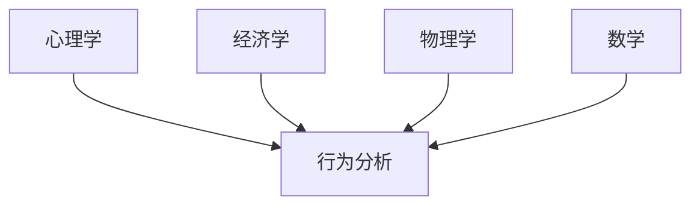
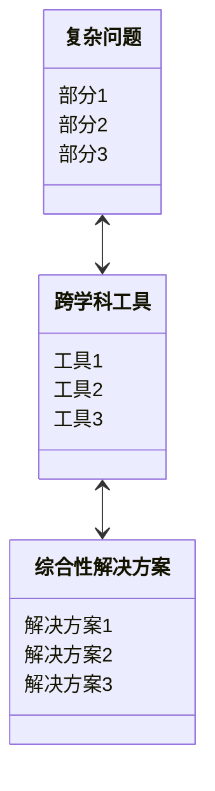
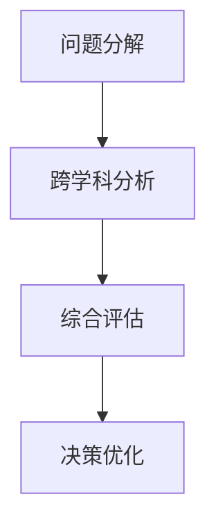
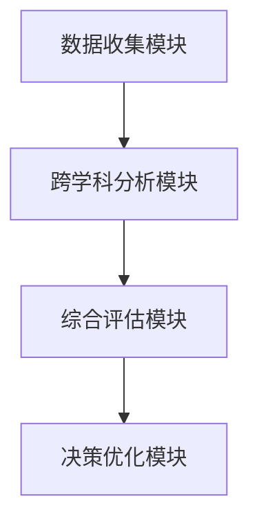
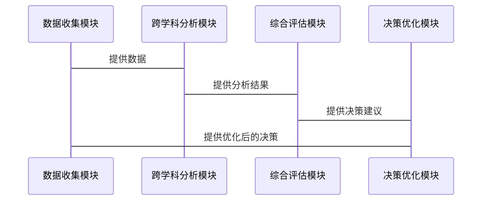

                 


# 查理芒格的多元思维模型

> 关键词：查理芒格，多元思维模型，跨学科思考，决策框架，技术思维

> 摘要：查理芒格的多元思维模型是一种通过跨学科视角进行决策和分析的方法，它强调将不同领域的知识和思维方式结合起来，以更好地理解复杂问题并做出明智的决策。本文从技术角度出发，详细分析了多元思维模型的核心概念、算法原理、系统架构、项目实战以及最佳实践，帮助读者在技术领域中更好地应用这一模型。

---

# 第一部分: 多元思维模型的背景与核心概念

## 第1章: 多元思维模型的起源与背景

### 1.1 多元思维模型的定义

#### 1.1.1 多元思维模型的核心概念
- 多元思维模型是一种通过整合多个学科的知识和思维方式来分析问题的方法。
- 它强调从不同角度看待问题，避免单一学科的局限性。
- 多元思维模型的核心在于将复杂问题分解为多个简单的问题，并通过跨学科的视角找到解决方案。

#### 1.1.2 多元思维模型与其他思维方法的对比
- 与单一学科思维相比，多元思维模型更注重综合性和全局性。
- 与传统的决策框架相比，多元思维模型更强调灵活性和适应性。

#### 1.1.3 多元思维模型的起源与发展
- 多元思维模型由查理芒格提出，灵感来源于他对心理学、经济学、物理学等多学科的研究。
- 它在投资、商业决策等领域得到了广泛应用。

### 1.2 多元思维模型的核心思想

#### 1.2.1 知识的广泛性与交叉性
- 多元思维模型认为，知识的广度和深度是相辅相成的。
- 不同学科的交叉点往往是解决问题的关键。

#### 1.2.2 多学科视角的重要性
- 通过多学科视角，可以更全面地理解问题的本质。
- 多学科视角可以帮助避免单一学科的偏见和局限性。

#### 1.2.3 复杂问题的简化与分解
- 复杂问题可以通过分解成多个简单的问题来解决。
- 多元思维模型提供了一种系统化的方法来分解和分析问题。

### 1.3 多元思维模型的应用价值

#### 1.3.1 在个人决策中的作用
- 帮助个人做出更明智的决策，尤其是在面对复杂问题时。
- 提高个人的批判性思维能力和创新能力。

#### 1.3.2 在商业与投资中的应用
- 在商业决策中，多元思维模型可以帮助识别潜在风险和机会。
- 在投资中，多元思维模型可以帮助更好地评估投资项目的价值和风险。

#### 1.3.3 在日常生活中的实践
- 帮助人们更好地处理日常生活中的复杂问题。
- 提高人们在面对不确定性和复杂性时的应对能力。

---

## 第2章: 多元思维模型的核心概念与联系

### 2.1 多元思维模型的核心概念

#### 2.1.1 跨学科视角
- 跨学科视角是多元思维模型的核心，它要求从多个学科的角度看待问题。
- 不同学科的思维方式和工具可以帮助更好地理解和解决复杂问题。

#### 2.1.2 模块化思维
- 模块化思维是多元思维模型的重要组成部分，它要求将问题分解成多个模块。
- 每个模块可以独立分析，但它们之间的关系也需要被考虑到。

#### 2.1.3 系统化思维
- 系统化思维是多元思维模型的另一个核心，它要求将问题视为一个整体系统。
- 系统的各个部分之间相互关联，需要综合考虑。

### 2.2 多元思维模型的核心要素

#### 2.2.1 复杂问题的分解
- 复杂问题可以通过分解成多个简单的问题来解决。
- 分解问题时需要考虑问题的各个方面，并找到它们之间的关系。

#### 2.2.2 跨学科工具的使用
- 多元思维模型要求使用不同学科的工具和方法来分析问题。
- 例如，使用心理学的理论来分析用户行为，使用经济学的原理来分析市场趋势。

#### 2.2.3 综合性解决方案
- 多元思维模型的最终目标是找到一个综合性的解决方案。
- 这个解决方案需要考虑问题的各个方面，并且能够应对各种潜在的变化和不确定性。

### 2.3 多元思维模型的对比分析

#### 2.3.1 不同学科的思维方式对比
- 心理学：关注人的行为和心理过程。
- 经济学：关注资源分配和市场行为。
- 物理学：关注自然规律和物质运动。
- 数学：关注逻辑推理和数量关系。

#### 2.3.2 多学科视角的互补性
- 不同学科的思维方式和工具可以相互补充，共同解决复杂问题。
- 例如，使用心理学和经济学的理论来分析消费者行为。

#### 2.3.3 多学科视角的整合方法
- 整合不同学科的思维方式需要找到它们的共同点和差异点。
- 需要通过实践不断调整和优化，以找到最佳的整合方法。

### 2.4 多元思维模型的图表分析

#### 2.4.1 多学科视角的Mermaid流程图


#### 2.4.2 系统化思维的Mermaid类图


---

## 第3章: 多元思维模型的算法原理

### 3.1 多元思维模型的算法框架

#### 3.1.1 算法概述
- 多元思维模型的算法框架是一种基于跨学科视角的决策框架。
- 它通过整合不同学科的思维方式和工具来解决复杂问题。

#### 3.1.2 算法步骤
1. 问题分解：将复杂问题分解成多个简单的问题。
2. 跨学科分析：使用不同学科的思维方式和工具对每个问题进行分析。
3. 综合评估：综合各个问题的分析结果，找到最佳解决方案。
4. 决策优化：根据实际情况对决策进行优化和调整。

#### 3.1.3 算法流程图


### 3.2 多元思维模型的数学模型

#### 3.2.1 基于概率论的决策模型
- 使用概率论来评估不同决策的可能性和风险。
- 公式：$$ P(A|B) = \frac{P(B|A) \cdot P(A)}{P(B)} $$
- 例子：计算某个投资项目的成功概率。

#### 3.2.2 基于线性回归的预测模型
- 使用线性回归来预测未来趋势。
- 公式：$$ y = a + bx + \epsilon $$
- 例子：预测市场需求的变化。

#### 3.2.3 基于决策树的优化模型
- 使用决策树来优化决策过程。
- 示例代码：
```python
from sklearn.tree import DecisionTreeClassifier
import pandas as pd

# 示例数据
data = pd.DataFrame({
    '特征1': [0, 1, 2, 3],
    '特征2': [4, 5, 6, 7],
    '目标': [0, 1, 1, 0]
})

# 训练决策树模型
model = DecisionTreeClassifier()
model.fit(data[['特征1', '特征2']], data['目标'])
```

### 3.3 多元思维模型的优化方法

#### 3.3.1 参数优化
- 使用交叉验证等方法优化模型的参数。
- 示例代码：
```python
from sklearn.model_selection import GridSearchCV
from sklearn.tree import DecisionTreeClassifier

# 参数设置
param_grid = {
    'max_depth': [2, 4, 6],
    'min_samples_split': [2, 4, 6]
}

# 参数优化
grid_search = GridSearchCV(model, param_grid, cv=5)
grid_search.fit(data[['特征1', '特征2']], data['目标'])
best_params = grid_search.best_params_
```

#### 3.3.2 模型集成
- 使用模型集成方法（如袋装法、堆叠法）来提高模型的性能。
- 示例代码：
```python
from sklearn.ensemble import BaggingClassifier

# 袋装法集成
bagging_model = BaggingClassifier(
    base_estimator=DecisionTreeClassifier(),
    n_estimators=10,
    max_samples=0.8
)
bagging_model.fit(data[['特征1', '特征2']], data['目标'])
```

#### 3.3.3 模型评估
- 使用准确率、召回率、F1分数等指标来评估模型的性能。
- 示例代码：
```python
from sklearn.metrics import classification_report

# 模型预测
y_pred = bagging_model.predict(data[['特征1', '特征2']])
print(classification_report(data['目标'], y_pred))
```

---

## 第4章: 多元思维模型的系统架构设计

### 4.1 系统架构概述

#### 4.1.1 系统功能模块
- 数据收集模块：收集和整理相关数据。
- 跨学科分析模块：使用不同学科的工具和方法对数据进行分析。
- 综合评估模块：综合分析结果，生成决策建议。
- 决策优化模块：根据实际情况对决策进行优化和调整。

#### 4.1.2 系统架构图


#### 4.1.3 系统功能流程
- 数据收集模块通过多种渠道收集数据。
- 跨学科分析模块使用不同学科的工具和方法对数据进行分析。
- 综合评估模块综合分析结果，生成决策建议。
- 决策优化模块根据实际情况对决策进行优化和调整。

### 4.2 系统架构设计

#### 4.2.1 系统组件设计
- 数据源：包括数据库、API接口等。
- 分析工具：包括统计分析工具、机器学习模型等。
- 决策模块：包括决策树、概率模型等。

#### 4.2.2 系统接口设计
- 数据接口：用于数据的输入和输出。
- 分析接口：用于调用不同学科的分析工具。
- 决策接口：用于生成和优化决策。

#### 4.2.3 系统交互设计


---

## 第5章: 多元思维模型的项目实战

### 5.1 项目背景与目标

#### 5.1.1 项目背景
- 项目目标：通过多元思维模型解决一个复杂问题。
- 项目需求：分析问题，制定解决方案，并进行优化。

#### 5.1.2 项目目标
- 使用多元思维模型分析问题。
- 制定综合性解决方案。
- 对决策进行优化和调整。

### 5.2 项目环境与工具

#### 5.2.1 环境配置
- 操作系统：Linux/Mac/Windows
- 开发工具：Python、Jupyter Notebook、IDE
- 数据库：MySQL/PostgreSQL
- 分析工具：Pandas、NumPy、Scikit-learn

#### 5.2.2 工具安装
- 安装Python和必要的库：
  ```bash
  pip install numpy pandas scikit-learn mermaid4jupyter
  ```

### 5.3 项目核心实现

#### 5.3.1 数据收集与预处理
- 使用Python收集和整理数据。
- 示例代码：
  ```python
  import pandas as pd

  # 数据收集
  data = pd.read_csv('data.csv')
  # 数据预处理
  data = data.dropna()
  ```

#### 5.3.2 跨学科分析
- 使用不同学科的工具和方法对数据进行分析。
- 示例代码：
  ```python
  from sklearn.tree import DecisionTreeClassifier
  from sklearn.metrics import accuracy_score

  # 训练决策树模型
  model = DecisionTreeClassifier()
  model.fit(data[['特征1', '特征2']], data['目标'])
  # 模型预测
  y_pred = model.predict(data[['特征1', '特征2']])
  # 计算准确率
  print(accuracy_score(data['目标'], y_pred))
  ```

#### 5.3.3 综合评估与优化
- 综合分析结果，生成决策建议。
- 对决策进行优化和调整。
- 示例代码：
  ```python
  from sklearn.ensemble import BaggingClassifier

  # 模型集成
  bagging_model = BaggingClassifier(
      base_estimator=DecisionTreeClassifier(),
      n_estimators=10,
      max_samples=0.8
  )
  bagging_model.fit(data[['特征1', '特征2']], data['目标'])
  # 模型预测
  y_pred = bagging_model.predict(data[['特征1', '特征2']])
  # 计算准确率
  print(accuracy_score(data['目标'], y_pred))
  ```

### 5.4 项目案例分析

#### 5.4.1 案例背景
- 项目目标：分析用户行为，优化用户体验。
- 数据来源：用户行为日志、市场调研数据等。

#### 5.4.2 分析过程
- 使用心理学和经济学的理论分析用户行为。
- 使用统计学和机器学习的方法预测用户行为。

#### 5.4.3 结果解读
- 综合分析结果，生成优化建议。
- 对决策进行优化和调整，确保最优解决方案。

### 5.5 项目小结

#### 5.5.1 项目成果
- 成功应用多元思维模型解决复杂问题。
- 提高了决策的准确性和效率。

#### 5.5.2 项目经验
- 多学科视角的结合能够更好地解决复杂问题。
- 持续学习和实践是应用多元思维模型的关键。

---

## 第6章: 多元思维模型的最佳实践

### 6.1 最佳实践指南

#### 6.1.1 持续学习
- 多元思维模型需要不断学习和更新知识。
- 建议每天花时间学习不同学科的知识。

#### 6.1.2 跨学科应用
- 将多元思维模型应用到实际问题中，不断实践。
- 通过实践不断优化和调整模型。

#### 6.1.3 避免认知偏差
- 注意避免单一学科的偏见和局限性。
- 保持开放和包容的态度，接受不同的观点。

### 6.2 小结

#### 6.2.1 重要性
- 多元思维模型是解决复杂问题的重要工具。
- 它能够帮助我们更好地理解和应对不确定性。

#### 6.2.2 注意事项
- 应用多元思维模型需要时间和实践。
- 需要注意避免认知偏差和信息过载。

#### 6.2.3 拓展阅读
- 推荐阅读查理芒格的原著和其他相关书籍。
- 关注技术领域的最新动态和研究成果。

---

## 第7章: 多元思维模型的总结与展望

### 7.1 总结

#### 7.1.1 核心思想回顾
- 多元思维模型是一种通过跨学科视角解决问题的方法。
- 它强调知识的广泛性和交叉性，注重系统化思维。

#### 7.1.2 实际应用总结
- 多元思维模型在技术、商业、日常生活等领域都有广泛应用。
- 它能够帮助我们更好地应对复杂性和不确定性。

### 7.2 未来展望

#### 7.2.1 技术领域的发展
- 随着技术的进步，多元思维模型将得到更广泛的应用。
- 新兴技术（如人工智能、大数据）将为多元思维模型提供更多工具和方法。

#### 7.2.2 知识管理的创新
- 多元思维模型将推动知识管理的创新。
- 新型知识管理工具将帮助我们更好地整合和应用多元思维模型。

#### 7.2.3 教育与培训的变革
- 多元思维模型将推动教育和培训的变革。
- 更多教育机构将引入多元思维模型的教学方法。

---

## 参考文献

1. 芒格, 查理. 《查理芒格的多元思维模型》
2. 哈佛商学院. 《技术与管理》
3. 《系统思维与决策优化》
4. 《概率论与统计学》
5. 《机器学习与数据挖掘》

---

通过以上内容，我们详细分析了查理芒格的多元思维模型的核心概念、算法原理、系统架构、项目实战以及最佳实践。希望读者能够通过本文更好地理解和应用多元思维模型，将其应用于实际问题中，以提高决策的准确性和效率。

