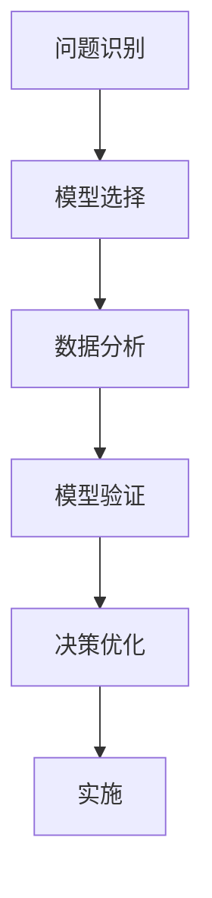
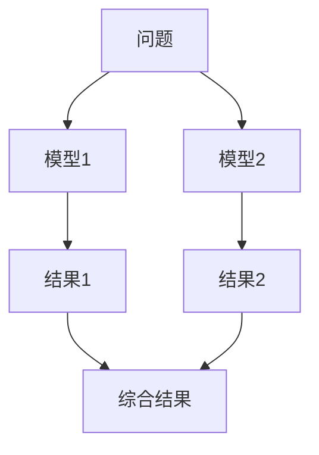
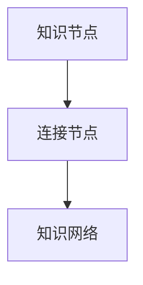
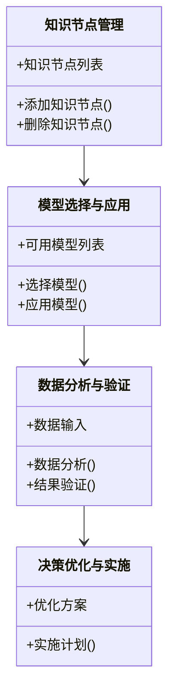
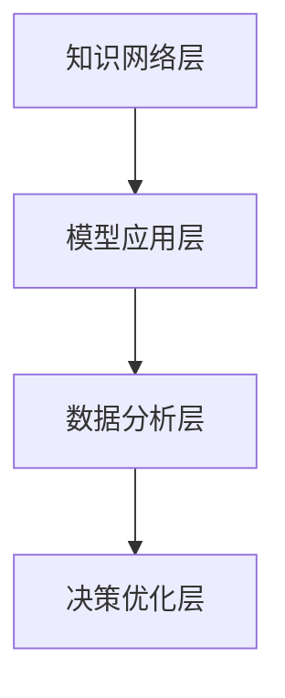

                 


# 查理芒格的多元思维模型

> 关键词：多元思维模型，查理芒格，认知框架，系统思维，知识网络，决策优化

> 摘要：查理芒格的多元思维模型是一种通过整合多个学科的思维方式来优化决策和理解问题的方法。本文从背景、核心概念、算法原理、数学模型、系统架构、项目实战和最佳实践等多个方面详细探讨了多元思维模型的结构、原理和应用，结合实例分析和图表展示，帮助读者系统理解和应用这一模型。

---

## 第一部分: 查理芒格多元思维模型的背景与核心概念

### 第1章: 多元思维模型的起源与背景

#### 1.1 多元思维模型的定义
##### 1.1.1 多元思维模型的核心概念
多元思维模型（Multi-Model Thinking）是由查理·芒格提出的一种思维方式，强调通过广泛学习多个学科的核心原理，构建一个知识框架，从而在决策时能够从多个角度分析问题。

##### 1.1.2 多元思维模型与其他思维方法的对比
| 思维方法      | 定义 | 优势 | 局限性 |
|---------------|------|------|--------|
| 单一学科思维   | 仅依赖某一学科的知识 | 深度分析 | 缺乏广度 |
| 多元思维模型   | 综合多个学科的核心原理 | 全面性、系统性 | 需要广泛学习 |
| 批判性思维     | 分析和评估信息的真伪 | 理性判断 | 可能缺乏整体视角 |

##### 1.1.3 多元思维模型的起源与发展
多元思维模型起源于查理·芒格的实践哲学，他认为人类的认知是通过多个“心智模型”来理解世界的，只有通过广泛涉猎多个学科，才能避免单一视角的局限性。

#### 1.2 多元思维模型的核心思想
##### 1.2.1 知识的广泛性与交叉性
知识的广泛性指的是覆盖多个学科的核心原理，交叉性则是指这些原理之间的相互作用。

##### 1.2.2 多学科视角的重要性
通过不同学科的视角分析问题，可以发现单一视角难以察觉的细节。

##### 1.2.3 复杂问题的简化与分解
将复杂问题分解为多个简单问题，分别用不同学科的模型进行分析。

#### 1.3 多元思维模型的应用价值
##### 1.3.1 在个人决策中的作用
帮助个人在生活和职业中做出更明智的决策。

##### 1.3.2 在商业与投资中的应用
通过综合分析市场、经济、心理学等多个因素，做出更稳健的投资决策。

##### 1.3.3 在日常生活中的实践
帮助我们更好地理解和解决日常生活中的问题。

---

### 第2章: 多元思维模型的核心概念与联系

#### 2.1 多元思维模型的核心概念
##### 2.1.1 多学科视角
通过学习心理学、经济学、物理学等学科的核心原理，构建一个跨学科的知识框架。

##### 2.1.2 系统思维
将问题视为一个整体系统，分析其组成部分及其相互关系。

##### 2.1.3 知识网络
通过构建知识网络，将不同学科的核心原理连接起来，形成一个有机的整体。

#### 2.2 多元思维模型的联系
##### 2.2.1 多学科视角与系统思维的联系
多学科视角提供了分析问题的不同工具，系统思维则将这些工具整合起来，形成一个完整的分析框架。

##### 2.2.2 知识网络的构建
通过不断学习和应用，将不同学科的知识连接起来，形成一个动态的知识网络。

---

## 第二部分: 多元思维模型的算法原理

### 第3章: 多元思维模型的算法原理

#### 3.1 多元思维模型的决策框架
##### 3.1.1 决策框架的核心步骤
1. 问题识别与分解
2. 多学科模型的选择与应用
3. 数据分析与模型验证
4. 决策优化与实施

##### 3.1.2 决策框架的流程图


#### 3.2 多元思维模型的优化算法
##### 3.2.1 基于多学科模型的优化算法


##### 3.2.2 基于知识网络的优化算法


---

### 第4章: 多元思维模型的数学模型

#### 4.1 多元思维模型的数学表达
##### 4.1.1 基于多学科模型的加权平均
$$
\text{综合评分} = \sum_{i=1}^{n} w_i \cdot s_i
$$
其中，$w_i$ 是第 $i$ 个模型的权重，$s_i$ 是评分。

##### 4.1.2 基于知识网络的矩阵表示
使用矩阵表示知识网络的连接关系：
$$
M = [m_{ij}]
$$
其中，$m_{ij}$ 表示第 $i$ 个知识节点与第 $j$ 个知识节点的连接强度。

---

## 第三部分: 多元思维模型的系统分析与架构设计

### 第5章: 多元思维模型的系统分析

#### 5.1 系统功能设计
##### 5.1.1 系统功能模块
1. 知识节点管理
2. 模型选择与应用
3. 数据分析与验证
4. 决策优化与实施

##### 5.1.2 系统功能的类图


#### 5.2 系统架构设计
##### 5.2.1 系统架构的组成
1. 知识网络层
2. 模型应用层
3. 数据分析层
4. 决策优化层

##### 5.2.2 系统架构的流程图


---

## 第四部分: 多元思维模型的项目实战

### 第6章: 多元思维模型的项目实战

#### 6.1 项目背景
##### 6.1.1 项目目标
通过多元思维模型优化一个投资决策过程。

##### 6.1.2 项目环境
- 数据来源：市场数据、财务报表、行业报告
- 工具：数据分析工具、编程语言

#### 6.2 核心实现
##### 6.2.1 环境配置
```bash
pip install pandas numpy matplotlib
```

##### 6.2.2 核心代码实现
```python
import pandas as pd
import numpy as np

# 数据加载
data = pd.read_csv('market_data.csv')

# 多学科模型应用
def apply_models(data):
    # 经济模型分析
    economic_factor = data['economic_index']
    # 心理学模型分析
    psychological_factor = data['psychological_index']
    # 综合评分
    score = economic_factor * 0.6 + psychological_factor * 0.4
    return score

# 数据分析与结果验证
result = apply_models(data)
print(result.describe())
```

##### 6.2.3 代码应用解读
- 数据加载：从CSV文件加载市场数据。
- 多学科模型应用：结合经济和心理学指标进行评分。
- 数据分析与结果验证：计算综合评分的描述统计。

#### 6.3 实际案例分析
##### 6.3.1 案例分析
通过分析某公司的市场数据，应用多元思维模型进行投资决策。

##### 6.3.2 案例总结
总结分析结果，提出优化建议。

---

## 第五部分: 多元思维模型的最佳实践

### 第7章: 多元思维模型的最佳实践

#### 7.1 应用技巧
##### 7.1.1 持续学习
定期学习新知识，保持知识网络的更新。

##### 7.1.2 避免认知偏差
通过多学科视角减少认知偏差的影响。

#### 7.2 小结
多元思维模型是一种通过广泛学习和系统分析来优化决策的思维方式，具有广泛的应用价值。

#### 7.3 注意事项
- 避免知识碎片化，注重知识的系统性。
- 在实际应用中，根据具体问题选择合适的模型。

#### 7.4 拓展阅读
推荐阅读查理·芒格的著作，深入理解多元思维模型的哲学基础。

---

### 总结
查理·芒格的多元思维模型是一种通过整合多个学科的核心原理来优化决策的思维方式。本文从背景、核心概念、算法原理、数学模型、系统架构、项目实战和最佳实践等多个方面进行了详细探讨，结合实例分析和图表展示，帮助读者系统理解和应用这一模型。通过不断学习和实践，我们可以更好地掌握多元思维模型的精髓，提升决策能力和问题解决能力。

