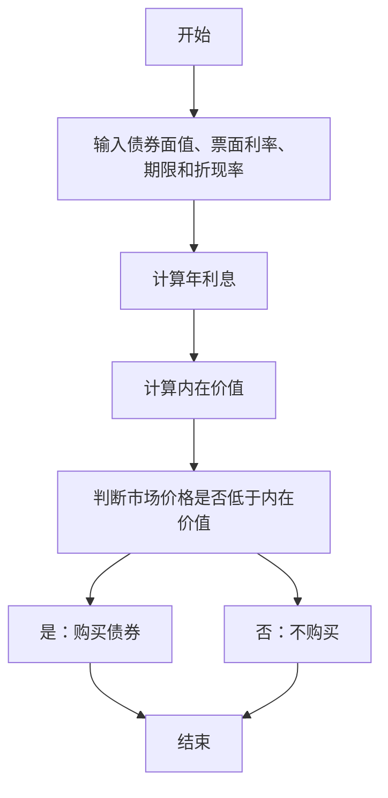
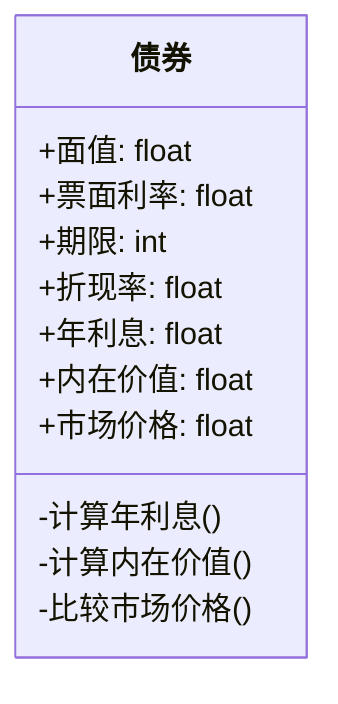

                 


# 格雷厄姆·多德的固定收益证券分析方法

> 关键词：固定收益证券，价值投资，格雷厄姆·多德，安全边际，债券分析，投资策略

> 摘要：本文深入探讨了格雷厄姆·多德的固定收益证券分析方法，从理论基础到实践应用，详细阐述了其核心概念、算法原理、系统设计及项目实战。通过本文，读者将全面理解如何运用格雷厄姆·多德的方法进行固定收益证券的分析与投资。

---

## 第1章: 固定收益证券的背景与基本概念

### 1.1 固定收益证券的定义与特点

固定收益证券是指那些具有固定面值、固定利率和固定偿还期限的金融工具。其核心特点包括：

1. **固定性**：投资者在购买固定收益证券时，能够明确预期到未来现金流的大小和时间。
2. **安全性**：相比股票等权益类资产，固定收益证券的风险较低，适合保守型投资者。
3. **流动性**：大多数固定收益证券具有较高的流动性，可以在市场上方便地买卖。

### 1.2 格雷厄姆·多德分析方法的背景

格雷厄姆和多德是价值投资的鼻祖，他们的分析方法以基本面分析为核心，强调安全边际和内在价值的计算。这种方法在固定收益证券分析中具有重要地位，尤其是在评估债券的内在价值和风险方面。

### 1.3 分析框架的构建

格雷厄姆·多德的分析框架包括以下几个核心要素：

1. **债券的面值与期限**：债券的面值是其本金，期限决定了债券的存续时间。
2. **债券的票面利率**：票面利率是债券每年支付的利息与面值的比率。
3. **债券的市场价格**：市场价格是债券在二级市场的交易价格，受市场供求关系影响。
4. **债券的内在价值**：内在价值是基于债券的现金流折现计算得出的理论价值。

---

## 第2章: 格雷厄姆·多德分析方法的核心原理

### 2.1 核心概念与原理

格雷厄姆·多德的分析方法强调以下几个核心概念：

1. **价值投资**：以低于内在价值的价格购买优质资产，长期持有，等待价值的实现。
2. **安全边际**：在购买债券时，确保市场价格远低于内在价值，以降低风险。
3. **市场波动**：市场的短期波动往往被过度情绪化，投资者应以理性和耐心应对。

### 2.2 核心概念的属性特征对比

通过对比分析，我们可以更清晰地理解格雷厄姆·多德分析方法的核心概念。以下是一个对比表格：

| **概念**       | **属性特征**                                                                 |
|----------------|-----------------------------------------------------------------------------|
| 内在价值       | 基于现金流折现计算得出的理论价值，反映债券的真实价值。                  |
| 市场价格       | 受市场供求关系影响，可能高于或低于内在价值。                          |
| 安全边际       | 市场价格与内在价值之间的差额，确保在市场价格下跌时仍能获得正收益。     |

---

## 第3章: 格雷厄姆·多德分析方法的算法原理

### 3.1 算法原理的数学模型

格雷厄姆·多德的分析方法基于以下数学模型：

$$
\text{内在价值} = \frac{\text{年利息}}{\text{折现率}}
$$

其中，年利息是债券的票面利率乘以面值，折现率是市场要求的收益率。

### 3.2 算法流程图

以下是一个简单的算法流程图：



---

## 第4章: 系统分析与架构设计方案

### 4.1 系统分析

#### 4.1.1 问题场景介绍

假设我们有一个固定收益证券分析系统，需要分析债券的内在价值和市场价格，并给出投资建议。

#### 4.1.2 系统功能设计

系统功能包括：

1. 输入债券的基本信息（面值、票面利率、期限、折现率）。
2. 计算债券的年利息和内在价值。
3. 比较市场价格与内在价值，给出投资建议。

#### 4.1.3 领域模型的mermaid类图



---

## 第5章: 项目实战与案例分析

### 5.1 项目环境安装与配置

#### 5.1.1 环境搭建步骤

1. 安装Python和必要的开发工具。
2. 安装Pandas和NumPy库。

#### 5.1.2 工具安装与配置

安装步骤如下：

```bash
pip install pandas numpy
```

### 5.2 核心代码实现

#### 5.2.1 核心算法的Python代码

```python
import pandas as pd

def calculate_intrinsic_value(face_value, coupon_rate,期限, discount_rate):
    annual_interest = face_value * coupon_rate
    intrinsic_value = annual_interest / discount_rate
    return intrinsic_value

# 示例数据
face_value = 1000
coupon_rate = 0.05
期限 = 10
discount_rate = 0.04

intrinsic_value = calculate_intrinsic_value(face_value, coupon_rate, 期限, discount_rate)
print(f"债券的内在价值为：{intrinsic_value}")
```

---

## 第6章: 最佳实践与小结

### 6.1 最佳实践 tips

1. 在实际投资中，应结合市场环境和宏观经济因素进行综合判断。
2. 定期复盘和调整投资组合，以应对市场变化。
3. 保持对市场的理性和耐心，避免情绪化决策。

### 6.2 项目小结

通过本文的分析与实战，我们全面了解了格雷厄姆·多德的固定收益证券分析方法，从理论到实践，从算法到系统设计，再到项目实战，为读者提供了完整的解决方案。希望读者能够通过本文，掌握这一经典的投资方法，并在实际投资中取得优异的成果。

---

通过本文的系统介绍，读者可以深入理解格雷厄姆·多德的固定收益证券分析方法，并将其应用于实际投资中。

