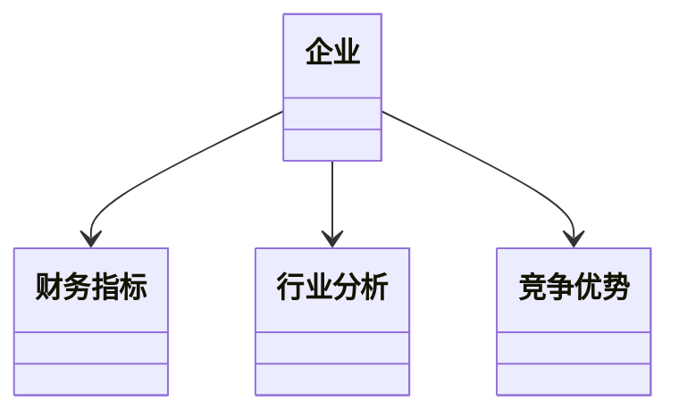

                 


# 格雷厄姆到巴菲特：价值投资理念的演变

## 关键词：价值投资，格雷厄姆，巴菲特，内在价值，安全边际，护城河，长期投资

## 摘要：  
价值投资是一种以基本面分析为基础，寻找被市场低估的优质企业进行长期投资的策略。从本杰明·格雷厄姆到沃伦·巴菲特，价值投资的理念经历了从防御性投资到进攻性投资的演变，但核心思想始终围绕着“安全边际”和“内在价值”。本文将详细分析格雷厄姆和巴菲特的价值投资理念，探讨两者之间的异同点，并结合现代投资实践，为读者提供系统化的价值投资框架。

---

# 第一部分：价值投资的起源与发展

## 第1章：价值投资的起源与核心理念

### 1.1 格雷厄姆的价值投资理念

#### 1.1.1 价值投资的起源与背景  
价值投资的起源可以追溯到20世纪初，本杰明·格雷厄姆和戴维·多德在纽约证券交易所工作期间，观察到市场的波动性极强，投资者往往被短期市场波动所迷惑，忽视了企业的内在价值。他们提出了一种基于基本面分析的投资方法，即通过分析企业的财务报表，寻找市场价格低于其内在价值的企业进行投资。

#### 1.1.2 格雷厄姆的投资策略  
格雷厄姆的价值投资策略以“防御性投资”为核心，强调通过购买具有安全边际的企业，降低投资风险。他的策略包括以下几点：  
- **安全边际**：购买价格低于企业内在价值的股票，确保即使市场价格波动，投资者也能获得超额收益。  
- **低市盈率和低市净率**：选择市盈率和市净率低于行业平均水平的企业，这些企业通常被市场低估。  
- **分散投资**：通过分散投资降低风险，避免将所有资金投入到单一企业中。  

#### 1.1.3 格雷厄姆的防御性投资原则  
格雷厄姆的防御性投资原则包括：  
1. **避免投机性投资**：只投资于具有明确财务数据和稳定历史表现的企业。  
2. **关注企业的内在价值**：通过分析企业的盈利能力、资产状况和行业地位，评估其内在价值。  
3. **安全边际的重要性**：即使市场出现短期波动，价格回归内在价值的长期趋势不变。  

---

### 1.2 多德与格雷厄姆的合作与发展  

#### 1.2.1 多德对价值投资的贡献  
戴维·多德与格雷厄姆共同提出了“价值圈”概念，认为市场波动会导致优质企业的价格偏离其内在价值，投资者可以通过长期持有这些企业股票获得超额收益。  

#### 1.2.2 格雷厄姆-多德价值圈的核心思想  
格雷厄姆-多德价值圈的核心思想包括：  
- **价格回归定律**：市场价格最终会回归企业的内在价值。  
- **安全边际的数学模型**：通过计算企业的内在价值与市场价格的差值，确定投资的安全边际。  

#### 1.2.3 多德与格雷厄姆的学术影响  
格雷厄姆和多德的理论奠定了现代价值投资的基础，他们的著作《证券分析》成为投资领域的经典之作，影响了后来的投资者，包括沃伦·巴菲特。  

---

## 第2章：巴菲特的成长与价值投资的演变  

### 2.1 巴菲特早期的投资理念  

#### 2.1.1 巴菲特对格雷厄姆理念的继承  
巴菲特在早期的投资生涯中，深受格雷厄姆的影响，他将格雷厄姆的安全边际理论应用到实践中，通过寻找具有安全边际的企业进行投资。  

#### 2.1.2 巴菲特早期投资案例分析  
巴菲特早期的典型投资案例包括购买纺织公司和保险公司，这些企业的共同点是价格低于内在价值，且具有稳定的盈利能力。  

#### 2.1.3 巴菲特的导师与学习经历  
巴菲特在哥伦比亚大学师从格雷厄姆，学习了防御性投资策略，并在职业生涯中不断学习和进化，形成了自己独特的投资理念。  

---

### 2.2 巴菲特对价值投资的创新与发展  

#### 2.2.1 巴菲特的“安全边际”理念  
巴菲特将安全边际的概念进一步发展，认为安全边际不仅是价格低于内在价值，还包括企业的竞争优势和长期盈利能力。  

#### 2.2.2 巴菲特的“护城河”概念  
巴菲特提出“护城河”理论，认为具有竞争优势的企业能够长期保持高盈利能力，这些企业值得长期投资。  

#### 2.2.3 巴菲特的长期投资策略  
巴菲特的投资策略以长期持有优质企业股票为核心，他强调企业竞争优势、管理团队和长期盈利能力，而不是短期市场波动。  

---

## 第3章：价值投资的核心概念与分析框架  

### 3.1 价值投资的核心概念  

#### 3.1.1 内在价值的定义与计算  
内在价值是企业未来现金流的现值，计算公式为：  
$$ V = \sum_{t=1}^{n} \frac{CF_t}{(1+r)^t} $$  
其中，$CF_t$ 是第 $t$ 年的现金流，$r$ 是折现率。  

#### 3.1.2 市场价值与内在价值的关系  
市场价值围绕内在价值波动，投资者的目标是找到市场价格低于内在价值的企业。  

#### 3.1.3 安全边际的数学模型  
安全边际可以通过以下公式计算：  
$$ \text{安全边际} = \text{内在价值} - \text{市场价格} $$  

---

### 3.2 价值投资的分析框架  

#### 3.2.1 财务报表分析的关键指标  
关键财务指标包括：  
1. 净利润  
2. 每股收益（EPS）  
3. 市盈率（P/E）  
4. 市净率（P/B）  

#### 3.2.2 行业分析与竞争优势评估  
行业分析包括：  
- 行业生命周期  
- 市场结构  
- 竞争格局  

竞争优势评估包括：  
- 技术壁垒  
- 品牌优势  
- 成本优势  

#### 3.2.3 企业生命周期与投资阶段  
企业生命周期分为：  
1. 初创期  
2. 成长期  
3. 成熟期  
4. 衰退期  

---

## 第4章：价值投资的策略与实践  

### 4.1 格雷厄姆与巴菲特的投资策略对比  

#### 4.1.1 格雷厄姆的防御性投资策略  
格雷厄姆的投资策略以安全边际为核心，注重防御性和低风险投资。  

#### 4.1.2 巴菲特的进攻性投资策略  
巴菲特的投资策略以寻找具有竞争优势的企业为核心，注重长期成长和价值提升。  

#### 4.1.3 两者的异同点分析  
| 核心理念       | 格雷厄姆                     | 巴菲特                     |  
|----------------|-----------------------------|-----------------------------|  
| 投资目标       | 价格低于内在价值           | 具有竞争优势的企业         |  
| 投资策略       | 防御性投资，注重安全边际     | 进攻性投资，注重长期成长   |  
| 投资期限       | 短期至中期                   | 长期                       |  

---

### 4.2 价值投资的实战技巧  

#### 4.2.1 筛选优质企业的标准  
1. 企业具有竞争优势（护城河）。  
2. 企业财务健康，盈利能力稳定。  
3. 企业市场价格低于内在价值。  

#### 4.2.2 财务指标的量化分析方法  
1. 净利润增长率：$$ \text{净利润增长率} = \frac{\text{今年净利润} - \text{去年净利润}}{\text{去年净利润}} $$  
2. 净资产收益率（ROE）：$$ \text{ROE} = \frac{\text{净利润}}{\text{净资产}} $$  

#### 4.2.3 风险控制与仓位管理  
1. 分散投资：避免将所有资金投入到单一企业。  
2. 风险控制：设定止损点，防止亏损扩大。  

---

## 第5章：价值投资的数学模型与公式  

### 5.1 内在价值的计算模型  

#### 5.1.1 现金流折现模型（DCF）  
现金流折现模型是计算企业内在价值的核心工具，公式为：  
$$ V = \sum_{t=1}^{n} \frac{CF_t}{(1+r)^t} $$  

#### 5.1.2 市盈率与市净率分析  
市盈率（P/E）：$$ \text{P/E} = \frac{\text{股价}}{\text{每股收益}} $$  
市净率（P/B）：$$ \text{P/B} = \frac{\text{股价}}{\text{每股净资产}} $$  

---

## 第6章：系统分析与架构设计方案  

### 6.1 问题场景介绍  
假设我们想要通过价值投资策略，选择一家具有竞争优势的企业进行长期投资。  

### 6.2 系统功能设计  

#### 6.2.1 领域模型（mermaid类图）  


#### 6.2.2 系统架构设计（mermaid架构图）  
```mermaid
container 投资决策系统
    participant 投资者
    participant 企业数据
    participant 投资策略
    investor -> 投资策略: 输入投资目标
    投资策略 -> 企业数据: 分析企业数据
    投资策略 -> 投资者: 输出投资建议
```

---

## 第7章：项目实战  

### 7.1 环境安装  
1. 安装Python和相关库（Pandas、NumPy、Matplotlib）。  

### 7.2 核心实现源代码  
```python
import pandas as pd
import numpy as np

def calculate_intrinsic_value(enterprise_value, cash_flow, discount_rate):
    return sum(cash_flow / (1 + discount_rate) ** t for t in range(len(cash_flow)))

enterprise_data = pd.read_csv('enterprise.csv')
enterprise_value = calculate_intrinsic_value(enterprise_data['enterprise_value'], enterprise_data['cash_flow'], 0.1)
print(f"企业内在价值：{enterprise_value}")
```

### 7.3 实际案例分析  
以某企业为例，分析其财务指标、行业地位和竞争优势，计算其内在价值，制定投资策略。  

---

## 第8章：最佳实践与总结  

### 8.1 最佳实践 tips  
1. 长期投资，避免短期波动。  
2. 选择具有竞争优势的企业。  
3. 定期评估投资组合，调整持仓。  

### 8.2 小结  
从格雷厄姆到巴菲特，价值投资的理念经历了从防御性投资到进攻性投资的演变，但核心思想始终围绕着“安全边际”和“内在价值”。  

### 8.3 注意事项  
1. 避免过度分散投资，集中投资优质企业。  
2. 定期复盘投资组合，及时调整策略。  

### 8.4 拓展阅读  
- 《证券分析》——本杰明·格雷厄姆  
- 《巴菲特致股东的信》——沃伦·巴菲特  

---

# 结语  
价值投资是一种长期有效的投资策略，从格雷厄姆到巴菲特，这一理念不断完善和发展。通过系统的分析和实践，投资者可以更好地理解和应用价值投资的理念，实现长期稳健的投资回报。

