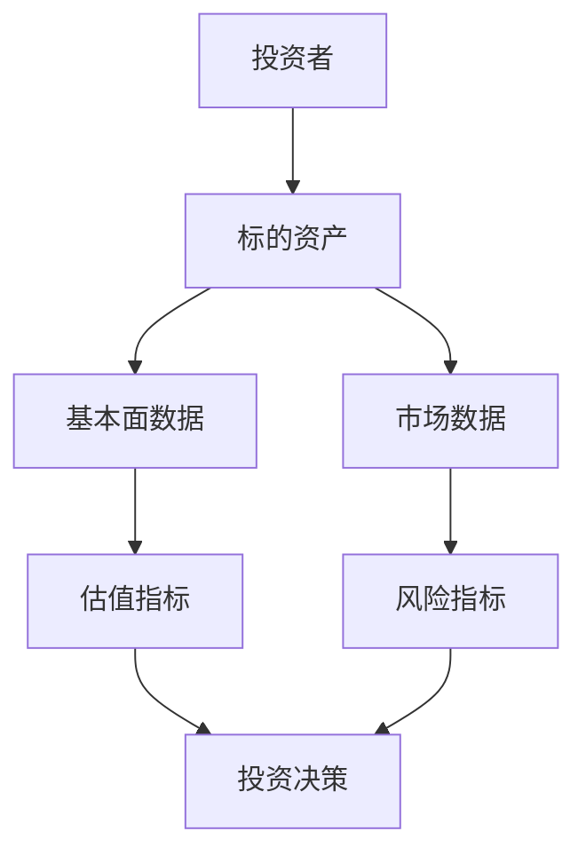
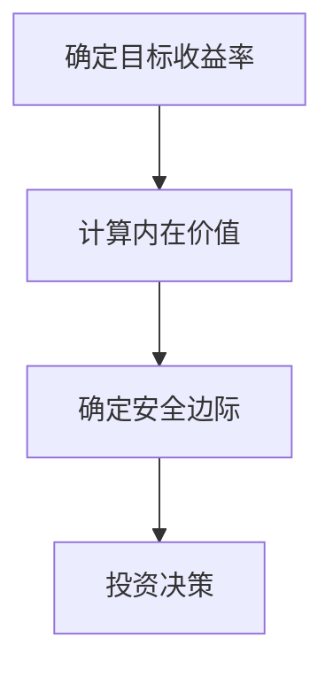
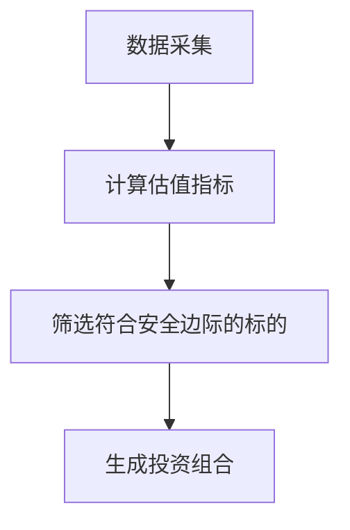
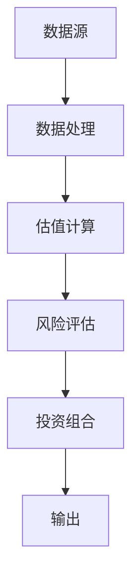

                 


# 格雷厄姆多德的安全性分析在现代市场的应用

> 关键词：格雷厄姆多德，安全性分析，价值投资，现代市场，风险管理

> 摘要：本文深入探讨格雷厄姆和多德提出的安全性分析理论在现代市场中的应用。通过对安全性分析的核心概念、算法原理、系统架构及实际案例的分析，展示如何将这一经典投资方法与现代投资环境相结合，实现稳健的投资收益。

---

## 第一部分: 格雷厄姆多德的安全性分析基础

### 第1章: 安全性分析的起源与发展

#### 1.1 格雷厄姆与多德的投资理念

##### 1.1.1 格雷厄姆与多德的生平简介
本杰明·格雷厄姆（Benjamin Graham）和戴维·多德（David Dodd）是价值投资理论的奠基人。格雷厄姆被誉为“价值投资之父”，他在20世纪初提出了基本面分析和安全边际的概念。多德是格雷厄姆的学生，两人共同撰写了许多经典的投资著作，如《证券分析》（1934年）。

##### 1.1.2 安全性分析的核心思想
格雷厄姆和多德的安全性分析的核心思想是：投资的本质是购买企业的一部分，而非仅仅买卖股票。他们强调通过基本面分析，找到那些市场价格低于其内在价值的证券，从而实现长期稳健的投资回报。这种投资方法被称为“安全边际”投资法。

##### 1.1.3 格雷厄姆多德学派的形成与发展
格雷厄姆和多德的安全性分析理论为后来的价值投资奠定了基础。他们的思想影响了众多投资者，包括沃伦·巴菲特、彼得·林奇等投资大师。尽管时代变化，但格雷厄姆多德的理论仍然在现代投资实践中发挥着重要作用。

#### 1.2 安全性分析的核心概念

##### 1.2.1 安全边际的定义与计算
安全边际是格雷厄姆提出的一个重要概念，指的是市场价格与内在价值之间的差距。通过计算安全边际，投资者可以识别出那些价格被市场低估的证券。

公式：
$$ 安全边际 = 内在价值 - 市场价格 $$

##### 1.2.2 市场先生的概念与作用
格雷厄姆提出了“市场先生”的概念，认为市场的波动性是由市场先生的情绪化行为引起的。投资者的任务是利用市场先生的错误，以合理的价格买入优质的证券。

##### 1.2.3 价值投资与成长投资的区别
价值投资强调以低于内在价值的价格买入优质的公司，而成长投资则关注于选择那些具有高成长潜力的公司。格雷厄姆多德的安全性分析更偏向于价值投资，但并非完全排斥成长投资。

#### 1.3 安全性分析在现代市场中的应用
##### 1.3.1 现代市场环境的变化
现代市场环境的变化包括金融工具的多样化、信息透明度的提高、技术的进步等，这些变化为安全性分析提供了新的应用场景。

##### 1.3.2 安全性分析的适用性与局限性
安全性分析在现代市场中仍然具有很强的适用性，尤其是在寻找低估的证券时。然而，其局限性在于无法完全预测市场的短期波动，且对宏观经济环境的变化较为敏感。

##### 1.3.3 安全性分析的现代拓展
现代投资者将格雷厄姆多德的安全性分析与量化分析相结合，开发出新的投资策略。例如，利用大数据和人工智能技术，对大量证券进行筛选和评估，以找到具有安全边际的优质标的。

---

### 第2章: 安全性分析的核心概念与联系

#### 2.1 基本面分析与量化分析的对比

##### 2.1.1 基本面分析的核心要素
基本面分析主要关注公司的财务状况、行业地位、盈利能力等。核心要素包括：
- 财务报表分析（收入、利润、负债等）
- 行业分析
- 管理团队分析

##### 2.1.2 量化分析的指标体系
量化分析主要依赖数学模型和统计指标，核心指标包括：
- 市盈率（P/E）
- 市净率（P/B）
- 股息率
- 贝塔系数

##### 2.1.3 两种方法的优劣势对比

| 对比维度 | 基本面分析 | 量化分析 |
|----------|------------|----------|
| 优点     | 更加注重企业内在价值 | 计算简便，适合大规模筛选 |
| 缺点     | 时间消耗大，需要专业知识 | 可能忽略企业基本面的特殊情况 |

#### 2.2 核心概念的属性特征对比

| 指标名称 | 定义 | 用途 | 优点 | 缺点 |
|----------|------|------|------|------|
| 市盈率    | 股价/每股收益 | 评估股票估值 | 计算简单 | 受盈利率波动影响较大 |
| 市净率    | 股价/每股净资产 | 评估资产价值 | 适用于净资产稳定的公司 | 受资产质量影响较大 |

#### 2.3 实体关系图：安全性分析的核心架构



---

### 第3章: 安全性分析的算法原理

#### 3.1 市盈率与市净率的计算

##### 3.1.1 市盈率的计算公式
$$ 市盈率 = \frac{股价}{每股收益} $$

##### 3.1.2 市净率的计算公式
$$ 市净率 = \frac{股价}{每股净资产} $$

#### 3.2 安全边际的计算流程



#### 3.3 基于安全性分析的量化筛选算法



---

### 第4章: 安全性分析的系统架构设计

#### 4.1 系统功能设计

##### 4.1.1 数据采集模块
- 从股票市场获取实时数据
- 包括股价、财务报表等

##### 4.1.2 估值指标计算模块
- 计算市盈率、市净率等指标
- 确定内在价值和安全边际

##### 4.1.3 风险评估模块
- 评估市场风险
- 计算波动率

##### 4.1.4 投资组合模块
- 生成投资组合
- 调整权重

#### 4.2 系统架构设计



---

## 第二部分: 现代市场的安全性分析应用

### 第5章: 量化分析与风险管理

#### 5.1 量化分析的核心算法

##### 5.1.1 市盈率筛选算法
```python
def calculate_pe(stock_price, earnings_per_share):
    return stock_price / earnings_per_share
```

##### 5.1.2 市净率筛选算法
```python
def calculate_pb(stock_price, book_value_per_share):
    return stock_price / book_value_per_share
```

#### 5.2 风险管理策略

##### 5.2.1 多因子模型
$$ 多因子模型 = \alpha + \beta_1 \times F_1 + \beta_2 \times F_2 + \cdots + \beta_n \times F_n $$

##### 5.2.2 风险调整后的价值评估
$$ 调整后内在价值 = 内在价值 \times (1 - 风险溢价) $$

---

### 第6章: 项目实战与案例分析

#### 6.1 项目实战: 基于安全性分析的股票筛选

##### 6.1.1 环境安装
- 安装Python
- 安装数据采集库（如pandas、numpy）

##### 6.1.2 核心实现代码
```python
import pandas as pd
import numpy as np

def calculate_pe(df):
    df['PE'] = df['股价'] / df['每股收益']
    return df

def calculate_pb(df):
    df['PB'] = df['股价'] / df['每股净资产']
    return df

# 数据加载
data = pd.read_csv('stock_data.csv')

# 计算PE和PB
data = calculate_pe(data)
data = calculate_pb(data)

# 筛选符合安全边际的标的
safe_stocks = data[(data['PE'] < 15) & (data['PB'] < 2)]
```

##### 6.1.3 案例分析: 苹果公司的安全性分析
以苹果公司为例，假设其股价为 $150，每股收益为 $10，每股净资产为 $50。

- 市盈率：$150 / $10 = 15
- 市净率：$150 / $50 = 3
- 内在价值：假设目标收益率为10%，内在价值为 $16.67（基于市盈率）

结论：苹果公司当前股价略高于内在价值，但市净率较高，需进一步分析。

---

### 第7章: 最佳实践与小结

#### 7.1 投资策略建议
- 结合量化分析和基本面分析
- 定期调整投资组合
- 保持长期投资心态

#### 7.2 风险管理注意事项
- 设置止损点
- 分散投资
- 定期评估市场风险

#### 7.3 拓展阅读
- 《证券分析》（格雷厄姆与多德）
- 《巴菲特的 investing：普林斯顿大学讲座》

---

通过本文的分析，我们可以看到格雷厄姆多德的安全性分析在现代市场中的应用仍然具有重要的意义。尽管市场环境发生了变化，但其核心思想依然适用于今天的投资者。通过结合量化分析和风险管理，投资者可以更好地利用安全性分析，实现稳健的投资收益。

