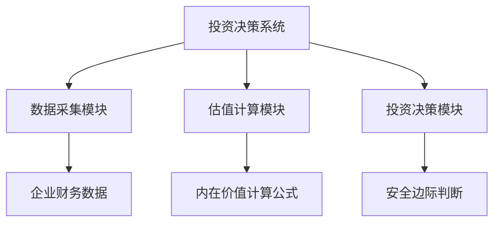

                 

# 格雷厄姆对投机与投资的区分

## 关键词：格雷厄姆，投资，投机，价值投资，内在价值，安全边际

## 摘要：本文将深入探讨格雷厄姆对投机与投资的区分，分析其投资策略的核心概念、数学模型、系统架构及实际案例，帮助读者理解如何在投资中应用格雷厄姆的理论。

---

## 第1章：格雷厄姆的生平与投资哲学

### 1.1 格雷厄姆的生平简介

本杰明·格雷厄姆（Benjamin Graham）是20世纪最伟大的投资思想家之一，被誉为“价值投资之父”。他出生于1894年，早年在哥伦比亚大学学习法律，后来转向金融领域。他在1926年与戴维·多德（David Dodd）共同出版了《证券分析》一书，奠定了价值投资的基础。格雷厄姆的投资理念影响了包括沃伦·巴菲特在内的无数投资者。

### 1.2 投资与投机的核心概念

#### 投资的定义
投资是指购买资产以期获得未来收益的行为，其核心在于对资产内在价值的分析。格雷厄姆强调，投资应该基于对企业内在价值的理解，而不是市场的短期波动。

#### 投机的定义
投机是指在不确定资产内在价值的情况下，通过预测市场波动来获利的行为。投机者更关注市场的短期走势，而非企业的基本面。

#### 二者的区别
| 特征 | 投资 | 投机 |
|------|------|------|
| 目标 | 资产的内在价值 | 市场波动 |
| 时间框架 | 长期 | 短期 |
| 风险 | 较低 | 较高 |

---

## 第2章：格雷厄姆的投资策略与数学模型

### 2.1 内在价值计算公式

格雷厄姆认为，投资应基于对企业内在价值的评估。内在价值的计算公式为：

$$
V = \frac{C}{r - g}
$$

其中：
- \( C \) 是企业的年现金流
- \( r \) 是折现率
- \( g \) 是现金流增长率

### 2.2 安全边际的概念

为了降低投资风险，格雷厄姆提出了“安全边际”概念，即以低于内在价值的价格购买资产：

$$
\text{安全边际} = P < V
$$

其中：
- \( P \) 是资产的市场价格
- \( V \) 是资产的内在价值

---

## 第3章：系统架构设计

### 3.1 系统功能模块

- 数据采集模块：收集企业财务数据
- 估值计算模块：计算资产的内在价值
- 投资决策模块：基于安全边际判断投资机会

### 3.2 系统架构图

---

## 第4章：实际案例分析

### 4.1 案例背景

假设我们评估一家企业的内在价值：

- 年现金流 \( C = \$100 \)
- 折现率 \( r = 10\% \)
- 增长率 \( g = 5\% \)

计算内在价值：

$$
V = \frac{100}{0.10 - 0.05} = \$2000
$$

如果市场价格 \( P = \$1500 \)，则存在安全边际：

$$
\text{安全边际} = 1500 < 2000
$$

此时，可以考虑买入该资产。

---

## 第5章：投资与投机的实践指南

### 5.1 投资策略建议

1. **长期投资**：避免频繁交易，降低交易成本。
2. **分散投资**：通过投资不同资产降低风险。
3. **定期评估**：定期检查投资组合，确保符合安全边际原则。

### 5.2 小结

格雷厄姆的投资理念强调内在价值和安全边际，帮助投资者避免投机行为，实现长期稳健收益。

---

## 第6章：注意事项与拓展阅读

### 6.1 注意事项

- 避免过度依赖市场情绪，坚持基本面分析。
- 保持对市场的敬畏，及时调整投资策略。

### 6.2 拓展阅读

- 《证券分析》（Benjamin Graham & David Dodd）
- 《聪明的投资者》（Benjamin Graham）

---

通过以上分析，格雷厄姆的价值投资理论为投资者提供了清晰的指导，帮助我们在投资与投机之间找到平衡，实现长期稳健的投资回报。

