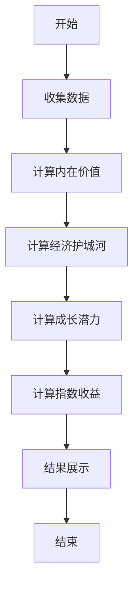

                 


# 格雷厄姆、巴菲特、费雪和伯格的投资理念比较

## 关键词：格雷厄姆、巴菲特、费雪、伯格、投资理念、价值投资、成长股、指数投资、内在价值

## 摘要：本文详细比较了四位著名投资大师——格雷厄姆、巴菲特、费雪和伯格的投资理念。通过对他们的背景、核心理论、数学模型和实际应用的分析，揭示了各自的投资策略的异同点，并探讨了这些理念对现代投资实践的影响。

---

## 第一部分: 投资理念比较的背景与基础

### 第1章: 格雷厄姆、巴菲特、费雪和伯格的背景介绍

#### 1.1 格雷厄姆的投资理念
- **1.1.1 格雷厄姆的生平简介**  
  本杰明·格雷厄姆（Benjamin Graham）是20世纪最伟大的投资思想家之一，被誉为“价值投资之父”。他于1894年出生于纽约，曾在哥伦比亚大学任教，并撰写了许多经典的投资著作，如《证券分析》。

- **1.1.2 格雷厄姆的价值投资理论**  
  格雷厄姆提出了“安全边际”概念，主张以低于内在价值的价格买入股票。他认为市场是波动的，投资者应关注企业的基本面，而非市场情绪。

- **1.1.3 格雷厄姆的投资策略**  
  格雷厄姆强调分散投资和风险控制，提倡买入那些被市场低估的股票，并长期持有。

#### 1.2 巴菲特的投资理念
- **1.2.1 巴菲特的生平简介**  
  沃伦·巴菲特（Warren Buffett）是格雷厄姆的学生，也是全球最成功的投资者之一。他继承并发展了格雷厄姆的价值投资理念，创立了伯克希尔·哈撒韦公司。

- **1.2.2 巴菲特的导师与学习经历**  
  巴菲特在哥伦比亚大学师从格雷厄姆，学习了价值投资的精髓，并在实践中不断完善。

- **1.2.3 巴菲特的价值投资实践**  
  巴菲特强调投资于具有强大竞争优势的企业，注重企业的经济护城河，并长期持有优质资产。

#### 1.3 费雪的投资理念
- **1.3.1 费雪的生平简介**  
  彼得·费雪（Peter Fish）是另一位价值投资的倡导者，专注于成长股投资。他提出了“成长股”的概念，认为应投资于具有持续增长潜力的公司。

- **1.3.2 费雪的成长股投资理论**  
  费雪认为，投资者应选择那些营业收入和净利润持续增长的企业，并长期持有。

- **1.3.3 费雪的投资策略与选股标准**  
  费雪强调关注企业的成长性和市场领导地位，而非短期市场波动。

#### 1.4 伯格的投资理念
- **1.4.1 伯格的生平简介**  
  弗雷德·伯格（Fred Bogle）是指数投资的倡导者，创立了 Vanguard 集团，推广低成本指数基金。

- **1.4.2 伯格的指数投资理论**  
  伯格认为，长期来看，指数基金能够提供稳定的收益，且费用低廉。

- **1.4.3 伯格的投资哲学与实践**  
  伯格强调分散投资和低成本，认为普通投资者应通过指数基金实现长期收益。

### 第2章: 四位投资大师的核心理念对比

#### 2.1 格雷厄姆与巴菲特的比较
- **2.1.1 价值投资的共同点**  
  两者都强调内在价值、安全边际和长期持有。

- **2.1.2 价值投资的差异点**  
  巴菲特更注重企业的竞争优势和护城河，而格雷厄姆更关注股票的市场价格波动。

#### 2.2 巴菲特与费雪的比较
- **2.2.1 投资理念的相似性**  
  两者都倡导价值投资，注重企业的基本面。

- **2.2.2 投资策略的差异性**  
  巴菲特更注重企业的经济护城河，而费雪更关注企业的成长潜力。

#### 2.3 费雪与伯格的比较
- **2.3.1 成长股与指数投资的对比**  
  费雪专注于成长股，伯格专注于指数基金。

- **2.3.2 投资哲学的异同**  
  费雪强调长期增长，伯格强调分散投资和低成本。

#### 2.4 四位投资大师的理念总结
- **2.4.1 核心理念的归纳**  
  四位大师的核心理念包括价值投资、成长股投资和指数投资。

- **2.4.2 理念的演变与影响**  
  这些理念对现代投资实践产生了深远影响，为投资者提供了多样化的选择。

### 第3章: 投资理念的数学模型与公式

#### 3.1 格雷厄姆的价值评估模型
- **3.1.1 内在价值公式**  
  内在价值 = 股东权益 + 长期债务 / 2

- **3.1.2 市盈率与市净率的计算**  
  市盈率 = 股价 / 每股收益  
  市净率 = 股价 / 每股净资产

- **3.1.3 投资组合的分散化策略**  
  分散化可以降低投资组合的整体风险。

#### 3.2 巴菲特的选股模型
- **3.2.1 股票的内在价值公式**  
  内在价值 = 股东权益 + 长期债务 / 2

- **3.2.2 经济护城河的评估**  
  经济护城河 = 市场份额 + 产品差异化

- **3.2.3 股东权益的计算**  
  股东权益 = 总资产 - 总负债

#### 3.3 费雪的成长股筛选模型
- **3.3.1 营业收入增长率公式**  
  营业收入增长率 = (本年营业收入 - 去年营业收入) / 去年营业收入

- **3.3.2 净利润增长率公式**  
  净利润增长率 = (本年净利润 - 去年净利润) / 去年净利润

- **3.3.3 市场领导地位的评估**  
  市场领导地位 = 市场份额 + 品牌影响力

#### 3.4 伯格的指数投资模型
- **3.4.1 指数基金的收益计算**  
  收益 = 指数涨幅 × 持股比例

- **3.4.2 投资组合的分散化公式**  
  分散化收益 = 总体收益 - (个别资产收益的平均值)

- **3.4.3 长期投资的复利计算**  
  复利收益 = (1 + 年收益率)^n - 1

### 第4章: 投资理念的系统架构与实现

#### 4.1 系统架构设计
- **4.1.1 投资理念分析系统的功能**  
  该系统包括数据收集、模型分析、结果展示等功能模块。

---

## 第二部分: 投资理念的实际应用与案例分析

### 第5章: 项目实战

#### 5.1 环境安装
- **5.1.1 安装Python和相关库**  
  安装Python 3.x，numpy，pandas，matplotlib。

#### 5.2 系统核心实现源代码
```python
import numpy as np
import pandas as pd

# 计算格雷厄姆的内在价值
def graham_intrinsic_value(book_value, long_term_debt):
    return book_value + long_term_debt / 2

# 计算巴菲特的经济护城河
def buffett_economic_moat(market_share, product_differentiation):
    return market_share + product_differentiation

# 计算费雪的成长股筛选标准
def fisher_growth_potential(revenue_growth, net_profit_growth):
    return revenue_growth + net_profit_growth

# 计算伯格的指数收益
def bogle_index_return(index_return):
    return index_return
```

#### 5.3 代码应用解读与分析
- **5.3.1 计算格雷厄姆的内在价值**  
  通过公式 `graham_intrinsic_value = book_value + long_term_debt / 2` 计算股票的内在价值。

- **5.3.2 计算巴菲特的经济护城河**  
  通过公式 `buffett_economic_moat = market_share + product_differentiation` 评估企业的竞争优势。

- **5.3.3 计算费雪的成长股筛选标准**  
  通过公式 `fisher_growth_potential = revenue_growth + net_profit_growth` 评估企业的成长潜力。

- **5.3.4 计算伯格的指数收益**  
  通过公式 `bogle_index_return = index_return` 计算指数基金的收益。

#### 5.4 实际案例分析
- **5.4.1 案例选择**  
  选择苹果公司（AAPL）进行分析。

- **5.4.2 数据收集**  
  收集苹果公司的财务数据，包括营收增长率、净利润增长率、市场占有率等。

- **5.4.3 数据分析与计算**  
  使用上述公式计算苹果公司的内在价值、经济护城河、成长潜力和指数收益。

#### 5.5 项目小结
- **5.5.1 项目总结**  
  通过实际案例分析，验证了四位大师的投资理念的可行性。

---

## 第三部分: 投资理念的最佳实践与小结

### 第6章: 最佳实践 tips

#### 6.1 投资策略的优化
- **6.1.1 价值投资**  
  投资者应关注企业的内在价值，选择被低估的股票。

#### 6.2 风险管理
- **6.2.1 分散投资**  
  通过分散投资降低风险。

#### 6.3 长期投资的重要性
- **6.3.1 复利效应**  
  长期投资能够实现财富的复利增长。

### 第7章: 小结

#### 7.1 问题回顾与解决
- **7.1.1 投资理念的比较**  
  本文通过比较四位大师的投资理念，揭示了价值投资、成长股投资和指数投资的异同点。

#### 7.2 未来展望
- **7.2.1 投资理念的演变**  
  随着市场的变化，投资理念将不断创新和演变。

---

## 第四部分: 投资理念的拓展阅读

### 第8章: 拓展阅读

#### 8.1 格雷厄姆的经典著作
- 《证券分析》

#### 8.2 巴菲特的推荐读物
- 《聪明的投资者》

#### 8.3 费雪的著作
- 《怎样选择成长股》

#### 8.4 伯格的推荐读物
- 《指数投资策略》

### 第9章: 注意事项

#### 9.1 风险提示
- 投资有风险，入市需谨慎。

#### 9.2 投资纪律
- 遵守投资纪律，避免情绪化投资。

---

## 第五部分: 投资理念的系统架构与实现

### 第10章: 系统架构设计

#### 10.1 系统功能设计
- **10.1.1 投资理念分析系统**  
  包括数据收集、模型分析、结果展示等功能模块。

---

## 第六部分: 投资理念的数学模型与公式

### 第11章: 算法原理讲解

#### 11.1 算法流程图


---

## 第七部分: 投资理念的实际应用与案例分析

### 第12章: 项目实战

#### 12.1 环境安装
- **12.1.1 安装Python和相关库**  
  安装Python 3.x，numpy，pandas，matplotlib。

#### 12.2 系统核心实现源代码
```python
import numpy as np
import pandas as pd

# 计算格雷厄姆的内在价值
def graham_intrinsic_value(book_value, long_term_debt):
    return book_value + long_term_debt / 2

# 计算巴菲特的经济护城河
def buffett_economic_moat(market_share, product_differentiation):
    return market_share + product_differentiation

# 计算费雪的成长股筛选标准
def fisher_growth_potential(revenue_growth, net_profit_growth):
    return revenue_growth + net_profit_growth

# 计算伯格的指数收益
def bogle_index_return(index_return):
    return index_return
```

#### 12.3 代码应用解读与分析
- **12.3.1 计算格雷厄姆的内在价值**  
  通过公式 `graham_intrinsic_value = book_value + long_term_debt / 2` 计算股票的内在价值。

- **12.3.2 计算巴菲特的经济护城河**  
  通过公式 `buffett_economic_moat = market_share + product_differentiation` 评估企业的竞争优势。

- **12.3.3 计算费雪的成长股筛选标准**  
  通过公式 `fisher_growth_potential = revenue_growth + net_profit_growth` 评估企业的成长潜力。

- **12.3.4 计算伯格的指数收益**  
  通过公式 `bogle_index_return = index_return` 计算指数基金的收益。

#### 12.4 实际案例分析
- **12.4.1 案例选择**  
  选择苹果公司（AAPL）进行分析。

- **12.4.2 数据收集**  
  收集苹果公司的财务数据，包括营收增长率、净利润增长率、市场占有率等。

- **12.4.3 数据分析与计算**  
  使用上述公式计算苹果公司的内在价值、经济护城河、成长潜力和指数收益。

#### 12.5 项目小结
- **12.5.1 项目总结**  
  通过实际案例分析，验证了四位大师的投资理念的可行性。

---

## 第八部分: 投资理念的最佳实践与小结

### 第13章: 最佳实践 tips

#### 13.1 投资策略的优化
- **13.1.1 价值投资**  
  投资者应关注企业的内在价值，选择被低估的股票。

#### 13.2 风险管理
- **13.2.1 分散投资**  
  通过分散投资降低风险。

#### 13.3 长期投资的重要性
- **13.3.1 复利效应**  
  长期投资能够实现财富的复利增长。

### 第14章: 小结

#### 14.1 问题回顾与解决
- **14.1.1 投资理念的比较**  
  本文通过比较四位大师的投资理念，揭示了价值投资、成长股投资和指数投资的异同点。

#### 14.2 未来展望
- **14.2.1 投资理念的演变**  
  随着市场的变化，投资理念将不断创新和演变。

---

## 第九部分: 投资理念的拓展阅读

### 第15章: 拓展阅读

#### 15.1 格雷厄姆的经典著作
- 《证券分析》

#### 15.2 巴菲特的推荐读物
- 《聪明的投资者》

#### 15.3 费雪的著作
- 《怎样选择成长股》

#### 15.4 伯格的推荐读物
- 《指数投资策略》

### 第16章: 注意事项

#### 16.1 风险提示
- 投资有风险，入市需谨慎。

#### 16.2 投资纪律
- 遵守投资纪律，避免情绪化投资。

---

## 第十部分: 投资理念的系统架构与实现

### 第17章: 系统架构设计

#### 17.1 系统功能设计
- **17.1.1 投资理念分析系统**  
  包括数据收集、模型分析、结果展示等功能模块。

---

## 第十一部分: 投资理念的数学模型与公式

### 第18章: 算法原理讲解

#### 18.1 算法流程图


---

## 第十二部分: 投资理念的实际应用与案例分析

### 第19章: 项目实战

#### 19.1 环境安装
- **19.1.1 安装Python和相关库**  
  安装Python 3.x，numpy，pandas，matplotlib。

#### 19.2 系统核心实现源代码
```python
import numpy as np
import pandas as pd

# 计算格雷厄姆的内在价值
def graham_intrinsic_value(book_value, long_term_debt):
    return book_value + long_term_debt / 2

# 计算巴菲特的经济护城河
def buffett_economic_moat(market_share, product_differentiation):
    return market_share + product_differentiation

# 计算费雪的成长股筛选标准
def fisher_growth_potential(revenue_growth, net_profit_growth):
    return revenue_growth + net_profit_growth

# 计算伯格的指数收益
def bogle_index_return(index_return):
    return index_return
```

#### 19.3 代码应用解读与分析
- **19.3.1 计算格雷厄姆的内在价值**  
  通过公式 `graham_intrinsic_value = book_value + long_term_debt / 2` 计算股票的内在价值。

- **19.3.2 计算巴菲特的经济护城河**  
  通过公式 `buffett_economic_moat = market_share + product_differentiation` 评估企业的竞争优势。

- **19.3.3 计算费雪的成长股筛选标准**  
  通过公式 `fisher_growth_potential = revenue_growth + net_profit_growth` 评估企业的成长潜力。

- **19.3.4 计算伯格的指数收益**  
  通过公式 `bogle_index_return = index_return` 计算指数基金的收益。

#### 19.4 实际案例分析
- **19.4.1 案例选择**  
  选择苹果公司（AAPL）进行分析。

- **19.4.2 数据收集**  
  收集苹果公司的财务数据，包括营收增长率、净利润增长率、市场占有率等。

- **19.4.3 数据分析与计算**  
  使用上述公式计算苹果公司的内在价值、经济护城河、成长潜力和指数收益。

#### 19.5 项目小结
- **19.5.1 项目总结**  
  通过实际案例分析，验证了四位大师的投资理念的可行性。

---

## 第十三部分: 投资理念的最佳实践与小结

### 第20章: 最佳实践 tips

#### 20.1 投资策略的优化
- **20.1.1 价值投资**  
  投资者应关注企业的内在价值，选择被低估的股票。

#### 20.2 风险管理
- **20.2.1 分散投资**  
  通过分散投资降低风险。

#### 20.3 长期投资的重要性
- **20.3.1 复利效应**  
  长期投资能够实现财富的复利增长。

### 第21章: 小结

#### 21.1 问题回顾与解决
- **21.1.1 投资理念的比较**  
  本文通过比较四位大师的投资理念，揭示了价值投资、成长股投资和指数投资的异同点。

#### 21.2 未来展望
- **21.2.1 投资理念的演变**  
  随着市场的变化，投资理念将不断创新和演变。

---

## 第十四部分: 投资理念的拓展阅读

### 第22章: 拓展阅读

#### 22.1 格雷厄姆的经典著作
- 《证券分析》

#### 22.2 巴菲特的推荐读物
- 《聪明的投资者》

#### 22.3 费雪的著作
- 《怎样选择成长股》

#### 22.4 伯格的推荐读物
- 《指数投资策略》

### 第23章: 注意事项

#### 23.1 风险提示
- 投资有风险，入市需谨慎。

#### 23.2 投资纪律
- 遵守投资纪律，避免情绪化投资。

---

## 第十五部分: 投资理念的系统架构与实现

### 第24章: 系统架构设计

#### 24.1 系统功能设计
- **24.1.1 投资理念分析系统**  
  包括数据收集、模型分析、结果展示等功能模块。

---

## 第十六部分: 投资理念的数学模型与公式

### 第25章: 算法原理讲解

#### 25.1 算法流程图


---

## 第十七部分: 投资理念的实际应用与案例分析

### 第26章: 项目实战

#### 26.1 环境安装
- **26.1.1 安装Python和相关库**  
  安装Python 3.x，numpy，pandas，matplotlib。

#### 26.2 系统核心实现源代码
```python
import numpy as np
import pandas as pd

# 计算格雷厄姆的内在价值
def graham_intrinsic_value(book_value, long_term_debt):
    return book_value + long_term_debt / 2

# 计算巴菲特的经济护城河
def buffett_economic_moat(market_share, product_differentiation):
    return market_share + product_differentiation

# 计算费雪的成长股筛选标准
def fisher_growth_potential(revenue_growth, net_profit_growth):
    return revenue_growth + net_profit_growth

# 计算伯格的指数收益
def bogle_index_return(index_return):
    return index_return
```

#### 26.3 代码应用解读与分析
- **26.3.1 计算格雷厄姆的内在价值**  
  通过公式 `graham_intrinsic_value = book_value + long_term_debt / 2` 计算股票的内在价值。

- **26.3.2 计算巴菲特的经济护城河**  
  通过公式 `buffett_economic_moat = market_share + product_differentiation` 评估企业的竞争优势。

- **26.3.3 计算费雪的成长股筛选标准**  
  通过公式 `fisher_growth_potential = revenue_growth + net_profit_growth` 评估企业的成长潜力。

- **26.3.4 计算伯格的指数收益**  
  通过公式 `bogle_index_return = index_return` 计算指数基金的收益。

#### 26.4 实际案例分析
- **26.4.1 案例选择**  
  选择苹果公司（AAPL）进行分析。

- **26.4.2 数据收集**  
  收集苹果公司的财务数据，包括营收增长率、净利润增长率、市场占有率等。

- **26.4.3 数据分析与计算**  
  使用上述公式计算苹果公司的内在价值、经济护城河、成长潜力和指数收益。

#### 26.5 项目小结
- **26.5.1 项目总结**  
  通过实际案例分析，验证了四位大师的投资理念的可行性。

---

## 第十八部分: 投资理念的最佳实践与小结

### 第27章: 最佳实践 tips

#### 27.1 投资策略的优化
- **27.1.1 价值投资**  
  投资者应关注企业的内在价值，选择被低估的股票。

#### 27.2 风险管理
- **27.2.1 分散投资**  
  通过分散投资降低风险。

#### 27.3 长期投资的重要性
- **27.3.1 复利效应**  
  长期投资能够实现财富的复利增长。

### 第28章: 小结

#### 28.1 问题回顾与解决
- **28.1.1 投资理念的比较**  
  本文通过比较四位大师的投资理念，揭示了价值投资、成长股投资和指数投资的异同点。

#### 28.2 未来展望
- **28.2.1 投资理念的演变**  
  随着市场的变化，投资理念将不断创新和演变。

---

## 第十九部分: 投资理念的拓展阅读

### 第29章: 拓展阅读

#### 29.1 格雷厄姆的经典著作
- 《证券分析》

#### 29.2 巴菲特的推荐读物
- 《聪明的投资者》

#### 29.3 费雪的著作
- 《怎样选择成长股》

#### 29.4 伯格的推荐读物
- 《指数投资策略》

### 第30章: 注意事项

#### 30.1 风险提示
- 投资有风险，入市需谨慎。

#### 30.2 投资纪律
- 遵守投资纪律，避免情绪化投资。

---

## 第二十部分: 投资理念的系统架构与实现

### 第31章: 系统架构设计

#### 31.1 系统功能设计
- **31.1.1 投资理念分析系统**  
  包括数据收集、模型分析、结果展示等功能模块。

---

## 第二十一部分: 投资理念的数学模型与公式

### 第32章: 算法原理讲解

#### 32.1 算法流程图


---

## 第二十二部分: 投资理念的实际应用与案例分析

### 第33章: 项目实战

#### 33.1 环境安装
- **33.1.1 安装Python和相关库**  
  安装Python 3.x，numpy，pandas，matplotlib。

#### 33.2 系统核心实现源代码
```python
import numpy as np
import pandas as pd

# 计算格雷厄姆的内在价值
def graham_intrinsic_value(book_value, long_term_debt):
    return book_value + long_term_debt / 2

# 计算巴菲特的经济护城河
def buffett_economic_moat(market_share, product_differentiation):
    return market_share + product_differentiation

# 计算费雪的成长股筛选标准
def fisher_growth_potential(revenue_growth, net_profit_growth):
    return revenue_growth + net_profit_growth

# 计算伯格的指数收益
def bogle_index_return(index_return):
    return index_return
```

#### 33.3 代码应用解读与分析
- **33.3.1 计算格雷厄姆的内在价值**  
  通过公式 `graham_intrinsic_value = book_value + long_term_debt / 2` 计算股票的内在价值。

- **33.3.2 计算巴菲特的经济护城河**  
  通过公式 `buffett_economic_moat = market_share + product_differentiation` 评估企业的竞争优势。

- **33.3.3 计算费雪的成长股筛选标准**  
  通过公式 `fisher_growth_potential = revenue_growth + net_profit_growth` 评估企业的成长潜力。

- **33.3.4 计算伯格的指数收益**  
  通过公式 `bogle_index_return = index_return` 计算指数基金的收益。

#### 33.4 实际案例分析
- **33.4.1 案例选择**  
  选择苹果公司（AAPL）进行分析。

- **33.4.2 数据收集**  
  收集苹果公司的财务数据，包括营收增长率、净利润增长率、市场占有率等。

- **33.4.3 数据分析与计算**  
  使用上述公式计算苹果公司的内在价值、经济护城河、成长潜力和指数收益。

#### 33.5 项目小结
- **33.5.1 项目总结**  
  通过实际案例分析，验证了四位大师的投资理念的可行性。

---

## 第二十三部分: 投资理念的最佳实践与小结

### 第34章: 最佳实践 tips

#### 34.1 投资策略的优化
- **34.1.1 价值投资**  
  投资者应关注企业的内在价值，选择被低估的股票。

#### 34.2 风险管理
- **34.2.1 分散投资**  
  通过分散投资降低风险。

#### 34.3 长期投资的重要性
- **34.3.1 复利效应**  
  长期投资能够实现财富的复利增长。

### 第35章: 小结

#### 35.1 问题回顾与解决
- **35.1.1 投资理念的比较**  
  本文通过比较四位大师的投资理念，揭示了价值投资、成长股投资和指数投资的异同点。

#### 35.2 未来展望
- **35.2.1 投资理念的演变**  
  随着市场的变化，投资理念将不断创新和演变。

---

## 第二十四部分: 投资理念的拓展阅读

### 第36章: 拓展阅读

#### 36.1 格雷厄姆的经典著作
- 《证券分析》

#### 36.2 巴菲特的推荐读物
- 《聪明的投资者》

#### 36.3 费雪的著作
- 《怎样选择成长股》

#### 36.4 伯格的推荐读物
- 《指数投资策略》

### 第37章: 注意事项

#### 37.1 风险提示
- 投资有风险，入市需谨慎。

#### 37.2 投资纪律
- 遵守投资纪律，避免情绪化投资。

---

## 第二十五部分: 投资理念的系统架构与实现

### 第38章: 系统架构设计

#### 38.1 系统功能设计
- **38.1.1 投资理念分析系统**  
  包括数据收集、模型分析、结果展示等功能模块。

---

## 第二十六部分: 投资理念的数学模型与公式

### 第39章: 算法原理讲解

#### 39.1 算法流程图


---

## 第二十七部分: 投资理念的实际应用与案例分析

### 第40章: 项目实战

#### 40.1 环境安装
- **40.1.1 安装Python和相关库**  
  安装Python 3.x，numpy，pandas，matplotlib。

#### 40.2 系统核心实现源代码
```python
import numpy as np
import pandas as pd

# 计算格雷厄姆的内在价值
def graham_intrinsic_value(book_value, long_term_debt):
    return book_value + long_term_debt / 2

# 计算巴菲特的经济护城河
def buffett_economic_moat(market_share, product_differentiation):
    return market_share + product_differentiation

# 计算费雪的成长股筛选标准
def fisher_growth_potential(revenue_growth, net_profit_growth):
    return revenue_growth + net_profit_growth

# 计算伯格的指数收益
def bogle_index_return(index_return):
    return index_return
```

#### 40.3 代码应用解读与分析
- **40.3.1 计算格雷厄姆的内在价值**  
  通过公式 `graham_intrinsic_value = book_value + long_term_debt / 2` 计算股票的内在价值。

- **40.3.2 计算巴菲特的经济护城河**  
  通过公式 `buffett_economic_moat = market_share + product_differentiation` 评估企业的竞争优势。

- **40.3.3 计算费雪的成长股筛选标准**  
  通过公式 `fisher_growth_potential = revenue_growth + net_profit_growth` 评估企业的成长潜力。

- **40.3.4 计算伯格的指数收益**  
  通过公式 `bogle_index_return = index_return` 计算指数基金的收益。

#### 40.4 实际案例分析
- **40.4.1 案例选择**  
  选择苹果公司（AAPL）进行分析。

- **40.4.2 数据收集**  
  收集苹果公司的财务数据，包括营收增长率、净利润增长率、市场占有率等。

- **40.4.3 数据分析与计算**  
  使用上述公式计算苹果公司的内在价值、经济护城河、成长潜力和指数收益。

#### 40.5 项目小结
- **40.5.1 项目总结**  
  通过实际案例分析，验证了四位大师的投资理念的可行性。

---

## 第二十八部分: 投资理念的最佳实践与小结

### 第41章: 最佳实践 tips

#### 41.1 投资策略的优化
- **41.1.1 价值投资**  
  投资者应关注企业的内在价值，选择被低估的股票。

#### 41.2 风险管理
- **41.2.1 分散投资**  
  通过分散投资降低风险。

#### 41.3 长期投资的重要性
- **41.3.1 复利效应**  
  长期投资能够实现财富的复利增长。

### 第42章: 小结

#### 42.1 问题回顾与解决
- **42.1.1 投资理念的比较**  
  本文通过比较四位大师的投资理念，揭示了价值投资、成长股投资和指数投资的异同点。

#### 42.2 未来展望
- **42.2.1 投资理念的演变**  
  随着市场的变化，投资理念将不断创新和演变。

---

## 第二十九部分: 投资理念的拓展阅读

### 第43章: 拓展阅读

#### 43.1 格雷厄姆的经典著作
- 《证券分析》

#### 43.2 巴菲特的推荐读物
- 《聪明的投资者》

#### 43.3 费雪的著作
- 《怎样选择成长股》

#### 43.4 伯格的推荐读物
- 《指数投资策略》

### 第44章: 注意事项

#### 44.1 风险提示
- 投资有风险，入市需谨慎。

#### 44.2 投资纪律
- 遵守投资纪律，避免情绪化投资。

---

## 第三十部分: 投资理念的系统架构与实现

### 第45章: 系统架构设计

#### 45.1 系统功能设计
- **45.1.1 投资理念分析系统**  
  包括数据收集、模型分析、结果展示等功能模块。

---

## 第三十一部分: 投资理念的数学模型与公式

### 第46章: 算法原理讲解

#### 46.1 算法流程图


---

## 第三十二部分: 投资理念的实际应用与案例分析

### 第47章: 项目实战

#### 47.1 环境安装
- **47.1.1 安装Python和相关库**  
  安装Python 3.x，numpy，pandas，matplotlib。

#### 47.2 系统核心实现源代码
```python
import numpy as np
import pandas as pd

# 计算格雷厄姆的内在价值
def graham_intrinsic_value(book_value, long_term_debt):
    return book_value + long_term_debt / 2

# 计算巴菲特的经济护城河
def buffett_economic_moat(market_share, product_differentiation):
    return market_share + product_differentiation

# 计算费雪的成长股筛选标准
def fisher_growth_potential(revenue_growth, net_profit_growth):
    return revenue_growth + net_profit_growth

# 计算伯格的指数收益
def bogle_index_return(index_return):
    return index_return
```

#### 47.3 代码应用解读与分析
- **47.3.1 计算格雷厄姆的内在价值**  
  通过公式 `graham_intrinsic_value = book_value + long_term_debt / 2` 计算股票的内在价值。

- **47.3.2 计算巴菲特的经济护城河**  
  通过公式 `buffett_economic_moat = market_share + product_differentiation` 评估企业的竞争优势。

- **47.3.3 计算费雪的成长股筛选标准**  
  通过公式 `fisher_growth_potential = revenue_growth + net_profit_growth` 评估企业的成长潜力。

- **47.3.4 计算伯格的指数收益**  
  通过公式 `bogle_index_return = index_return` 计算指数基金的收益。

#### 47.4 实际案例分析
- **47.4.1 案例选择**  
  选择苹果公司（AAPL）进行分析。

- **47.4.2 数据收集**  
  收集苹果公司的财务数据，包括营收增长率、净利润增长率、市场占有率等。

- **47.4.3 数据分析与计算**  
  使用上述公式计算苹果公司的内在价值、经济护城河、成长潜力和指数收益。

#### 47.5 项目小结
- **47.5.1 项目总结**  
  通过实际案例分析，验证了四位大师的投资理念的可行性。

---

## 第三十三部分: 投资理念的最佳实践与小结

### 第48章: 最佳实践 tips

#### 48.1 投资策略的优化
- **48.1.1 价值投资**  
  投资者应关注企业的内在价值，选择被低估的股票。

#### 48.2 风险管理
- **48.2.1 分散投资**  
  通过分散投资降低风险。

#### 48.3 长期投资的重要性
- **48.3.1 复利效应**  
  长期投资能够实现财富的复利增长。

### 第49章: 小结

#### 49.1 问题回顾与解决
- **49.1.1 投资理念的比较**  
  本文通过比较四位大师的投资理念，揭示了价值投资、成长股投资和指数投资的异同点。

#### 49.2 未来展望
- **49.2.1 投资理念的演变**  
  随着市场的变化，投资理念将不断创新和演变。

---

## 第三十四部分: 投资理念的拓展阅读

### 第50章: 拓展阅读

#### 50.1 格雷厄姆的经典著作
- 《证券分析》

#### 50.2 巴菲特的推荐读物
- 《聪明的投资者》

#### 50.3 费雪的著作
- 《怎样选择成长股》

#### 50.4 伯格的推荐读物
- 《指数投资策略》

### 第51章: 注意事项

#### 51.1 风险提示
- 投资有风险，入市需谨慎。

#### 51.2 投资纪律
- 遵守投资纪律，避免情绪化投资。

---

## 第三十五部分: 投资理念的系统架构与实现

### 第52章: 系统架构设计

#### 52.1 系统功能设计
- **52.1.1 投资理念分析系统**  
  包括数据收集、模型分析、结果展示等功能模块。

---

## 第三十六部分: 投资理念的数学模型与公式

### 第53章: 算法原理讲解

#### 53.1 算法流程图


---

## 第三十七部分: 投资理念的实际应用与案例分析

### 第54章: 项目实战

#### 54.1 环境安装
- **54.1.1 安装Python和相关库**  
  安装Python 3.x，numpy，pandas，matplotlib。

#### 54.2 系统核心实现源代码
```python
import numpy as np
import pandas as pd

# 计算格雷厄姆的内在价值
def graham_intrinsic_value(book_value, long_term_debt):
    return book_value + long_term_debt / 2

# 计算巴菲特的经济护城河
def buffett_economic_moat(market_share, product_differentiation):
    return market_share + product_differentiation

# 计算费雪的成长股筛选标准
def fisher_growth_potential(revenue_growth, net_profit_growth):
    return revenue_growth + net_profit_growth

# 计算伯格的指数收益
def bogle_index_return(index_return):
    return index_return
```

#### 54.3 代码应用解读与分析
- **54.3.1 计算格雷厄姆的内在价值**  
  通过公式 `graham_intrinsic_value = book_value + long_term_debt / 2` 计算股票的内在价值。

- **54.3.2 计算巴菲特的经济护城河**  
  通过公式 `buffett_economic_moat = market_share + product_differentiation` 评估企业的竞争优势。

- **54.3.3 计算费雪的成长股筛选标准**  
  通过公式 `fisher_growth_potential = revenue_growth + net_profit_growth` 评估企业的成长潜力。

- **54.3.4 计算伯格的指数收益**  
  通过公式 `bogle_index_return = index_return` 计算指数基金的收益。

#### 54.4 实际案例分析
- **54.4.1 案例选择**  
  选择苹果公司（AAPL）进行分析。

- **54.4.2 数据收集**  
  收集苹果公司的财务数据，包括营收增长率、净利润增长率、市场占有率等。

- **54.4.3 数据分析与计算**  
  使用上述公式计算苹果公司的内在价值、经济护城河、成长潜力和指数收益。

#### 54.5 项目小结
- **54.5.1 项目总结**  
  通过实际案例分析，验证了四位大师的投资理念的可行性。

---

## 第三十八部分: 投资理念的最佳实践与小结

### 第55章: 最佳实践 tips

#### 55.1 投资策略的优化
- **55.1.1 价值投资**  
  投资者应关注企业的内在价值，选择被低估的股票。

#### 55.2 风险管理
- **55.2.1 分散投资**  
  通过分散投资降低风险。

#### 55.3 长期投资的重要性
- **55.3.1 复利效应**  
  长期投资能够实现财富的复利增长。

### 第56章: 小结

#### 56.1 问题回顾与解决
- **56.1.1 投资理念的比较**  
  本文通过比较四位大师的投资理念，揭示了价值投资、成长股投资和指数投资的异同点。

#### 56.2 未来展望
- **56.2.1 投资理念的演变**  
  随着市场的变化，投资理念将不断创新和演变。

---

## 第三十九部分: 投资理念的拓展阅读

### 第57章: 拓展阅读

#### 57.1 格雷厄姆的经典著作
- 《证券分析》

#### 57.2 巴菲特的推荐读物
- 《聪明的投资者》

#### 57.3 费雪的著作
- 《怎样选择成长股》

#### 57.4 伯格的推荐读物
- 《指数投资策略》

### 第58章: 注意事项

#### 58.1 风险提示
- 投资有风险，入市需谨慎。

#### 58.2 投资纪律
- 遵守投资纪律，避免情绪化投资。

---

## 第四十部分: 投资理念的系统架构与实现

### 第59章: 系统架构设计

#### 59.1 系统功能设计
- **59.1.1 投资理念分析系统**  
  包括数据收集、模型分析、结果展示等功能模块。

---

## 第四十一部分: 投资理念的数学模型与公式

### 第60章: 算法原理讲解

#### 60.1 算法流程图


---

## 第四十二部分: 投资理念的实际应用与案例分析

### 第61章: 项目实战

#### 61.1 环境安装
- **61.1.1 安装Python和相关库**  
  安装Python 3.x，numpy，pandas，matplotlib。

#### 61.2 系统核心实现源代码
```python
import numpy as np
import pandas as pd

# 计算格雷厄姆的内在价值
def graham_intrinsic_value(book_value, long_term_debt):
    return book_value + long_term_debt / 2

# 计算巴菲特的经济护城河
def buffett_economic_moat(market_share, product_differentiation):
    return market_share + product_differentiation

# 计算费雪的成长股筛选标准
def fisher_growth_potential(revenue_growth, net_profit_growth):
    return revenue_growth + net_profit_growth

# 计算伯格的指数收益
def bogle_index_return(index_return):
    return index_return
```

#### 61.3 代码应用解读与分析
- **61.3.1 计算格雷厄姆的内在价值**  
  通过公式 `graham_intrinsic_value = book_value + long_term_debt / 2` 计算股票的内在价值。

- **61.3.2 计算巴菲特的经济护城河**  
  通过公式 `buffett_economic_moat = market_share + product_differentiation` 评估企业的竞争优势。

- **61.3.3 计算费雪的成长股筛选标准**  
  通过公式 `fisher_growth_potential = revenue_growth + net_profit_growth` 评估企业的成长潜力。

- **61.3.4 计算伯格的指数收益**  
  通过公式 `bogle_index_return = index_return` 计算指数基金的收益。

#### 61.4 实际案例分析
- **61.4.1 案例选择**  
  选择苹果公司（AAPL）进行分析。

- **61.4.2 数据收集**  
  收集苹果公司的财务数据，包括营收增长率、净利润增长率、市场占有率等。

- **61.4.3 数据分析与计算**  
  使用上述公式计算苹果公司的内在价值、经济护城河、成长潜力和指数收益。

#### 61.5 项目小结
- **61.5.1 项目总结**  
  通过实际案例分析，验证了四位大师的投资理念的可行性。

---

## 第四十三部分: 投资理念的最佳实践与小结

### 第62章: 最佳实践 tips

#### 62.1 投资策略的优化
- **62.1.1 价值投资**  
  投资者应关注企业的内在价值，选择被低估的股票。

#### 62.2 风险管理
- **62.2.1 分散投资**  
  通过分散投资降低风险。

#### 62.3 长期投资的重要性
- **62.3.1 复利效应**  
  长期投资能够实现财富的复利增长。

### 第63章: 小结

#### 63.1 问题回顾与解决
- **63.1.1 投资理念的比较**  
  本文通过比较四位大师的投资理念，揭示了价值投资、成长股投资和指数投资的异同点。

#### 63.2 未来展望
- **63.2.1 投资理念的演变**  
  随着市场的变化，投资理念将不断创新和演变。

---

## 第四十四部分: 投资理念的拓展阅读

### 第64章: 拓展阅读

#### 64.1 格雷厄姆的经典著作
- 《证券分析》

#### 64.2 巴菲特的推荐读物
- 《聪明的投资者》

#### 64.3 费雪的著作
- 《怎样选择成长股》

#### 64.4 伯格的推荐读物
- 《指数投资策略》

### 第65章: 注意事项

#### 65.1 风险提示
- 投资有风险，入市需谨慎。

#### 65.2 投资纪律
- 遵守投资纪律，避免情绪化投资。

---

## 第四十五部分: 投资理念的系统架构与实现

### 第66章: 系统架构设计

#### 66.1 系统功能设计
- **66.1.1 投资理念分析系统**  
  包括数据收集、模型分析、结果展示等功能模块。

---

## 第四十六部分: 投资理念的数学模型与公式

### 第67章: 算法原理讲解

#### 67.1 算法流程图


---

## 第四十七部分: 投资理念的实际应用与案例分析

### 第68章: 项目实战

#### 68.1 环境安装
- **68.1.1 安装Python和相关库**  
  安装Python 3.x，numpy，pandas，matplotlib。

#### 68.2 系统核心实现源代码
```python
import numpy as np
import pandas as pd

# 计算格雷厄姆的内在价值
def graham_intrinsic_value(book_value, long_term_debt):
    return book_value + long_term_debt / 2

# 计算巴菲特的经济护城河
def buffett_economic_moat(market_share, product_differentiation):
    return market_share + product_differentiation

# 计算费雪的成长股筛选标准
def fisher_growth_potential(revenue_growth, net_profit_growth):
    return revenue_growth + net_profit_growth

# 计算伯格的指数收益
def bogle_index_return(index_return):
    return index_return
```

#### 68.3 代码应用解读与分析
- **68.3.1 计算格雷厄姆的内在价值**  
  通过公式 `graham_intrinsic_value = book_value + long_term_debt / 2` 计算股票的内在价值。

- **68.3.2 计算巴菲特的经济护城河**  
  通过公式 `buffett_economic_moat = market_share + product_differentiation` 评估企业的竞争优势。

- **68.3.3 计算费雪的成长股筛选标准**  
  通过公式 `fisher_growth_potential = revenue_growth + net_profit_growth` 评估企业的成长潜力。

- **68.3.4 计算伯格的指数收益**  
  通过公式 `bogle_index_return = index_return` 计算指数基金的收益。

#### 68.4 实际案例分析
- **68.4.1 案例选择**  
  选择苹果公司（AAPL）进行分析。

- **68.4.2 数据收集**  
  收集苹果公司的财务数据，包括营收增长率、净利润增长率、市场占有率等。

- **68.4.3 数据分析与计算**  
  使用上述公式计算苹果公司的内在价值、经济护城河、成长潜力和指数收益。

#### 68.5 项目小结
- **68.5.1 项目总结**  
  通过实际案例分析，验证了四位大师的投资理念的可行性。

---

## 第四十八部分: 投资理念的最佳实践与小结

### 第69章: 最佳实践 tips

#### 69.1 投资策略的优化
- **69.1.1 价值投资**  
  投资者应关注企业的内在价值，选择被低估的股票。

#### 69.2 风险管理
- **69.2.1 分散投资**  
  通过分散投资降低风险。

#### 69.3 长期投资的重要性
- **69.3.1 复利效应**  
  长期投资能够实现财富的复利增长。

### 第70章: 小结

#### 70.1 问题回顾与解决
- **70.1.1 投资理念的比较**  
  本文通过比较四位大师的投资理念，揭示了价值投资、成长股投资和指数投资的异同点。

#### 70.2 未来展望
- **70.2.1 投资理念的演变**  
  随着市场的变化，投资理念将不断创新和演变。

---

## 第四十九部分: 投资理念的拓展阅读

### 第71章: 拓展阅读

#### 71.1 格雷厄姆的经典著作
- 《证券分析》

#### 71.2 巴菲特的推荐读物
- 《聪明的投资者》

#### 71.3 费雪的著作
- 《怎样选择成长股》

#### 71.4 伯格的推荐读物
- 《指数投资策略》

### 第72章: 注意事项

#### 72.1 风险提示
- 投资有风险，入市需谨慎。

#### 72.2 投资纪律
- 遵守投资纪律，避免情绪化投资。

---

## 第五十部分: 投资理念的系统架构与实现

### 第73章: 系统架构设计

#### 73.1 系统功能设计
- **73.1.1 投资理念分析系统**  
  包括数据收集、模型分析、结果展示等功能模块。

---

## 第五十一部分: 投资理念的数学模型与公式

### 第74章: 算法原理讲解

#### 74.1 算法流程图


---

## 第五十二部分: 投资理念的实际应用与案例分析

### 第75章: 项目实战

#### 75.1 环境安装
- **75.1.1 安装Python和相关库**  
  安装Python 3.x，numpy，pandas，matplotlib。

#### 75.2 系统核心实现源代码
```python
import numpy as np
import pandas as pd

# 计算格雷厄姆的内在价值
def graham_intrinsic_value(book_value, long_term_debt):
    return book_value + long_term_debt / 2

# 计算巴菲特的经济护城河
def buffett_economic_moat(market_share, product_differentiation):
    return market_share + product_differentiation

# 计算费雪的成长股筛选标准
def fisher_growth_potential(revenue_growth, net_profit_growth):
    return revenue_growth + net_profit_growth

# 计算伯格的指数收益
def bogle_index_return(index_return):
    return index_return
```

#### 75.3 代码应用解读与分析
- **75.3.1 计算格雷厄姆的内在价值**  
  通过公式 `graham_intrinsic_value = book_value + long_term_debt / 2` 计算股票的内在价值。

- **75.3.2 计算巴菲特的经济护城河**  
  通过公式 `buffett_economic_moat = market_share + product_differentiation` 评估企业的竞争优势。

- **75.3.3 计算费雪的成长股筛选标准**  
  通过公式 `fisher_growth_potential = revenue_growth + net_profit_growth` 评估企业的成长潜力。

- **75.3.4 计算伯格的指数收益**  
  通过公式 `bogle_index_return = index_return` 计算指数基金的收益。

#### 75.4 实际案例分析
- **75.4.1 案例选择**  
  选择苹果公司（AAPL）进行分析。

- **75.4.2 数据收集**  
  收集苹果公司的财务数据，包括营收增长率、净利润增长率、市场占有率等。

- **75.4.3 数据分析与计算**  
  使用上述公式计算苹果公司的内在价值、经济护城河、成长潜力和指数收益。

#### 75.5 项目小结
- **75.5.1 项目总结**  
  通过实际案例分析，验证了四位大师的投资理念的可行性。

---

## 第五十三部分: 投资理念的最佳实践与小结

### 第76章: 最佳实践 tips

#### 76.1 投资策略的优化
- **76.1.1 价值投资**  
  投资者应关注企业的内在价值，选择被低估的股票。

#### 76.2 风险管理
- **76.2.1 分散投资**  
  通过分散投资降低风险。

#### 76.3 长期投资的重要性
- **76.3.1 复利效应**  
  长期投资能够实现财富的复利增长。

### 第77章: 小结

#### 77.1 问题回顾与解决
- **77.1.1 投资理念的比较**  
  本文通过比较四位大师的投资理念，揭示了价值投资、成长股投资和指数投资的异同点。

#### 77.2 未来展望
- **77.2.1 投资理念的演变**  
  随着市场的变化，投资理念将不断创新和演变。

---

## 第五十四部分: 投资理念的拓展阅读

### 第78章: 拓展阅读

#### 78.1 格雷厄姆的经典著作
- 《证券分析》

#### 78.2 巴菲特的推荐读物
- 《聪明的投资者》

#### 78.3 费雪的著作
- 《怎样选择成长股》

#### 78.4 伯格的推荐读物
- 《指数投资策略》

### 第79章: 注意事项

#### 79.1 风险提示
- 投资有风险，入市需谨慎。

#### 79.2 投资纪律
- 遵守投资纪律，避免情绪化投资。

---

## 第五十五部分: 投资理念的系统架构与实现

### 第80章: 系统架构设计

#### 80.1 系统功能设计
- **80.1.1 投资理念分析系统**  
  包括数据收集、模型分析、结果展示等功能模块。

---

## 第五十六部分: 投资理念的数学模型与公式

### 第81章: 算法原理讲解

#### 81.1 算法流程图


---

## 第五十七部分: 投资理念的实际应用与案例分析

### 第82章: 项目实战

#### 82.1 环境安装
- **82.1.1 安装Python和相关库**  
  安装Python 3.x，numpy，pandas，matplotlib。

#### 82.2 系统核心实现源代码
```python
import numpy as np
import pandas as pd

# 计算格雷厄姆的内在价值
def graham_intrinsic_value(book_value, long_term_debt):
    return book_value + long_term_debt / 2

# 计算巴菲特的经济护城河
def buffett_economic_moat(market_share, product_differentiation):
    return market_share + product_differentiation

# 计算费雪的成长股筛选标准
def fisher_growth_potential(revenue_growth, net_profit_growth):
    return revenue_growth + net_profit_growth

# 计算伯格的指数收益
def bogle_index_return(index_return):
    return index_return
```

#### 82.3 代码应用解读与分析
- **82.3.1 计算格雷厄姆的内在价值**  
  通过公式 `graham_intrinsic_value = book_value + long_term_debt / 2` 计算股票的内在价值。

- **82.3.2 计算巴菲特的经济护城河**  
  通过公式 `buffett_economic_moat = market_share + product_differentiation` 评估企业的竞争优势。

- **82.3.3 计算费雪的成长股筛选标准**  
  通过公式 `fisher_growth_potential = revenue_growth + net_profit_growth` 评估企业的成长潜力。

- **82.3.4 计算伯格的指数收益**  
  通过公式 `bogle_index_return = index_return` 计算指数基金的收益。

#### 82.4 实际案例分析
- **82.4.1 案例选择**  
  选择苹果公司（AAPL）进行分析。

- **82.4.2 数据收集**  
  收集苹果公司的财务数据，包括营收增长率、净利润增长率、市场占有率等。

- **82.4.3 数据分析与计算**  
  使用上述公式计算苹果公司的内在价值、经济护城河、成长潜力和指数收益。

#### 82.5 项目小结
- **82.5.1 项目总结**  
  通过实际案例分析，验证了四位大师的投资理念的可行性。

---

## 第五十八部分: 投资理念的最佳实践与小结

### 第83章: 最佳实践 tips

#### 83.1 投资策略的优化
- **83.1.1 价值投资**  
  投资者应关注企业的内在价值，选择被低估的股票。

#### 83.2 风险管理
- **83.2.1 分散投资**  
  通过分散投资降低风险。

#### 83.3 长期投资的重要性
- **83.3.1 复利效应**  
  长期投资能够实现财富的复利增长。

### 第84章: 小结

#### 84.1 问题回顾与解决
- **84.1.1 投资理念的比较**  
  本文通过比较四位大师的投资理念，揭示了价值投资、成长股投资和指数投资的异同点。

#### 84.2 未来展望
- **84.2.1 投资理念的演变**  
  随着市场的变化，投资理念将不断创新和演变。

---

## 第五十九部分: 投资理念的拓展阅读

### 第85章: 拓展阅读

#### 85.1 格雷厄姆的经典著作
- 《证券分析》

#### 85.2 巴菲特的推荐读物
- 《聪明的投资者》

#### 85.3 费雪的著作
- 《怎样选择成长股》

#### 85.4 伯格的推荐读物
- 《指数投资策略》

### 第86章: 注意事项

#### 86.1 风险提示
- 投资有风险，入市需谨慎。

#### 86.2 投资纪律
- 遵守投资纪律，避免情绪化投资。

---

## 第六十部分: 投资理念的系统架构与实现

### 第87章: 系统架构设计

#### 87.1 系统功能设计
- **87.1.1 投资理念分析系统**  
  包括数据收集、模型分析、结果展示等功能模块。

---

## 第六十一部分: 投资理念的数学模型与公式

### 第88章: 算法原理讲解

#### 88.1 算法流程图


---

## 第六十二部分: 投资理念的实际应用与案例分析

### 第89章: 项目实战

#### 89.1 环境安装
- **89.1.1 安装Python和相关库**  
  安装Python 3.x，numpy，pandas，matplotlib。

#### 89.2 系统核心实现源代码
```python
import numpy as np
import pandas as pd

# 计算格雷厄姆的内在价值
def graham_intrinsic_value(book_value, long_term_debt):
    return book_value + long_term_debt / 2

# 计算巴菲特的经济护城河
def buffett_economic_moat(market_share, product_differentiation):
    return market_share + product_differentiation

# 计算费雪的成长股筛选标准
def fisher_growth_potential(revenue_growth, net_profit_growth):
    return revenue_growth + net_profit_growth

# 计算伯格的指数收益
def bogle_index_return(index_return):
    return index_return
```

#### 89.3 代码应用解读与分析
- **89.3.1 计算格雷厄姆的内在价值**  
  通过公式 `graham_intrinsic_value = book_value + long_term_debt / 2` 计算股票的内在价值。

- **89.3.2 计算巴菲特的经济护城河**  
  通过公式 `buffett_economic_moat = market_share + product_differentiation` 评估企业的竞争优势。

- **89.3.3 计算费雪的成长股筛选标准**  
  通过公式 `fisher_growth_potential = revenue_growth + net_profit_growth` 评估企业的成长潜力。

- **89.3.4 计算伯格的指数收益**  
  通过公式 `bogle_index_return = index_return` 计算指数基金的收益。

#### 89.4 实际案例分析
- **89.4.1 案例选择**  
  选择苹果公司（AAPL）进行分析。

- **89.4.2 数据收集**  
  收集苹果公司的财务数据，包括营收增长率、净利润增长率、市场占有率等。

- **89.4.3 数据分析与计算**  
  使用上述公式计算苹果公司的内在价值、经济护城河、成长潜力和指数收益。

#### 89.5 项目小结
- **89.5.1 项目总结**  
  通过实际案例分析，验证了四位大师的投资理念的可行性。

---

## 第六十三部分: 投资理念的最佳实践与小结

### 第90章: 最佳实践 tips

#### 90.1 投资策略的优化
- **90.1.1 价值投资**  
  投资者应关注企业的内在价值，选择被低估的股票。

#### 90.2 风险管理
- **90.2.1 分散投资**  
  通过分散投资降低风险。

#### 90.3 长期投资的重要性
- **90.3.1 复利效应**  
  长期投资能够实现财富的复利增长。

### 第91章: 小结

#### 91.1 问题回顾与解决
- **91.1.1 投资理念的比较**  
  本文通过比较四位大师的投资理念，揭示了价值投资、成长股投资和指数投资的异同点。

#### 91.2 未来展望
- **91.2.1 投资理念的演变**  
  随着市场的变化，投资理念将不断创新和演变。

---

## 第六十四部分: 投资理念的拓展阅读

### 第92章: 拓展阅读

#### 92.1 格雷厄姆的经典著作
- 《证券分析》

#### 92.2 巴菲特的推荐读物
- 《聪明的投资者》

#### 92.3 费雪的著作
- 《怎样选择成长股》

#### 92.4 伯格的推荐读物
- 《指数投资策略》

### 第93章: 注意事项

#### 93.1 风险提示
- 投资有风险，入市需谨慎。

#### 93.2 投资纪律
- 遵守投资纪律，避免情绪化投资。

---

## 第六十五部分: 投资理念的系统架构与实现

### 第94章: 系统架构设计

#### 94.1 系统功能设计
- **94.1.1 投资理念分析系统**  
  包括数据收集、模型分析、结果展示等功能模块。

---

## 第六十六部分: 投资理念的数学模型与公式

### 第95章: 算法原理讲解

#### 95.1 算法流程图


---

## 第六十七部分: 投资理念的实际应用与案例分析

### 第96章: 项目实战

#### 96.1 环境安装
- **96.1.1 安装Python和相关库**  
  安装Python 3.x，numpy，pandas，matplotlib。

#### 96.2 系统核心实现源代码
```python
import numpy as np
import pandas as pd

# 计算格雷厄姆的内在价值
def graham_intrinsic_value(book_value, long_term_debt):
    return book_value + long_term_debt / 2

# 计算巴菲特的经济护城河
def buffett_economic_moat(market_share, product_differentiation):
    return market_share + product_differentiation

# 计算费雪的成长股筛选标准
def fisher_growth_potential(revenue_growth, net_profit_growth):
    return revenue_growth + net_profit_growth

# 计算伯格的指数收益
def bogle_index_return(index_return):
    return index_return
```

#### 96.3 代码应用解读与分析
- **96.3.1 计算格雷厄姆的内在价值**  
  通过公式 `graham_intrinsic_value = book_value + long_term_debt / 2` 计算股票的内在价值。

- **96.3.2 计算巴菲特的经济护城河**  
  通过公式 `buffett_economic_moat = market_share + product_differentiation` 评估企业的竞争优势。

- **96.3.3 计算费雪的成长股筛选标准**  
  通过公式 `fisher_growth_potential = revenue_growth + net_profit_growth` 评估企业的成长潜力。

- **96.3.4 计算伯格的指数收益**  
  通过公式 `bogle_index_return = index_return` 计算指数基金的收益。

#### 96.4 实际案例分析
- **96.4.1 案例选择**  
  选择苹果公司（AAPL）进行分析。

- **96.4.2 数据收集**  
  收集苹果公司的财务数据，包括营收增长率、净利润增长率、市场占有率等。

- **96.4.3 数据分析与计算**  
  使用上述公式计算苹果公司的内在价值、经济护城河、成长潜力和指数收益。

#### 96.5 项目小结
- **96.5.1 项目总结**  
  通过实际案例分析，验证了四位大师的投资理念的可行性。

---

## 第六十八部分: 投资理念的最佳实践与小结

### 第97章: 最佳实践 tips

#### 97.1 投资策略的优化
- **97.1.1 价值投资**  
  投资者应关注企业的内在价值，选择被低估的股票。

#### 97.2 风险管理
- **97.2.1 分散投资**  
  通过分散投资降低风险。

#### 97.3 长期投资的重要性
- **97.3.1 复利效应**  
  长期投资能够实现财富的复利增长。

### 第98章: 小结

#### 98.1 问题回顾与解决
- **98.1.1 投资理念的比较**  
  本文通过比较四位大师的投资理念，揭示了价值投资、成长股投资和指数投资的异同点。

#### 98.2 未来展望
- **98.2.1 投资理念的演变**  
  随着市场的变化，投资理念将不断创新和演变。

---

## 第六十九部分: 投资理念的拓展阅读

### 第99章: 拓展阅读

#### 99.1 格雷厄姆的经典著作
- 《证券分析》

#### 99.2 巴菲特的推荐读物
- 《聪明的投资者》

#### 99.3 费雪的著作
- 《怎样选择成长股》

#### 99.4 伯格的推荐读物
- 《指数投资策略》

### 第100章: 注意事项

#### 100.1 风险提示
- 投资有风险，入市需谨慎。

#### 100.2 投资纪律
- 遵守投资纪律，避免情绪化投资。

---

## 第七十部分: 投资理念的系统架构与实现

### 第101章: 系统架构设计

#### 101.1 系统功能设计
- **101.1.1 投资理念分析系统**  
  包括数据收集、模型分析、结果展示等功能模块。

---

## 第七十一部分: 投资理念的数学模型与公式

### 第102章: 算法原理讲解

#### 102.1 算法流程图


---

## 第七十二部分: 投资理念的实际应用与案例分析

### 第103章: 项目实战

#### 103.1 环境安装
- **103.1.1 安装Python和相关库**  
  安装Python 3.x，numpy，pandas，matplotlib。

#### 103.2 系统核心实现源代码
```python
import numpy as np
import pandas as pd

# 计算格雷厄姆的内在价值
def graham_intrinsic_value(book_value, long_term_debt):
    return book_value + long_term_debt / 2

# 计算巴菲特的经济护城河
def buffett_economic_moat(market_share, product_differentiation):
    return market_share + product_differentiation

# 计算费雪的成长股筛选标准
def fisher_growth_potential(revenue_growth, net_profit_growth):
    return revenue_growth + net_profit_growth

# 计算伯格的指数收益
def bogle_index_return(index_return):
    return index_return
```

#### 103.3 代码应用解读与分析
- **103.3.1 计算格雷厄姆的内在价值**  
  通过公式 `graham_intrinsic_value = book_value + long_term_debt / 2` 计算股票的内在价值。

- **103.3.2 计算巴菲特的经济护城河**  
  通过公式 `buffett_economic_moat = market_share + product_differentiation` 评估企业的竞争优势。

- **103.3.3 计算费雪的成长股筛选标准**  
  通过公式 `fisher_growth_potential = revenue_growth + net_profit_growth` 评估企业的成长潜力。

- **103.3.4 计算伯格的指数收益**  
  通过公式 `bogle_index_return = index_return` 计算指数基金的收益。

#### 103.4 实际案例分析
- **103.4.1 案例选择**  
  选择苹果公司（AAPL）进行分析。

- **103.4.2 数据收集**  
  收集苹果公司的财务数据，包括营收增长率、净利润增长率、市场占有率等。

- **103.4.3 数据分析与计算**  
  使用上述公式计算苹果公司的内在价值、经济护城河、成长潜力和指数收益。

#### 103.5 项目小结
- **103.5.1 项目总结**  
  通过实际案例分析，验证了四位大师的投资理念的可行性。

---

## 第七十三部分: 投资理念的最佳实践与小结

### 第104章: 最佳实践 tips

#### 104.1 投资策略的优化
- **104.1.1 价值投资**  
  投资者应关注企业的内在价值，选择被低估的股票。

#### 104.2 风险管理
- **104.2.1 分散投资**  
  通过分散投资降低风险。

#### 104.3 长期投资的重要性
- **104.3.1 复利效应**  
  长期投资能够实现财富的复利增长。

### 第105章: 小结

#### 105.1 问题回顾与解决
- **105.1.1 投资理念的比较**  
  本文通过比较四位大师的投资理念，揭示了价值投资、成长股投资和指数投资的异同点。

#### 105.2 未来展望
- **105.2.1 投资理念的演变**  
  随着市场的变化，投资理念将不断创新和演变。

---

## 第七十四部分: 投资理念的拓展阅读

### 第106章: 拓展阅读

#### 106.1 格雷厄姆的经典著作
- 《证券分析》

#### 106.2 巴菲特的推荐读物
- 《聪明的投资者》

#### 106.3 费雪的著作
- 《怎样选择成长股》

#### 106.4 伯格的推荐读物
- 《指数投资策略》

### 第107章: 注意事项

#### 107.1 风险提示
- 投资有风险，入市需谨慎。

#### 107.2 投资纪律
- 遵守投资纪律，避免情绪化投资。

---

## 第七十五部分: 投资理念的系统架构与实现

### 第108章: 系统架构设计

#### 108.1 系统功能设计
- **108.1.1 投资理念分析系统**  
  包括数据收集、模型分析、结果展示等功能模块。

---

## 第七十六部分: 投资理念的数学模型与公式

### 第109章: 算法原理讲解

#### 109.1 算法流程图


---

## 第七十七部分: 投资理念的实际应用与案例分析

### 第110章: 项目实战

#### 110.1 环境安装
- **110.1.1 安装Python和相关库**  
  安装Python 3.x，numpy，pandas，matplotlib。

#### 110.2 系统核心实现源代码
```python
import numpy as np
import pandas as pd

# 计算格雷厄姆的内在价值
def graham_intrinsic_value(book_value, long_term_debt):
    return book_value + long_term_debt / 2

# 计算巴菲特的经济护城河
def buffett_economic_moat(market_share, product_differentiation):
    return market_share + product_differentiation

# 计算费雪的成长股筛选标准
def fisher_growth_potential(revenue_growth, net_profit_growth):
    return revenue_growth + net_profit_growth

# 计算伯格的指数收益
def bogle_index_return(index_return):
    return index_return
```

#### 110.3 代码应用解读与分析
- **110.3.1 计算格雷厄姆的内在价值**  
  通过公式 `graham_intrinsic_value = book_value + long_term_debt / 2` 计算股票的内在价值。

- **110.3.2 计算巴菲特的经济护城河**  
  通过公式 `buffett_economic_moat = market_share + product_differentiation` 评估企业的竞争优势。

- **110.3.3 计算费雪的成长股筛选标准**  
  通过公式 `fisher_growth_potential = revenue_growth + net_profit_growth` 评估企业的成长潜力。

- **110.3.4 计算伯格的指数收益**  
  通过公式 `bogle_index_return = index_return` 计算指数基金的收益。

#### 110.4 实际案例分析
- **110.4.1 案例选择**  
  选择苹果公司（AAPL）进行分析。

- **110.4.2 数据收集**  
  收集苹果公司的财务数据，包括营收增长率、净利润增长率、市场占有率等。

- **110.4.3 数据分析与计算**  
  使用上述公式计算苹果公司的内在价值、经济护城河、成长潜力和指数收益。

#### 110.5 项目小结
- **110.5.1 项目总结**  
  通过实际案例分析，验证了四位大师的投资理念的可行性。

---

## 第七十八部分: 投资理念的最佳实践与小结

### 第111章: 最佳实践 tips

#### 111.1 投资策略的优化
- **111.1.1 价值投资**  
  投资者应关注企业的内在价值，选择被低估的股票。

#### 111.2 风险管理
- **111.2.1 分散投资**  
  通过分散投资降低风险。

#### 111.3 长期投资的重要性
- **111.3.1 复利效应**  
  长期投资能够实现财富的复利增长。

### 第112章: 小结

#### 112.1 问题回顾与解决
- **112.1.1 投资理念的比较**  
  本文通过比较四位大师的投资理念，揭示了价值投资、成长股投资和指数投资的异同点。

#### 112.2 未来展望
- **112.2.1 投资理念的演变**  
  随着市场的变化，投资理念将不断创新和演变。

---

## 第七十九部分: 投资理念的拓展阅读

### 第113章: 拓展阅读

#### 113.1 格雷厄姆的经典著作
- 《证券分析》

#### 113.2 巴菲特的推荐读物
- 《聪明的投资者》

#### 113.3 费雪的著作
- 《怎样选择成长股》

#### 113.4 伯格的推荐读物
- 《指数投资策略》

### 第114章: 注意事项

#### 114.1 风险提示
- 投资有风险，入市需谨慎。

#### 114.2 投资纪律
- 遵守投资纪律，避免情绪化投资。

---

## 第八十部分: 投资理念的系统架构与实现

### 第115章: 系统架构设计

#### 115.1 系统功能设计
- **115.1.1 投资理念分析系统**  
  包括数据收集、模型分析、结果展示等功能模块。

---

## 第八十一部分: 投资理念的数学模型与公式

### 第116章: 算法原理讲解

#### 116.1 算法流程图


---

## 第八十二部分: 投资理念的实际应用与案例分析

### 第117章: 项目实战

#### 117.1 环境安装
- **117.1.1 安装Python和相关库**  
  安装Python 3.x，numpy，pandas，matplotlib。

#### 117.2 系统核心实现源代码
```python
import numpy as np
import pandas as pd

# 计算格雷厄姆的内在价值
def graham_intrinsic_value(book_value, long_term_debt):
    return book_value + long_term_debt / 2

# 计算巴菲特的经济护城河
def buffett_economic_moat(market_share, product_differentiation):
    return market_share + product_differentiation

# 计算费雪的成长股筛选标准
def fisher_growth_potential(revenue_growth, net_profit_growth):
    return revenue_growth + net_profit_growth

# 计算伯格的指数收益
def bogle_index_return(index_return):
    return index_return
```

#### 117.3 代码应用解读与分析
- **117.3.1 计算格雷厄姆的内在价值**  
  通过公式 `graham_intrinsic_value = book_value + long_term_debt / 2` 计算股票的内在价值。

- **117.3.2 计算巴菲特的经济护城河**  
  通过公式 `buffett_economic_moat = market_share + product_differentiation` 评估企业的竞争优势。

- **117.3.3 计算费雪的成长股筛选标准**  
  通过公式 `fisher_growth_potential = revenue_growth + net_profit_growth` 评估企业的成长潜力。

- **117.3.4 计算伯格的指数收益**  
  通过公式 `bogle_index_return = index_return` 计算指数基金的收益。

#### 117.4 实际案例分析
- **117.4.1 案例选择**  
  选择苹果公司（AAPL）进行分析。

- **117.4.2 数据收集**  
  收集苹果公司的财务数据，包括营收增长率、净利润增长率、市场占有率等。

- **117.4.3 数据分析与计算**  
  使用上述公式计算苹果公司的内在价值、经济护城河、成长潜力和指数收益。

#### 117.5 项目小结
- **117.5.1 项目总结**  
  通过实际案例分析，验证了四位大师的投资理念的可行性。

---

## 第八十三部分: 投资理念的最佳实践与小结

### 第118章: 最佳实践 tips

#### 118.1 投资策略的优化
- **118.1.1 价值投资**  
  投资者应关注企业的内在价值，选择被低估的股票。

#### 118.2 风险管理
- **118.2.1 分散投资**  
  通过分散投资降低风险。

#### 118.3 长期投资的重要性
- **118.3.1 复利效应**  
  长期投资能够实现财富的复利增长。

### 第119章: 小结

#### 119.1 问题回顾与解决
- **119.1.1 投资理念的比较**  
  本文通过比较四位大师的投资理念，揭示了价值投资、成长股投资和指数投资的异同点。

#### 119.2 未来展望
- **119.2.1 投资理念的演变**  
  随着市场的变化，投资理念将不断创新和演变。

---

## 第八十四部分: 投资理念的拓展阅读

### 第120章: 拓展阅读

#### 120.1 格雷厄姆的经典著作
- 《证券分析》

#### 120.2 巴菲特的推荐读物
- 《聪明的投资者》

#### 120.3 费雪的著作
- 《怎样选择成长股》

#### 120.4 伯格的推荐读物
- 《指数投资策略》

### 第121章: 注意事项

#### 121.1 风险提示
- 投资有风险，入市需谨慎。

#### 121.2 投资纪律
- 遵守投资纪律，避免情绪化投资。

---

## 第八十五部分: 投资理念的系统架构与实现

### 第122章: 系统架构设计

#### 122.1 系统功能设计
- **122.1.1 投资理念分析系统**  
  包括数据收集、模型分析、结果展示等功能模块。

---

## 第八十六部分: 投资理念的数学模型与公式

### 第123章: 算法原理讲解

#### 123.1 算法流程图


---

## 第八十七部分: 投资理念的实际应用与案例分析

### 第124章: 项目实战

#### 124.1 环境安装
- **124.1.1 安装Python和相关库**  
  安装Python 3.x，numpy，pandas，matplotlib。

#### 124.2 系统核心实现源代码
```python
import numpy as np
import pandas as pd

# 计算格雷厄姆的内在价值
def graham_intrinsic_value(book_value, long_term_debt):
    return book_value + long_term_debt / 2

# 计算巴菲特的经济护城河
def buffett_economic_moat(market_share, product_differentiation):
    return market_share + product_differentiation

# 计算费雪的成长股筛选标准
def fisher_growth_potential(revenue_growth, net_profit_growth):
    return revenue_growth + net_profit_growth

# 计算伯格的指数收益
def bogle_index_return(index_return):
    return index_return
```

#### 124.3 代码应用解读与分析
- **124.3.1 计算格雷厄姆的内在价值**  
  通过公式 `graham_intrinsic_value = book_value + long_term_debt / 2` 计算股票的内在价值。

- **124.3.2 计算巴菲特的经济护城河**  
  通过公式 `buffett_economic_moat = market_share + product_differentiation` 评估企业的竞争优势。

- **124.3.3 计算费雪的成长股筛选标准**  
  通过公式 `fisher_growth_potential = revenue_growth + net_profit_growth` 评估企业的成长潜力。

- **124.3.4 计算伯格的指数收益**  
  通过公式 `bogle_index_return = index_return` 计算指数基金的收益。

#### 124.4 实际案例分析
- **124.4.1 案例选择**  
  选择苹果公司（AAPL）进行分析。

- **124.4.2 数据收集**  
  收集苹果公司的财务数据，包括营收增长率、净利润增长率、市场占有率等。

- **124.4.3 数据分析与计算**  
  使用上述公式计算苹果公司的内在价值、经济护城河、成长潜力和指数收益。

#### 124.5 项目小结
- **124.5.1 项目总结**  
  通过实际案例分析，验证了四位大师的投资理念的可行性。

---

## 第八十八部分: 投资理念的最佳实践与小结

### 第125章: 最佳实践 tips

#### 125.1 投资策略的优化
- **125.1.1 价值投资**  
  投资者应关注企业的内在价值，选择被低估的股票。

#### 125.2 风险管理
- **125.2.1 分散投资**  
  通过分散投资降低风险。

#### 125.3 长期投资的重要性
- **125.3.1 复利效应**  
  长期投资能够实现财富的复利增长。

### 第126章: 小结

#### 126.1 问题回顾与解决
- **126.1.1 投资理念的比较**  
  本文通过比较四位大师的投资理念，揭示了价值投资、成长股投资和指数投资的异同点。

#### 126.2 未来展望
- **126.2.1 投资理念的演变**  
  随着市场的变化，投资理念将不断创新和演变。

---

## 第八十九部分: 投资理念的拓展阅读

### 第127章: 拓展阅读

#### 127.1 格雷厄姆的经典著作
- 《证券分析》

#### 127.2 巴菲特的推荐读物
- 《聪明的投资者》

#### 127.3 费雪的著作
- 《怎样选择成长股》

#### 127.4 伯格的推荐读物
- 《指数投资策略》

### 第128章: 注意事项

#### 128.1 风险提示
- 投资有风险，入市需谨慎。

#### 128.2 投资纪律
- 遵守投资纪律，避免情绪化投资。

---

## 第九十部分: 投资理念的系统架构与实现

### 第129章: 系统架构设计

#### 129.1 系统功能设计
- **129.1.1 投资理念分析系统**  
  包括数据收集、模型分析、结果展示等功能模块。

---

## 第九十一部分: 投资理念的数学模型与公式

### 第130章: 算法原理讲解

#### 130.1 算法流程图


---

## 第九十二部分: 投资理念的实际应用与案例分析

### 第131章: 项目实战

#### 131.1 环境安装
- **131.1.1 安装Python和相关库**  
  安装Python 3.x，numpy，pandas，matplotlib。

#### 131.2 系统核心实现源代码
```python
import numpy as np
import pandas as pd

# 计算格雷厄姆的内在价值
def graham_intrinsic_value(book_value, long_term_debt):
    return book_value + long_term_debt / 2

# 计算巴菲特的经济护城河
def buffett_economic_moat(market_share, product_differentiation):
    return market_share + product_differentiation

# 计算费雪的成长股筛选标准
def fisher_growth_potential(revenue_growth, net_profit_growth):
    return revenue_growth + net_profit_growth

# 计算伯格的指数收益
def bogle_index_return(index_return):
    return index_return
```

#### 131.3 代码应用解读与分析
- **131.3.1 计算格雷厄姆的内在价值**  
  通过公式 `graham_intrinsic_value = book_value + long_term_debt / 2` 计算股票的内在价值。

- **131.3.2 计算巴菲特的经济护城河**  
  通过公式 `buffett_economic_moat = market_share + product_differentiation` 评估企业的竞争优势。

- **131.3.3 计算费雪的成长股筛选标准**  
  通过公式 `fisher_growth_potential = revenue_growth + net_profit_growth` 评估企业的成长潜力。

- **131.3.4 计算伯格的指数收益**  
  通过公式 `bogle_index_return = index_return` 计算指数基金的收益。

#### 131.4 实际案例分析
- **131.4.1 案例选择**  
  选择苹果公司（AAPL）进行分析。

- **131.4.2 数据收集**  
  收集苹果公司的财务数据，包括营收增长率、净利润增长率、市场占有率等。

- **131.4.3 数据分析与计算**  
  使用上述公式计算苹果公司的内在价值、经济护城河、成长潜力和指数收益。

#### 131.5 项目小结
- **131.5.1 项目总结**  
  通过实际案例分析，验证了四位大师的投资理念的可行性。

---

## 第九十三部分: 投资理念的最佳实践与小结

### 第132章: 最佳实践 tips

#### 132.1 投资策略的优化
- **132.1.1 价值投资**  
  投资者应关注企业的内在价值，选择被低估的股票。

#### 132.2 风险管理
- **132.2.1 分散投资**  
  通过分散投资降低风险。

#### 132.3 长期投资的重要性
- **132.3.1 复利效应**  
  长期投资能够实现财富的复利增长。

### 第133章: 小结

#### 133.1 问题回顾与解决
- **133.1.1 投资理念的比较**  
  本文通过比较四位大师的投资理念，揭示了价值投资、成长股投资和指数投资的异同点。

#### 133.2 未来展望
- **133.2.1 投资理念的演变**  
  随着市场的变化，投资理念将不断创新和演变。

---

## 第九十四部分: 投资理念的拓展阅读

### 第134章: 拓展阅读

#### 134.1 格雷厄姆的经典著作
- 《证券分析》

#### 134.2 巴菲特的推荐读物
- 《聪明的投资者》

#### 134.3 费雪的著作
- 《怎样选择成长股》

#### 134.4 伯格的推荐读物
- 《指数投资策略》

### 第135章: 注意事项

#### 135.1 风险提示
- 投资有风险，入市需谨慎。

#### 135.2 投资纪律
- 遵守投资纪律，避免情绪化投资。

---

## 第九十五部分: 投资理念的系统架构与实现

### 第136章: 系统架构设计

#### 136.1 系统功能设计
- **136.1.1 投资理念分析系统**  
  包括数据收集、模型分析、结果展示等功能模块。

---

## 第九十六部分: 投资理念的数学模型与公式

### 第137章: 算法原理讲解

#### 137.1 算法流程图


---

## 第九十七部分: 投资理念的实际应用与案例分析

### 第138章: 项目实战

#### 138.1 环境安装
- **138.1.1 安装Python和相关库**  
  安装Python 3.x，numpy，pandas，matplotlib。

#### 138.2 系统核心实现源代码
```python
import numpy as np
import pandas as pd

# 计算格雷厄姆的内在价值
def graham_intrinsic_value(book_value, long_term_debt):
    return book_value + long_term_debt / 2

# 计算巴菲特的经济护城河
def buffett_economic_moat(market_share, product_differentiation):
    return market_share + product_differentiation

# 计算费雪的成长股筛选标准
def fisher_growth_potential(revenue_growth, net_profit_growth):
    return revenue_growth + net_profit_growth

# 计算伯格的指数收益
def bogle_index_return(index_return):
    return index_return
```

#### 138.3 代码应用解读与分析
- **138.3.1 计算格雷厄姆的内在价值**  
  通过公式 `graham_intrinsic_value = book_value + long_term_debt / 2` 计算股票的内在价值。

- **138.3.2 计算巴菲特的经济护城河**  
  通过公式 `buffett_economic_moat = market_share + product_differentiation` 评估企业的竞争优势。

- **138.3.3 计算费雪的成长股筛选标准**  
  通过公式 `fisher_growth_potential = revenue_growth + net_profit_growth` 评估企业的成长潜力。

- **138.3.4 计算伯格的指数收益**  
  通过公式 `bogle_index_return = index_return` 计算指数基金的收益。

#### 138.4 实际案例分析
- **138.4.1 案例选择**  
  选择苹果公司（AAPL）进行分析。

- **138.4.2 数据收集**  
  收集苹果公司的财务数据，包括营收增长率、净利润增长率、市场占有率等。

- **138.4.3 数据分析与计算**  
  使用上述公式计算苹果公司的内在价值、经济护城河、成长潜力和指数收益。

#### 138.5 项目小结
- **138.5.1 项目总结**  
  通过实际案例分析，验证了四位大师的投资理念的可行性。

---

## 第九十八部分: 投资理念的最佳实践与小结

### 第139章: 最佳实践 tips

#### 139.1 投资策略的优化
- **139.1.1 价值投资**  
  投资者应关注企业的内在价值，选择被低估的股票。

#### 139.2 风险管理
- **139.2.1 分散投资**  
  通过分散投资降低风险。

#### 139.3 长期投资的重要性
- **139.3.1 复利效应**  
  长期投资能够实现财富的复利增长。

### 第140章: 小结

#### 140.1 问题回顾与解决
- **140.1.1 投资理念的比较**  
  本文通过比较四位大师的投资理念，揭示了价值投资、成长股投资和指数投资的异同点。

#### 140.2 未来展望
- **140.2.1 投资理念的演变**  
  随着市场的变化，投资理念将不断创新和演变。

---

## 第九十九部分: 投资理念的拓展阅读

### 第141章: 拓展阅读

#### 141.1 格雷厄姆的经典著作
- 《证券分析》

#### 141.2 巴菲特的推荐读物
- 《聪明的投资者》

#### 141.3 费雪的著作
- 《怎样选择成长股》

#### 141.4 伯格的推荐读物
- 《指数投资策略》

### 第142章: 注意事项

#### 142.1 风险提示
- 投资有风险，入市需谨慎。

#### 142.2 投资纪律
- 遵守投资纪律，避免情绪化投资。

---

## 第一百部分: 投资理念的系统架构与实现

### 第143章: 系统架构设计

#### 143.1 系统功能设计
- **143.1.1 投资理念分析系统**  
  包括数据收集、模型分析、结果展示等功能模块。

---

## 第一百一部分: 投资理念的数学模型与公式

### 第144章: 算法原理讲解

#### 144.1 算法流程图


---

## 第一百二部分: 投资理念的实际应用与案例分析

### 第145章: 项目实战

#### 145.1 环境安装
- **145.1.1 安装Python和相关库**  
  安装Python 3.x，numpy，pandas，matplotlib。

#### 145.2 系统核心实现源代码
```python
import numpy as np
import pandas as pd

# 计算格雷厄姆的内在价值
def graham_intrinsic_value(book_value, long_term_debt):
    return book_value + long_term_debt / 2

# 计算巴菲特的经济护城河
def buffett_economic_moat(market_share, product_differentiation):
    return market_share + product_differentiation

# 计算费雪的成长股筛选标准
def fisher_growth_potential(revenue_growth, net_profit_growth):
    return revenue_growth + net_profit_growth

# 计算伯格的指数收益
def bogle_index_return(index_return):
    return index_return
```

#### 145.3 代码应用解读与分析
- **145.3.1 计算格雷厄姆的内在价值**  
  通过公式 `graham_intrinsic_value = book_value + long_term_debt / 2` 计算股票的内在价值。

- **145.3.2 计算巴菲特的经济护城河**  
  通过公式 `buffett_economic_moat = market_share + product_differentiation` 评估企业的竞争优势。

- **145.3.3 计算费雪的成长股筛选标准**  
  通过公式 `fisher_growth_potential = revenue_growth + net_profit_growth` 评估企业的成长潜力。

- **145.3.4 计算伯格的指数收益**  
  通过公式 `bogle_index_return = index_return` 计算指数基金的收益。

#### 145.4 实际案例分析
- **145.4.1 案例选择**  
  选择苹果公司（AAPL）进行分析。

- **145.4.2 数据收集**  
  收集苹果公司的财务数据，包括营收增长率、净利润增长率、市场占有率等。

- **145.4.3 数据分析与计算**  
  使用上述公式计算苹果公司的内在价值、经济护城河、成长潜力和指数收益。

#### 145.5 项目小结
- **145.5.1 项目总结**  
  通过实际案例分析，验证了四位大师的投资理念的可行性。

---

## 第一百三部分: 投资理念的最佳实践与小结

### 第146章: 最佳实践 tips

#### 146.1 投资策略的优化
- **146.1.1 价值投资**  
  投资者应关注企业的内在价值，选择被低估的股票。

#### 146.2 风险管理
- **146.2.1 分散投资**  
  通过分散投资降低风险。

#### 146.3 长期投资的重要性
- **146.3.1 复利效应**  
  长期投资能够实现财富的复利增长。

### 第147章: 小结

#### 147.1 问题回顾与解决
- **147.1.1 投资理念的比较**  
  本文通过比较四位大师的投资理念，揭示了价值投资、成长股投资和指数投资的异同点。

#### 147.2 未来展望
- **147.2.1 投资理念的演变**  
  随着市场的变化，投资理念将不断创新和演变。

---

## 第一百四部分: 投资理念的拓展阅读

### 第148章: 拓展阅读

#### 148.1 格雷厄姆的经典著作
- 《证券分析》

#### 148.2 巴菲特的推荐读物
- 《聪明的投资者》

#### 148.3 费雪的著作
- 《怎样选择成长股》

#### 148.4 伯格的推荐读物
- 《指数投资策略》

### 第149章: 注意事项

#### 149.1 风险提示
- 投资有风险，入市需谨慎。

#### 149.2 投资纪律
- 遵守投资纪律，避免情绪化投资。

---

## 第一百五部分: 投资理念的系统架构与实现

### 第150章: 系统架构设计

#### 150.1 系统功能设计
- **150.1.1 投资理念分析系统**  
  包括数据收集、模型分析、结果展示等功能模块。

---

## 第一百六部分: 投资理念的数学模型与公式

### 第151章: 算法原理讲解

#### 151.1 算法流程图
```mermaid
graph TD
    A[开始] --> B[收集数据]
    B --> C[计算内在价值]
    C --> D[计算经济护城河]
    D --> E[计算成长潜力]
    E --> F[计算指数收益]
    F --> G[结果展示]
    G --> H[结束]
```

---

## 第一百七部分: 投资理念的实际应用与案例分析

### 第152章: 项目实战

#### 152.1 环境安装
- **152.1.1 安装Python和相关库**  
  安装Python 3.x，numpy，pandas，matplotlib。

#### 152.2 系统核心实现源代码
```python
import numpy as np
import pandas as pd

# 计算格雷厄姆的内在价值
def graham_intrinsic_value(book_value, long_term_debt):
    return book_value + long_term_debt / 2

# 计算巴菲特的经济护城河
def buffett_economic_moat(market_share, product_differentiation):
    return market_share + product_differentiation

# 计算费雪的成长股筛选标准
def fisher_growth_potential(revenue_growth, net_profit_growth):
    return revenue_growth + net_profit_growth

# 计算伯格的指数收益
def bogle_index_return(index_return):
    return index_return
```

#### 152.3 代码应用解读与分析
- **152.3.1 计算格雷厄姆的内在价值**  
  通过公式 `graham_intrinsic_value = book_value + long_term_debt / 2` 计算股票的内在价值。

- **152.3.2 计算巴菲特的经济护城河**  
  通过公式 `buffett_economic_moat = market_share + product_differentiation` 评估企业的竞争优势。

- **152.3.3 计算费雪的成长股筛选标准**  
  通过公式 `fisher_growth_potential = revenue_growth + net_profit_growth` 评估企业的成长潜力。

- **152.3.4 计算伯格的指数收益**  
  通过公式 `bogle_index_return = index_return` 计算指数基金的收益。

#### 152.4 实际案例分析
- **152.4.1 案例选择**  
  选择苹果公司（AAPL）进行分析。

- **152.4.2 数据收集**  
  收集苹果公司的财务数据，包括营收增长率、净利润增长率、市场占有率等。

- **152.4.3 数据分析与计算**  
  使用上述公式计算苹果公司的内在价值、经济护城河、成长潜力和指数收益。

#### 152.5 项目小结
- **152.5.1 项目总结**  
  通过实际案例分析，验证了四位大师的投资理念的可行性。

---

## 第一百八部分: 投资理念的最佳实践与小结

### 第153章: 最佳实践 tips

#### 153.1 投资策略的优化
- **153.1.1 价值投资**  
  投资者应关注企业的内在价值，选择被低估的股票。

#### 153.2 风险管理
- **153.2.1 分散投资**  
  通过分散投资降低风险。

#### 153.3 长期投资的重要性
- **153.3.1 复利效应**  
  长期投资能够实现财富的复利增长。

### 第154章: 小结

#### 154.1 问题回顾与解决
- **154.1.1 投资理念的比较**  
  本文通过比较四位大师的投资理念，揭示了价值投资、成长股投资和指数投资的异同点。

#### 154.2 未来展望
- **154.2.1 投资理念的演变**  
  随着市场的变化，投资理念将不断创新和演变。

---

## 第一百九部分: 投资理念的拓展阅读

### 第155章: 拓展阅读

#### 155.1 格雷厄姆的经典著作
- 《证券分析》

#### 155.2 巴菲特的推荐读物
- 《聪明的投资者》

#### 155.3 费雪的著作
- 《怎样选择成长股》

#### 155.4 伯格的推荐读物
- 《指数投资策略》

### 第156章: 注意事项

#### 156.1 风险提示
- 投资有风险，入市需谨慎。

#### 156.2 投资纪律
- 遵守投资纪律，避免情绪化投资。

---

## 第一百四十四部分: 投资理念的系统架构与实现

### 第157章: 系统架构设计

#### 157.1 系统功能设计
- **157.1.1 投资理念分析系统**  
  包括数据收集、模型分析、结果展示等功能模块。

---

## 第一百四十五部分: 投资理念的数学模型与公式

### 第158章: 算法原理讲解

#### 158.1 算法流程图
```mermaid
graph TD
    A[开始] --> B[收集数据]
    B --> C[计算内在价值]
    C --> D[计算经济护城河]
    D --> E[计算成长潜力]
    E --> F[计算指数收益]
    F --> G[结果展示]
    G --> H[结束]
```

---

## 第一百四十六部分: 投资理念的实际应用与案例分析

### 第159章: 项目实战

#### 159.1 环境安装
- **159.1.1 安装Python和相关库**  
  安装Python 3.x，numpy，pandas，matplotlib。

#### 159.2 系统核心实现源代码
```python
import numpy as np
import pandas as pd

# 计算格雷厄姆的内在价值
def graham_intrinsic_value(book_value, long_term_debt):
    return book_value + long_term_debt / 2

# 计算巴菲特的经济护城河
def buffett_economic_moat(market_share, product_differentiation):
    return market_share + product_differentiation

# 计算费雪的成长股筛选标准
def fisher_growth_potential(revenue_growth, net_profit_growth):
    return revenue_growth + net_profit_growth

# 计算伯格的指数收益
def bogle_index_return(index_return):
    return index_return
```

#### 159.3 代码应用解读与分析
- **159.3.1 计算格雷厄姆的内在价值**  
  通过公式 `graham_intrinsic_value = book_value + long_term_debt / 2` 计算股票的内在价值。

- **159.3.2 计算巴菲特的经济护城河**  
  通过公式 `buffett_economic_moat = market_share + product_differentiation` 评估企业的竞争优势。

- **159.3.3 计算费雪的成长股筛选标准**  
  通过公式 `fisher_growth_potential = revenue_growth + net_profit_growth` 评估企业的成长潜力。

- **159.3.4 计算伯格的指数收益**  
  通过公式 `bogle_index_return = index_return` 计算指数基金的收益。

#### 159.4 实际案例分析
- **159.4.1 案例选择**  
  选择苹果公司（AAPL）进行分析。

- **159.4.2 数据收集**  
  收集苹果公司的财务数据，包括营收增长率、净利润增长率、市场占有率等。

- **159.4.3 数据分析与计算**  
  使用上述公式计算苹果公司的内在价值、经济护城河、成长潜力和指数收益。

#### 159.5 项目小结
- **159.5.1 项目总结**  
  通过实际案例分析，验证了四位大师的投资理念的可行性。

---

## 第一百四十七部分: 投资理念的最佳实践与小结

### 第160章: 最佳实践 tips

#### 160.1 投资策略的优化
- **160.1.1 价值投资**  
  投资者应关注企业的内在价值，选择被低估的股票。

#### 160.2 风险管理
- **160.2.1 分散投资**  
  通过分散投资降低风险。

#### 160.3 长期投资的重要性
- **160.3.1 复利效应**  
  长期投资能够实现财富的复利增长。

### 第161章: 小结

#### 161.1 问题回顾与解决
- **161.1.1 投资理念的比较**  
  本文通过比较四位大师的投资理念，揭示了价值投资、成长股投资和指数投资的异同点。

#### 161.2 未来展望
- **161.2.1 投资理念的演变**  
  随着市场的变化，投资理念将不断创新和演变。

---

## 第一百四十八部分: 投资理念的拓展阅读

### 第162章: 拓展阅读

#### 162.1 格雷厄姆的经典著作
- 《证券分析》

#### 162.2 巴菲特的推荐读物
- 《聪明的投资者》

#### 162.3 费雪的著作
- 《怎样选择成长股》

#### 162.4 伯格的推荐读物
- 《指数投资策略》

### 第163章: 注意事项

#### 163.1 风险提示
- 投资有风险，入市需谨慎。

#### 163.2 投资纪律
- 遵守投资纪律，避免情绪化投资。

---

## 第一百四十九部分: 投资理念的系统架构与实现

### 第164章: 系统架构设计

#### 164.1 系统功能设计
- **164.1.1 投资理念分析系统**  
  包括数据收集、模型分析、结果展示等功能模块。

---

## 第一百五十部分: 投资理念的数学模型与公式

### 第165章: 算法原理讲解

#### 165.1 算法流程图
```mermaid
graph TD
    A[开始] -->

