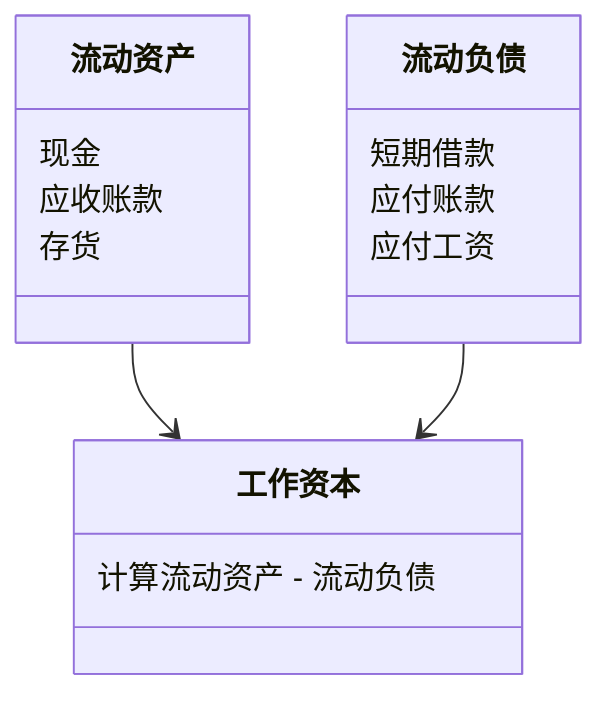
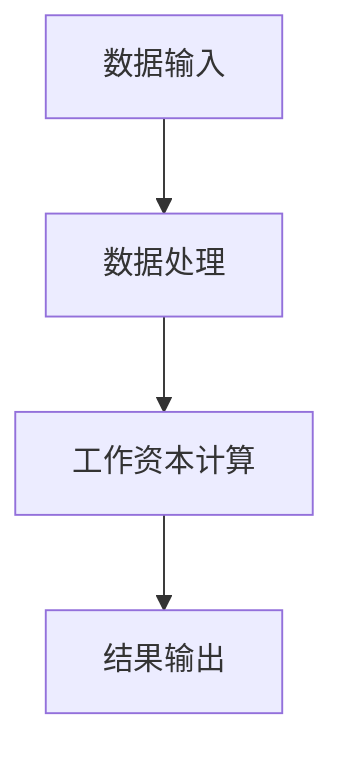
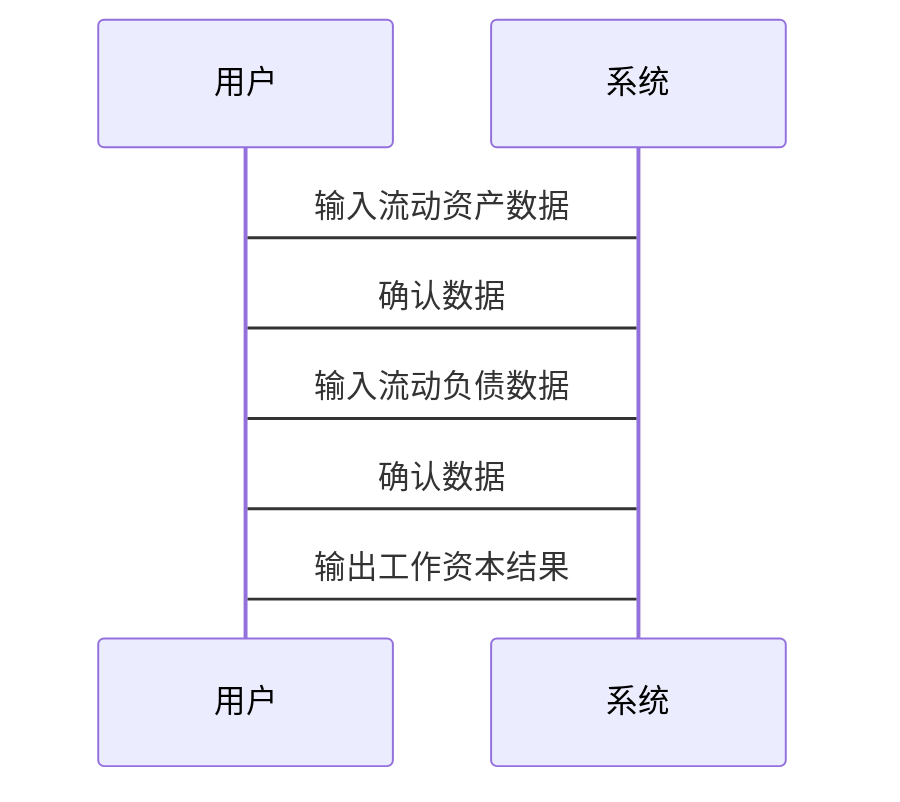

                 


# 格雷厄姆的“工作资本”分析：评估公司短期偿债能力

**关键词：** 格雷厄姆，工作资本，短期偿债能力，流动资产，流动负债，财务分析

**摘要：** 格雷厄姆的“工作资本”分析是一种经典的财务分析方法，用于评估公司的短期偿债能力。本文将详细探讨工作资本的概念、计算方法、评估指标、行业差异以及实际应用。通过系统化的分析和案例研究，帮助读者全面理解并掌握如何利用工作资本分析来评估公司的财务健康状况。

---

## 第一部分：格雷厄姆的“工作资本”分析基础

### 第1章：工作资本的概念与背景

#### 1.1 什么是工作资本

##### 1.1.1 核心概念的定义
工作资本（Working Capital），也称为营运资本，是公司日常运营所需的流动资金。其定义为：
$$\text{工作资本} = \text{流动资产} - \text{流动负债}$$
流动资产包括现金、应收账款、存货等，而流动负债则包括应付账款、短期借款等。

##### 1.1.2 工作资本的意义与重要性
工作资本是公司短期偿债能力的核心指标。充足的流动资产能够确保公司在短期内偿还债务，维持正常的运营活动。如果工作资本为负，表明公司可能面临短期偿债压力。

##### 1.1.3 格雷厄姆的“工作资本”理论背景
本杰明·格雷厄姆是价值投资的鼻祖，他提出了“工作资本”理论，强调企业应保持足够的流动资产以应对短期债务。这种方法至今仍被广泛应用于财务分析。

#### 1.2 工作资本与流动资本的区别

##### 1.2.1 流动资本的定义与特点
流动资本是指企业在一定时期内能够快速转换为现金的资产。其特点包括流动性高、周转快、用途广泛。

##### 1.2.2 工作资本的独特属性
工作资本不仅关注流动资产，还考虑流动负债。通过计算工作资本，可以更准确地评估企业的短期偿债能力。

##### 1.2.3 格雷厄姆的理论贡献
格雷厄姆通过引入“工作资本”概念，强调了流动资产与流动负债的动态平衡，为现代财务分析奠定了基础。

### 第2章：工作资本的评估方法

#### 2.1 格雷厄姆的“工作资本”计算公式

##### 2.1.1 核心公式
$$\text{工作资本} = \text{流动资产} - \text{流动负债}$$
流动资产包括现金、应收账款、存货等，流动负债包括应付账款、短期借款等。

##### 2.1.2 流动资产与流动负债的构成
- 流动资产：
  - 现金
  - 应收账款
  - 存货
- 流动负债：
  - 应付账款
  - 短期借款
  - 应付工资

##### 2.1.3 公式的实际应用案例
假设某公司流动资产为500万元，流动负债为300万元，则工作资本为：
$$\text{工作资本} = 500 - 300 = 200 \text{万元}$$

#### 2.2 工作资本的评估指标

##### 2.2.1 速动比率（Acid-test ratio）
速动比率是衡量企业短期偿债能力的重要指标，公式为：
$$\text{速动比率} = \frac{\text{速动资产}}{\text{流动负债}}$$
速动资产包括现金、应收账款和存货。

##### 2.2.2 流动比率（Current Ratio）
流动比率是流动资产与流动负债的比值，公式为：
$$\text{流动比率} = \frac{\text{流动资产}}{\text{流动负债}}$$

##### 2.2.3 其他相关指标的对比分析
- 速动比率更严格，排除了存货的影响。
- 流动比率更为宽松，包括所有流动资产。

### 第3章：工作资本与财务报表的关联

#### 3.1 资产负债表中的工作资本分析

##### 3.1.1 流动资产的详细分类
- 现金及现金等价物
- 应收账款
- 存货

##### 3.1.2 流动负债的详细分类
- 短期借款
- 应付账款
- 应付工资

##### 3.1.3 工作资本在资产负债表中的体现
通过资产负债表，可以提取流动资产和流动负债的数据，计算出工作资本。

#### 3.2 利润表与工作资本的关系

##### 3.2.1 营业收入对工作资本的影响
营业收入的增加可以提高流动资产，从而增加工作资本。

##### 3.2.2 营业成本与工作资本的互动
营业成本的增加会减少流动资产中的存货，从而降低工作资本。

##### 3.2.3 净利润与工作资本的关联
净利润增加会增加流动资产中的现金，从而提高工作资本。

### 第4章：工作资本的行业差异

#### 4.1 不同行业的流动资产周转率

##### 4.1.1 制造业的库存管理
制造业通常需要大量的存货，因此流动资产中的存货比例较高。

##### 4.1.2 零售业的应收账款管理
零售业的应收账款周转率较高，因为客户通常是个人消费者。

##### 4.1.3 服务业的现金流管理
服务业的流动资产主要集中在现金和应收账款上，存货较少。

#### 4.2 不同行业的流动负债结构

##### 4.2.1 制造业的应付账款策略
制造业通常与供应商有较长的信用期，应付账款周转率较低。

##### 4.2.2 零售业的应付账款周期
零售业的应付账款周期较短，因为供应商通常要求现金付款。

##### 4.2.3 服务业的应付账款管理
服务业的应付账款主要集中在应付工资和租金上，周转率较高。

---

## 第二部分：系统分析与架构设计

### 第5章：工作资本分析的系统架构

#### 5.1 问题场景介绍
企业需要通过工作资本分析来评估短期偿债能力，确保财务健康。

#### 5.2 系统功能设计

##### 5.2.1 领域模型


#### 5.3 系统架构设计

##### 5.3.1 架构图


#### 5.4 系统接口设计
- 数据输入接口：接收流动资产和流动负债的数据。
- 数据处理接口：计算工作资本。
- 结果输出接口：展示工作资本分析结果。

#### 5.5 系统交互设计

##### 5.5.1 交互流程


---

## 第三部分：项目实战

### 第6章：工作资本分析的Python实现

#### 6.1 环境安装
需要安装Python和Pandas库：
```bash
pip install pandas
```

#### 6.2 核心实现源代码

##### 6.2.1 数据读取
```python
import pandas as pd

# 读取财务数据
data = pd.read_csv('financial_data.csv')
```

##### 6.2.2 工作资本计算
```python
# 计算流动资产和流动负债
current_assets = data['现金'] + data['应收账款'] + data['存货']
current_liabilities = data['短期借款'] + data['应付账款'] + data['应付工资']

# 计算工作资本
working_capital = current_assets - current_liabilities

# 输出结果
print("工作资本:", working_capital)
```

#### 6.3 代码应用解读与分析
- 数据读取：从CSV文件中读取财务数据。
- 数据计算：分别计算流动资产和流动负债，然后计算工作资本。
- 结果输出：打印工作资本值。

#### 6.4 实际案例分析
以某公司为例，假设财务数据如下：
| 现金 | 应收账款 | 存货 | 短期借款 | 应付账款 | 应付工资 |
|------|----------|------|----------|----------|----------|
| 100 | 200 | 300 | 50 | 100 | 50 |

计算工作资本：
$$\text{工作资本} = (100 + 200 + 300) - (50 + 100 + 50) = 600 - 200 = 400$$

#### 6.5 项目小结
通过Python代码实现工作资本分析，可以快速计算并评估公司的短期偿债能力。

---

## 第四部分：总结与展望

### 第7章：总结与展望

#### 7.1 总结
格雷厄姆的“工作资本”分析是一种经典的财务分析方法，通过计算流动资产减去流动负债，可以评估公司的短期偿债能力。本文详细探讨了工作资本的概念、计算方法、行业差异以及实际应用。

#### 7.2 展望
随着人工智能和大数据技术的发展，工作资本分析将更加智能化和自动化。未来可以通过机器学习模型预测工作资本的变化趋势，为财务决策提供更有力的支持。

#### 7.3 最佳实践 Tips
- 定期计算工作资本，监控短期偿债能力。
- 结合其他财务指标（如速动比率、流动比率）进行综合分析。
- 根据行业特点调整工作资本的管理策略。

---

通过以上分析，读者可以全面理解格雷厄姆的“工作资本”分析方法，并能够在实际工作中有效评估公司的短期偿债能力。

