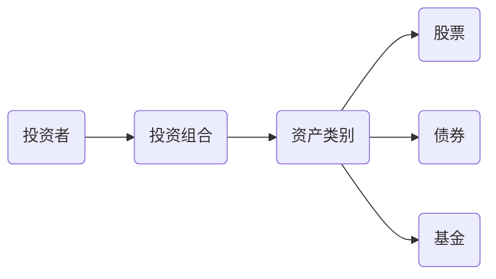
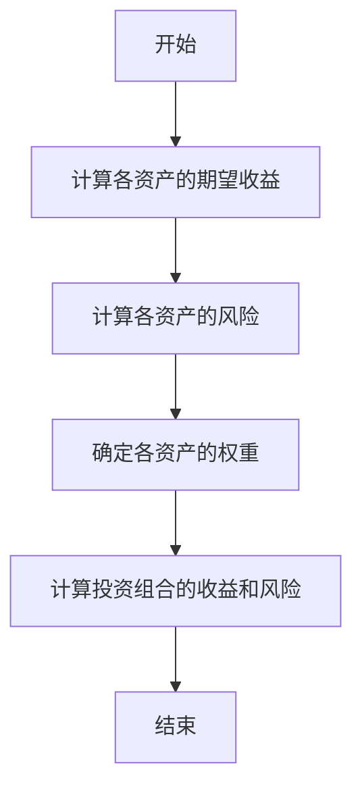

                 

# 格雷厄姆的Group Approach：分散投资的智慧

## 关键词
分散投资，价值投资，投资组合，风险控制，数学模型，系统架构

## 摘要
本文深入探讨了格雷厄姆的Group Approach投资策略，分析了其核心概念、数学模型、系统架构，并通过实际案例展示了其在投资组合管理中的应用。文章结构清晰，内容详实，适合对投资策略和风险管理感兴趣的读者阅读。

---

## 第一部分: 格雷厄姆的Group Approach背景与基础

### 第1章: 格雷厄姆与Group Approach概述

#### 1.1 格雷厄姆的生平与投资理念
格雷厄姆是价值投资的奠基人，他的投资理念强调安全边际和长期稳健的收益。他通过分析市场波动和投资者心理，提出了“市场先生”的概念，认为市场价格波动是投资者的机会而非威胁。

#### 1.2 Group Approach的核心概念
Group Approach是一种分散投资策略，通过将资金分配到多个不同资产类别或股票中，降低单一投资的风险。其核心思想是通过多样化来平滑投资组合的波动性。

---

### 第2章: Group Approach的核心概念与联系

#### 2.1 核心概念原理
分散投资通过降低特定资产的风险来优化整体投资组合的收益。Group Approach通过将资金分配到多个资产类别，如股票、债券、房地产等，来实现风险的分散。

#### 2.2 核心概念属性特征对比表格
| 对比维度 | 集中投资 | 分散投资 |
|----------|----------|----------|
| 风险     | 高       | 低       |
| 收益     | 不稳定   | 稳定     |
| 管理难度 | 高       | 中等     |

#### 2.3 ER实体关系图架构

---

## 第二部分: Group Approach的数学模型与算法原理

### 第3章: Group Approach的数学模型与算法原理

#### 3.1 数学模型
投资组合的收益和风险可以通过数学模型进行量化分析：
- **收益计算**：$$\text{收益} = \sum_{i=1}^{n} w_i \times r_i$$
  其中，$w_i$ 是第 $i$ 个资产的权重，$r_i$ 是第 $i$ 个资产的预期收益。
- **风险计算**：$$\text{风险} = \sqrt{\sum_{i=1}^{n} w_i^2 \times \sigma_i^2}$$
  其中，$\sigma_i$ 是第 $i$ 个资产的风险（标准差）。

#### 3.2 算法原理

---

## 第三部分: Group Approach的系统架构与实现

### 第4章: Group Approach的系统架构与实现

#### 4.1 系统架构设计

#### 4.2 系统功能设计

---

## 第四部分: Group Approach的项目实战与案例分析

### 第5章: Group Approach的项目实战与案例分析

#### 5.1 项目实战
- **环境安装**：安装Python和相关库（如NumPy、Pandas）。
- **系统实现**：编写代码实现投资组合的收益和风险计算。

#### 5.2 案例分析
通过具体案例分析，验证Group Approach在实际投资中的效果。

---

## 第五部分: Group Approach的总结与最佳实践

### 第6章: Group Approach的总结与最佳实践

#### 6.1 总结
Group Approach通过分散投资降低了风险，同时保持了收益的稳定性。

#### 6.2 投资建议
- 保持分散投资，避免过度集中。
- 定期调整投资组合，适应市场变化。

#### 6.3 注意事项
- 避免追涨杀跌，理性投资。
- 定期评估投资组合的风险和收益。

#### 6.4 拓展阅读
推荐阅读格雷厄姆的经典著作《证券分析》和《聪明的投资者》。

---

通过以上分析，格雷厄姆的Group Approach为投资者提供了一种科学的投资策略，帮助他们在复杂多变的市场中实现稳健的投资收益。希望本文能为读者提供有价值的参考和启示。

