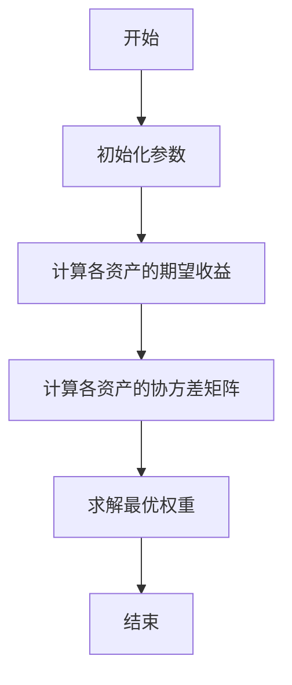
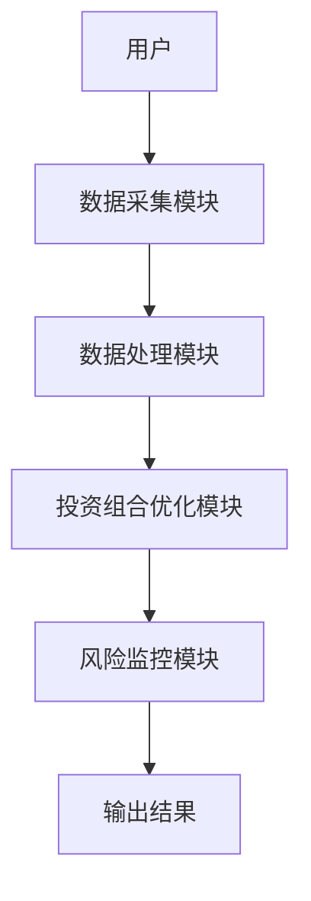

                 


# 格雷厄姆的Group Approach：分散风险的智慧

> 关键词：格雷厄姆，Group Approach，分散投资，风险控制，投资组合优化，资产配置，价值投资

> 摘要：本文深入探讨了格雷厄姆的Group Approach投资策略，分析其核心思想、数学模型和系统架构，并通过实际案例展示其在现代投资管理中的应用。文章从背景介绍、核心概念、算法原理、数学模型、系统架构、项目实战等多维度展开，旨在帮助读者理解如何通过分散投资降低风险，实现稳健收益。

---

## 第一部分: Group Approach的背景与基础

### 第1章: Group Approach概述

#### 1.1 格雷厄姆的投资理念

##### 1.1.1 价值投资的核心思想
格雷厄姆是价值投资的鼻祖，他主张以低于内在价值的价格购买优质股票，并长期持有。他的投资理念强调安全边际，即买入价格与内在价值的差距越大，投资的安全性越高。

##### 1.1.2 分散投资的重要性
格雷厄姆认为，通过分散投资可以降低非系统性风险。他建议将资金分散投资于多个股票或资产类别，以避免因单一资产波动导致的重大损失。

##### 1.1.3 Group Approach的定义与特点
Group Approach是格雷厄姆提出的一种投资策略，强调通过将资金分配到多个具有相似特性的资产（如行业、市值等）中，来实现风险分散和收益稳定。

#### 1.2 Group Approach的核心要素

##### 1.2.1 投资组合的构建原则
Group Approach的投资组合构建原则包括：
- 分散化：将资金分配到多个资产类别或行业中。
- 估值优先：优先选择被低估的资产。
- 风险控制：通过资产配置和组合管理降低风险。

##### 1.2.2 风险分散的数学模型
Group Approach的核心是通过分散化降低组合的总体风险。其数学模型包括：
- 方差：衡量资产收益的波动性。
- 协方差：衡量不同资产收益之间的相关性。

##### 1.2.3 格雷厄姆的选股标准
格雷厄姆的选股标准包括：
- 低市盈率：市盈率低于市场平均水平。
- 高股息率：股息收益率较高。
- 低负债率：公司负债较低，财务状况健康。

#### 1.3 Group Approach与传统投资方法的对比

##### 1.3.1 传统投资方法的局限性
传统投资方法通常依赖于市场预测和个股选择，这种方式的风险较高，且难以实现长期稳定的收益。

##### 1.3.2 Group Approach的优势
Group Approach通过分散化降低了非系统性风险，同时注重资产的估值和质量，能够在不同市场环境下实现稳健收益。

##### 1.3.3 两种方法的适用场景
传统投资方法适用于对市场有深刻理解且能够准确预测的投资者，而Group Approach则更适合希望降低风险、追求稳定收益的投资者。

---

### 第2章: Group Approach的核心概念

#### 2.1 分散投资的数学原理

##### 2.1.1 投资组合的方差计算
投资组合的总体方差由各资产的方差和协方差决定：
$$ \sigma_p^2 = \sum_{i=1}^{n} \sum_{j=1}^{n} w_i w_j \sigma_i \sigma_j \rho_{ij} $$
其中，$w_i$ 和 $w_j$ 是资产i和资产j的权重，$\sigma_i$ 和 $\sigma_j$ 是资产i和资产j的收益标准差，$\rho_{ij}$ 是资产i和资产j的相关系数。

##### 2.1.2 标准差的意义
标准差衡量的是资产收益的波动性，标准差越低，资产的收益越稳定。

##### 2.1.3 协方差与相关性的影响
协方差反映了资产收益之间的关系，正协方差表示资产收益同向变动，负协方差表示反向变动。

#### 2.2 核心概念的属性对比

##### 2.2.1 通过表格对比不同投资策略的属性

| 属性                | Group Approach                     | 传统投资方法                  |
|---------------------|------------------------------------|------------------------------|
| 投资理念            | 分散化、价值投资                  | 个股选择、市场预测            |
| 风险控制            | 通过分散化降低风险               | 依赖个股选择和市场判断        |
| 适合场景            | 稳健收益、降低波动性              | 高风险承受能力、精准预测      |

##### 2.2.2 通过ER图展示投资组合的实体关系
```mermaid
erd
  投资组合
    - 资产类别: 股票、债券、现金
    - 资产配置: 每类资产的权重
    - 组合收益: 预期收益和实际收益
    - 风险指标: 方差、标准差
```

---

### 第3章: Group Approach的算法原理

#### 3.1 投资组合优化的算法流程

##### 3.1.1 使用mermaid绘制算法流程图


##### 3.1.2 算法实现步骤
1. 输入各资产的历史收益数据。
2. 计算各资产的期望收益和协方差矩阵。
3. 使用优化算法（如均值-方差优化）求解最优权重。
4. 输出最优投资组合及其收益和风险指标。

#### 3.2 投资组合优化的Python实现

##### 3.2.1 代码示例
```python
import numpy as np

def portfolio_optimization(returns):
    n = len(returns.columns)
    cov_matrix = returns.cov()
    mu = returns.mean()
    
    # 初始化权重向量
    weights = np.ones(n) / n
    
    # 计算投资组合的期望收益和风险
    port_return = np.dot(mu, weights)
    port_variance = np.dot(weights.T, np.dot(cov_matrix, weights))
    
    return port_return, port_variance

# 示例数据
returns = pd.DataFrame({
    '股票': [0.1, 0.2, 0.15],
    '债券': [0.05, 0.1, 0.08]
})

port_return, port_variance = portfolio_optimization(returns)
print(f"组合期望收益: {port_return:.2%}")
print(f"组合风险: {port_variance:.2%}")
```

##### 3.2.2 算法原理的数学模型
组合的期望收益和风险可以通过以下公式计算：
$$ E[R_p] = \sum_{i=1}^{n} w_i E[R_i] $$
$$ \sigma_p^2 = \sum_{i=1}^{n} \sum_{j=1}^{n} w_i w_j \sigma_i \sigma_j \rho_{ij} $$

---

### 第4章: Group Approach的数学模型

#### 4.1 投资组合优化的数学模型

##### 4.1.1 均值-方差优化模型
$$ \text{minimize } \sigma_p^2 $$
$$ \text{subject to } \sum_{i=1}^{n} w_i = 1 $$

##### 4.1.2 剩余风险的分解
$$ \sigma_p^2 = \sigma_m^2 + \sum_{i=1}^{n} \beta_i^2 \sigma_r^2 $$
其中，$\beta_i$ 是资产i的贝塔系数，$\sigma_r$ 是市场收益的标准差。

---

## 第五部分: Group Approach的系统架构

### 第5章: 系统架构设计方案

#### 5.1 问题场景介绍
Group Approach的投资管理系统需要能够实时监控多个资产的收益和风险指标，并根据市场变化动态调整投资组合。

#### 5.2 系统功能设计

##### 5.2.1 数据采集模块
- 从多个数据源获取资产的历史收益和市场数据。
- 数据清洗和预处理。

##### 5.2.2 投资组合优化模块
- 计算各资产的期望收益和协方差矩阵。
- 使用优化算法求解最优权重。

##### 5.2.3 风险监控模块
- 实时监控投资组合的收益和风险指标。
- 设置预警机制。

#### 5.3 系统架构设计

##### 5.3.1 使用mermaid绘制系统架构图


---

## 第六部分: 项目实战

### 第6章: Group Approach的实际应用

#### 6.1 环境安装
- 安装必要的Python库：numpy、pandas、matplotlib。

#### 6.2 代码实现

##### 6.2.1 投资组合优化代码
```python
import numpy as np
import pandas as pd
import matplotlib.pyplot as plt

# 示例数据
returns = pd.DataFrame({
    '股票': [0.1, 0.2, 0.15],
    '债券': [0.05, 0.1, 0.08]
})

n = len(returns.columns)
cov_matrix = returns.cov()
mu = returns.mean()

# 初始化权重向量
weights = np.ones(n) / n

# 计算组合收益和风险
port_return = np.dot(mu, weights)
port_variance = np.dot(weights.T, np.dot(cov_matrix, weights))

print(f"组合期望收益: {port_return:.2%}")
print(f"组合风险: {port_variance:.2%}")

# 可视化展示
plt.bar(returns.columns, weights * 100)
plt.title('投资组合权重分布')
plt.ylabel('权重(%)')
plt.show()
```

#### 6.3 案例分析
通过上述代码，我们可以计算出投资组合的期望收益和风险，并通过可视化展示各资产的权重分布。

---

## 第七部分: 总结与展望

### 第7章: Group Approach的总结

#### 7.1 核心要点回顾
- Group Approach通过分散化降低风险。
- 通过资产配置和优化算法实现稳健收益。
- 适合长期投资者和风险厌恶型投资者。

#### 7.2 实际应用中的注意事项
- 定期调整投资组合，避免过度集中。
- 选择优质资产，注重估值和质量。
- 保持长期投资，避免频繁交易。

#### 7.3 未来展望
随着人工智能和大数据技术的发展，Group Approach的投资策略将更加智能化和自动化。未来的研究方向包括：
- 更高效的优化算法。
- 更精准的市场预测模型。
- 更灵活的资产配置策略。

---

## 参考文献

1. 格雷厄姆《证券投资分析》
2. Markowitz《投资组合选择》
3. Python for Finance, by Yves Hilpisch

