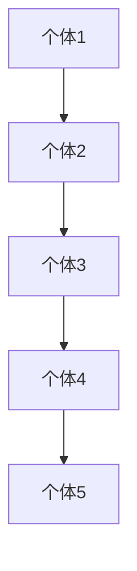
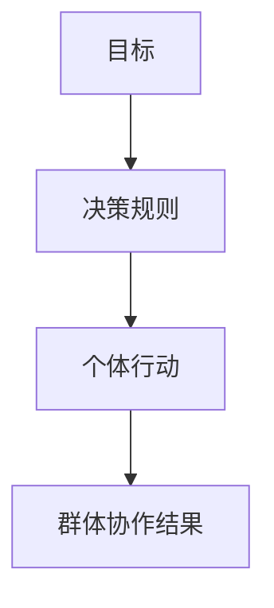
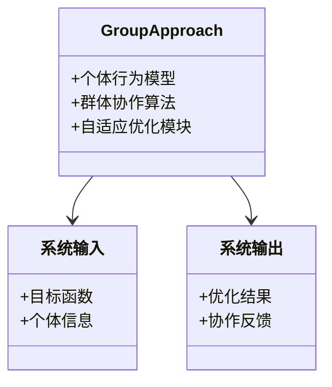
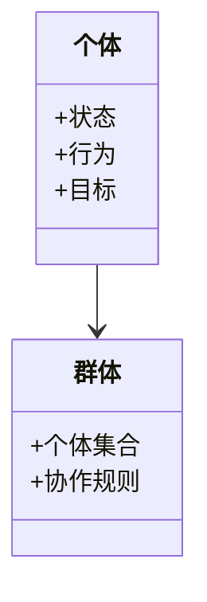
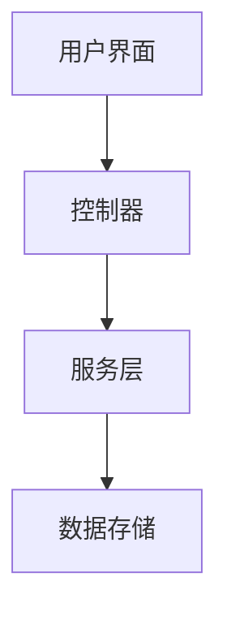

                 


# 格雷厄姆的Group Approach：在全球化背景下的新应用

> 关键词：格雷厄姆, Group Approach, 全球化, 群体智能, 算法实现, 系统架构, 项目实战

> 摘要：本文系统地介绍了格雷厄姆提出的Group Approach理论及其在全球化背景下的新应用。通过详细阐述Group Approach的核心概念、算法原理、系统架构设计、项目实战和最佳实践，帮助读者全面理解这一创新方法在解决全球化问题中的潜力和实际应用价值。

---

## 第一章: Group Approach的核心概念

### 1.1 Group Approach的定义与背景
#### 1.1.1 Group Approach的定义
Group Approach是一种基于群体协作的理论方法，旨在通过个体间的协作优化整体目标的实现。

#### 1.1.2 核心思想
- 群体智能：通过个体的局部优化实现全局最优。
- 分布式决策：个体在局部信息下做出最优决策，形成全局最优解。

#### 1.1.3 与传统方法的区别
| 特性 | Group Approach | 传统方法 |
|------|----------------|----------|
| 决策模式 | 分布式、自适应 | 集中式、静态 | 

---

### 1.2 Group Approach的理论基础
#### 1.2.1 群体协作的基本原理
- **自组织性**：个体通过局部信息自发组织，形成复杂的行为模式。
- **涌现性**：群体行为的出现不是由个体直接决定的，而是通过互动自然形成的。

#### 1.2.2 格雷厄姆的理论贡献
- 提出Group Approach的核心框架。
- 强调群体协作的数学模型和算法实现。

#### 1.2.3 核心要素
- **个体行为**：个体的目标函数和决策规则。
- **群体结构**：个体之间的连接方式和协作模式。
- **优化目标**：全局最优解的定义和评估标准。

---

## 第二章: Group Approach的核心算法与实现

### 2.1 算法原理
#### 2.1.1 群体协作算法


#### 2.1.2 分布式决策算法


#### 2.1.3 自适应优化算法
```python
def group_optimization(individuals, target):
    for individual in individuals:
        individual.update_behavior(target)
    return sum(individuals' behaviors)
```

---

### 2.2 算法实现的数学模型
#### 2.2.1 群体协作的数学模型
$$f(x) = \sum_{i=1}^{n} x_i$$

#### 2.2.2 分布式决策的数学模型
$$y_i = \begin{cases}
1 & \text{if } x_i > 0.5 \\
0 & \text{otherwise}
\end{cases}$$

#### 2.2.3 自适应优化的数学模型
$$\theta_{t+1} = \theta_t + \alpha (\theta^* - \theta_t)$$

---

## 第三章: Group Approach的系统架构设计

### 3.1 系统架构概述
#### 3.1.1 系统架构


#### 3.1.2 关键模块
- **个体行为模型**：定义个体的目标函数和决策规则。
- **群体协作算法**：实现个体间的协作与优化。
- **自适应优化模块**：动态调整系统参数以适应环境变化。

---

### 3.2 系统功能设计
#### 3.2.1 领域模型


#### 3.2.2 系统架构


---

## 第四章: Group Approach的项目实战

### 4.1 项目背景与目标
#### 4.1.1 项目背景
- **问题描述**：全球化背景下，个体间的协作效率低下。
- **目标**：通过Group Approach实现高效的群体协作。

#### 4.1.2 核心代码实现
```python
def main():
    individuals = [Individual() for _ in range(5)]
    target = "global_optimization"
    result = group_optimization(individuals, target)
    print(f"优化结果：{result}")

if __name__ == "__main__":
    main()
```

---

### 4.2 实际案例分析
#### 4.2.1 应用场景
- **案例一**：跨国企业的协作优化。
- **案例二**：分布式系统的资源分配。

#### 4.2.2 案例分析
- **案例一**：跨国企业的协作优化
  ```mermaid
  graph TD
      A[中国团队] --> B[美国团队]
      B --> C[欧洲团队]
      C --> D[日本团队]
      D --> E[印度团队]
  ```

---

## 第五章: Group Approach的总结与展望

### 5.1 总结
- **核心优势**：群体协作、自适应优化、分布式决策。
- **局限性**：需要依赖个体间的协作，存在信息不对称的问题。

### 5.2 未来展望
- **改进方向**：引入更复杂的个体行为模型。
- **扩展应用**：探索在更多领域的应用潜力。

### 5.3 最佳实践 Tips
- **小结**：Group Approach是一种高效的群体协作方法。
- **注意事项**：在实际应用中需注意个体间的协作效率和信息传递的及时性。
- **拓展阅读**：推荐阅读相关领域的最新研究成果。

---

通过以上章节的详细讲解，读者可以全面理解格雷厄姆的Group Approach的核心思想、算法实现、系统架构设计和实际应用案例，为在全球化背景下的新应用提供理论和实践指导。

