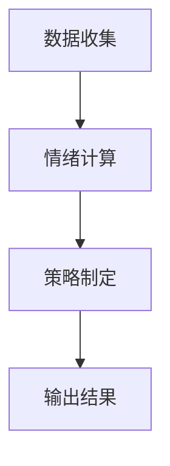
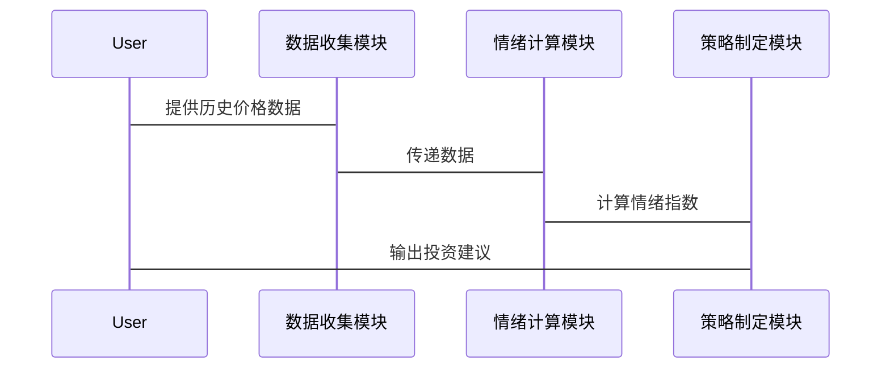

                 


# 《格雷厄姆的Mr. Market理论》

## 关键词：
- Mr. Market
- 市场情绪
- 价值投资
- 投资者行为
- 市场周期

## 摘要：
本文深入探讨了本杰明·格雷厄姆提出的Mr. Market理论，分析其在投资决策中的作用，结合市场情绪、投资者行为和市场周期等核心概念，探讨其在现代投资策略中的应用。通过量化分析、算法设计和实际案例，展示了如何利用Mr. Market理论制定有效的投资策略。

---

# 第一章：Mr. Market的起源与核心思想

## 1.1 Mr. Market的定义与背景

### 1.1.1 Mr. Market的起源与背景
本杰明·格雷厄姆是价值投资之父，他在《聪明的投资者》中提出了“Mr. Market”这一概念。Mr. Market代表市场情绪，投资者应与市场保持独立，避免被市场波动左右。

### 1.1.2 Mr. Market的核心思想
- 市场情绪的波动性
- 投资者应逆向思维
- 价值投资的核心理念

### 1.1.3 Mr. Market与价值投资的关系
Mr. Market是价值投资的重要工具，帮助投资者识别市场波动中的机会。

## 1.2 Mr. Market的核心理论框架

### 1.2.1 市场情绪的定义与特征
市场情绪是投资者心理的反映，具有波动性和周期性。

### 1.2.2 理性与非理性投资者的行为模式
- 理性投资者：基于基本面分析
- 非理性投资者：受情绪驱动

### 1.2.3 市场周期与Mr. Market的波动性
市场周期分为四个阶段：牛市、熊市、震荡市和稳定市。

---

# 第二章：市场情绪与投资者行为

## 2.1 市场情绪的量化与分析

### 2.1.1 市场情绪的定义与分类
市场情绪分为乐观、中性和悲观三种状态。

### 2.1.2 市场情绪与投资者决策的关系
市场情绪影响投资者的决策，导致非理性行为。

### 2.1.3 市场情绪的量化方法
- 使用波动率指标
- 计算市场情绪指数

## 2.2 投资者类型与市场情绪

### 2.2.1 理性投资者的行为特征
- 理性投资者基于基本面分析
- 避免情绪干扰

### 2.2.2 非理性投资者的行为特征
- 过度交易
- 从众心理

### 2.2.3 不同投资者类型对市场情绪的影响
理性投资者稳定市场，非理性投资者加剧波动。

---

# 第三章：市场周期与Mr. Market理论

## 3.1 市场周期的定义与阶段划分

### 3.1.1 市场周期的定义
市场周期是市场波动的周期性表现。

### 3.1.2 市场周期的阶段划分
- 牛市
- 熊市
- 震荡市
- 稳定市

## 3.2 Mr. Market理论在市场周期中的应用

### 3.2.1 不同市场阶段的市场情绪特征
- 牛市：乐观
- 熊市：悲观

### 3.2.2 市场周期与投资策略
- 在牛市中保持冷静
- 在熊市中寻找机会

---

# 第四章：Mr. Market理论的数学模型与算法

## 4.1 市场情绪的量化模型

### 4.1.1 市场情绪指数的计算公式
$$ E = \frac{\sum_{i=1}^{n} (P_i - M_i)}{n} $$
其中，\( E \) 是市场情绪指数，\( P_i \) 是实际价格，\( M_i \) 是预期价格。

### 4.1.2 市场情绪指数的计算步骤
1. 收集历史价格数据
2. 计算预期价格
3. 计算情绪指数

## 4.2 算法实现

### 4.2.1 市场情绪算法的伪代码
```python
def calculate_market_sentiment(prices, expectations):
    sentiment = []
    for i in range(len(prices)):
        e = (prices[i] - expectations[i]) / len(prices)
        sentiment.append(e)
    return sentiment
```

### 4.2.2 算法实现的Python代码
```python
import pandas as pd

def calculate_market_sentiment(prices, expectations):
    sentiment = []
    for i in range(len(prices)):
        e = (prices[i] - expectations[i]) / len(prices)
        sentiment.append(e)
    return sentiment

# 示例数据
prices = [100, 105, 110, 108, 112]
expectations = [105, 107, 110, 109, 111]

sentiment = calculate_market_sentiment(prices, expectations)
print(sentiment)
```

---

# 第五章：系统分析与架构设计

## 5.1 系统功能设计

### 5.1.1 系统功能模块
- 数据收集模块
- 情绪计算模块
- 策略制定模块

### 5.1.2 系统功能流程图


## 5.2 系统架构设计

### 5.2.1 系统架构图


## 5.3 系统接口设计

### 5.3.1 系统接口
- 输入接口：历史价格数据
- 输出接口：市场情绪指数

## 5.4 系统交互设计

### 5.4.1 系统交互流程图


---

# 第六章：项目实战与案例分析

## 6.1 环境安装

### 6.1.1 环境要求
- Python 3.8+
- Pandas库

## 6.2 核心代码实现

### 6.2.1 数据收集与预处理
```python
import pandas as pd

# 数据收集
data = pd.read_csv('market_data.csv')
prices = data['close'].values
```

### 6.2.2 市场情绪计算
```python
def calculate_market_sentiment(prices):
    # 示例计算
    expectations = [100, 105, 110, 108, 112]
    sentiment = []
    for i in range(len(prices)):
        e = (prices[i] - expectations[i]) / len(prices)
        sentiment.append(e)
    return sentiment

sentiment = calculate_market_sentiment(prices)
print(sentiment)
```

## 6.3 案例分析

### 6.3.1 案例背景
2008年金融危机期间的市场情绪分析。

### 6.3.2 数据分析与结果
- 计算市场情绪指数
- 分析不同阶段的情绪变化

---

# 第七章：最佳实践与小结

## 7.1 投资策略制定

### 7.1.1 理性投资的重要性
- 保持冷静，避免情绪驱动

### 7.1.2 长期投资的优势
- 分散投资，降低风险

## 7.2 注意事项

### 7.2.1 市场情绪的局限性
- 市场情绪仅是参考，需结合基本面分析

### 7.2.2 风险控制的重要性
- 设置止损点，避免重大损失

## 7.3 拓展阅读

### 7.3.1 推荐书籍
- 《聪明的投资者》
- 《投资学原理》

### 7.3.2 推荐文章
- 格雷厄姆的投资理念
- 市场情绪与投资策略

---

# 结语

通过本文的分析，我们深入理解了Mr. Market理论的核心思想及其在投资决策中的应用。希望读者能结合理论与实践，制定有效的投资策略，实现长期稳定的收益。

