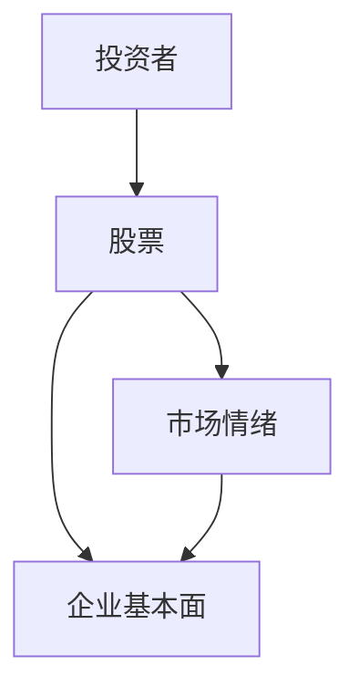
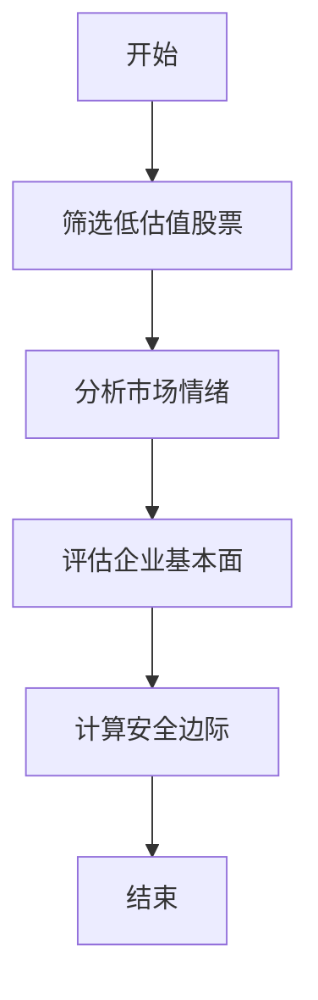

                 


# 格雷厄姆的Special Situations：寻找特殊机会

---

## 关键词
- 格雷厄姆
- Special Situations
- 价值投资
- 低估值股票
- 市场误判

---

## 摘要
本文深入探讨了格雷厄姆的Special Situations投资策略，分析了其核心概念、理论基础、算法原理以及在实际投资中的应用。通过详细讲解Special Situations的定义、筛选标准、数学模型和系统架构，本文为投资者提供了寻找特殊投资机会的实用指南。文章结合理论与实践，帮助读者理解如何在市场中识别和利用低估值股票，实现长期稳健的投资回报。

---

## 正文

### 第一部分：Special Situations的背景与核心概念

#### 第1章：Special Situations的定义与背景

##### 1.1 Special Situations的起源
Special Situations是指那些由于市场误判或企业特定情况导致股票价格显著低于其内在价值的情形。格雷厄姆作为价值投资的鼻祖，提出了这一概念，强调通过分析企业基本面和市场情绪来识别这些特殊机会。

- **1.1.1 格雷厄姆的价值投资理论**  
  格雷厄姆认为，市场的短期波动性为投资者提供了以低于内在价值的价格购买优质股票的机会。他强调安全边际的重要性，即购买价格远低于企业内在价值的股票。

- **1.1.2 Special Situations的定义与核心特征**  
  Special Situations是指那些由于市场误解、暂时困境或行业周期性波动导致企业估值被市场严重低估的情况。其核心特征包括低市盈率、低市净率和高股息率。

- **1.1.3 Special Situations的市场背景与适用场景**  
  在市场低迷或经济危机时期，Special Situations更容易出现。此时，许多优质企业因市场恐慌而被抛售，价格远低于其真实价值。

##### 1.2 Special Situations的核心要素
Special Situations的识别需要结合企业基本面和市场情绪分析，重点关注以下要素：

- **1.2.1 低估值股票的识别标准**  
  通过市盈率（P/E）、市净率（P/B）等指标筛选出价格远低于行业平均水平的股票。

- **1.2.2 市场误判的常见原因**  
  市场情绪的非理性波动、信息不对称和投资者过度反应是导致市场误判的主要原因。

- **1.2.3 Special Situations的边界与外延**  
  Special Situations不仅限于股票投资，还可应用于债券和其他资产类别，但本文主要聚焦于股票投资。

##### 1.3 Special Situations与其他投资策略的对比
Special Situations与其他投资策略（如成长型投资和趋势投资）有显著区别：

- **1.3.1 与成长型投资的对比**  
  成长型投资关注企业的未来增长潜力，而Special Situations关注当前的低估值。

- **1.3.2 与价值型投资的对比**  
  价值型投资强调安全边际，而Special Situations更注重市场误判带来的短期机会。

- **1.3.3 与趋势投资的对比**  
  趋势投资依赖于市场趋势，而Special Situations更注重个股的基本面分析。

##### 1.4 本章小结
本章介绍了Special Situations的定义、核心要素和与其他投资策略的区别，为后续分析奠定了基础。

---

#### 第2章：Special Situations的核心原理

##### 2.1 Special Situations的理论基础
Special Situations的理论基础源于格雷厄姆的价值投资理念，强调安全边际和逆向思维：

- **2.1.1 格雷厄姆的估值方法**  
  格雷厄姆提出通过计算内在价值来评估股票，内在价值是未来现金流的现值。

- **2.1.2 市场情绪对企业估值的影响**  
  市场情绪的波动会导致股票价格偏离其内在价值，Special Situations正是利用这种偏离。

- **2.1.3 特殊情况下企业的潜在价值**  
  在特殊情况下，企业可能因暂时性问题导致估值被低估，但其潜在价值并未受到影响。

##### 2.2 Special Situations的核心属性特征
Special Situations的核心属性包括低估值、市场误判和潜在价值。以下是核心属性特征的对比：

| 特性               | 特点描述                               |
|--------------------|----------------------------------------|
| 低估值             | 市盈率、市净率显著低于行业平均水平   |
| 市场误判           | 由于市场情绪波动导致的价格低估       |
| 潜在价值           | 企业基本面良好，未来增长潜力大         |

##### 2.3 Special Situations的ER实体关系图
以下是Special Situations的ER实体关系图：



---

### 第二部分：Special Situations的算法原理

#### 第3章：Special Situations的算法原理

##### 3.1 Special Situations的筛选标准
Special Situations的筛选标准包括以下步骤：

1. **筛选低估值股票**：通过市盈率、市净率等指标筛选出价格低于行业平均水平的股票。
2. **分析市场情绪**：通过市场情绪指标（如恐慌指数）判断市场是否处于低估状态。
3. **评估企业基本面**：分析企业的盈利能力、财务状况和未来增长潜力。
4. **计算安全边际**：确保购买价格远低于企业内在价值。

##### 3.2 Special Situations的数学模型
以下是Special Situations的数学模型：

- **市盈率（P/E）计算公式**：
  $$\text{市盈率} = \frac{\text{股价}}{\text{每股收益}}$$

- **市净率（P/B）计算公式**：
  $$\text{市净率} = \frac{\text{股价}}{\text{每股净资产}}$$

- **内在价值计算公式（简化版）**：
  $$\text{内在价值} = \sum_{t=1}^{n} \frac{\text{现金流}_t}{(1 + r)^t}$$
  其中，r为折现率，n为现金流的时间跨度。

##### 3.3 Special Situations的算法流程图
以下是Special Situations的算法流程图：



---

#### 第4章：Special Situations的系统架构设计

##### 4.1 系统功能设计
Special Situations的识别系统需要以下功能模块：

1. **数据收集模块**：收集股票的市场数据和财务数据。
2. **筛选模块**：根据筛选标准筛选出符合条件的股票。
3. **分析模块**：分析市场情绪和企业基本面。
4. **投资组合管理模块**：管理投资组合，跟踪投资绩效。

##### 4.2 系统架构设计
以下是Special Situations识别系统的架构图：


---

### 第三部分：Special Situations的项目实战

#### 第5章：Special Situations的项目实战

##### 5.1 环境安装
- **工具安装**：安装Python、Pandas、NumPy等工具。
- **数据源**：获取股票数据，可通过Yahoo Finance等平台获取。

##### 5.2 核心代码实现
以下是Special Situations筛选的核心代码：

```python
import pandas as pd
import numpy as np

# 加载数据
df = pd.read_csv('stock_data.csv')

# 筛选低估值股票
low_pe = df[df['pe'] < df['pe'].mean()]
low_pb = low_pe[low_pe['pb'] < low_pe['pb'].mean()]

# 计算安全边际
low_pe['intrinsic_value'] = low_pe['price'] * 1.5  # 简化版计算

# 输出结果
print(low_pb.head())
```

##### 5.3 代码解读与分析
- **数据加载**：从CSV文件加载股票数据。
- **筛选低估值股票**：通过市盈率和市净率筛选出低估值股票。
- **计算内在价值**：使用简化版模型计算内在价值，确保安全边际。

##### 5.4 实际案例分析
以某公司为例，分析其Special Situations的识别过程：

1. **数据收集**：收集该公司的历史股价、市盈率和市净率。
2. **筛选标准**：判断其市盈率和市净率是否低于行业平均水平。
3. **分析市场情绪**：判断市场是否处于低估状态。
4. **评估基本面**：分析公司的盈利能力和发展潜力。
5. **计算安全边际**：确保购买价格远低于内在价值。

##### 5.5 项目小结
本章通过实际案例展示了Special Situations的识别过程，帮助投资者更好地理解和应用这一策略。

---

### 第四部分：Special Situations的最佳实践

#### 第6章：Special Situations的最佳实践

##### 6.1 小结
Special Situations是一种有效的投资策略，通过识别市场误判和低估值股票，实现长期稳健的投资回报。

##### 6.2 注意事项
- **风险控制**：避免过度集中在单一股票或行业。
- **长期投资**：Special Situations需要耐心等待市场恢复。
- **持续学习**：不断更新知识和策略，适应市场变化。

##### 6.3 拓展阅读
- 格雷厄姆的《聪明的投资者》
- 巴菲特的《致股东的信》
- 《价值投资实战策略》

---

### 第五章：Special Situations的总结与展望

#### 5.1 总结
Special Situations是一种基于价值投资的策略，通过识别市场误判和低估值股票，为投资者提供了寻找特殊机会的指南。本文详细讲解了其核心概念、算法原理和实际应用，帮助投资者更好地理解和应用这一策略。

#### 5.2 展望
随着市场的不断发展，Special Situations的应用场景将更加广泛。未来，投资者需要结合新技术和新工具，进一步优化识别过程，提高投资效率。

---

通过本文的分析，读者可以更好地理解Special Situations的投资策略，并在实际操作中灵活运用，实现长期稳健的投资回报。

