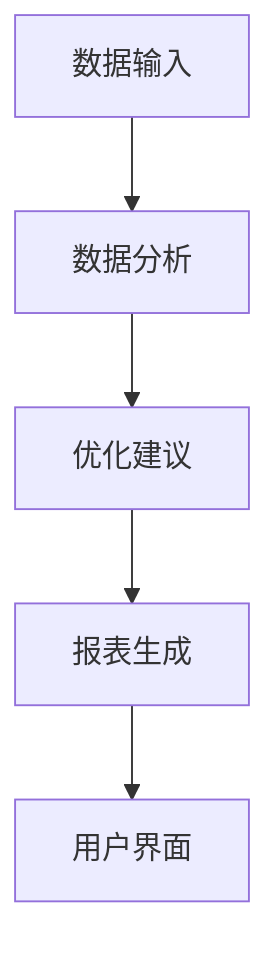

                 


# 格雷厄姆的Working Capital管理：运营效率的重要性

> 关键词：Working Capital 管理，运营效率，资金流动性，流动资产，流动负债

> 摘要：本文深入探讨了格雷厄姆的Working Capital管理理论，分析了其对现代企业运营效率的重要性。通过详细阐述Working Capital的核心概念、管理方法、系统架构和实际案例，本文旨在帮助企业更好地优化资本管理，提升运营效率，实现可持续发展。

---

## 第一部分: Working Capital管理的基础知识

### 第1章: Working Capital的定义与组成

#### 1.1 Working Capital的定义
Working Capital（营运资本）是指企业在日常运营中用于支持核心业务活动的流动资产与流动负债的差额。简单来说，它是企业在短期内能够变现或用于支付债务的资产。

$$
\text{Working Capital} = \text{流动资产} - \text{流动负债}
$$

流动资产包括现金、应收账款、存货等，而流动负债则包括应付账款、短期借款等。

#### 1.2 Working Capital的组成
1. **流动资产**：
   - 现金及现金等价物
   - 应收账款
   - 存货
   - 其他应收款
2. **流动负债**：
   - 应付账款
   - 短期借款
   - 应付工资
   - 应交税费

#### 1.3 Working Capital的重要性
Working Capital是企业运营的核心，直接关系到企业的资金流动性、偿债能力和运营效率。如果Working Capital管理不当，可能导致企业出现资金链断裂的风险。

---

### 第2章: Working Capital管理的核心目标

#### 2.1 提高资金流动性
资金流动性是衡量企业短期偿债能力的重要指标。通过优化流动资产和流动负债的结构，企业可以确保在需要时能够快速变现资产或偿还债务。

#### 2.2 优化资产使用效率
资产使用效率是指企业在一定时间内利用资产创造的价值。通过精简库存、加快应收账款回收速度等方法，可以提高资产使用效率。

#### 2.3 控制负债风险
流动负债虽然在短期内需要偿还，但如果管理得当，可以为企业提供必要的资金支持。然而，过高的流动负债可能导致企业面临偿债压力。

---

### 第3章: Working Capital管理与运营效率

#### 3.1 运营效率的定义
运营效率是指企业在资源有限的情况下，通过优化资源配置，提高产出效率的能力。它是衡量企业核心竞争力的重要指标。

#### 3.2 Working Capital管理对运营效率的影响
Working Capital管理直接影响企业的资金周转速度和资产使用效率。例如，优化存货管理可以减少库存积压，提高资金周转速度。

#### 3.3 运营效率提升的策略
1. **缩短应收账款回收周期**：通过加强客户信用管理和催收机制，加快资金回笼速度。
2. **精简库存管理**：采用JIT（准时制生产）等方法，减少库存积压。
3. **优化应付账款管理**：延长付款周期，缓解短期偿债压力。

---

## 第二部分: Working Capital管理的核心概念与方法

### 第4章: Working Capital管理的理论基础

#### 4.1 资金时间价值理论
资金时间价值是指资金随着时间的推移而产生的价值变化。在Working Capital管理中，资金时间价值理论可以帮助企业合理规划资金使用和筹措。

#### 4.2 流动资产与流动负债的管理
流动资产和流动负债的管理是Working Capital管理的核心内容。通过平衡流动资产和流动负债的比例，企业可以优化资本结构，降低财务风险。

#### 4.3 资金周转率与资金链稳定性
资金周转率是衡量企业资金流动效率的重要指标。通过提高资金周转率，企业可以增强资金链的稳定性，降低流动性风险。

---

### 第5章: Working Capital管理的系统分析与架构设计

#### 5.1 系统功能模块设计
为了实现高效的Working Capital管理，企业需要建立一个完善的管理系统。以下是系统功能模块的简要设计：

1. **数据输入模块**：收集企业的流动资产和流动负债数据。
2. **数据分析模块**：计算Working Capital、资金周转率等关键指标。
3. **优化建议模块**：根据数据分析结果，提供资产优化和负债管理的建议。
4. **报表生成模块**：生成财务报表和管理报表，便于管理层决策。

#### 5.2 系统架构设计
以下是系统架构的简要设计：



#### 5.3 接口设计与交互流程
系统需要与企业现有的财务系统和业务系统进行对接。以下是接口设计和交互流程的简要说明：

1. **数据接口**：通过API接口将企业的财务数据导入系统。
2. **用户交互**：用户通过用户界面输入数据，系统自动生成分析结果和优化建议。
3. **反馈机制**：用户可以根据系统建议进行调整，并通过反馈机制验证调整效果。

---

## 第三部分: Working Capital管理的项目实战

### 第6章: 项目实施与案例分析

#### 6.1 项目背景与目标
某制造企业由于存货积压和应收账款回收慢，导致资金流动性不足，影响了企业的正常运营。为此，企业决定引入Working Capital管理系统，优化资本管理。

#### 6.2 环境安装
企业需要安装以下软件和工具：
1. **数据库**：MySQL
2. **开发工具**：PyCharm
3. **数据分析工具**：Pandas、Matplotlib

#### 6.3 核心代码实现
以下是系统的核心代码实现：

```python
import pandas as pd
import matplotlib.pyplot as plt

# 数据加载
df = pd.read_csv('financial_data.csv')

# Working Capital计算
working_capital = df['流动资产'] - df['流动负债']
print('Working Capital:', working_capital.mean())

# 资金周转率计算
current_ratio = df['流动资产'] / df['流动负债']
print('Current Ratio:', current_ratio.mean())

# 图表绘制
plt.figure(figsize=(10, 6))
plt.plot(df['日期'], working_capital, 'b-', label='Working Capital')
plt.xlabel('日期')
plt.ylabel('数值')
plt.title('Working Capital趋势图')
plt.legend()
plt.show()
```

#### 6.4 案例分析与解读
通过上述代码，企业可以计算出平均Working Capital和平均资金周转率，并绘制趋势图。结果显示，企业通过优化存货管理和应收账款回收，显著提高了资金流动性。

#### 6.5 项目总结
通过引入Working Capital管理系统，企业成功优化了资本管理，提高了运营效率，降低了财务风险。

---

## 第四部分: 总结与展望

### 第7章: 总结与最佳实践

#### 7.1 总结
Working Capital管理是企业运营中的重要环节，直接影响企业的资金流动性、资产使用效率和财务风险。通过合理规划流动资产和流动负债，企业可以实现资本优化，提升运营效率。

#### 7.2 最佳实践
1. **定期进行财务分析**：企业应定期计算Working Capital和资金周转率，及时发现和解决问题。
2. **引入管理系统**：通过引入专业的管理系统，企业可以实现资本管理的自动化和智能化。
3. **加强内部培训**：企业应加强财务人员的培训，提高资本管理的专业能力。

#### 7.3 未来展望
随着大数据和人工智能技术的发展，Working Capital管理将更加智能化和精准化。企业可以通过引入智能算法，进一步优化资本管理，提升运营效率。

---

## 附录

### 附录A: 术语表
1. **Working Capital**：营运资本
2. **流动资产**：Current Assets
3. **流动负债**：Current Liabilities
4. **资金周转率**：Current Ratio

### 附录B: 工具推荐
1. **数据库**：MySQL、MongoDB
2. **数据分析工具**：Pandas、Excel
3. **可视化工具**：Matplotlib、Tableau

### 附录C: 进一步阅读
1. 《财务报表分析》
2. 《资本预算与投资决策》

---

通过以上内容，本文详细阐述了格雷厄姆的Working Capital管理理论及其对现代企业运营效率的重要性。希望本文能够为企业优化资本管理、提升运营效率提供有价值的参考和指导。

