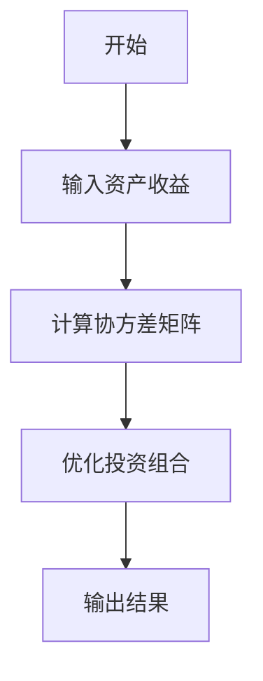
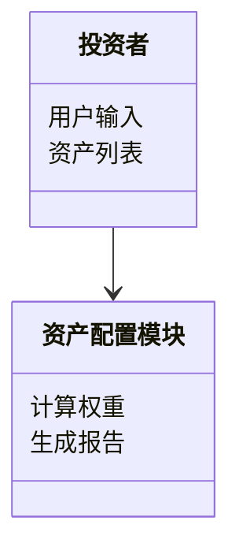

                 


# 格雷厄姆的分散化原则：降低投资风险

## 关键词
- 投资分散化
- 风险管理
- 资产配置
- 现代投资组合理论
- 风险降低策略

## 摘要
本文深入探讨了格雷厄姆的分散化原则，解释其核心概念、算法原理、系统架构，并通过实际案例分析，指导读者如何在投资中应用分散化策略来降低风险。文章结构清晰，内容涵盖从理论到实践的各个方面，帮助投资者做出明智决策。

---

# 第一部分：背景介绍

## 第1章：diversification原则的定义与背景

### 1.1 diversification的定义
- **1.1.1 投资分散化的基本概念**  
  分散化是将资金投资于不同资产或资产类别以降低整体风险的策略。通过多样化，投资者可以减少单一投资带来的波动性风险。

- **1.1.2 投资分散化**  
  格雷厄姆强调分散化是降低投资风险的有效方法，通过投资不同类型的资产，减少市场波动对整体投资组合的影响。

---

## 第1.2 现代分散化投资的背景

- **1.2.1 投资分散化的起源与发展**  
  分散化投资起源于20世纪中期，随着金融理论的发展，逐渐成为现代投资组合管理的核心策略。

- **1.2.2 分散化与风险管理**  
  分散化通过降低非系统性风险，帮助投资者在市场波动中保持稳定收益。

---

## 第1.3 分散化投资的重要性

- **1.3.1 分散化如何降低风险**  
  通过投资不同类型资产，分散化可以减少单一资产价格波动带来的损失。

- **1.3.2 分散化与资产配置**  
  合理的资产配置是分散化的基础，投资者需根据自身风险承受能力和目标进行配置。

---

## 第1.4 分散化与其他风险管理方法的比较

- **1.4.1 分散化与保险**  
  保险通过转移风险来管理不确定性，而分散化通过多样化投资降低风险。

- **1.4.2 分散化与对冲策略**  
  对冲策略通过做空和做多来抵消市场风险，而分散化通过多样化资产来降低风险。

---

# 第二部分：核心概念与联系

## 第2章：分散化原则的核心概念

### 2.1 分散化原则的原理
- 分散化通过投资不同资产类别、地理区域和行业，降低特定资产的风险。

### 2.2 分散化策略的类型
| 资产类别 | 优点 | 缺点 |
|----------|------|------|
| 股票     | 高增长潜力 | 高波动性 |
| 债券     | 稳定收益 | 利率风险 |

### 2.3 分散化与投资组合管理
- **mermaid 实体关系图**
  ```mermaid
  graph TD
    I[投资者] --> A[资产类别]
    A --> R[风险等级]
    I --> D[分散化策略]
  ```

---

# 第三部分：算法原理讲解

## 第3章：现代投资组合理论与分散化

### 3.1 马科维茨的均值-方差优化模型
- 通过优化投资组合的期望收益和方差，找到最优风险调整后收益。

### 3.2 分散化算法的实现步骤


### 3.3 Python代码实现
```python
import numpy as np

def portfolio_var(weights, covariance_matrix):
    return (weights.T @ covariance_matrix @ weights)[0,0]

# 示例数据
n_assets = 3
covariance_matrix = np.array([[1, 0.5, 0.3], [0.5, 1, 0.5], [0.3, 0.5, 1]])

# 均等权重
weights = np.array([1/3, 1/3, 1/3])
print(portfolio_var(weights, covariance_matrix))
```

### 3.4 数学模型与公式
- **投资组合的期望收益**：$$E(r_p) = \sum_{i=1}^{n} w_i E(r_i)$$
- **投资组合的方差**：$$Var(r_p) = \sum_{i=1}^{n} \sum_{j=1}^{n} w_i w_j Cov(r_i, r_j)$$

---

# 第四部分：系统分析与架构设计

## 第4章：投资组合管理系统架构

### 4.1 系统功能设计
- **用户界面**：输入资产和权重，选择优化目标。
- **风险评估模块**：计算投资组合的方差和期望收益。

### 4.2 系统架构图


---

# 第五部分：项目实战

## 第5章：分散化策略的实现

### 5.1 环境搭建
- 安装Python和相关库：`pip install numpy pandas`

### 5.2 代码实现
```python
import numpy as np

def optimize_portfolio(n_assets, returns, covariance):
    # 简单的均值-方差优化
    weights = np.ones(n_assets) / n_assets
    return weights

returns = np.array([0.1, 0.15, 0.08])
covariance = np.array([[0.04, 0.02, 0.01], [0.02, 0.06, 0.03], [0.01, 0.03, 0.05]])

weights = optimize_portfolio(3, returns, covariance)
print(weights)
```

### 5.3 实际案例分析
- 分散化投资如何降低波动性，通过具体案例分析收益和风险的权衡。

---

# 第六部分：最佳实践

## 第6章：分散化的应用与注意事项

### 6.1 分散化策略的注意事项
- 定期再平衡投资组合，避免过度集中。

### 6.2 分散化与风险管理的结合
- 监控市场风险，及时调整投资组合。

---

# 第七部分：附录

## 术语表
- **分散化（Diversification）**：投资不同资产以降低风险的策略。

## 工具安装指南
- Python库：`pip install numpy pandas`

## 参考文献
1. 格雷厄姆《证券分析》
2. 马科维茨《投资组合理论》

---

通过以上结构，文章详细讲解了格雷厄姆的分散化原则，从理论到实践，帮助读者理解并应用这一策略。

