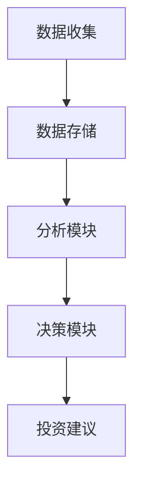

                 


# 格雷厄姆的价值投资公式解析

## 关键词
价值投资，格雷厄姆，内在价值，安全边际，投资公式，财务分析，投资策略

## 摘要
本文深入解析了格雷厄姆的价值投资公式，探讨了内在价值和安全边际的核心概念，通过数学模型和实际案例分析，展示了如何将这些理论应用于投资决策。文章从背景介绍、公式解析、算法实现到系统架构，全面阐述了格雷厄姆的价值投资体系，并提供了Python代码和系统设计的详细指南。

---

## 第一部分：价值投资的背景与核心概念

### 第1章：价值投资的定义与背景

#### 1.1 价值投资的定义
价值投资是一种以基本面分析为基础的投资策略，旨在通过寻找市场价格低于其内在价值的股票，实现长期稳定的收益。与短期交易和投机不同，价值投资强调长期持有优质资产，耐心等待市场对其内在价值的认可。

#### 1.2 格雷厄姆的生平与贡献
本·格雷厄姆（Ben Graham）是价值投资的鼻祖，被誉为“价值投资之父”。他在20世纪初提出了许多影响深远的投资理念，包括安全边际、内在价值等。他的著作《证券分析》和《聪明的投资者》奠定了现代价值投资的基础。

---

### 第2章：价值投资的核心概念

#### 2.1 内在价值的定义与计算
内在价值是指一家企业在当前市场条件下所能创造的最大价值，与市场价格无关。格雷厄姆通常使用股息率和市盈率等指标来评估内在价值。公式如下：

$$
\text{内在价值} = \frac{\text{股息}}{\text{折现率}}
$$

#### 2.2 安全边际的概念与应用
安全边际是指市场价格与内在价值之间的差距。格雷厄姆建议以低于内在价值的价格购买股票，确保在市场价格波动时仍能获得收益。安全边际公式为：

$$
\text{安全边际} = \text{内在价值} - \text{市场价格}
$$

---

## 第二部分：价值投资的数学模型与公式

### 第3章：格雷厄姆的经典公式

#### 3.1 内在价值公式
格雷厄姆的内在价值计算公式考虑了企业的盈利能力、成长性和财务状况。公式如下：

$$
\text{内在价值} = \frac{D_1}{r - g}
$$

其中：
- \( D_1 \)：第一年预期股息
- \( r \)：折现率
- \( g \)：股息增长率

#### 3.2 安全边际公式
安全边际确保投资者在市场价格波动时仍能获得收益：

$$
\text{安全边际} = \text{内在价值} \times (1 - \text{安全边际率})
$$

---

### 第4章：价值投资的数学模型

#### 4.1 内在价值的数学模型
通过股息增长模型计算内在价值：

$$
\text{内在价值} = \frac{D_0 \times (1 + g)}{r - g}
$$

其中：
- \( D_0 \)：当前股息
- \( g \)：股息增长率
- \( r \)：折现率

#### 4.2 安全边际的数学模型
结合市场价格和内在价值计算安全边际：

$$
\text{安全边际} = \text{内在价值} - \text{市场价格}
$$

---

## 第三部分：系统分析与架构设计

### 第5章：价值投资分析系统

#### 5.1 系统功能设计
系统包括数据收集、分析模块和决策模块。数据收集模块获取财务数据，分析模块计算内在价值和安全边际，决策模块根据结果给出投资建议。

#### 5.2 系统架构设计



#### 5.3 系统接口设计
系统提供API接口，支持第三方数据源接入和分析结果输出。

---

### 第6章：算法实现与代码解析

#### 6.1 Python代码实现

```python
def calculate_intrinsic_value(dividend, discount_rate, growth_rate):
    return dividend * (1 + growth_rate) / (discount_rate - growth_rate)

def calculate_margin_of_safety(intrinsic_value, market_price):
    return intrinsic_value - market_price
```

#### 6.2 代码应用实例
以某公司为例，计算其内在价值和安全边际，判断是否值得投资。

---

## 第四部分：项目实战与案例分析

### 第7章：价值投资案例分析

#### 7.1 案例背景
分析某公司的财务数据，计算其内在价值和安全边际，评估是否具有投资价值。

#### 7.2 数据分析与计算

| 指标     | 数值       |
|----------|------------|
| 当前股息 | $2.00      |
| 折现率   | 10%        |
| 股息增长率 | 5%         |

计算内在价值：

$$
\text{内在价值} = \frac{2.00 \times 1.05}{0.10 - 0.05} = \frac{2.10}{0.05} = 42.00
$$

假设市场价格为$40.00，计算安全边际：

$$
\text{安全边际} = 42.00 - 40.00 = 2.00
$$

---

### 第8章：投资策略与注意事项

#### 8.1 投资策略
- 选择具有稳定股息和良好财务状况的公司。
- 确保安全边际足够大，降低投资风险。

#### 8.2 注意事项
- 定期更新财务数据和市场信息，重新评估内在价值。
- 考虑宏观经济环境和行业风险，避免单一投资。

---

## 第五部分：最佳实践与总结

### 第9章：最佳实践

#### 9.1 投资策略的优化
结合技术分析和基本面分析，制定全面的投资策略。

#### 9.2 风险管理
设定止损点，控制投资组合的波动风险。

### 第10章：总结与展望

格雷厄姆的价值投资公式为投资者提供了科学的分析工具，但实际操作中需结合市场环境和企业动态。未来，价值投资将继续演变，为投资者创造长期收益。

---

## 参考文献
1. 本·格雷厄姆，《证券分析》
2. 本·格雷厄姆，《聪明的投资者》
3. 巴菲特致股东的信系列

