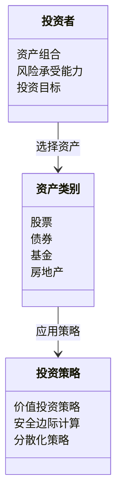
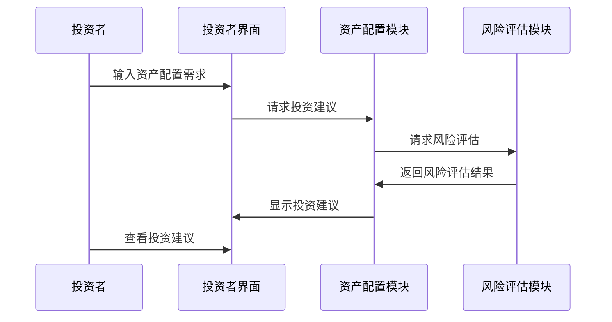

                 


# 格雷厄姆的价值投资原则在不同资产类别中的应用

## 关键词：
- 价值投资
- 格雷厄姆
- 股票
- 债券
- 基金
- 房地产
- 资产配置

## 摘要：
本文系统地探讨了格雷厄姆的价值投资原则在不同资产类别中的应用，包括股票、债券、基金和房地产。文章首先介绍了价值投资的基本概念和核心理念，然后通过数学模型和实例分析，详细阐述了格雷厄姆投资策略在各种资产中的具体应用。文章还结合了系统架构设计和项目实战，展示了如何将价值投资原则应用于实际投资决策中。

---

# 第一部分: 格雷厄姆价值投资原则概述

## 第1章: 价值投资的基本概念

### 1.1 价值投资的定义与核心理念

#### 1.1.1 价值投资的定义
价值投资是一种以基本面分析为基础的投资策略，旨在通过寻找市场价格低于其内在价值的资产来实现长期收益。该策略强调安全边际和长期持有，注重资产的内在价值而非市场波动。

#### 1.1.2 格雷厄姆的价值投资理论
格雷厄姆是价值投资的鼻祖，他提出的核心理论包括：
- **安全边际**：买入价格低于内在价值，以降低风险。
- **防御性投资**：适合风险厌恶的投资者，追求稳定收益。
- **进攻性投资**：适合风险承受能力强的投资者，追求超额收益。

#### 1.1.3 价值投资的核心原则
- **长期投资**：关注企业的长期价值，而非短期市场波动。
- **安全边际**：买入价格低于内在价值。
- **分散投资**：通过多样化降低风险。

---

## 第2章: 格雷厄姆投资策略的数学模型

### 2.1 格雷厄姆投资模型的构建

#### 2.1.1 格雷厄姆投资模型的输入变量
- 市盈率（P/E）
- 市净率（P/PM）
- 股息率（Dividend Yield）

#### 2.1.2 格雷厄姆投资模型的计算公式
格雷厄姆的内在价值公式：
$$ V = \frac{P}{E} + \frac{P}{PM} $$

其中，\( P \) 为当前股价，\( E \) 为每股收益，\( PM \) 为每股净资产。

### 2.2 格雷厄姆投资模型的验证与优化

#### 2.2.1 模型的验证方法
- 回测分析：通过历史数据验证模型的有效性。
- 比较分析：与市场指数（如标普500）进行对比。

#### 2.2.2 模型的优化策略
- 结合技术分析：利用趋势指标辅助决策。
- 动态调整：根据市场变化定期优化模型参数。

---

## 第3章: 格雷厄姆价值投资在股票资产中的应用

### 3.1 股票投资的基本策略

#### 3.1.1 防御性投资者的策略
防御性投资者注重稳定收益，选择低市盈率和低市净率的股票。例如，投资于公用事业或消费品行业的龙头企业。

#### 3.1.2 进攻性投资者的策略
进攻性投资者寻找成长潜力大的股票，关注高市盈率和高市净率的公司，如科技类股票。

#### 3.1.3 安全边际的概念与计算
安全边际 = 内在价值 - 市场价格。例如，如果某股票的内在价值为50元，市场价格为40元，则安全边际为10元。

### 3.2 股票估值方法

#### 3.2.1 市盈率法
市盈率（P/E）= 股价 / 每股收益。例如，某股票P/E为15，低于行业平均水平20，则该股票可能被低估。

#### 3.2.2 市净率法
市净率（P/PM）= 股价 / 每股净资产。例如，某银行股的P/PM为1.5，低于行业平均水平2，则该股票可能被低估。

#### 3.2.3 股息率法
股息率 = 每股股息 / 股价。例如，某股票股息率为5%，高于行业平均水平3%，则该股票具有较高的分红吸引力。

---

## 第4章: 格雷厄姆价值投资在债券资产中的应用

### 4.1 债券投资的基本概念

#### 4.1.1 债券的定义与分类
- **定义**：债券是发行人债务工具，承诺在特定日期偿还本金和利息。
- **分类**：政府债券、公司债券、可转换债券等。

#### 4.1.2 债券的主要风险
- 利率风险：利率上升导致债券价格下跌。
- 信用风险：债券发行人违约的风险。

#### 4.1.3 债券的收益率计算
- 税前收益率 = 利息收入 / 购买价格。
- 税后收益率 = 税前收益率 × (1 - 税率)。

### 4.2 格雷厄姆债券投资策略

#### 4.2.1 债券的安全性评估
- 选择高信用评级的债券，如AAA级债券。
- 关注发行人的财务状况，确保其具备偿还能力。

#### 4.2.2 债券的收益与风险平衡
- 高收益债券通常伴随着高风险。
- 通过分散投资降低整体风险。

#### 4.2.3 债券投资的分散化策略
- 投资于不同发行人的债券，降低信用风险。
- 配置不同期限的债券，平衡流动性需求。

---

## 第5章: 格雷厄姆价值投资在基金资产中的应用

### 5.1 基金投资的基本概念

#### 5.1.1 共同基金与指数基金的区别
- 共同基金：由专业管理人操作，费用较高。
- 指数基金：被动跟踪指数，费用较低。

#### 5.1.2 基金的主要分类
- 股票型基金、债券型基金、混合型基金、货币市场基金。

#### 5.1.3 基金投资的风险与收益
- 风险：市场波动、流动性风险。
- 收益：长期来看，基金收益通常高于存款收益。

### 5.2 格雷厄姆基金投资策略

#### 5.2.1 基金选择的标准
- 选择长期表现稳定的基金。
- 关注基金管理人的投资策略和历史业绩。

#### 5.2.2 基金投资的分散化策略
- 配置不同类型的基金，降低整体风险。
- 定期调整投资组合，适应市场变化。

#### 5.2.3 基金投资的长期策略
- 长期持有，避免频繁交易。
- 定期定额投资，分散风险。

---

## 第6章: 格雷厄姆价值投资在房地产资产中的应用

### 6.1 房地产投资的基本概念

#### 6.1.1 房地产的定义与分类
- 房地产包括土地、建筑物及配套设施。
- 分为住宅、商业、工业等类型。

#### 6.1.2 房地产投资的主要风险
- 市场风险：房地产价格波动。
- 流动性风险：难以快速变现。

#### 6.1.3 房地产的收益率计算
- 净资产收益率（ROE）= 净利润 / 净资产。
- 投资回报率（ROI）= 净利润 / 初始投资。

### 6.2 格雷厄姆房地产投资策略

#### 6.2.1 房地产的安全性评估
- 选择地理位置优越的房产。
- 关注区域经济发展前景。

#### 6.2.2 房地产的收益与风险平衡
- 长期租赁模式：稳定收益，但流动性差。
- 投资房地产信托（REITs）：间接投资，流动性较好。

#### 6.2.3 房地产投资的分散化策略
- 配置不同地区的房地产，降低区域风险。
- 结合其他资产类别，实现整体投资组合的分散化。

---

## 第7章: 系统分析与架构设计

### 7.1 问题场景介绍
投资者需要构建一个基于格雷厄姆价值投资原则的投资管理系统，实现资产配置、风险评估和投资决策支持。

### 7.2 系统功能设计

#### 7.2.1 领域模型设计


### 7.3 系统架构设计

#### 7.3.1 系统架构图
```mermaid
architecturalDiagram
    package 投资管理系统 {
        class 投资者界面 {
            输入资产配置需求
            显示投资建议
        }
        class 资产配置模块 {
            分析资产类别
            计算内在价值
        }
        class 风险评估模块 {
            评估风险等级
            提供分散化建议
        }
        投资者界面 --> 资产配置模块
        资产配置模块 --> 风险评估模块
    }
```

### 7.4 系统接口设计
- 投资者界面：提供资产配置需求的输入接口。
- 资产配置模块：返回基于格雷厄姆策略的投资建议。
- 风险评估模块：返回风险评估结果和分散化建议。

### 7.5 系统交互设计

#### 7.5.1 投资者与系统交互流程


---

## 第8章: 项目实战

### 8.1 环境安装
- 操作系统：Windows 10或更高版本。
- 开发工具：Python 3.8以上，Jupyter Notebook，Pandas库。

### 8.2 核心实现源代码

#### 8.2.1 股票估值代码
```python
import pandas as pd

def calculate_intrinsic_value(stock_price, earnings_per_share, book_value_per_share):
    pe_ratio = stock_price / earnings_per_share
    pb_ratio = stock_price / book_value_per_share
    intrinsic_value = pe_ratio + pb_ratio
    return intrinsic_value

# 示例数据
stock_price = 100
earnings_per_share = 25
book_value_per_share = 50

intrinsic_value = calculate_intrinsic_value(stock_price, earnings_per_share, book_value_per_share)
print(f"内在线值为：{intrinsic_value}")
```

#### 8.2.2 债券安全评估代码
```python
def bond_security_assessment(face_value, coupon_rate, years_to_maturity):
    current_price = face_value / (1 + coupon_rate/100)
    return current_price

face_value = 1000
coupon_rate = 5
years_to_maturity = 10

security_assessment = bond_security_assessment(face_value, coupon_rate, years_to_maturity)
print(f"债券安全评估价格为：{security_assessment}")
```

### 8.3 代码应用解读与分析
- 股票估值代码：计算股票的内在价值，帮助投资者判断是否低估。
- 债券安全评估代码：评估债券的安全性，选择合适的债券进行投资。

### 8.4 实际案例分析
- 案例：某股票的内在价值计算。
  - 股价：$100
  - 每股收益：$25
  - 每股净资产：$50
  - 内在线值：$100 / $25 + $100 / $50 = 4 + 2 = $6
  - 结论：股票被低估，具有投资价值。

---

## 第9章: 总结与展望

### 9.1 总结
本文详细探讨了格雷厄姆的价值投资原则在不同资产类别中的应用，包括股票、债券、基金和房地产。通过数学模型、系统架构设计和项目实战，展示了如何将价值投资原则应用于实际投资决策中。

### 9.2 展望
未来，随着市场环境的变化，价值投资策略需要不断优化和创新。投资者应结合市场趋势和技术进步，灵活调整投资策略，以实现长期稳定的收益。

---

通过本文的系统分析和实际案例，读者可以更好地理解格雷厄姆的价值投资原则，并将其应用于实际投资中，实现财富的长期增长。

