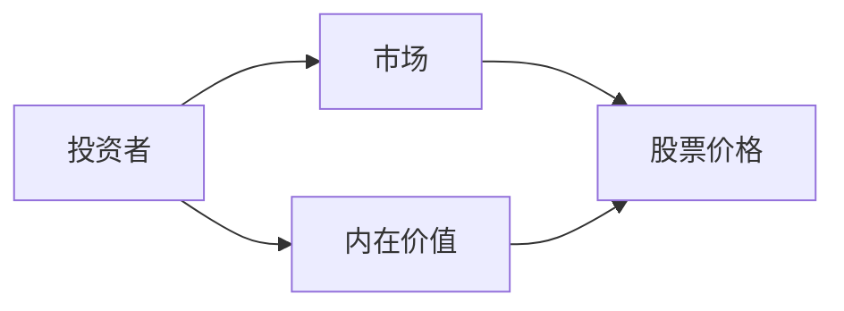
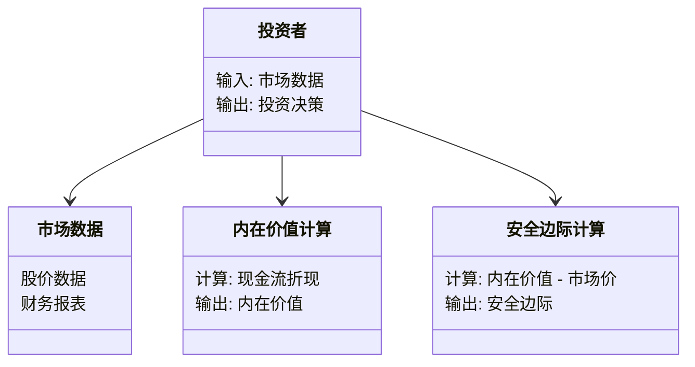
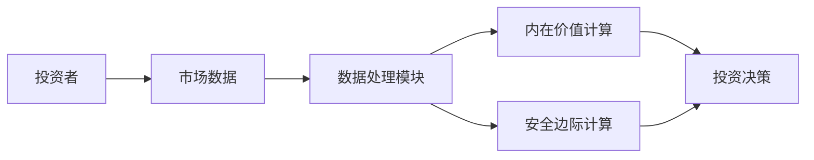

                 


# 格雷厄姆的价值投资原则现代解读

## 关键词
- 价值投资
- 内在价值
- 安全边际
- 现代投资理论
- 格雷厄姆
- 价值评估

## 摘要
本文旨在通过现代视角重新解读格雷厄姆的价值投资原则，结合经典理论与现代投资实践，探讨其在当前复杂市场环境中的应用。文章从价值投资的背景、核心概念、数学模型、系统架构等多个维度展开分析，结合实际案例，为投资者提供深入的理论支持和实践指导。

---

## 第1章: 价值投资的背景与核心概念

### 1.1 价值投资的起源与发展

#### 1.1.1 价值投资的起源
价值投资由本杰明·格雷厄姆在20世纪初提出，强调以低于内在价值的价格购买优质资产。其起源可追溯至1929年大萧条时期，格雷厄姆通过分析市场的非理性波动，提出了安全边际的概念。

#### 1.1.2 格雷厄姆的贡献与影响
格雷厄姆的学生彼得·林奇和巴菲特继承并发展了价值投资理论，使其成为投资领域的重要流派。格雷厄姆的《证券分析》一书奠定了价值投资的基础。

#### 1.1.3 现代价值投资的发展与演变
现代价值投资结合了量化分析和行为金融学，扩展了其应用场景。技术进步和全球化使得价值投资的工具和方法更加多样化。

### 1.2 价值投资的核心理念

#### 1.2.1 市场先生与投资者的角色
格雷厄姆将市场比作情绪化的“市场先生”，投资者应保持理性，利用市场的非理性波动寻找投资机会。

#### 1.2.2 安全边际的定义与重要性
安全边际=内在价值-市场价格，是投资中的“缓冲区”，确保投资的安全性和盈利能力。

#### 1.2.3 内在价值的计算与意义
内在价值是资产的未来现金流的现值，是决定投资价值的关键因素。

### 1.3 价值投资的核心要素对比

#### 1.3.1 核心概念属性对比表格

| 概念         | 描述                                   | 示例                         |
|--------------|--------------------------------------|------------------------------|
| 内在价值     | 资产的未来现金流现值                 | 股票未来分红的现值           |
| 安全边际     | 投资价格与内在价值的差距             | 股票价格低于内在价值         |
| 市场情绪     | 投资者情绪波动                       | 市场恐慌或狂热               |

#### 1.3.2 实体关系图（Mermaid）



---

## 第2章: 格雷厄姆价值投资的现代解读

### 2.1 现代市场环境的变化

#### 2.1.1 技术进步对投资的影响
量化交易、算法交易等技术手段的出现，使得市场更加高效和复杂。

#### 2.1.2 全球化与市场的复杂性
全球化导致市场参与者更多样化，投资标的更加多元化。

#### 2.1.3 现代金融工具与投资策略
衍生品、指数基金等工具的普及，为投资者提供了更多选择。

### 2.2 现代价值投资的调整与优化

#### 2.2.1 格雷厄姆理论的现代应用
结合现代量化分析工具，优化内在价值的计算方法。

#### 2.2.2 现代安全边际的计算方法
引入波动率、贝塔值等指标，动态调整安全边际。

#### 2.2.3 内在价值的动态评估
结合实时数据和市场变化，定期更新内在价值评估。

---

## 第3章: 价值投资的数学模型与算法原理

### 3.1 内在价值的计算公式

#### 3.1.1 格雷厄姆的内在价值公式

$$ V = \sum_{t=1}^{n} \frac{C_t}{(1+r)^t} $$

其中：
- \( V \) 表示内在价值
- \( C_t \) 表示第 \( t \) 年的现金流
- \( r \) 表示折现率

#### 3.1.2 现代改进模型

$$ V = \frac{C_1}{r - g} + \frac{C_n}{(1+r)^n} $$

### 3.2 安全边际的计算方法

#### 3.2.1 安全边际公式

$$ \text{安全边际} = \text{内在价值} - \text{市场价格} $$

#### 3.2.2 算法流程图（Mermaid）


---

## 第4章: 价值投资的系统架构与实现

### 4.1 价值投资决策系统的功能设计

#### 4.1.1 系统功能模块



### 4.2 系统架构设计

#### 4.2.1 系统架构图（Mermaid）



---

## 第5章: 项目实战与案例分析

### 5.1 项目环境安装

```bash
pip install pandas numpy matplotlib
```

### 5.2 核心实现代码

```python
def calculate_intrinsic_value(cash_flows, discount_rate):
    return sum(c / (1 + discount_rate)**t for t, c in enumerate(cash_flows))

def calculate_margin_of_safety(intrinsic_value, market_price):
    return intrinsic_value - market_price
```

### 5.3 案例分析与解读

#### 5.3.1 案例选择
以贵州茅台为例，假设其未来5年的现金流分别为100, 110, 120, 130, 140，折现率为10%。

#### 5.3.2 内在价值计算

$$ V = \frac{100}{0.10} + \frac{110}{(1+0.10)^2} + \frac{120}{(1+0.10)^3} + \frac{130}{(1+0.10)^4} + \frac{140}{(1+0.10)^5} $$

---

## 第6章: 总结与展望

### 6.1 小结
本文从多个维度解读了格雷厄姆的价值投资原则，并结合现代技术进行了创新和优化，为投资者提供了新的视角和工具。

### 6.2 注意事项
投资者应结合市场环境和自身情况，灵活应用价值投资原则，避免机械操作。

### 6.3 拓展阅读
推荐阅读《证券分析》和《巴菲特传》，深入了解价值投资的精髓。

---

通过以上思考，我们逐步构建了《格雷厄姆的价值投资原则现代解读》的技术博客文章，涵盖了从理论到实践的各个方面，为读者提供了深入的分析和指导。

