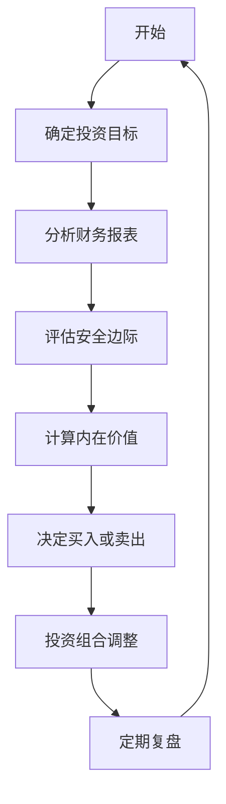
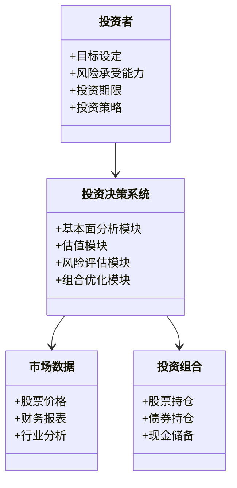
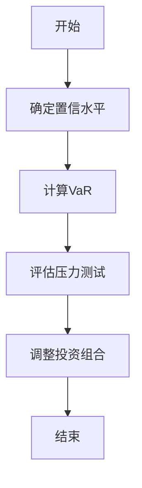

                 


```markdown
# 格雷厄姆的价值投资实践指南

## 关键词
- 格雷厄姆
- 价值投资
- 股票分析
- 投资组合
- 风险管理

## 摘要
本文深入探讨了格雷厄姆的价值投资理论及其在实际中的应用。通过分析核心概念、股票分析方法、投资组合构建和风险管理策略，为读者提供系统化的投资指南。文章结合理论与实践，帮助投资者在复杂市场中做出明智决策。

---

## 第一部分: 价值投资的核心理念

### 第1章: 格雷厄姆的生平与投资理念

#### 1.1 格雷厄姆的生平简介
- **早期经历**：出生于伦敦，后移居美国，师从 Benjamin Franklin。
- **学术贡献**：在哥伦比亚大学任教，培养了巴菲特等著名投资者。
- **著述影响**：与大卫·多德合著《安全的套期交易》，奠定价值投资基础。

#### 1.2 格雷厄姆的价值投资理念
- **安全边际**：买入价格低于内在价值，以降低风险。
- **市场先生理论**：市场情绪波动影响价格，而非价值。
- **长期投资**：通过持有优质股票实现财富增长。

#### 1.3 格雷厄姆的投资哲学
- **逆向思维**：在市场恐慌时寻找机会。
- **分散投资**：降低单一投资的风险。
- **耐心与纪律**：坚持长期投资，避免短期波动干扰。

---

## 第二部分: 股票分析的核心方法

### 第2章: 基本面分析的关键要素

#### 2.1 财务报表分析
- **收入与利润**：关注收入增长和利润率。
- **现金流**：健康的现金流是企业稳定的保障。
- **资产负债表**：评估企业的资产和负债状况。

#### 2.2 估值指标
- **市盈率（P/E）**：价格与收益的比率，衡量估值高低。
- **市净率（P/B）**：价格与净资产的比率，适用于评估资产密集型企业。
- **股息率**：收益的一部分以股息形式返还，衡量分红能力。

#### 2.3 企业竞争优势
- **护城河**：独特的竞争优势，如专利、品牌、成本优势。
- **管理层能力**：优秀管理层能提升企业价值。
- **行业地位**：企业在行业中的竞争力和市场份额。

### 第3章: 格雷厄姆的选股标准

#### 3.1 低市盈率与低市净率
- **低P/E策略**：寻找被市场低估的企业。
- **低P/B策略**：关注资产价值被低估的企业。

#### 3.2 高股息率
- **股息的重要性**：稳定的股息收入是投资回报的重要来源。
- **股息增长**：寻找股息逐年增长的企业。

#### 3.3 财务健康状况
- **低债务**：避免高负债带来的财务风险。
- **稳健的现金流**：确保企业有持续的运营资金。

---

## 第三部分: 投资组合的构建与风险管理

### 第4章: 投资组合的构建原则

#### 4.1 分散投资
- **资产配置**：将资金分配到股票、债券、现金等不同资产类别。
- **行业分散**：避免过度集中于某一行业。

#### 4.2 资本配置
- **动态调整**：根据市场变化和个人财务状况调整资产配置。
- **杠杆使用**：谨慎使用杠杆，避免过高负债。

### 第5章: 风险管理策略

#### 5.1 设置止损点
- **止损原理**：在股价下跌到一定程度时卖出，避免更大损失。
- **止损线的设置**：根据技术分析或基本面变化设定止损点。

#### 5.2 风险与回报的平衡
- **风险承受能力**：根据个人风险偏好调整投资策略。
- **风险调整后的收益**：考虑风险因素后的真实回报。

#### 5.3 压力测试
- **情景分析**：模拟极端市场情况下的投资组合表现。
- **压力测试方法**：评估投资组合在极端情况下的抗跌能力。

---

## 第四部分: 价值投资的实践与心理控制

### 第6章: 投资心理与行为偏差

#### 6.1 心理偏差的影响
- **贪婪与恐惧**：市场上涨时贪婪，下跌时恐惧。
- **从众心理**：盲目跟随市场潮流可能导致错误决策。

#### 6.2 投资纪律的重要性
- **坚持长期投资**：避免短期波动的干扰。
- **定期复盘**：评估投资组合表现，及时调整策略。

### 第7章: 实际案例分析

#### 7.1 格雷厄姆的经典案例
- **购买某公司的股票**：展示如何通过基本面分析找到低估股票。
- **卖出决策**：说明何时以及如何做出卖出决定。

#### 7.2 现实中的应用
- **普通投资者的策略**：如何在实际操作中应用格雷厄姆的理论。
- **长期投资的回报**：通过具体数据展示长期投资的优势。

---

## 第五部分: 总结与展望

### 第8章: 总结

#### 8.1 核心要点回顾
- **价值投资的核心理念**：安全边际、内在价值、长期投资。
- **股票分析的关键要素**：财务报表、估值指标、竞争优势。

#### 8.2 投资策略总结
- **分散投资**：降低风险。
- **风险管理**：设置止损，评估压力测试。
- **心理控制**：克服心理偏差，保持纪律。

### 第9章: 未来展望

#### 9.1 价值投资的演变
- **新市场环境**：科技发展、全球化对投资的影响。
- **新工具的应用**：大数据、人工智能在投资分析中的作用。

#### 9.2 对投资者的建议
- **持续学习**：市场变化不断，需不断更新知识。
- **保持耐心**：价值投资需要时间，耐心持有优质资产。

---

## 第六部分: 最佳实践与注意事项

### 第10章: 投资注意事项

#### 10.1 避免的误区
- **过度关注短期波动**：忽视长期价值。
- **盲目跟风**：跟随市场潮流而不做独立分析。

#### 10.2 实战中的技巧
- **定期复盘**：回顾投资表现，总结经验教训。
- **关注经济周期**：根据经济周期调整投资策略。

### 第11章: 投资小结

#### 11.1 核心要点回顾
- **价值投资的本质**：寻找低估的优质资产。
- **长期投资的重要性**：时间是价值投资者的朋友。

#### 11.2 对未来投资的展望
- **持续学习**：市场变化快，需不断更新知识。
- **保持纪律**：遵循既定的投资策略，避免情绪化决策。

---

## 第七部分: 拓展阅读与进一步学习

### 第12章: 推荐书籍与资源

#### 12.1 格雷厄姆的经典著作
- 《安全的套期交易》：格雷厄姆与多德的合著，价值投资的 bible。
- 《 Intelligent Investor》：巴菲特推崇的投资指南。

#### 12.2 其他推荐阅读
- 《The New Value investing》：现代价值投资的演变与应用。
- 《The Warren Buffett Portfolio》：巴菲特的投资策略与实践。

---

## 结语

格雷厄姆的价值投资理论为投资者提供了坚实的基础，但成功投资不仅需要理论知识，更需要实践中的纪律和耐心。通过深入理解格雷厄姆的投资理念，并将其与实际市场相结合，投资者可以在复杂的市场中找到成功的路径。记住，投资不是一场短跑，而是一场马拉松，需要持久的耐心和纪律。

---

## 附录

### 附录A: 格雷厄姆投资理论的数学模型

#### A.1 现金流贴现模型（DCF）
$$DCF = \sum_{t=1}^{n} \frac{CF_t}{(1+r)^t} + \frac{TV}{(1+r)^n}$$

其中：
- $CF_t$：第t年的现金流
- $r$：折现率
- $TV$：终值

#### A.2 市盈率（P/E）计算
$$P/E = \frac{股票价格}{每股收益}$$

#### A.3 市净率（P/B）计算
$$P/B = \frac{股票价格}{每股净资产}$$

### 附录B: 格雷厄姆投资策略的Mermaid流程图



### 附录C: 价值投资系统的架构设计



### 附录D: 风险管理的VaR模型



---

## 结语

通过系统的分析和实际案例的探讨，格雷厄姆的价值投资理论为投资者提供了明确的指导。从基本面分析到投资组合构建，再到风险管理，每一步都需要细致的分析和严格的纪律。希望本文能够帮助读者更好地理解和应用价值投资的理念，实现长期稳定的财富增长。
```

