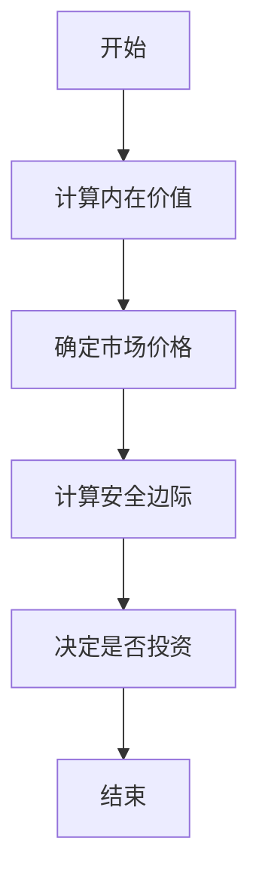
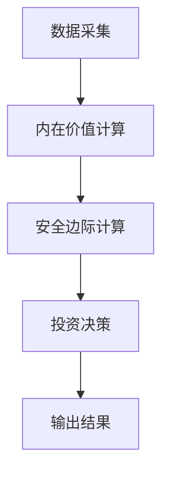

                 


# 格雷厄姆的价值投资实践案例

## 关键词
- 格雷厄姆
- 价值投资
- 内在价值
- 安全边际
- 投资策略

## 摘要
本文详细介绍了格雷厄姆的价值投资理论及其实际应用案例。通过分析价值投资的核心概念，如内在价值和安全边际，探讨了格雷厄姆的投资策略，并结合实际案例展示了如何在现代投资环境中应用这些理论。文章还详细讲解了价值投资的数学模型、系统架构和项目实战，为读者提供了全面的指导。

---

## 第一部分: 格雷厄姆的价值投资背景与基础

### 第1章: 价值投资的背景与核心概念

#### 1.1 价值投资的起源与发展
##### 1.1.1 格雷厄姆的生平与投资理念
 Benjamin Graham 是20世纪著名的投资学家，被誉为“价值投资之父”。他出生于1894年，曾在哥伦比亚大学教授证券分析，其投资理念对整个投资界产生了深远影响。格雷厄姆的投资理念强调安全性和长期稳健回报，主张以低于内在价值的价格买入股票。

##### 1.1.2 价值投资的核心思想与特点
 价值投资的核心思想是寻找市场价格低于内在价值的股票进行投资。其特点包括：
 - 以基本面分析为基础
 - 强调安全边际
 - 侧重于长期投资而非短期波动

##### 1.1.3 价值投资与现代投资学的联系与区别
 联系：
 - 两者都基于基本面分析
 - 强调风险管理
 区别：
 - 价值投资注重内在价值，而现代投资学更注重市场趋势和技术分析

#### 1.2 价值投资的基本原理
##### 1.2.1 投资的基本问题与解决思路
 投资的核心问题在于如何在不确定的市场中实现稳健的回报。价值投资通过分析企业的内在价值，寻找被市场低估的机会。

##### 1.2.2 价值投资的核心概念与属性对比
 下表展示了价值投资与其他投资策略的核心概念对比：

| 比较维度 | 价值投资 | 其他投资策略 |
|----------|-----------|--------------|
| 核心理念 | 内在价值 | 市场趋势 |
| 投资目标 | 长期稳健回报 | 短期收益最大化 |
| 风险管理 | 强调安全边际 | 侧重技术分析 |

##### 1.2.3 价值投资的ER实体关系图
 下图展示了价值投资的核心实体及其关系：

```mermaid
erDiagram
    customer[投资者] {
        +Id: int
        +资金: float
        +风险偏好: string
    }
    stock[股票] {
        +Id: int
        +名称: string
        +内在价值: float
        +市场价格: float
    }
    investment[投资] {
        +Id: int
        +投资金额: float
        +投资期限: int
    }
    customer -> stock: 购买
    stock -> investment: 产生
```

---

### 第2章: 格雷厄姆的价值投资模型

#### 2.1 格雷厄姆的投资策略
##### 2.1.1 股票内在价值的计算公式
 内在价值是企业未来现金流的现值。格雷厄姆提出了以下计算公式：

$$ V = \frac{E}{(1 + r)^n} $$

 其中：
 - \( V \) 为内在价值
 - \( E \) 为未来现金流
 - \( r \) 为折现率
 - \( n \) 为时间跨度

##### 2.1.2 安全边际的概念与计算
 安全边际是市场价格与内在价值之间的差异。公式如下：

$$ \text{安全边际} = \text{内在价值} - \text{市场价格} $$

##### 2.1.3 内在价值的公式推导与应用
 以某公司为例，假设未来5年的现金流分别为100万、120万、150万、180万、200万，折现率为10%。计算其内在价值：

$$ V = \frac{100}{1.1} + \frac{120}{1.1^2} + \frac{150}{1.1^3} + \frac{180}{1.1^4} + \frac{200}{1.1^5} \approx 471.63 \text{万} $$

 若市场价格为400万，则安全边际为71.63万。

---

#### 2.2 价值投资的数学模型与公式
##### 2.2.1 决策树分析
 下图展示了价值投资的决策流程：



---

## 第三部分: 价值投资的系统分析与架构设计

### 第3章: 价值投资的系统框架

#### 3.1 价值投资的系统目标
 系统目标是通过分析企业的基本面数据，计算其内在价值，并基于安全边际制定投资策略。

#### 3.2 价值投资系统的功能设计
##### 3.2.1 系统功能模块
 - 数据采集模块：收集企业的财务数据
 - 内在价值计算模块：基于公式计算内在价值
 - 安全边际计算模块：计算安全边际
 - 投资决策模块：基于安全边际制定投资策略

##### 3.2.2 功能流程图
 下图展示了系统的功能流程：



---

### 第4章: 价值投资的项目实战

#### 4.1 项目背景与目标
 本项目旨在通过价值投资的方法，分析某上市公司的投资价值。

#### 4.2 系统实现
##### 4.2.1 环境安装与数据收集
 使用Python进行开发，数据来源为公司财务报表。

##### 4.2.2 核心代码实现
 计算内在价值的Python代码如下：

```python
def calculate_intrinsic_value(cash_flows, discount_rate, years):
    iv = 0
    for i in range(years):
        iv += cash_flows[i] / (1 + discount_rate) ** (i + 1)
    return iv

cash_flows = [100, 120, 150, 180, 200]
discount_rate = 0.1
years = 5
iv = calculate_intrinsic_value(cash_flows, discount_rate, years)
print(f"内在价值: {iv}")
```

##### 4.2.3 投资策略制定
 根据计算结果，若市场价格低于内在价值，建议买入；反之，建议卖出。

---

### 第5章: 总结与展望

#### 5.1 总结
 本文详细介绍了格雷厄姆的价值投资理论，并通过实际案例展示了其应用。通过系统的分析和实战，证明了价值投资的有效性。

#### 5.2 展望
 未来的研究可以结合大数据和人工智能技术，进一步优化内在价值的计算方法，提高投资决策的准确性。

---

## 结语
 格雷厄姆的价值投资理论为投资者提供了科学的指导。通过本文的分析，读者可以更好地理解价值投资的核心思想，并在实际操作中加以应用。

