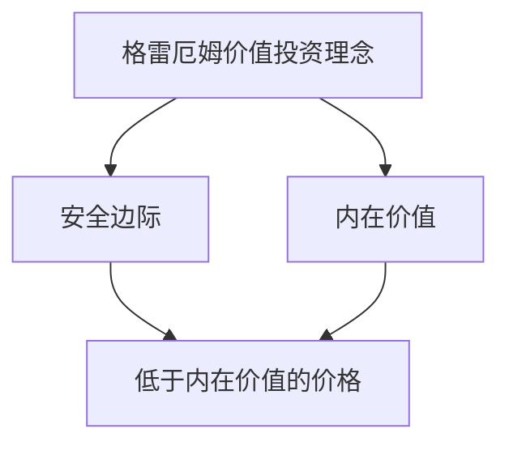
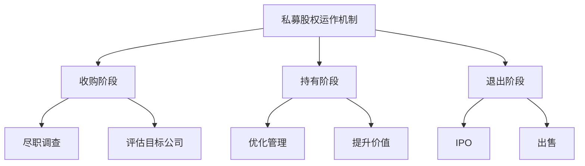
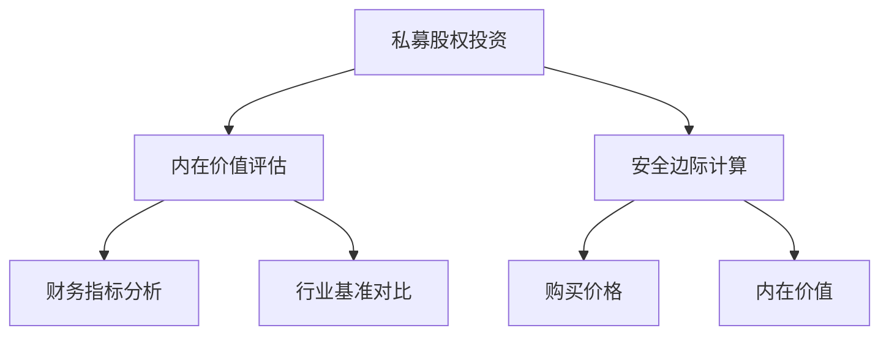
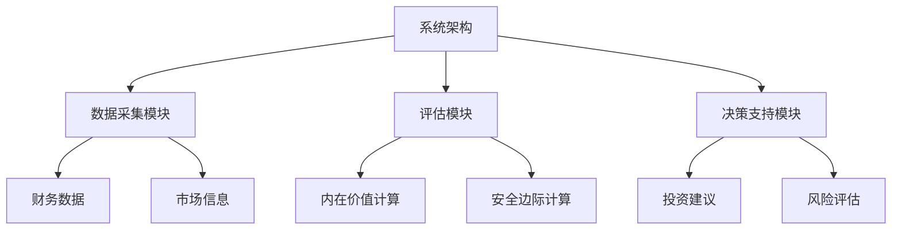

                 


# 《格雷厄姆的价值投资理念在私募股权中的应用》

> 关键词：价值投资，私募股权，格雷厄姆，安全边际，内在价值，投资策略

> 摘要：本文探讨了格雷厄姆的价值投资理念在私募股权中的应用。通过分析私募股权的特点和运作机制，结合格雷厄姆的安全边际、内在价值等核心概念，提出了在私募股权中应用价值投资的具体方法。文章包括理论基础、应用分析、案例研究、系统设计和项目实战等部分，为投资者提供了系统的指导和参考。

---

# 第1章 格雷厄姆价值投资理念概述

## 1.1 价值投资的定义与核心理念

### 背景介绍
- **价值投资**：一种以基本面分析为基础的投资策略，强调以低于内在价值的价格购买优质资产。
- **格雷厄姆的贡献**：提出“安全边际”和“内在价值”等核心概念，为价值投资奠定了理论基础。

### 核心概念与联系
- **安全边际**：购买价格低于内在价值的差额，提供风险缓冲。
- **内在价值**：资产在未来现金流的现值，计算公式为：
  $$ \text{内在价值} = \sum_{t=1}^{n} \frac{\text{现金流}}{(1 + r)^t} $$
  其中，r为折现率，n为现金流期限。

### 图形化展示


---

# 第2章 私募股权的特点与运作机制

## 2.1 私募股权的基本概念

### 背景介绍
- **私募股权**：对未上市公司部分或全部股权的投资，通常通过杠杆收购、管理层收购等方式进行。
- **运作机制**：私募基金通过收购、重组、增值后出售实现收益。

### 核心概念与联系
- **私募股权的三阶段模型**：
  1. **收购阶段**：评估目标公司，进行尽职调查。
  2. **持有阶段**：优化管理，提升价值。
  3. **退出阶段**：通过IPO或出售实现收益。

### 图形化展示


---

# 第3章 格雷厄姆理念在私募股权中的应用

## 3.1 格雷厄姆理念与私募股权的结合

### 背景介绍
- **核心策略**：在私募股权中应用格雷厄姆的内在价值评估和安全边际概念，寻找被低估的投资目标。

### 核心概念与联系
- **内在价值评估**：通过财务指标（如EBITDA、净利润）和行业基准进行分析。
- **安全边际计算**：购买价格与内在价值的差异，确保投资的安全性。

### 图形化展示


---

# 第4章 私募股权价值投资的系统设计

## 4.1 系统架构设计

### 背景介绍
- **系统目标**：构建一个基于格雷厄姆理念的私募股权分析系统，帮助投资者进行决策。

### 核心概念与联系
- **系统功能模块**：
  1. 数据采集模块：收集目标公司的财务数据和市场信息。
  2. 评估模块：计算内在价值和安全边际。
  3. 决策支持模块：提供投资建议和风险评估。

### 图形化展示


---

# 第5章 项目实战：私募股权价值投资分析

## 5.1 环境安装与数据准备

### 背景介绍
- **工具选择**：使用Python进行数据分析，利用Pandas、NumPy等库。

### 核心代码实现
```python
import pandas as pd
import numpy as np

# 示例数据：假设目标公司的财务数据
data = {
    '收入': [100, 200, 150],
    '净利润': [20, 30, 25],
    '现金流': [50, 70, 60]
}
df = pd.DataFrame(data)

# 计算内在价值
def calculate_intrinsic_value(df):
    # 简单示例，实际应根据具体模型计算
    average_cash_flow = df['现金流'].mean()
    growth_rate = 0.1
    discount_rate = 0.08
    return average_cash_flow / (1 - (1 + discount_rate)**-5) * (1 + growth_rate)
```

---

# 第6章 总结与展望

## 6.1 小结
- 格雷厄姆的价值投资理念为私募股权提供了科学的分析框架，结合安全边际和内在价值评估，帮助投资者做出明智决策。

## 6.2 注意事项
- 私募股权市场波动大，需谨慎评估风险。
- 持股期间需关注公司管理团队和运营状况。

## 6.3 拓展阅读
- 格雷厄姆的《 Intelligent Investor 》
- 私募股权相关的经典书籍和研究论文。

---

通过以上结构和内容，本文系统地阐述了格雷厄姆的价值投资理念在私募股权中的应用，为投资者提供了理论支持和实践指导。

