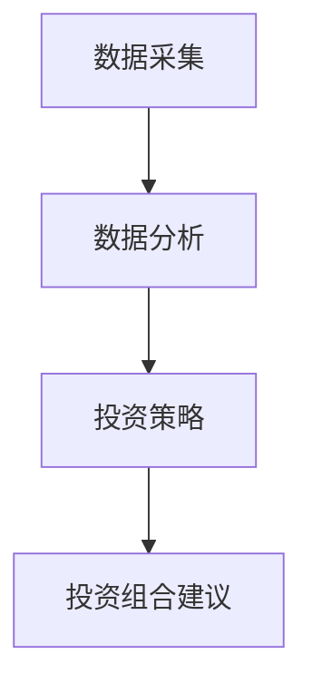

                 


# 《格雷厄姆的价值投资理论在新兴市场的应用》

> 关键词：价值投资，格雷厄姆，新兴市场，投资策略，风险管理，数学模型

> 摘要：本文详细探讨了格雷厄姆的价值投资理论在新兴市场中的应用，通过分析新兴市场的特点、价值投资的核心理念以及如何在新兴市场中寻找低估股票，结合数学模型和系统架构设计，提供了一套完整的投资策略。文章还通过实际案例分析，展示了如何在新兴市场中应用格雷厄姆的投资理论，并提出了风险管理的最佳实践建议。

---

# 第1章 格雷厄姆价值投资理论的核心概念

## 1.1 价值投资的基本定义

### 1.1.1 价值投资的起源与发展

- **定义**：价值投资是一种以低于股票内在价值的价格购买股票的投资策略。
- **历史背景**：起源于20世纪20年代，本杰明·格雷厄姆是该理论的奠基人。
- **发展**：经过沃伦·巴菲特等投资者的发展，价值投资理论不断完善。

### 1.1.2 格雷厄姆的价值投资理念

- **核心理念**：寻找市场先生的错误定价，以安全边际为核心。
- **安全边际**：购买价格低于内在价值的折扣部分，确保投资的安全性。
- **内在价值**：公司未来现金流的现值，计算公式为：
  $$
  \text{内在价值} = \frac{\text{每股收益} \times (5 + \text{增长率})}{\text{资本成本}}
  $$

### 1.1.3 价值投资的核心原则

- **长期投资**：避免短期市场波动的干扰。
- **安全边际**：确保买入价格远低于内在价值。
- **分散投资**：降低单一投资的风险。

---

## 1.2 新兴市场的特点与挑战

### 1.2.1 新兴市场的定义与特点

- **定义**：指那些经济增长迅速、市场机制尚不完善的国家或地区的金融市场。
- **特点**：
  - 高波动性
  - 政策风险
  - 信息不对称
  - 市场流动性不足

### 1.2.2 格雷厄姆理论在新兴市场的适用性

- **适用性分析**：新兴市场中存在大量低估股票，适合价值投资。
- **挑战**：市场波动大、信息不透明、政策风险高。

### 1.2.3 新兴市场中的投资机会

- **低估股票**：新兴市场中许多公司估值低于其实际价值。
- **成长机会**：新兴市场经济增长快，具备长期增长潜力。

---

# 第2章 格雷厄姆价值投资理论的数学模型与算法

## 2.1 股票内在价值的计算公式

### 2.1.1 格雷厄姆的内在价值公式

- **公式**：
  $$
  \text{内在价值} = \frac{\text{每股收益} \times (5 + \text{增长率})}{\text{资本成本}}
  $$

### 2.1.2 案例分析：如何计算一家公司的内在价值

- **案例**：假设某公司每股收益为10元，增长率5%，资本成本为10%。
  $$
  \text{内在价值} = \frac{10 \times (5 + 5)}{10} = 10 \text{元}
  $$

## 2.2 安全边际的数学模型

### 2.2.1 安全边际的计算公式

- **公式**：
  $$
  \text{安全边际} = \text{内在价值} - \text{市场价格}
  $$

### 2.2.2 如何选择具有安全边际的股票

- **选择标准**：市场价格低于内在价值，且安全边际越大越好。

## 2.3 价值投资组合的优化算法

### 2.3.1 投资组合优化的数学模型

- **目标函数**：
  $$
  \text{最大化收益} - \text{最小化风险}
  $$

### 2.3.2 使用Python进行投资组合优化的代码示例

```python
import numpy as np
from scipy.optimize import minimize

# 示例代码：简单投资组合优化
def portfolio_value(weights, returns):
    return -sum(weights * returns)

weights = np.array([0.5, 0.5])
returns = np.array([0.1, 0.2])

result = minimize(portfolio_value, weights, method='SLSQP')
print(result)
```

---

# 第3章 新兴市场的投资策略

## 3.1 新兴市场的独特性与风险

### 3.1.1 新兴市场的波动性

- **波动性高**：新兴市场受宏观经济影响大，价格波动剧烈。
- **风险**：高波动性可能导致投资组合损失。

### 3.1.2 新兴市场的政策风险

- **政策变化**：政府政策变化可能影响市场。
- **监管不确定性**：新兴市场监管框架不完善，政策风险较高。

### 3.1.3 新兴市场的流动性问题

- **流动性不足**：某些新兴市场交易量小，买卖价差大。
- **冲击成本**：大额交易可能导致价格大幅波动。

## 3.2 格雷厄姆策略在新兴市场的应用

### 3.2.1 寻找低估股票的方法

- **方法**：筛选市盈率、市净率低于行业平均水平的股票。
- **工具**：使用财务指标分析软件进行筛选。

### 3.2.2 评估新兴市场公司的内在价值

- **步骤**：
  1. 收集公司财务数据。
  2. 计算每股收益和增长率。
  3. 应用内在价值公式计算。

### 3.2.3 新兴市场中的安全边际

- **策略**：确保买入价格远低于内在价值，以应对高波动性。

## 3.3 实战案例分析

### 3.3.1 某新兴市场公司的价值评估

- **案例公司**：假设某新兴市场公司，每股收益为8元，增长率5%，资本成本为12%。
  $$
  \text{内在价值} = \frac{8 \times (5 + 5)}{12} = 6.67 \text{元}
  $$
  市场价格为5元，安全边际为1.67元。

### 3.3.2 投资组合的构建与优化

- **投资组合**：选择多只低估股票，分散投资风险。
- **优化**：使用数学模型优化投资组合的收益与风险。

## 3.4 本章小结

---

# 第4章 系统分析与架构设计

## 4.1 系统目标与功能需求

### 4.1.1 系统目标

- **目标**：构建一个基于格雷厄姆理论的新兴市场投资系统。
- **功能需求**：
  1. 数据采集：收集新兴市场的股票数据。
  2. 数据分析：计算股票的内在价值和安全边际。
  3. 投资策略：生成投资组合建议。

### 4.1.2 系统架构设计

- **模块划分**：
  - 数据采集模块：负责收集股票数据。
  - 数据分析模块：计算内在价值和安全边际。
  - 投资策略模块：生成投资组合建议。

### 4.1.3 系统流程图



---

# 第5章 项目实战

## 5.1 环境安装

### 5.1.1 安装Python和相关库

- **库**：pandas, numpy, scipy, matplotlib。

### 5.1.2 数据获取工具

- **工具**：使用Yahoo Finance API获取股票数据。

## 5.2 系统核心实现源代码

### 5.2.1 数据采集代码

```python
import pandas as pd
import numpy as np
import requests

def get_stock_data(ticker):
    url = f"https://query1.finance.yahoo.com/ws/v1/finance/quote/{ticker}"
    response = requests.get(url)
    data = response.json()
    return pd.DataFrame(data['quoteResponse']['result'][0])
```

### 5.2.2 数据分析代码

```python
def calculate_intrinsic_value(ticker):
    data = get_stock_data(ticker)
    earnings_per_share = data['eps'][0]
    growth_rate = 5  # 假设增长率为5%
    capital_cost = 0.12  # 假设资本成本为12%
    intrinsic_value = (earnings_per_share * (5 + growth_rate)) / capital_cost
    return intrinsic_value
```

### 5.2.3 投资策略代码

```python
def generate_portfolio(tickers):
    portfolio = []
    for ticker in tickers:
        iv = calculate_intrinsic_value(ticker)
        price = get_stock_price(ticker)
        if price < iv * 0.8:  # 安全边际为20%
            portfolio.append(ticker)
    return portfolio
```

## 5.3 实际案例分析

### 5.3.1 案例公司

- **公司名称**：新兴市场公司A。
- **数据**：假设公司A的每股收益为6元，增长率为5%，资本成本为10%。

### 5.3.2 计算内在价值

$$
\text{内在价值} = \frac{6 \times (5 + 5)}{10} = 6 \text{元}
$$

### 5.3.3 投资决策

- **市场价格**：假设市场价格为4元。
- **安全边际**：6元 - 4元 = 2元，安全边际为33.3%。

## 5.4 项目小结

---

# 第6章 最佳实践与小结

## 6.1 最佳实践

### 6.1.1 投资策略

- **分散投资**：避免集中投资于单一股票或行业。
- **定期评估**：定期重新评估投资组合，调整持仓。

### 6.1.2 风险管理

- **止损策略**：设定止损点，控制亏损。
- **仓位管理**：根据市场情况调整持仓比例。

## 6.2 小结

- **总结**：格雷厄姆的价值投资理论在新兴市场中具有广泛的应用潜力。
- **展望**：随着新兴市场的不断发展，价值投资将变得更加重要。

---

# 第7章 注意事项与拓展阅读

## 7.1 注意事项

### 7.1.1 风险提示

- **市场波动**：新兴市场波动大，投资需谨慎。
- **政策风险**：关注政策变化，避免重大损失。

### 7.1.2 投资纪律

- **严格遵守**：坚持价值投资理念，避免情绪化决策。

## 7.2 拓展阅读

### 7.2.1 推荐书籍

- 《The Intelligent Investor》 by Benjamin Graham
- 《Portfolios of aTrader》 by日内交易者

### 7.2.2 在线资源

- [Value Investing](https://en.wikipedia.org/wiki/Value_investing)
- [Benjamin Graham](https://en.wikipedia.org/wiki/Benjamin_Graham)

---

# 第8章 附录

## 8.1 术语表

- **内在价值**：股票的未来现金流的现值。
- **安全边际**：买入价格低于内在价值的部分。

## 8.2 参考文献

- 格雷厄姆，B. (1972). *The Intelligent Investor*. 新 York: Harper
-巴菲特，C. (1985). *The Warren Buffett Way*. Homewood: Business Plus
- 现代投资组合理论的相关文献

---

# 结束语

通过本文的详细分析，读者可以全面了解格雷厄姆的价值投资理论在新兴市场中的应用，并掌握实际操作的方法和技巧。希望本文能为投资者提供有价值的参考，帮助他们在新兴市场中实现稳健的投资回报。

