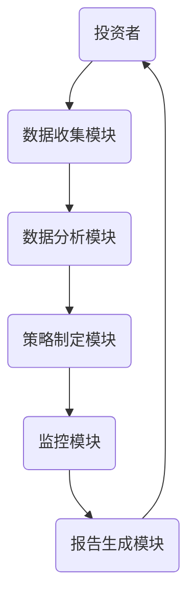

                 


# 格雷厄姆的价值投资者应具备的素质

## 关键词：价值投资、格雷厄姆、安全边际、内在价值、心理素质、投资策略

## 摘要：本文深入探讨格雷厄姆价值投资的核心理念，分析投资者应具备的素质，包括心理素质、投资策略、数学模型和系统架构等方面，帮助读者全面理解如何成为成功的价值投资者。

---

## 第一部分: 价值投资的背景与核心概念

### 第1章: 价值投资的起源与发展

#### 1.1 价值投资的起源

##### 1.1.1 投资的基本概念与问题背景

投资是将资金分配到金融资产或实体资产以获取收益的行为。传统投资学派依赖现代投资组合理论（MPT），但忽视了市场的非理性波动。本文探讨格雷厄姆的价值投资方法，帮助投资者在波动中寻找安全边际。

##### 1.1.2 格雷厄姆与价值投资的诞生

 Benjamin Graham是价值投资的奠基人，其投资理念在《证券分析》和《 Intelligent Investor》中提出。他认为市场先生是理性的朋友，帮助投资者在波动中寻找机会。他的方法强调安全边际，确保投资的安全性。

##### 1.1.3 价值投资的核心理念与原则

 格雷厄姆的价值投资原则包括买入低于内在价值的股票、追求安全边际、长期投资和分散投资。这些原则旨在避免市场波动带来的损失，实现长期稳定的收益。

#### 1.2 价值投资的基本概念

##### 1.2.1 价值投资的定义与核心要素

 价值投资是通过分析公司基本面，寻找市场价格低于内在价值的投资标的。核心要素包括内在价值、安全边际和市场情绪。

##### 1.2.2 投资者与投机者的区别

 投资者追求长期稳定收益，而投机者依赖市场波动短期获利。价值投资强调长期持有，避免短期波动的干扰。

##### 1.2.3 价值投资的边界与外延

 价值投资适用于所有资产类别，但需考虑市场周期和经济环境。它不仅适用于股票，也适用于债券和其他资产。

#### 1.3 价值投资的哲学与心理学基础

##### 1.3.1 投资者的决策心理

 投资者容易受到恐惧和贪婪的影响，价值投资强调克服这些情绪，保持理性决策。市场波动时，投资者应逆向思考，寻找被低估的机会。

##### 1.3.2 格雷厄姆的投资哲学

 格雷厄姆强调安全性，认为投资的本质是寻找价值，而不是市场的价格。他主张用安全边际来降低风险，确保投资的稳健性。

---

### 第2章: 核心概念的原理与联系

#### 2.1 核心概念的原理

##### 2.1.1 安全边际的概念与数学模型

 安全边际是市场价格与内在价值的差距。计算公式为：安全边际 = 市场价格 - 内在价值。例如，某股票内在价值为50美元，市场价格为40美元，安全边际为10美元。安全边际越大，投资风险越小。

##### 2.1.2 内在价值的计算方法

 内在价值是未来现金流的现值。计算公式为：PV = CF / (r + g)，其中CF为未来现金流，r为折现率，g为增长率。例如，某公司未来现金流为1000美元，r=10%，g=5%，内在价值约为18.18美元。

##### 2.1.3 市场先生的行为模型

 市场先生是格雷厄姆虚构的角色，代表市场的波动性。投资者应利用市场先生的情绪化，当市场先生报价低于内在价值时买入，高于时卖出。

#### 2.2 核心概念的对比分析

##### 2.2.1 核心概念的属性特征对比表格

 | 概念         | 定义                               | 重要性 | 计算方式                                                                 |
|--------------|------------------------------------|--------|--------------------------------------------------------------------------|
| 内在价值     | 公司未来现金流的现值             | 高     | PV = CF / (r + g)                                                     |
| 安全边际     | 市场价格与内在价值的差距           | 高     | 安全边际 = 市场价格 - 内在价值                                         |
| 市场先生     | 市场情绪波动的代表               | 中     | 通过市场先生的报价判断投资机会                                       |

##### 2.2.2 核心概念的ER实体关系图

```mermaid
erd
actor 投资者 {
  id 投资者ID
  属性 心理素质
  属性 知识储备
  属性 投资策略
}

实体 市场 {
  id 市场ID
  属性 市场价格
  属性 市场波动
  属性 市场情绪
}

关联 投资者-市场 {
  关联关系 投资者参与市场
}
```

---

## 第三部分: 投资者的心理素质

### 第3章: 心理素质的培养与管理

#### 3.1 心理

##### 3.1.1 心理素质的内涵

 心理素质包括独立思考、耐心、情绪控制、风险承受能力和自我约束能力。独立思考是价值投资者的核心能力，需要避免随波逐流。

##### 3.1.2 心理素质的挑战与应对策略

 投资者面临的主要心理挑战包括恐惧和贪婪。应对策略包括设定明确的投资目标，分散投资以降低风险，定期复盘和调整投资策略。

##### 3.1.3 心理素质的培养方法

 培养心理素质的方法包括阅读优秀投资者的案例，学习投资心理学，保持理性思维，避免情绪化决策。通过不断实践和反思，投资者可以逐步提升心理素质。

---

### 第4章: 投资策略与数学模型

#### 4.1 投资策略

##### 4.1.1 防御性投资策略

 防御性投资策略注重安全边际，寻找价格低于内在价值的股票。通过分散投资，降低特定股票的风险，避免重大损失。

##### 4.1.2 投资组合管理

 投资组合管理包括资产配置、风险控制和定期调整。通过分析各资产的历史表现和预期收益，优化组合以平衡风险和收益。

#### 4.2 数学模型

##### 4.2.1 市盈率与市净率的计算

 市盈率（P/E）= 股价 / 每股收益，市净率（P/B）= 股价 / 每股净资产。例如，某公司股价为20元，每股收益为5元，市盈率为4倍；每股净资产为10元，市净率为2倍。

##### 4.2.2 内在价值的估算方法

 内在价值估算公式为：内在价值 = 现金流 / 折现率。例如，某公司未来现金流为100万元，折现率为10%，内在价值约为100万 / 1.1 = 90.91万元。

---

### 第5章: 系统分析与架构设计

#### 5.1 系统分析

##### 5.1.1 问题场景介绍

 投资者需要分析市场数据，评估股票价值，制定投资策略。系统应能处理大量数据，提供分析工具，帮助投资者做出决策。

##### 5.1.2 系统功能设计

 系统功能包括数据收集、分析、策略制定和监控。数据收集模块获取市场数据，分析模块计算内在价值和安全边际，策略制定模块生成投资建议，监控模块跟踪投资表现。

#### 5.2 系统架构设计

##### 5.2.1 系统架构图



---

## 第四部分: 项目实战

### 第6章: 虚拟投资案例分析

#### 6.1 项目实战

##### 6.1.1 环境安装

 使用Excel或Python进行数据处理，安装必要的金融数据分析库如Pandas和NumPy。

##### 6.1.2 核心代码实现

 下面是一个计算内在价值的Python代码示例：

```python
import numpy as np

def calculate_intrinsic_value(fcf, discount_rate, growth_rate):
    return fcf / (discount_rate + growth_rate)

fcf = 1000000  # 未来现金流
discount_rate = 0.1  # 折现率
growth_rate = 0.05  # 增长率

iv = calculate_intrinsic_value(fcf, discount_rate, growth_rate)
print(f"内在价值: ${iv:.2f}")
```

##### 6.1.3 案例分析与解读

 以某公司为例，计算其内在价值和安全边际。假设公司未来现金流为100万元，折现率为10%，增长率5%，则内在价值约为90.91万元。若市场价格为80万元，则安全边际为10.91万元，具备投资价值。

---

### 第7章: 总结与展望

#### 7.1 最佳实践

 投资者应持续学习，定期复盘，保持耐心，避免情绪化决策。通过不断实践，提升分析能力，优化投资策略。

#### 7.2 小结

 本文从格雷厄姆的价值投资理念出发，分析了核心概念、心理素质、投资策略和数学模型，帮助读者系统地提升投资能力。

#### 7.3 注意事项

 投资有风险，需谨慎评估自身风险承受能力，避免盲目跟风。价值投资需要时间和耐心，市场波动是长期投资者的朋友。

#### 7.4 拓展阅读

 推荐阅读格雷厄姆的《 Intelligent Investor》和《证券分析》，以及现代投资组合理论的相关书籍，如《投资学》。

---

通过以上内容，读者可以系统地理解格雷厄姆的价值投资理念，掌握必要的投资策略和心理素质，成为成功的价值投资者。

