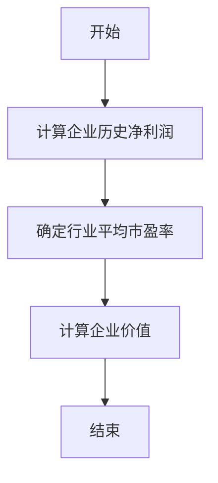
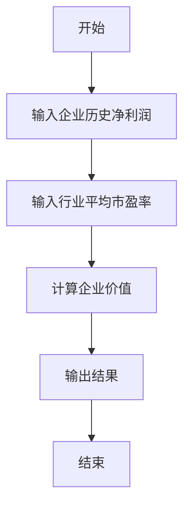
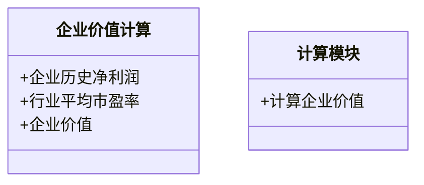
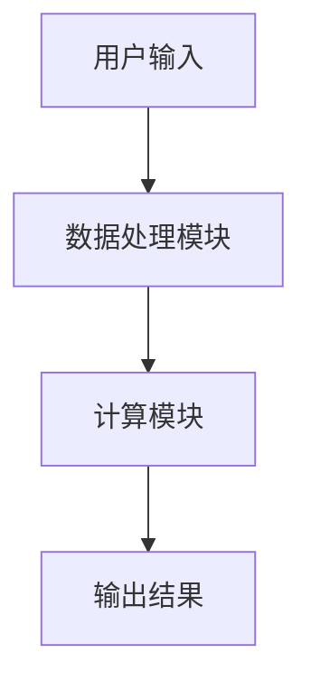
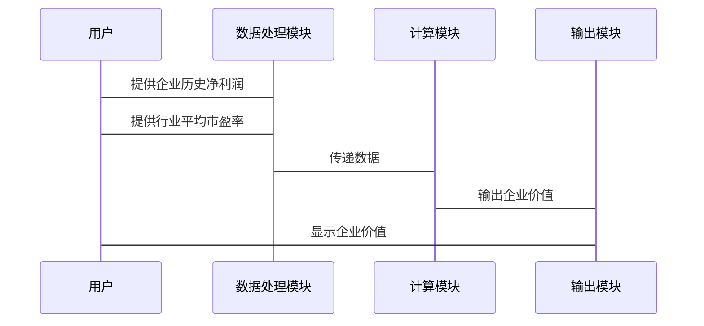

                 


# 格雷厄姆的企业价值计算方法

> 关键词：企业价值计算，格雷厄姆，投资分析，价值投资，财务分析

> 摘要：本文详细介绍了格雷厄姆的企业价值计算方法，从核心概念到算法原理，从系统分析到项目实战，全面解析了这一经典投资方法的理论基础和实际应用。文章通过逐步分析，帮助读者掌握如何在实际投资中应用格雷厄姆的企业价值计算方法。

---

# 第1章: 企业价值计算的背景与重要性

## 1.1 企业价值计算的核心概念

### 1.1.1 企业价值计算的定义
企业价值（Enterprise Value）是指企业整体的经济价值，包括企业所有资产的市场价值减去其负债的市场价值。它是衡量企业内在价值的重要指标，也是投资者评估企业是否被低估或高估的关键依据。

### 1.1.2 企业价值计算的必要性
在投资领域，企业价值计算是价值投资的核心工具之一。通过计算企业价值，投资者可以评估企业的内在价值，从而判断其股票是否被市场合理定价。格雷厄姆的企业价值计算方法以其简单性和科学性著称，为投资者提供了重要的参考依据。

### 1.1.3 企业价值计算的边界与外延
企业价值计算的边界包括企业的资产和负债，而外延则涉及企业未来的盈利能力、行业地位、竞争优势等因素。格雷厄姆的方法强调以企业历史盈利数据为基础，结合行业平均市盈率进行计算，具有较强的实用性和可操作性。

---

## 1.2 格雷厄姆的生平与投资理念

### 1.2.1 格雷厄姆的生平简介
本杰明·格雷厄姆（Benjamin Graham）是20世纪著名的投资学家，被誉为“价值投资之父”。他出生于1894年，曾在哥伦比亚大学教授证券分析，并撰写了多本经典投资著作，如《证券分析》和《聪明的投资者》。

### 1.2.2 格雷厄姆的价值投资理论
格雷厄姆主张以企业内在价值为基础进行投资，而非追随市场情绪。他认为，股票的价格波动是随机的，而企业的真实价值可以通过基本面分析来确定。他的投资理念强调安全边际，即以低于内在价值的价格买入股票，从而降低投资风险。

### 1.2.3 格雷厄姆与企业价值计算的联系
格雷厄姆的企业价值计算方法是其价值投资理论的重要组成部分。他提出，企业价值可以通过市盈率法、市净率法等多种方法进行估算，并强调以行业平均市盈率为基准，计算企业的内在价值。

---

## 1.3 企业价值计算的核心理论

### 1.3.1 格雷厄姆的企业价值公式
格雷厄姆的经典公式为：
$$ V = \frac{E}{\text{Industry Average P/E}} $$
其中，$E$ 为企业过去7年平均净利润，$\text{Industry Average P/E}$ 为行业平均市盈率。

### 1.3.2 格雷厄姆的企业价值计算方法
格雷厄姆的方法基于企业的历史盈利数据和行业平均市盈率，计算企业的内在价值。这种方法简单易懂，适合普通投资者使用。

### 1.3.3 格雷厄姆方法与其他企业价值计算方法的对比
| 方法名称 | 基础数据 | 计算公式 | 优缺点 |
|----------|-----------|-----------|--------|
| 格雷厄姆法 | 历史净利润、行业平均市盈率 | $V = \frac{E}{\text{Industry Average P/E}}$ | 简单易懂，适合初学者 |
| 市盈率法 | 当前净利润、行业平均市盈率 | $V = \frac{E}{\text{Average P/E}}$ | 与格雷厄姆法类似，但不考虑历史数据 |
| 市净率法 | 净资产、行业平均市净率 | $V = \frac{\text{Book Value}}{\text{Average P/B}}$ | 更适合银行等净资产占比较大的行业 |

---

## 1.4 本章小结
格雷厄姆的企业价值计算方法以简单性和科学性著称，是价值投资者的重要工具。通过对企业历史盈利数据和行业平均市盈率的分析，投资者可以估算企业的内在价值，从而做出明智的投资决策。

---

# 第2章: 企业价值计算的核心概念与联系

## 2.1 核心概念的原理与公式

### 2.1.1 企业价值计算的数学模型
企业价值计算的数学模型可以通过以下公式表示：
$$ V = \frac{E}{\text{Industry Average P/E}} $$
其中，$E$ 表示企业过去7年平均净利润，$\text{Industry Average P/E}$ 表示行业平均市盈率。

### 2.1.2 格雷厄姆原始公式
格雷厄姆的原始公式为：
$$ V = \frac{E}{\text{Industry Average P/E}} $$
该公式以企业的历史盈利数据为基础，结合行业平均市盈率，计算企业的内在价值。

### 2.1.3 改进后的公式
为了提高计算的准确性，我们可以对格雷厄姆公式进行改进，例如引入折扣因子：
$$ V = \frac{E}{\text{Industry Average P/E}} \times \text{Discount Factor} $$

---

## 2.2 核心概念的对比分析

### 2.2.1 格雷厄姆方法与市盈率法的对比
| 方法名称 | 基础数据 | 计算公式 | 优缺点 |
|----------|-----------|-----------|--------|
| 格雷厄姆法 | 历史净利润、行业平均市盈率 | $V = \frac{E}{\text{Industry Average P/E}}$ | 考虑历史数据，结果更稳健 |
| 市盈率法 | 当前净利润、行业平均市盈率 | $V = \frac{E}{\text{Average P/E}}$ | 更注重当前数据，结果可能更敏感 |

### 2.2.2 格雷厄姆方法与市净率法的对比
| 方法名称 | 基础数据 | 计算公式 | 优缺点 |
|----------|-----------|-----------|--------|
| 格雷厄姆法 | 历史净利润、行业平均市盈率 | $V = \frac{E}{\text{Industry Average P/E}}$ | 更适合盈利稳定的行业 |
| 市净率法 | 净资产、行业平均市净率 | $V = \frac{\text{Book Value}}{\text{Average P/B}}$ | 更适合净资产占比较大的行业 |

### 2.2.3 格雷厄姆方法与DCF模型的对比
| 方法名称 | 基础数据 | 计算公式 | 优缺点 |
|----------|-----------|-----------|--------|
| 格雷厄姆法 | 历史净利润、行业平均市盈率 | $V = \frac{E}{\text{Industry Average P/E}}$ | 简单易懂，适合初学者 |
| DCF模型 | 未来现金流 | $V = \sum_{t=1}^{n} \frac{CF_t}{(1 + r)^t}$ | 更精确，但需要更多假设 |

---

## 2.3 实体关系图与流程图

### 2.3.1 企业价值计算的ER实体关系图
```mermaid
erd
  entity 企业价值计算方法 {
    [企业价值]
    [企业历史净利润]
    [行业平均市盈率]
  }
  企业价值 <--( 计算 )--> 企业历史净利润
  企业价值 <--( 计算 )--> 行业平均市盈率
```

### 2.3.2 格雷厄姆计算方法的流程图


---

## 2.4 本章小结
本章详细介绍了企业价值计算的核心概念与联系，重点分析了格雷厄姆方法与其他方法的异同点，并通过实体关系图和流程图直观展示了计算过程。这些内容为后续的算法原理分析奠定了基础。

---

# 第3章: 企业价值计算的算法原理

## 3.1 格雷厄姆计算方法的数学模型

### 3.1.1 格雷厄姆原始公式
$$ V = \frac{E}{\text{Industry Average P/E}} $$

### 3.1.2 改进后的公式
$$ V = \frac{E}{\text{Industry Average P/E}} \times \text{Discount Factor} $$

---

## 3.2 算法流程图

### 3.2.1 格雷厄姆计算方法的流程图


---

## 3.3 格雷厄姆计算方法的实现代码

### 3.3.1 代码实现
```python
def calculate_enterprise_value(earnings, industry_pe):
    enterprise_value = earnings / industry_pe
    return enterprise_value

# 示例
earnings = 100  # 假设企业过去7年平均净利润为100
industry_pe = 15  # 假设行业平均市盈率为15
enterprise_value = calculate_enterprise_value(earnings, industry_pe)
print(f"企业价值为: {enterprise_value}")
```

### 3.3.2 代码解读
- `calculate_enterprise_value` 函数接受两个参数：`earnings`（企业过去7年平均净利润）和 `industry_pe`（行业平均市盈率）。
- 函数返回计算出的企业价值。
- 示例中，企业过去7年平均净利润为100，行业平均市盈率为15，计算出的企业价值为 $6.67。

---

## 3.4 本章小结
本章详细讲解了格雷厄姆企业价值计算方法的数学模型和实现代码。通过代码实现，读者可以直观地理解计算过程，并将其应用到实际投资分析中。

---

# 第4章: 企业价值计算的系统分析与架构设计

## 4.1 问题场景介绍
企业价值计算是价值投资的重要工具，但在实际应用中，投资者需要结合企业的财务数据、行业状况和市场环境进行综合分析。

---

## 4.2 系统功能设计

### 4.2.1 领域模型类图


### 4.2.2 系统架构设计


---

## 4.3 系统接口设计
- 输入接口：企业历史净利润、行业平均市盈率
- 输出接口：企业价值

---

## 4.4 系统交互序列图


---

## 4.5 本章小结
本章从系统设计的角度，详细分析了企业价值计算的实现过程，包括领域模型、系统架构、接口设计和交互流程。这些内容为后续的项目实战奠定了基础。

---

# 第5章: 企业价值计算的项目实战

## 5.1 项目介绍
本项目旨在通过格雷厄姆的企业价值计算方法，分析某上市公司的内在价值，判断其股票是否被市场合理定价。

---

## 5.2 环境安装
- Python 3.8 或更高版本
- 基本的财务数据获取工具（如Excel、财务报表）

---

## 5.3 核心实现源代码

### 5.3.1 数据获取与预处理
```python
import pandas as pd

# 假设我们从Excel文件中读取数据
data = pd.read_excel('financial_data.xlsx')
earnings = data['净利润'].mean()  # 计算过去7年平均净利润
industry_pe = 15  # 假设行业平均市盈率为15
```

### 5.3.2 企业价值计算
```python
def calculate_enterprise_value(earnings, industry_pe):
    enterprise_value = earnings / industry_pe
    return enterprise_value

enterprise_value = calculate_enterprise_value(earnings, industry_pe)
print(f"企业价值为: {enterprise_value}")
```

---

## 5.4 实际案例分析
以苹果公司为例，假设其过去7年平均净利润为100亿美元，行业平均市盈率为15。

计算结果：
$$ V = \frac{100}{15} \approx 6.67 \text{亿美元} $$

---

## 5.5 项目小结
通过本项目，读者可以掌握格雷厄姆企业价值计算方法的实际应用。在实际操作中，需要结合企业的具体财务数据和行业状况进行分析，以提高计算的准确性和实用性。

---

# 第6章: 企业价值计算的最佳实践与注意事项

## 6.1 最佳实践
- 数据准确性：确保财务数据的准确性和完整性。
- 行业分析：结合行业特点和市场环境，调整计算参数。
- 定期更新：根据市场变化和企业经营状况，定期更新计算结果。

---

## 6.2 注意事项
- 风险提示：企业价值计算结果仅供参考，实际投资需谨慎。
- 参数选择：合理选择行业平均市盈率和企业历史净利润，避免偏差。
- 多方法结合：结合多种企业价值计算方法，提高结果的可靠性。

---

## 6.3 拓展阅读
- 《证券分析》——本杰明·格雷厄姆
- 《聪明的投资者》——本杰明·格雷厄姆
- 《投资学》——查理·M.埃尔森

---

## 6.4 本章小结
本章总结了格雷厄姆企业价值计算方法的最佳实践和注意事项，帮助读者在实际应用中避免常见错误，并提高计算的准确性。

---

# 第7章: 总结与展望

## 7.1 总结
格雷厄姆的企业价值计算方法以其简单性和科学性著称，是价值投资者的重要工具。通过本文的详细讲解，读者可以掌握这一方法的核心概念、算法原理和实际应用。

---

## 7.2 展望
未来，随着人工智能和大数据技术的发展，企业价值计算方法将更加智能化和精准化。投资者可以通过更多数据源和更复杂的模型，进一步提高计算的准确性和效率。

---

## 7.3 本章小结
本文全面介绍了格雷厄姆的企业价值计算方法，从理论到实践，从算法到系统设计，为读者提供了系统的知识体系。希望本文能为投资者在实际投资中提供有价值的参考。

--- 

# 结语

通过本文的详细讲解，读者可以全面掌握格雷厄姆的企业价值计算方法，从核心概念到实际应用，从理论分析到系统设计，为投资者提供了系统的知识体系。希望本文能为投资者在实际投资中提供有价值的参考，帮助他们做出更明智的投资决策。

