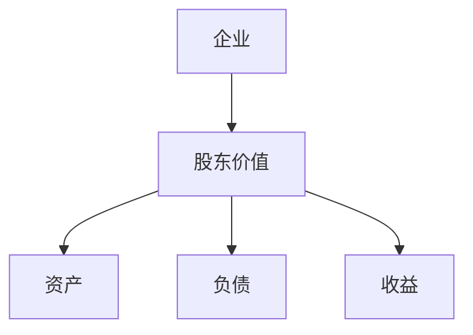

                 


# 格雷厄姆的企业价值计算方法

## 关键词：企业价值计算、格雷厄姆、价值投资、财务分析、投资策略

## 摘要：本文深入解析了格雷厄姆的企业价值计算方法，探讨了其核心理论、计算模型及实际应用。通过技术化的语言和结构，详细讲解了企业价值计算的背景、核心概念、算法原理、系统设计和项目实战，帮助读者全面理解并掌握这一经典投资方法。

---

## 第一部分: 企业价值计算的背景与重要性

### 第1章: 企业价值计算的背景与意义

#### 1.1 企业价值计算的重要性
- **1.1.1 企业价值计算的定义**
  企业价值（Enterprise Value，EV）是企业整体价值的度量，包括股权价值和债权价值，反映了企业的全部价值。
- **1.1.2 企业价值计算的意义**
  - 为企业估值提供依据。
  - 帮助投资者识别被低估的企业。
  - 用于并购决策和财务分析。
- **1.1.3 格雷厄姆在企业价值计算中的贡献**
  格雷厄姆提出了基于基本面分析的企业价值计算方法，强调安全边际和价值投资理念。

#### 1.2 企业价值计算的核心概念
- **1.2.1 企业价值计算的定义**
  企业价值 = 股东权益 + 红利 + 债务
- **1.2.2 企业价值计算的影响因素**
  - 财务状况：收入、利润、资产和负债。
  - 行业特点：行业竞争、周期性。
  - 宏观经济：利率、通货膨胀、经济周期。

---

### 第2章: 企业价值计算的基本框架

#### 2.1 企业价值计算的理论基础
- **2.1.1 格雷厄姆的价值投资理论**
  - 买入低于内在价值的企业。
  - 强调安全边际，即购买价格远低于内在价值。
- **2.1.2 企业价值计算的假设**
  - 理性市场：价格围绕价值波动。
  - 长期视角：关注企业的长期盈利能力。
- **2.1.3 企业价值计算的逻辑框架**
  通过分析企业的财务指标和市场数据，计算其内在价值，判断其是否被市场低估。

#### 2.2 企业价值计算的核心要素
- **2.2.1 收益能力**
  - 净利润：企业盈利能力的核心指标。
  - 收益稳定性：企业收益的波动性。
- **2.2.2 资产质量**
  - 资产周转率：资产使用效率。
  - 资产负债率：企业财务风险。
- **2.2.3 财务状况**
  - 现金流：企业运营资金的充裕性。
  - 资本结构：股权与债务的比例。
- **2.2.4 市场地位**
  - 市场份额：企业在市场中的地位。
  - 行业前景：行业的发展潜力。

#### 2.3 企业价值计算的边界条件
- **2.3.1 行业特点**
  - 周期性行业：需求波动较大的行业，如制造业和建筑业。
  - 非周期性行业：需求相对稳定的行业，如公用事业和消费品行业。
- **2.3.2 宏观经济环境**
  - 利率水平：影响企业的融资成本和投资回报。
  - 通货膨胀：影响企业的成本和价格。
  - 经济周期：影响企业的盈利能力和市场需求。
- **2.3.3 企业生命周期**
  - 初创期：高风险，低收益。
  - 成长期：快速扩张，高投入。
  - 成熟期：稳定收益，低增长。
  - 衰退期：收益下降，资产贬值。

---

### 第3章: 企业价值计算的核心概念与联系

#### 3.1 企业价值计算的核心原理
- **3.1.1 股东价值最大化**
  企业价值的核心目标是实现股东价值的最大化，这需要通过优化资本结构、提高盈利能力、降低财务风险等手段实现。
- **3.1.2 资本资产定价模型**
  资本资产定价模型（CAPM）用于估计资产的预期收益率，反映了市场风险和无风险利率的影响。
- **3.1.3 现金流折现法**
  现金流折现法（DCF）通过将未来现金流折现到现值，计算企业的内在价值。

#### 3.2 核心概念的特征对比
- **3.2.1 财务指标对比表**

| 财务指标 | 企业价值计算 | 市场价值计算 |
|----------|---------------|---------------|
| 净利润   | 核心驱动因素 | 受市场波动影响 |
| 资产负债率 | 财务健康度指标 | 受市场情绪影响 |
| 现金流   | 现金生成能力 | 现金流动性指标 |

- **3.2.2 企业价值与市场价值的对比**
  企业价值是企业整体价值的度量，而市场价值是企业股票的市场价格，两者之间存在差异，市场价值可能高于或低于企业价值。
- **3.2.3 核心要素的权重分配**
  不同行业的企业价值计算中，核心要素的权重不同。例如，制造业可能更关注资产质量，而科技行业可能更关注收益能力。

#### 3.3 ER实体关系图


---

## 第四部分: 企业价值计算的算法原理

### 第4章: 格雷厄姆的企业价值计算方法

#### 4.1 格雷厄姆计算模型
- **4.1.1 股息折现法**
  股息折现法是基于股息的现值计算企业价值的方法，适用于 dividend-paying companies。
  - 公式：EV = ∑(D / (1 + r)^t)
  - 其中，D 是未来股息的现值，r 是折现率，t 是时间。

- **4.1.2 现金流折现法**
  现金流折现法是基于未来现金流的现值计算企业价值的方法。
  - 公式：EV = ∑(CF_t / (1 + r)^t)
  - 其中，CF_t 是未来现金流，r 是折现率，t 是时间。

- **4.1.3 市盈率与市净率分析**
  市盈率（P/E）和市净率（P/B）是常用的估值指标，可以帮助投资者快速判断企业的估值水平。

#### 4.2 算法原理
- **4.2.1 算法流程**
  ```mermaid
  graph TD
      A[开始] --> B[确定目标企业]
      B --> C[收集财务数据]
      C --> D[计算关键指标]
      D --> E[应用估值模型]
      E --> F[得出企业价值]
      F --> G[结束]
  ```

- **4.2.2 代码实现**
  以下是一个简单的股息折现法的Python代码示例：
  ```python
  def discounted_cash_flow(cash_flows, discount_rate):
      present_value = 0
      for t, cf in enumerate(cash_flows):
          present_value += cf / (1 + discount_rate) ** t
      return present_value

  # 示例数据
  cash_flows = [100, 120, 150, 200]
  discount_rate = 0.10

  ev = discounted_cash_flow(cash_flows, discount_rate)
  print(f"企业价值：{ev}")
  ```

- **4.2.3 数学模型和公式**
  - 现金流折现法的公式：
    $$ EV = \sum_{t=1}^{n} \frac{CF_t}{(1 + r)^t} $$
  - 股息折现法的公式：
    $$ EV = \sum_{t=1}^{n} \frac{D_t}{(1 + r)^t} $$

---

### 第5章: 系统分析与架构设计

#### 5.1 问题场景介绍
  企业价值计算系统需要处理大量的财务数据，提供准确的企业估值，帮助投资者做出明智的决策。

#### 5.2 系统功能设计
  - 数据采集模块：收集企业的财务数据和市场数据。
  - 数据处理模块：计算关键财务指标和估值模型。
  - 结果展示模块：以图表和报告的形式展示企业价值计算结果。

#### 5.3 系统架构设计
  ```mermaid
  graph TD
      A[数据采集] --> B[数据处理]
      B --> C[估值模型]
      C --> D[结果展示]
  ```

#### 5.4 系统接口设计
  - 数据接口：与财务数据源（如股票数据库）对接。
  - 用户界面：提供数据输入和结果展示的界面。

#### 5.5 系统交互设计
  ```mermaid
  graph TD
      A[用户输入] --> B[数据处理]
      B --> C[计算结果]
      C --> D[用户输出]
  ```

---

### 第6章: 项目实战

#### 6.1 环境安装
  - Python 3.8+
  - NumPy 和 Pandas 库
  - Matplotlib 或 Seaborn 绘图库

#### 6.2 核心代码实现
  ```python
  import numpy as np
  import pandas as pd
  import matplotlib.pyplot as plt

  # 示例数据
  data = {
      '收入': [1000, 1200, 1400, 1600],
      '利润': [100, 120, 140, 160],
      '资产': [500, 600, 700, 800],
      '负债': [200, 220, 240, 260]
  }
  df = pd.DataFrame(data)

  # 计算ROE（净资产收益率）
  df['ROE'] = df['利润'] / (df['资产'] - df['负债']) * 100

  # 可视化
  plt.plot(df['收入'], df['利润'], 'b-')
  plt.title('收入与利润关系')
  plt.xlabel('收入')
  plt.ylabel('利润')
  plt.show()
  ```

#### 6.3 案例分析
  以某制造企业为例，通过分析其财务数据，计算其企业价值，并与市场价格进行对比，判断其是否被低估。

---

### 第7章: 总结

#### 7.1 最佳实践
  - 理解企业的基本面，关注财务指标。
  - 结合市场环境和行业特点，灵活运用估值方法。
  - 设置安全边际，降低投资风险。

#### 7.2 小结
  企业价值计算是投资决策的重要工具，格雷厄姆的方法为我们提供了科学的分析框架。通过深入理解和实际应用，我们可以更好地把握企业的内在价值，做出明智的投资决策。

#### 7.3 注意事项
  - 数据的准确性和完整性是计算的基础。
  - 估值模型的选择要根据企业的特点和市场环境。
  - 定期更新数据和重新评估，以应对变化的市场环境。

#### 7.4 拓展阅读
  - 《The Intelligent Investor》 by Benjamin Graham
  - 《价值投资实战手册》 by 价值投资研究组

---

通过以上结构和内容，您可以撰写一篇详细且有深度的关于格雷厄姆的企业价值计算方法的技术博客文章。

